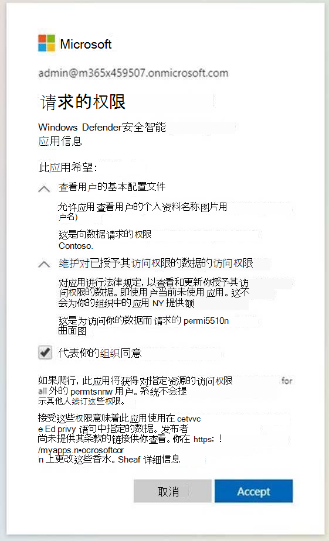
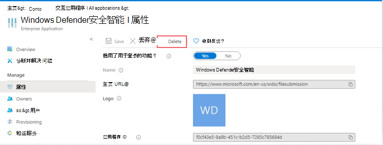
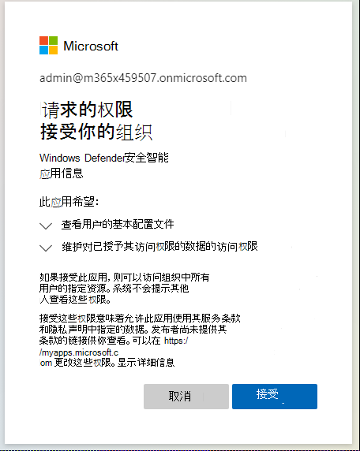

# 解决管理员阻止导致的恶意软件提交错误
在某些情况下，当您尝试将可能受感染的文件提交到 [Microsoft](https://www.microsoft.com/wdsi) 安全智能网站进行分析时，管理员阻止可能会导致提交问题。 以下过程演示如何解决此问题。

## 查看设置
打开 Azure [Enterprise应用程序设置](https://portal.azure.com/#blade/Microsoft_AAD_IAM/StartboardApplicationsMenuBlade/UserSettings/menuId/)。 在 **Enterprise应用程序** >  **用户可以** 同意应用代表他们访问公司数据，请检查是还是否。

- **如果选择"** 否"，Azure AD租户的管理员将需要向组织提供同意。 根据配置Azure AD，用户可能能够从同一对话框提交请求。 如果没有请求管理员同意的选项，用户需要请求将这些权限添加到其 Azure AD 管理员。有关详细信息，请转到以下部分。

- 如果 **选中**"是"，请确保"Windows Defender智能应用设置"启用 **以便** 用户登录？"在 Azure 中设置为 ["是"](https://portal.azure.com/#blade/Microsoft_AAD_IAM/ManagedAppMenuBlade/Properties/appId/f0cf43e5-8a9b-451c-b2d5-7285c785684d/objectId/4a918a14-4069-4108-9b7d-76486212d75d)。如果 **选中**"否"，你将需要请求Azure AD启用它。 
  
## 实现必需的Enterprise应用程序权限 
此过程需要租户中的全局管理员或应用程序管理员。
 1. 打开[Enterprise应用程序设置"](https://portal.azure.com/#blade/Microsoft_AAD_IAM/ManagedAppMenuBlade/Permissions/appId/f0cf43e5-8a9b-451c-b2d5-7285c785684d/objectId/4a918a14-4069-4108-9b7d-76486212d75d)。 
 2. 选择 **"为组织授予管理员许可"**。
 3. 如果能够这样做，请查看此应用程序所需的 API 权限，如下图所示。 为租户提供同意。

    

  4. 如果管理员在尝试手动提供同意时收到错误，请尝试选项 [1](#option-1-approve-enterprise-application-permissions-by-user-request) 或 [选项 2](#option-2-provide-admin-consent-by-authenticating-the-application-as-an-admin) 作为可能的解决方法。
  
## 选项 1 根据用户请求批准企业应用程序权限
> [!Note]
> 这目前是一项预览功能。

Azure Active Directory管理员将需要允许用户向应用请求管理员同意。 验证在应用程序中 **是否将设置** Enterprise [为"是"](https://portal.azure.com/#blade/Microsoft_AAD_IAM/StartboardApplicationsMenuBlade/UserSettings/menuId/)。

配置管理员同意工作流 [中提供了详细信息](/azure/active-directory/manage-apps/configure-admin-consent-workflow)。

验证此设置后，用户可以在 [Microsoft](https://www.microsoft.com/wdsi/filesubmission) 安全智能中通过企业客户登录，并提交管理员同意请求（包括理由）。

管理员将能够查看和批准 Azure 管理员同意请求 [的应用程序权限](https://portal.azure.com/#blade/Microsoft_AAD_IAM/StartboardApplicationsMenuBlade/AccessRequests/menuId/)。

提供同意后，租户中的所有用户都将能够使用该应用程序。
  
## 选项 2 通过验证应用程序作为管理员提供管理员同意 
此过程要求全局管理员在 Microsoft 安全Enterprise客户登录流程[。](https://www.microsoft.com/wdsi/filesubmission)

然后，管理员查看权限，并确保选择"代表你的组织同意"，然后选择"接受 **"**。

租户中的所有用户现在都将能够使用此应用程序。

## 选项 3：删除和读取应用程序权限
如果这两个选项均无法解决问题，请尝试 (管理员角色) ：

1. 删除应用程序以前的配置。 转到"[Enterprise"，](https://portal.azure.com/#blade/Microsoft_AAD_IAM/ManagedAppMenuBlade/Properties/appId/f0cf43e5-8a9b-451c-b2d5-7285c785684d/objectId/982e94b2-fea9-4d1f-9fca-318cda92f90b)然后选择"删除 **"**。

   

2. 从 [属性捕获](https://portal.azure.com/#blade/Microsoft_AAD_IAM/ActiveDirectoryMenuBlade/Properties) TenantID。

3. 将 {tenant-id} 替换为需要在下面的 URL 中向此应用程序授予同意的特定租户。 将此 URL 复制到浏览器。 其余参数已完成。 
``https://login.microsoftonline.com/{tenant-id}/v2.0/adminconsent?client_id=f0cf43e5-8a9b-451c-b2d5-7285c785684d&state=12345&redirect_uri=https%3a%2f%2fwww.microsoft.com%2fwdsi%2ffilesubmission&scope=openid+profile+email+offline_access``

   

4. 查看应用程序所需的权限，然后选择"接受 **"**。 

5. 确认权限在 [Azure 门户中应用](https://portal.azure.com/#blade/Microsoft_AAD_IAM/ManagedAppMenuBlade/Permissions/appId/f0cf43e5-8a9b-451c-b2d5-7285c785684d/objectId/ce60a464-5fca-4819-8423-bcb46796b051)。

   
   
6. 使用非管理员帐户作为企业用户登录到 [Microsoft](https://www.microsoft.com/wdsi/filesubmission) 安全智能，以查看你是否具有访问权限。

 如果在遵循这些疑难解答步骤后未解决警告，请致电 Microsoft 支持人员。