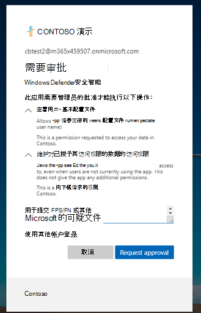

# 排查管理员阻止导致的恶意软件提交错误

在某些情况下，当你尝试将潜在受感染的文件提交到 [Microsoft 安全智能网站](https://www.microsoft.com/wdsi) 进行分析时，管理员块可能会导致提交问题。 以下过程演示如何解决此问题。

## 查看设置

打开 Azure [Enterprise应用程序设置](https://portal.azure.com/#blade/Microsoft_AAD_IAM/StartboardApplicationsMenuBlade/UserSettings/menuId/)。 根据 **Enterprise ApplicationsUsers** >   **可以同意应用代表他们访问公司数据**，检查是否选择了"是"或"否"。

- 如果选择 **"否**"，则客户租户的Azure AD管理员需要为组织提供许可。 根据具有Azure AD的配置，用户可能能够直接从同一对话框提交请求。 如果没有请求管理员同意的选项，则用户需要请求将这些权限添加到其Azure AD管理员。有关详细信息，请转到以下部分。

- 如果选择了 **"是**"，请确保为 **用户启用** 了Windows Defender安全智能应用设置？[在 Azure 中](https://portal.azure.com/#blade/Microsoft_AAD_IAM/ManagedAppMenuBlade/Properties/appId/f0cf43e5-8a9b-451c-b2d5-7285c785684d/objectId/4a918a14-4069-4108-9b7d-76486212d75d)设置为 **"是**"。 如果选择了 **"否**"，则需要请求Azure AD管理员启用它。

## 实现必需Enterprise应用程序权限

此过程需要租户中的全局管理员或应用程序管理员。

1. 打开[Enterprise应用程序设置](https://portal.azure.com/#blade/Microsoft_AAD_IAM/ManagedAppMenuBlade/Permissions/appId/f0cf43e5-8a9b-451c-b2d5-7285c785684d/objectId/4a918a14-4069-4108-9b7d-76486212d75d)。
2. 选择 **"为组织授予管理员许可**"。
3. 如果能够执行此操作，请查看此应用程序所需的 API 权限，如下图所示。 为租户提供许可。

    

4. 如果管理员在尝试手动提供同意时收到错误，请尝试 [选项 1](#option-1-approve-enterprise-application-permissions-by-user-request) 或 [选项 2](#option-2-provide-admin-consent-by-authenticating-the-application-as-an-admin) 作为可能的解决方法。

## 选项 1 按用户请求批准企业应用程序权限

> [!NOTE]
> 这是当前的预览功能。

Azure Active Directory管理员需要允许用户请求管理员同意应用。 验证设置是否在 [Enterprise应用程序](https://portal.azure.com/#blade/Microsoft_AAD_IAM/StartboardApplicationsMenuBlade/UserSettings/menuId/)中配置为 **"是**"。

有关详细信息，请参阅" [配置管理员同意"工作流](/azure/active-directory/manage-apps/configure-admin-consent-workflow)。

验证此设置后，用户可以通过企业客户登录 [Microsoft 安全智能](https://www.microsoft.com/wdsi/filesubmission)，并提交管理员同意请求，包括理由。

管理员将能够查看和批准 [Azure 管理员同意请求](https://portal.azure.com/#blade/Microsoft_AAD_IAM/StartboardApplicationsMenuBlade/AccessRequests/menuId/)的应用程序权限。

提供许可后，租户中的所有用户将能够使用该应用程序。

## 选项 2 通过将应用程序作为管理员身份进行身份验证来提供管理员同意

此过程要求全局管理员通过 [Microsoft 安全智能](https://www.microsoft.com/wdsi/filesubmission)Enterprise客户登录流。

然后，管理员查看权限，并确保 **代表组织选择"同意**"，然后选择" **接受**"。

租户中的所有用户现在都可以使用此应用程序。

## 选项 3：删除和读取应用权限

如果这两个选项都没有解决问题，请尝试以下步骤 (管理员) ：

1. 删除应用程序的先前配置。 转到 [Enterprise应用程序](https://portal.azure.com/#blade/Microsoft_AAD_IAM/ManagedAppMenuBlade/Properties/appId/f0cf43e5-8a9b-451c-b2d5-7285c785684d/objectId/982e94b2-fea9-4d1f-9fca-318cda92f90b)，然后选择 **"删除**"。

   

2. 从 [属性](https://portal.azure.com/#blade/Microsoft_AAD_IAM/ActiveDirectoryMenuBlade/Properties)捕获 TenantID。

3. 将 {tenant-id} 替换为需要在以下 URL 中向此应用程序授予许可的特定租户。 将此 URL 复制到浏览器中。 其余参数已完成。
``https://login.microsoftonline.com/{tenant-id}/v2.0/adminconsent?client_id=f0cf43e5-8a9b-451c-b2d5-7285c785684d&state=12345&redirect_uri=https%3a%2f%2fwww.microsoft.com%2fwdsi%2ffilesubmission&scope=openid+profile+email+offline_access``

   

4. 查看应用程序所需的权限，然后选择 **"接受**"。

5. 确认在Azure 门户中应用了权[限](https://portal.azure.com/#blade/Microsoft_AAD_IAM/ManagedAppMenuBlade/Permissions/appId/f0cf43e5-8a9b-451c-b2d5-7285c785684d/objectId/ce60a464-5fca-4819-8423-bcb46796b051)。

   

6. 以具有非管理员帐户的企业用户身份登录 [到 Microsoft 安全智能](https://www.microsoft.com/wdsi/filesubmission) ，以查看你是否有访问权限。

 如果在执行这些故障排除步骤后未解决警告，请调用 Microsoft 支持。