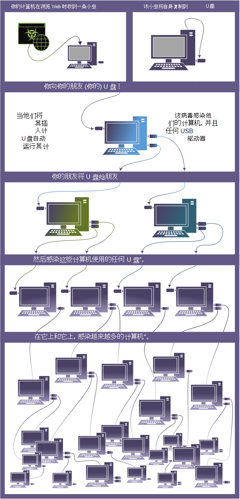

# 蠕虫

蠕虫是一种恶意软件，它可自行复制，并且通常通过利用安全漏洞传播到网络。 它可以通过电子邮件附件、短信、文件共享程序、社交网络网站、网络共享、可移动驱动器和软件漏洞进行传播。

## 蠕虫如何工作

蠕虫表示一大类恶意软件。 不同的蠕虫使用不同的方法来感染设备。 根据变体，它们可以窃取敏感信息、更改安全设置、向恶意黑客发送信息、阻止用户访问文件和其他恶意活动。

Jenxcus (也称为 Dunihi) 、Gamarue (也称为 Androm) 和一直位于感染运行 Microsoft 软件的用户的恶意软件列表的顶部。 尽管这些蠕虫有一些共同之处，但值得注意的是它们也有不同的特征。

* **Jenxcus** 不仅能够感染可移动驱动器，还可以充当连接回其服务器的后门。 此威胁通常从驱动器下载攻击进入设备，这意味着当用户仅访问遭到入侵的网页时将安装此威胁。

* **Gamarue** 通常通过垃圾邮件活动、攻击、下载者、社交网络网站和可移动驱动器到达。 当 Gamarue 感染设备时，它将成为其他恶意软件的分发通道。 我们看到它分发了其他恶意软件，如信息窃取程序、垃圾邮件制造者、点击者、下载者和未授权者。

* **一般** 通过虚构的 Nullsoft Scriptable Install System (NSIS) 、Java安装程序和可移动驱动器到达。 当一个系统感染了一个设备时，将收集有关计算机的信息，例如设备名称、全局唯一标识符 (GUID) 和操作系统版本。 然后，它将该信息发送到远程服务器。

这两个方格和 Gamarue 都有将自身模糊到规避检测的智能方法。 通过隐藏他们正在执行哪些工作，他们尝试避免由安全软件进行检测。

* [**WannaCrypt**](https://www.microsoft.com/wdsi/threats/malware-encyclopedia-description?Name=Ransom:Win32/WannaCrypt) 也值得在此处提及。 与通常只因它们传播而传播的较旧的蠕虫不同，现代蠕虫通常会传播以丢弃负载 (勒索软件) 。

此图显示了蠕虫如何在共享的 USB 驱动器中快速传播。

 

### *图从共享 USB 驱动器分布蠕虫*

## 如何防止蠕虫

在[Microsoft Defender 防病毒](/microsoft-365/security/defender-endpoint/microsoft-defender-antivirus-in-windows-10)中Windows 10。 它提供实时威胁防护，并检测并删除已知的不需要的软件。

在 [Microsoft Security Essentials](https://www.microsoft.com/download/details.aspx?id=5201) 7 或 vista 中下载Windows实时Windows保护。

如果威胁删除不成功，请阅读关于恶意软件[检测和删除疑难解答问题。](https://www.microsoft.com/wdsi/help/troubleshooting-infection)

有关更多常规提示，请参阅 [防止恶意软件感染](/microsoft-365/security/defender-endpoint/prevent-malware-infection)。