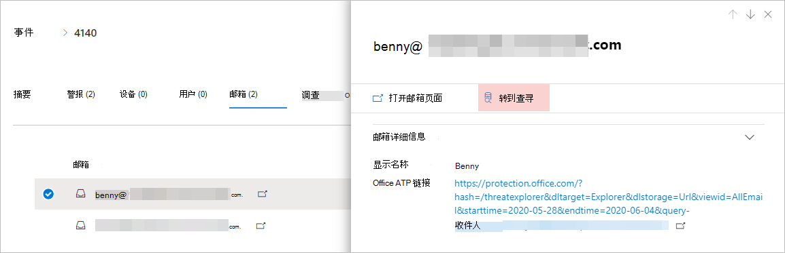
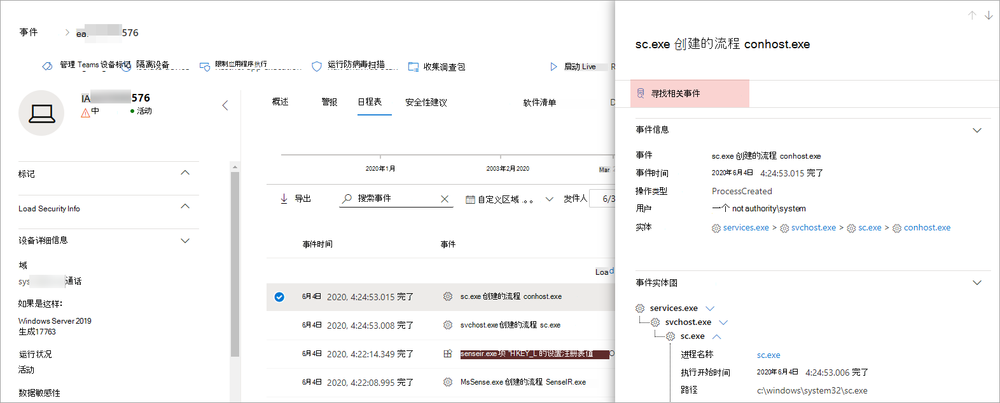

# <a name="quickly-hunt-for-entity-or-event-information-with-go-hunt"></a>使用 go 智能寻线快速查找实体或事件信息

[!INCLUDE [Microsoft 365 Defender rebranding](../includes/microsoft-defender.md)]


**适用于：**
- Microsoft 威胁防护

通过 " *转智能* " 操作，您可以使用基于查询的强大 [高级搜寻](advanced-hunting-overview.md) 功能快速调查事件和各种实体类型。 此操作将自动运行高级的搜索查询，以查找有关所选事件或实体的相关信息。

无论何时显示事件或实体详细信息，都会在安全中心的各个部分中提供 " *转智能* " 操作。 例如，可以使用以下部分中的 " *转智能寻* 线"：

- 在 " [事件" 页](investigate-incidents.md#incident-overview)中，您可以查看有关用户、设备以及与事件相关联的许多其他实体的详细信息。 在您选择实体时，将获取其他信息，以及您可以对该 entitity 执行的各种操作。 在下面的示例中，选择了一个邮箱，显示有关邮箱的详细信息，以及用于查找有关邮箱的详细信息的选项。

    

- 在 "事件" 页中，您还可以访问 "证据" 选项卡下的实体列表。选择其中一个实体将提供一个选项，可用于快速查找有关该实体的信息。

    


- 在查看设备的日程表时，您可以在时间轴中选择事件，以查看有关该事件的其他信息。 一旦选择了事件，您就可以选择在高级搜寻中查找其他相关事件。

    

选择 "**对相关事件的****查找**或查寻" 将传递不同的查询，具体取决于您是否选择了实体或事件。

## <a name="query-for-entity-information"></a>查询实体信息
使用 " *查寻* " 查询有关用户、设备或任何其他类型的实体的信息时，查询将检查涉及该实体的任何事件的所有相关架构表。 若要使结果保持可管理性，查询的范围为与过去30天中涉及实体并与事件相关联的最早活动的时间段相同。

下面的示例展示了设备的 "转智能" 查询：

```kusto
let selectedTimestamp = datetime(2020-06-02T02:06:47.1167157Z);
let deviceName = "fv-az770.example.com";
let deviceId = "device-guid";
search in (DeviceLogonEvents, DeviceProcessEvents, DeviceNetworkEvents, DeviceFileEvents, DeviceRegistryEvents, DeviceImageLoadEvents, DeviceEvents, DeviceImageLoadEvents, IdentityLogonEvents, IdentityQueryEvents)
Timestamp between ((selectedTimestamp - 1h) .. (selectedTimestamp + 1h))
and DeviceName == deviceName
// or RemoteDeviceName == deviceName
// or DeviceId == deviceId
| take 100
```
### <a name="supported-entity-types"></a>支持的实体类型
选择以下任何实体类型后，可以使用 " *转到浏览* "：

- 文件
- 电子邮件
- 电子邮件群集
- 邮箱
- 用户
- 设备
- IP 地址
- URL

## <a name="query-for-event-information"></a>事件信息查询
使用 " *查寻* " 查询有关日程表事件的信息时，查询将检查所选事件的时间周围的其他事件的所有相关架构表。 例如，下面的查询列出了在同一设备上的同一时间段内出现的各种架构表中的事件：

```kusto
// List relevant events 30 minutes before and after selected LogonAttempted event
let selectedEventTimestamp = datetime(2020-06-04T01:29:09.2496688Z);
search in (DeviceFileEvents, DeviceProcessEvents, DeviceEvents, DeviceRegistryEvents, DeviceNetworkEvents, DeviceImageLoadEvents, DeviceLogonEvents)
    Timestamp between ((selectedEventTimestamp - 30m) .. (selectedEventTimestamp + 30m))
    and DeviceId == "079ecf9c5798d249128817619606c1c47369eb3e"
| sort by Timestamp desc
| extend Relevance = iff(Timestamp == selectedEventTimestamp, "Selected event", iff(Timestamp < selectedEventTimestamp, "Earlier event", "Later event"))
| project-reorder Relevance
```

## <a name="adjust-the-query"></a>调整查询
在了解 [查询语言](advanced-hunting-query-language.md)的情况下，可以根据您的喜好调整查询。 例如，您可以调整此行，以确定时间窗口的大小：

```kusto
Timestamp between ((selectedTimestamp - 1h) .. (selectedTimestamp + 1h))
```

除了修改查询以获得更多相关结果之外，您还可以执行以下操作：
- [以图表形式查看结果](advanced-hunting-query-results.md#view-query-results-as-a-table-or-chart)
- [创建自定义检测规则](custom-detection-rules.md)

## <a name="related-topics"></a>相关主题
- [高级搜寻概述](advanced-hunting-overview.md)
- [了解查询语言](advanced-hunting-query-language.md)
- [处理查询结果](advanced-hunting-query-results.md)
- [自定义检测规则](custom-detection-rules.md)
