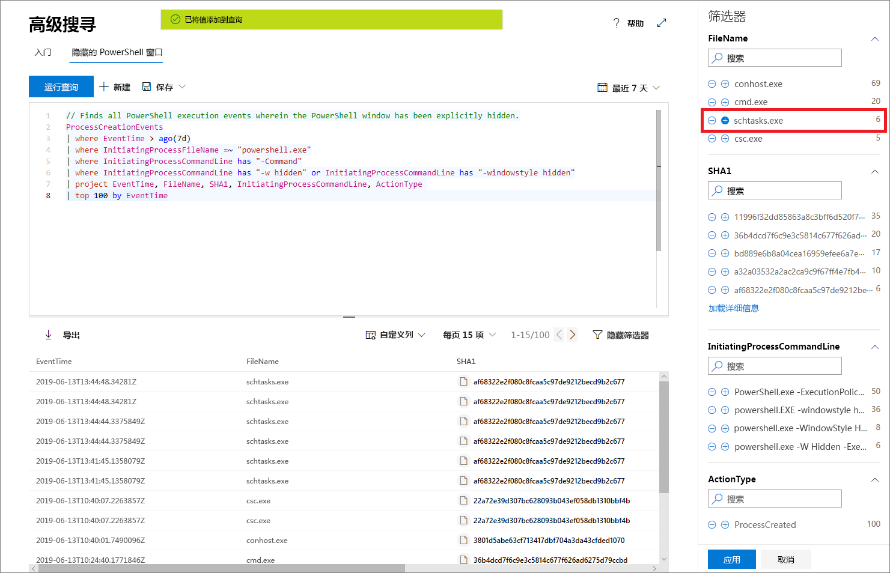

# 通过 Microsoft 威胁防护中的高级搜寻主动搜寻威胁

**适用于：**
- Microsoft 威胁防护

[!INCLUDE [Prerelease information](../includes/prerelease.md)]

高级搜寻是一种基于查询的威胁搜寻工具，可用于浏览多达 30 天的原始数据。 你可以主动检查网络中的事件来找到感兴趣的指示器和实体。 灵活访问数据有助于无约束搜寻已知威胁和潜在威胁。

在 Microsoft 365 安全中心中，高级搜索支持从 Microsoft Defender ATP 中查看数据的查询，其中包含来自载入设备的数据和 Office 365 ATP，从而提供来自电子邮件的数据。 若要使用高级搜寻，请[打开 Microsoft 威胁防护](mtp-enable.md)。

## 高级搜寻入门

我们建议执行几个步骤来通过高级搜寻快速启动并运行。

| 学习目标 | 说明 | 资源 |
|--|--|--|
| **了解语言** | 高级搜寻基于 [Kusto 查询语言](https://docs.microsoft.com/azure/kusto/query/)，支持相同的语法和运算符。 通过运行第一个查询开始学习查询语言。 | [查询语言概述](advanced-hunting-query-language.md) |
| **了解架构** | 更好地大致了解架构及其列中的表。 这将帮助你确定在何处查找数据以及如何构建查询。 | [架构参考](advanced-hunting-schema-tables.md) |
| **使用预定义查询** | 浏览涵盖不同威胁搜寻方案的预定义查询集合。 | [使用共享查询](advanced-hunting-shared-queries.md)
| **优化查询** | 了解如何创建高效查询以及组合电子邮件和设备中的数据的查询。 | [查询最佳做法](advanced-hunting-shared-queries.md)，[跨设备和电子邮件搜寻](advanced-hunting-best-practices.md)

## 编写查询时获取帮助
利用以下功能更快地编写查询：
- **自动建议** — 编写查询时，高级搜寻会提供建议。 
- **架构参考** — 工作区域旁边提供了包含表及其列的列表的架构参考。 有关详细信息，请将鼠标悬停在某个项上。 双击某个项，将其插入到查询编辑器中。

## 查询结果中的明细
若要查看有关查询结果中的实体（如计算机、文件、用户、IP 地址和 URL）的详细信息，只需单击实体标识符。 这将为 Microsoft Defender 安全中心中的所选实体打开详细的配置文件页。

## 调整结果中的查询
右键单击结果集中的值以快速增强查询。 可以使用这些选项执行以下操作：

- 显式查找选定值 (`==`)
- 从查询中排除选定值 (`!=`)
- 获取用于将值添加到查询的更高级运算符，如 `contains`、`starts with` 和 `ends with` 

## 筛选查询结果
右侧显示的筛选器提供结果集的摘要。 每列都有其自己的部分，其中列出了该列找到的非重复值和实例数。

选择要包括或排除的值上的“+”或“-”按钮，然后选择“运行查询”**** 来优化查询。

应用筛选器以修改查询并运行查询后，将相应更新结果。

## 相关主题
- [了解查询语言](advanced-hunting-query-language.md)
- [使用共享查询](advanced-hunting-shared-queries.md)
- [跨设备和电子邮件搜寻威胁](advanced-hunting-query-emails-devices.md)
- [了解架构](advanced-hunting-schema-tables.md)
- [应用查询最佳做法](advanced-hunting-best-practices.md)