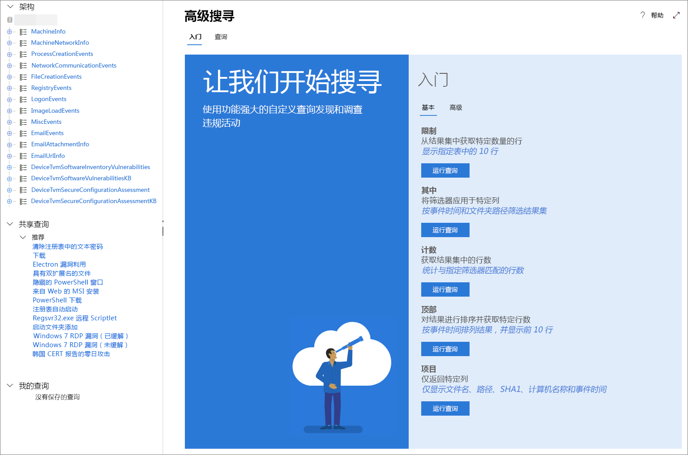

# <a name="learn-the-advanced-hunting-query-language"></a>了解高级搜寻查询语言

**适用于：**
- Microsoft 威胁防护

[!INCLUDE [Prerelease information](../includes/prerelease.md)]

高级搜寻基于 [Kusto 查询语言](https://docs.microsoft.com/azure/kusto/query/)。 你可以使用 Kusto 语法和运算符来构建查询，该查询可以在专为高级搜寻构造的[架构](advanced-hunting-schema-tables.md)中查找信息。 若要更好地了解这些概念，请运行你的第一个查询。

## <a name="try-your-first-query"></a>尝试你的第一个查询

在 Microsoft 365 安全中心，转到“**搜寻**”以运行你的第一个查询。 使用以下示例：

```kusto
// Finds PowerShell execution events that could involve a download.
DeviceProcessEvents 
| where Timestamp > ago(7d)
| where FileName in ("powershell.exe", "POWERSHELL.EXE", "powershell_ise.exe", "POWERSHELL_ISE.EXE") 
| where ProcessCommandLine has "Net.WebClient"
        or ProcessCommandLine has "DownloadFile"
        or ProcessCommandLine has "Invoke-WebRequest"
        or ProcessCommandLine has "Invoke-Shellcode"
        or ProcessCommandLine contains "http:"
| project Timestamp, DeviceName, InitiatingProcessFileName, FileName, ProcessCommandLine
| top 100 by Timestamp
```

这是它在高级搜寻中的显示效果。


查询将从描述其用途的简短批注开始。 如果你以后决定保存查询并与组织中的其他人共享，这将很有用。

```kusto
// Finds PowerShell execution events that could involve a download.
DeviceProcessEvents
```

查询本身通常以表名称开头，后跟一系列由管道 (`|`) 开头的元素。 在此示例中，我们首先添加表名称 `DeviceProcessEvents`，然后根据需要添加管道元素。

第一个管道元素是范围为前 7 天的时间筛选器。 尽可能缩小时间范围可以确保查询运行良好、返回易于管理的结果并且不会超时。

```kusto
| where Timestamp > ago(7d)
```

时间范围后紧跟表示 PowerShell 应用程序的文件搜索。

```kusto
| where FileName in ("powershell.exe", "POWERSHELL.EXE", "powershell_ise.exe", "POWERSHELL_ISE.EXE")
```

之后，查询将查找通常与 PowerShell 一起使用以下载文件的命令行。

```kusto
| where ProcessCommandLine has "Net.WebClient"
        or ProcessCommandLine has "DownloadFile"
        or ProcessCommandLine has "Invoke-WebRequest"
        or ProcessCommandLine has "Invoke-Shellcode"
        or ProcessCommandLine contains "http:"
```

现在，你的查询清楚地标识了要查找的数据，你可以添加定义结果外观的元素。 `project` 将返回特定列，并且 `top` 将限制结果数量，以使结果格式良好、大小合理且易于处理。

```kusto
| project Timestamp, DeviceName, InitiatingProcessFileName, FileName, ProcessCommandLine
| top 100 by Timestamp
```

单击“**运行查询**”以查看结果。 你可以展开屏幕视图，以便专注于你的搜寻查询和结果。

## <a name="learn-common-query-operators-for-advanced-hunting"></a>了解高级搜寻的常见查询运算符

你已运行第一个查询并对其组成部分有了大致了解，现在是时候回顾并学习一些基础知识了。 高级搜寻使用的 Kusto 查询语言支持多种运算符，包括以下常见的运算符。

| 运算符 | 说明和用法 |
|--|--|
| `where` | 从表中筛选出满足谓词的行的子集。 |
| `summarize` | 生成聚合输入表内容的表。 |
| `join` | 通过匹配每个表中指定列的值，合并两个表的行以形成新表。 |
| `count` | 返回输入记录集中的记录数。 |
| `top` | 返回按指定列排序的前 N 条记录。 |
| `limit` | 最多返回指定的行数。 |
| `project` | 选择要包含、重命名或删除的列，然后插入新的计算列。 |
| `extend` | 创建计算列并将其附加到结果集。 |
| `makeset` |  返回 Expr 在组中采用的一组不同值的动态 (JSON) 数组。 |
| `find` | 查找与一组表中的谓词匹配的行。 |

若要查看这些操作符的实时示例，请在高级搜寻的**入门**部分中运行它们。

## <a name="understand-data-types-and-their-query-syntax-implications"></a>了解数据类型及其查询语法含义

高级搜寻表中的数据通常分为以下数据类型。

| 数据类型 | 说明和查询含义 |
|--|--|
| `datetime` | 通常表示事件时间戳的数据和时间信息 |
| `string` | 字符串 |
| `bool` | True 或 False |
| `int` | 32 位数值  |
| `long` | 64 位数值 |

## <a name="use-sample-queries"></a>使用示例查询

**入门**部分提供了使用常用运算符的几个简单查询。 请尝试运行这些查询，并对其进行细微修改。



>[!NOTE]
>除了基本查询示例之外，你还可以访问特定威胁搜寻方案的[共享查询](advanced-hunting-shared-queries.md)。 浏览页面左侧或 GitHub 查询存储库中的共享查询。

## <a name="access-query-language-documentation"></a>访问查询语言文档

有关 Kusto 查询语言和受支持运算符的详细信息，请参阅 [Kusto 查询语言文档](https://docs.microsoft.com/azure/kusto/query/)。

## <a name="related-topics"></a>相关主题
- [主动搜寻威胁](advanced-hunting-overview.md)
- [使用共享查询](advanced-hunting-shared-queries.md)
- [在设备和电子邮件中搜寻威胁](advanced-hunting-query-emails-devices.md)
- [了解架构](advanced-hunting-schema-tables.md)
- [应用查询最佳做法](advanced-hunting-best-practices.md)