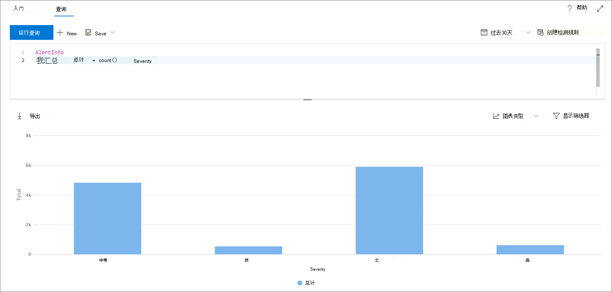

# <a name="work-with-advanced-hunting-query-results"></a>使用高级搜寻查询结果

**适用于：**
- Microsoft 威胁防护

[!INCLUDE [Prerelease information](../includes/prerelease.md)]

虽然您可以构建[高级搜寻](advanced-hunting-overview.md)查询以返回精确的信息，但您也可以使用查询结果来进一步了解并调查特定活动和指标。 您可以对查询结果执行以下操作：

- 以表或图表的形式查看结果
- 导出表和图表
- 向下钻取到详细实体信息
- 直接从结果或应用筛选器中调整您的查询

## <a name="view-query-results-as-a-table-or-chart"></a>以表或图表的形式查看查询结果
默认情况下，高级搜寻将查询结果显示为表格数据。 您还可以显示与图表相同的数据。 高级搜寻支持以下视图：

| 视图类型 | 说明 |
| -- | -- |
| **Table** | 以表格格式显示查询结果 |
| **柱形图** | 将 x 轴上的一系列唯一项呈现为垂直条，其高度表示来自另一个字段的数字值 |
| **堆积柱形图** | 将 x 轴上的一系列唯一项呈现为堆积垂直条形图，其高度表示来自一个或多个其他字段的数字值 |
| **饼形图** | 呈现表示唯一项的剖饼图。 每个饼图的大小代表另一个字段中的数字值。 |
| **圆环图** | 呈现表示唯一项的剖弧形。 每个弧的长度表示来自另一个字段的数值。 |
| **折线图** | 绘制一系列唯一项的数值，并连接绘制的值 |
| **散点图** | 绘制一系列唯一项的数值 |
| **面积图** | 绘制一系列唯一项的数值，并填充绘制值下面的部分 |

### <a name="construct-queries-for-effective-charts"></a>构建有效图表的查询
在呈现图表时，高级搜寻将自动标识感兴趣的列和要聚合的数值。 若要获取有意义的图表，请构建查询以返回您想要以可视化方式查看的特定值。 下面是一些示例查询和生成的图表。

#### <a name="alerts-by-severity"></a>按严重性的警报
使用`summarize`运算符获取要绘制图表的值的数值计数。 下面的查询使用`summarize`运算符按严重性获取警报数。

```kusto
AlertInfo
| summarize Total = count() by Severity
```
呈现结果时，柱形图将每个严重性值显示为单独的列：


*按严重性显示为柱形图的警报*的柱形图查询结果

#### <a name="alert-severity-by-operating-system"></a>警报严重性（按操作系统）
您还可以使用`summarize`运算符为来自多个字段的图表值准备结果。 例如，您可能想要了解如何在操作系统（OS）之间分布警报严重性。 

下面`join`的查询使用运算符从`DeviceInfo`表中提取 OS 信息，然后使用`summarize`对和`OSPlatform` `Severity`列中的值进行计数：

```kusto
AlertInfo
| join AlertEvidence on AlertId
| join DeviceInfo on DeviceId
| summarize Count = count() by OSPlatform, Severity 
```
以下是使用堆积柱形图的最佳可视化效果：


*按 OS 和严重性显示为堆叠图表的通知图表查询结果*

#### <a name="phishing-emails-across-top-ten-sender-domains"></a>多个前十个发件人域的网络钓鱼电子邮件
如果要处理不有限的值列表，则可以使用`Top`运算符仅绘制具有最多实例的值。 例如，若要获取最多包含最多网络钓鱼电子邮件的前十个发件人域，请使用以下查询：

```kusto
EmailEvents
| where PhishFilterVerdict == "Phish"
| summarize Count = count() by SenderFromDomain
| top 10 by Count
```
使用饼图视图有效显示跨顶级域的分布：


形式显示的高级搜索查询结果的图像，该饼图*显示了多发件人域之间的网络钓鱼电子邮件分布情况*

#### <a name="file-activities-over-time"></a>一段时间内的文件活动
将`summarize`运算符与`bin()`函数结合使用，可以检查一段时间内涉及特定指示器的事件。 下面的查询按30分钟的间隔`invoice.doc`对涉及文件的事件进行计数，以显示与该文件相关的活动峰值：

```kusto
AppFileEvents
| union DeviceFileEvents
| where FileName == "invoice.doc"
| summarize FileCount = count() by bin(Timestamp, 30m)
```
下面的行图清晰突出显示了包含更多活动`invoice.doc`的时间段： 


*折线图，显示有关一段时间内涉及文件的事件数*


## <a name="export-tables-and-charts"></a>导出表和图表
运行查询后，选择 "**导出**" 将结果保存到本地文件。 您选择的视图将确定导出结果的方式：

- **表视图**-以表格形式将查询结果导出为 Microsoft Excel 工作簿
- **任何图表**—查询结果将导出为呈现的图表的 JPEG 图像

## <a name="drill-down-from-query-results"></a>从查询结果中向下钻取
若要查看有关查询结果中的实体（如计算机、文件、用户、IP 地址和 URL）的详细信息，只需单击实体标识符。 这将为 Microsoft Defender 安全中心中的所选实体打开详细的配置文件页。

## <a name="tweak-your-queries-from-the-results"></a>调整结果中的查询
右键单击结果集中的值以快速增强查询。 可以使用这些选项执行以下操作：

- 显式查找选定值 (`==`)
- 从查询中排除选定值 (`!=`)
- 获取用于将值添加到查询的更高级运算符，如 `contains`、`starts with` 和 `ends with` 


## <a name="filter-the-query-results"></a>筛选查询结果
右侧显示的筛选器提供结果集的摘要。 每列都有其自己的部分，其中列出了该列找到的非重复值和实例数。

通过选择要包含或排除`+`的`-`值上的或按钮，然后选择 "**运行查询**" 来优化查询。


应用筛选器以修改查询并运行查询后，将相应更新结果。

## <a name="related-topics"></a>相关主题
- [高级搜寻概述](advanced-hunting-overview.md)
- [了解查询语言](advanced-hunting-query-language.md)
- [使用共享查询](advanced-hunting-shared-queries.md)
- [跨设备和电子邮件搜寻威胁](advanced-hunting-query-emails-devices.md)
- [了解架构](advanced-hunting-schema-tables.md)
- [应用查询最佳做法](advanced-hunting-best-practices.md)
- [自定义检测概述](custom-detections-overview.md)
