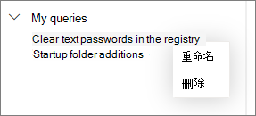

# 使用高级搜寻的共享查询Use shared queries in advanced hunting

[!INCLUDE [Microsoft 365 Defender rebranding](../includes/microsoft-defender.md)]

**适用于：****Applies to:**
- Microsoft 365 DefenderMicrosoft 365 Defender

可以与同一个组织内的用户共享[高级搜寻](advanced-hunting-overview.md)查询。[Advanced hunting](advanced-hunting-overview.md) queries can be shared among users in the same organization. 还可以查找在 GitHub 上公开共享的查询。You can also find queries shared publicly on GitHub. 借助这些查询，你可以快速追寻特定威胁搜寻方案，而无需从头开始编写查询。These queries let you quickly pursue specific threat hunting scenarios without having to write queries from scratch.

## 保存、修改和共享查询Save, modify, and share a query
可以保存新的或已有的查询，以便只有你可以访问它，或将它与组织内的其他用户共享。You can save a new or existing query so that it is only accessible to you or shared with other users in your organization. 

1. 创建或修改查询。Create or modify a query. 

2. 单击“保存查询”下拉按钮，并选择“另存为”。Click the **Save query** drop-down button and select **Save as**.
    
3. 输入查询的名称。Enter a name for the query. 

   

4. 选择要将查询保存到的文件夹。Select the folder where you'd like to save the query.
    - **共享查询** — 与组织内的所有用户共享**Shared queries** — shared to all users your organization
    - **我的查询** — 只有你可以访问**My queries** — accessible only to you
    
5. 选择“保存”。Select **Save**. 

## 删除或重命名查询Delete or rename a query
1. 右键单击要重命名或删除的查询。Right-click on a query you want to rename or delete.

    

2. 选择“删除”，并确认删除。Select **Delete** and confirm deletion. 或者选择“重命名”，并为查询提供新名称。Or select **Rename** and provide a new name for the query.

## 创建指向查询的直接链接Create a direct link to a query
若要生成直接在高级搜寻查询编辑器中打开您的查询的链接，请先完成查询，然后选择 " **共享链接** "。To generate a link that opens your query directly in the advanced hunting query editor, finalize your query and select **Share link**.

## 访问 GitHub 存储库中的查询Access queries in the GitHub repository  
Microsoft 安全研究人员定期在[指定的 GitHub 公共存储库](https://aka.ms/hunting-queries)中共享高级搜寻查询。Microsoft security researchers regularly share advanced hunting queries in a [designated public repository on GitHub](https://aka.ms/hunting-queries). 此存储库可自行参与。This repository is open to contributions. [免费加入 GitHub](https://github.com/)，即可参与。To contribute, [join GitHub for free](https://github.com/).

>[!tip]
>此外，Microsoft 研究人员还提供了高级搜寻查询，你可以使用它们查找与存在的威胁关联的活动和指示器。Microsoft security researchers also provide advanced hunting queries that you can use to locate activities and indicators associated with emerging threats. 将这些查询作为 Microsoft Defender 安全中心[威胁分析](https://docs.microsoft.com/windows/security/threat-protection/microsoft-defender-atp/threat-analytics)报告的一部分提供。These queries are provided as part of the [threat analytics](https://docs.microsoft.com/windows/security/threat-protection/microsoft-defender-atp/threat-analytics) reports in Microsoft Defender Security Center.

## 相关主题Related topics
- [高级搜寻概述Advanced hunting overview](advanced-hunting-overview.md)
- [了解查询语言Learn the query language](advanced-hunting-query-language.md)
- [处理查询结果Work with query results](advanced-hunting-query-results.md)
- [跨设备、电子邮件、应用和标识进行查寻Hunt across devices, emails, apps, and identities](advanced-hunting-query-emails-devices.md)
- [了解架构Understand the schema](advanced-hunting-schema-tables.md)
- [应用查询最佳做法Apply query best practices](advanced-hunting-best-practices.md)
