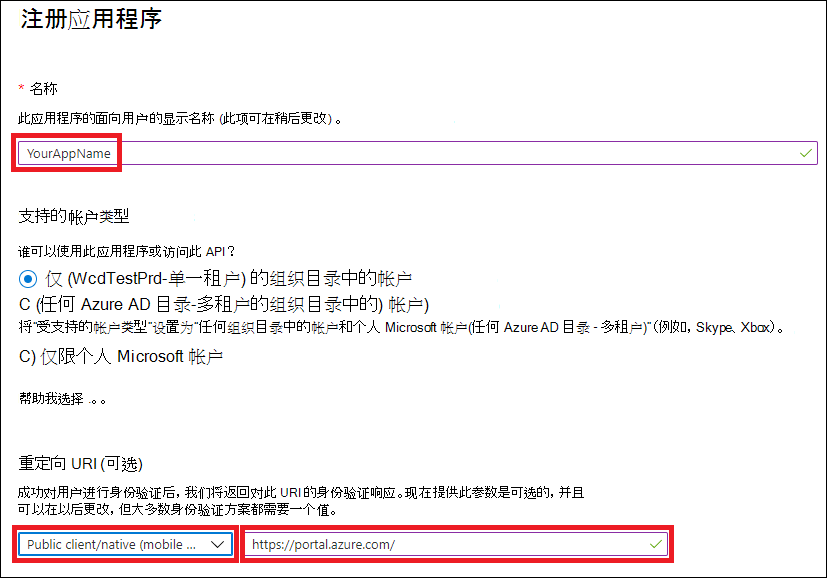
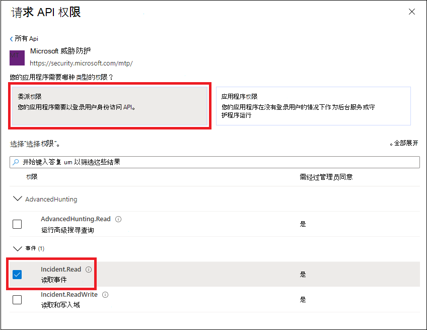

# <a name="access-microsoft-threat-protection-apis-on-behalf-of-user"></a><span data-ttu-id="e3bc2-104">代表用户访问 Microsoft 威胁防护 Api</span><span class="sxs-lookup"><span data-stu-id="e3bc2-104">Access Microsoft Threat Protection APIs on behalf of user</span></span>

[!INCLUDE [Microsoft 365 Defender rebranding](../includes/microsoft-defender.md)]


<span data-ttu-id="e3bc2-105">**适用于：**</span><span class="sxs-lookup"><span data-stu-id="e3bc2-105">**Applies to:**</span></span>
- <span data-ttu-id="e3bc2-106">Microsoft 威胁防护</span><span class="sxs-lookup"><span data-stu-id="e3bc2-106">Microsoft Threat Protection</span></span>

>[!IMPORTANT] 
><span data-ttu-id="e3bc2-107">一些信息与 prereleased 产品相关，在正式发布之前可能会对其进行重大修改。</span><span class="sxs-lookup"><span data-stu-id="e3bc2-107">Some information relates to prereleased product which may be substantially modified before it's commercially released.</span></span> <span data-ttu-id="e3bc2-108">Microsoft makes no warranties, express or implied, with respect to the information provided here.</span><span class="sxs-lookup"><span data-stu-id="e3bc2-108">Microsoft makes no warranties, express or implied, with respect to the information provided here.</span></span>


<span data-ttu-id="e3bc2-109">本页面介绍如何创建应用程序，以获取对用户代表用户进行的 Microsoft 威胁防护的编程访问。</span><span class="sxs-lookup"><span data-stu-id="e3bc2-109">This page describes how to create an application to get programmatic access to Microsoft Threat Protection on behalf of a user.</span></span>

<span data-ttu-id="e3bc2-110">如果需要在没有用户的情况下以编程方式访问 Microsoft 威胁防护，请参阅 [创建应用程序以访问不带用户的 Microsoft 威胁防护](api-create-app-web.md)。</span><span class="sxs-lookup"><span data-stu-id="e3bc2-110">If you need programmatic access Microsoft Threat Protection without a user, refer to [Create an app to access Microsoft Threat Protection without a user](api-create-app-web.md).</span></span>

<span data-ttu-id="e3bc2-111">如果您不确定所需的访问权限，请阅读 [Access Microsoft 威胁防护 api](api-access.md)。</span><span class="sxs-lookup"><span data-stu-id="e3bc2-111">If you are not sure which access you need, read the [Access the Microsoft Threat Protection APIs](api-access.md).</span></span>

<span data-ttu-id="e3bc2-112">Microsoft 威胁防护通过一组编程 Api 公开其大部分数据和操作。</span><span class="sxs-lookup"><span data-stu-id="e3bc2-112">Microsoft Threat Protection exposes much of its data and actions through a set of programmatic APIs.</span></span> <span data-ttu-id="e3bc2-113">这些 Api 将使您能够基于 Microsoft 威胁防护功能自动执行工作流和创新。</span><span class="sxs-lookup"><span data-stu-id="e3bc2-113">Those APIs will enable you to automate work flows and innovate based on Microsoft Threat Protection capabilities.</span></span> <span data-ttu-id="e3bc2-114">API 访问需要 OAuth 2.0 身份验证。</span><span class="sxs-lookup"><span data-stu-id="e3bc2-114">The API access requires OAuth2.0 authentication.</span></span> <span data-ttu-id="e3bc2-115">有关详细信息，请参阅 [OAuth 2.0 授权代码流](https://docs.microsoft.com/azure/active-directory/develop/active-directory-v2-protocols-oauth-code)。</span><span class="sxs-lookup"><span data-stu-id="e3bc2-115">For more information, see [OAuth 2.0 Authorization Code Flow](https://docs.microsoft.com/azure/active-directory/develop/active-directory-v2-protocols-oauth-code).</span></span>

<span data-ttu-id="e3bc2-116">一般情况下，您需要执行以下步骤来使用 Api：</span><span class="sxs-lookup"><span data-stu-id="e3bc2-116">In general, you’ll need to take the following steps to use the APIs:</span></span>
- <span data-ttu-id="e3bc2-117">创建 AAD 应用程序</span><span class="sxs-lookup"><span data-stu-id="e3bc2-117">Create an AAD application</span></span>
- <span data-ttu-id="e3bc2-118">使用此应用程序获取访问令牌</span><span class="sxs-lookup"><span data-stu-id="e3bc2-118">Get an access token using this application</span></span>
- <span data-ttu-id="e3bc2-119">使用令牌访问 Microsoft 威胁防护 API</span><span class="sxs-lookup"><span data-stu-id="e3bc2-119">Use the token to access Microsoft Threat Protection API</span></span>

<span data-ttu-id="e3bc2-120">此页说明如何创建 AAD 应用程序、获取 Microsoft 威胁防护的访问令牌并验证令牌。</span><span class="sxs-lookup"><span data-stu-id="e3bc2-120">This page explains how to create an AAD application, get an access token to Microsoft Threat Protection and validate the token.</span></span>

>[!NOTE]
> <span data-ttu-id="e3bc2-121">代表用户访问 Microsoft 威胁防护 API 时，需要正确的应用程序权限和用户权限。</span><span class="sxs-lookup"><span data-stu-id="e3bc2-121">When accessing Microsoft Threat Protection API on behalf of a user, you will need the correct Application permission and user permission.</span></span>


>[!TIP]
> <span data-ttu-id="e3bc2-122">如果您有权在门户中执行某项操作，则您有权在 API 中执行该操作。</span><span class="sxs-lookup"><span data-stu-id="e3bc2-122">If you have the permission to perform an action in the portal, you have the permission to perform the action in the API.</span></span>

## <a name="create-an-app"></a><span data-ttu-id="e3bc2-123">创建应用程序</span><span class="sxs-lookup"><span data-stu-id="e3bc2-123">Create an app</span></span>

1. <span data-ttu-id="e3bc2-124">使用具有**全局管理员**角色的用户登录到[Azure](https://portal.azure.com) 。</span><span class="sxs-lookup"><span data-stu-id="e3bc2-124">Log on to [Azure](https://portal.azure.com) with user that has **Global Administrator** role.</span></span>

2. <span data-ttu-id="e3bc2-125">导航到**Azure Active Directory**  >  **应用注册**  >  **新注册**。</span><span class="sxs-lookup"><span data-stu-id="e3bc2-125">Navigate to **Azure Active Directory** > **App registrations** > **New registration**.</span></span> 

   

3. <span data-ttu-id="e3bc2-127">在 "注册来源" 中，输入以下信息，然后单击 " **注册**"。</span><span class="sxs-lookup"><span data-stu-id="e3bc2-127">In the registration from, enter the following information then click **Register**.</span></span>

   

   - <span data-ttu-id="e3bc2-129">**名称：** 您的应用程序名称</span><span class="sxs-lookup"><span data-stu-id="e3bc2-129">**Name:** Your application name</span></span>
   - <span data-ttu-id="e3bc2-130">**应用程序类型：** 公共客户端</span><span class="sxs-lookup"><span data-stu-id="e3bc2-130">**Application type:** Public client</span></span>
   - <span data-ttu-id="e3bc2-131">**重定向 URI：**https://portal.azure.com</span><span class="sxs-lookup"><span data-stu-id="e3bc2-131">**Redirect URI:** https://portal.azure.com</span></span>

4. <span data-ttu-id="e3bc2-132">若要使您的应用程序能够访问 Microsoft 威胁防护并分配 it 权限，请在应用程序页上，选择 " **API 权限**"  >  **Add permission**  >  **"添加我的组织使用**> 的权限 api"，键入**microsoft 威胁 protection**，然后选择 " **microsoft 威胁防护**"。</span><span class="sxs-lookup"><span data-stu-id="e3bc2-132">To enable your app to access Microsoft Threat Protection and assign it permissions, on your application page, select **API Permissions** > **Add permission** > **APIs my organization uses** >, type **Microsoft Threat Protection**, and then select **Microsoft Threat Protection**.</span></span>

    >[!NOTE]
    > <span data-ttu-id="e3bc2-133">Microsoft 威胁防护不会出现在原始列表中。</span><span class="sxs-lookup"><span data-stu-id="e3bc2-133">Microsoft Threat Protection does not appear in the original list.</span></span> <span data-ttu-id="e3bc2-134">您需要先在文本框中写入其名称，才能看到它的显示。</span><span class="sxs-lookup"><span data-stu-id="e3bc2-134">You need to start writing its name in the text box to see it appear.</span></span>

      

    - <span data-ttu-id="e3bc2-136">选择 " **委派权限** " > 选择适用于您的方案的相关权限，如 " **事件**"，然后选择 " **添加权限**"。</span><span class="sxs-lookup"><span data-stu-id="e3bc2-136">Choose **Delegated permissions** > Choose the relevant permissions for your scenario, e.g. **Incident.Read**, and then select **Add permissions**.</span></span>

      

     >[!IMPORTANT]
     ><span data-ttu-id="e3bc2-138">您需要选择相关权限。</span><span class="sxs-lookup"><span data-stu-id="e3bc2-138">You need to select the relevant permissions.</span></span> 

    -  <span data-ttu-id="e3bc2-139">若要确定所需的权限，请查看您想要调用的 API 中的 " **权限** " 部分。</span><span class="sxs-lookup"><span data-stu-id="e3bc2-139">To determine which permission you need, please look at the **Permissions** section in the API you are interested to call.</span></span>

    - <span data-ttu-id="e3bc2-140">单击 "**授予同意**"</span><span class="sxs-lookup"><span data-stu-id="e3bc2-140">Click **Grant consent**</span></span>

      >[!NOTE]
      ><span data-ttu-id="e3bc2-141">每次添加权限时，都必须单击 " **授予许可** " 以使新权限生效。</span><span class="sxs-lookup"><span data-stu-id="e3bc2-141">Every time you add permission you must click on **Grant consent** for the new permission to take effect.</span></span>

      

6. <span data-ttu-id="e3bc2-143">记下应用程序 ID 和租户 ID：</span><span class="sxs-lookup"><span data-stu-id="e3bc2-143">Write down your application ID and your tenant ID:</span></span>

   - <span data-ttu-id="e3bc2-144">在应用程序页上，转到 " **概述** " 并复制以下内容：</span><span class="sxs-lookup"><span data-stu-id="e3bc2-144">On your application page, go to **Overview** and copy the following:</span></span>

   


## <a name="get-an-access-token-using-powershell"></a><span data-ttu-id="e3bc2-146">使用 PowerShell 获取访问令牌</span><span class="sxs-lookup"><span data-stu-id="e3bc2-146">Get an access token using PowerShell</span></span>

```
#Install the ADAL.PS package if it's not installed.
if(!(Get-Package adal.ps)) { Install-Package -Name adal.ps }

$authority = "https://login.windows.net/{tenant-id}" # replace {tenant-id} with your tenant ID.

$clientId = "{application-id}" #replace {application-id} with your application ID.

$redirectUri = "{redirect-uri}" # replace {redirect-uri} with your application redirect URI.

$resourceUrl = "https://api.security.microsoft.com"

$response = Get-ADALToken -Resource $resourceUrl -ClientId $clientId -RedirectUri $redirectUri -Authority $authority -PromptBehavior:Always
$response.AccessToken | clip
$response.AccessToken
```

## <a name="related-topics"></a><span data-ttu-id="e3bc2-147">相关主题</span><span class="sxs-lookup"><span data-stu-id="e3bc2-147">Related topics</span></span>
- [<span data-ttu-id="e3bc2-148">访问 Microsoft 威胁防护 Api</span><span class="sxs-lookup"><span data-stu-id="e3bc2-148">Access the Microsoft Threat Protection APIs</span></span>](api-access.md)
- [<span data-ttu-id="e3bc2-149">使用应用程序上下文访问 Microsoft 威胁防护</span><span class="sxs-lookup"><span data-stu-id="e3bc2-149">Access  Microsoft Threat Protection with application context</span></span>](api-create-app-web.md)
