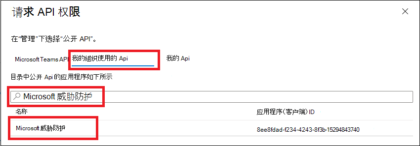
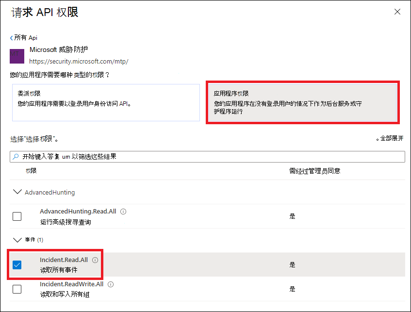
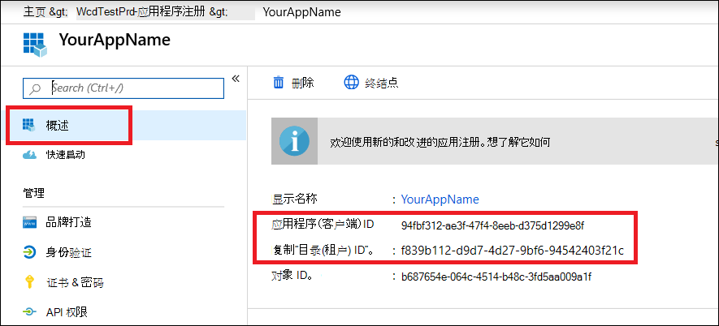

# <a name="hello-world-for-microsoft-threat-protection-rest-api"></a>Microsoft 威胁防护 REST API 的 Hello World 版 

**适用于：**
- Microsoft 威胁防护

>[!IMPORTANT] 
>一些信息与 prereleased 产品相关，在正式发布之前可能会对其进行重大修改。 Microsoft makes no warranties, express or implied, with respect to the information provided here.


## <a name="get-incidents-using-a-simple-powershell-script"></a>使用简单 PowerShell 脚本获取事件

### <a name="how-long-it-takes-to-go-through-this-example"></a>此示例需要多长时间？
只需完成以下两个步骤，即可完成5分钟：
- 应用程序注册
- 使用示例：仅需要复制/粘贴短 PowerShell 脚本

### <a name="do-i-need-a-permission-to-connect"></a>我是否需要权限才能连接？
对于 "应用程序注册" 阶段，您必须在 Azure Active Directory 中具有 **全局管理员** 角色 (azure AD) 租户。

### <a name="step-1---create-an-app-in-azure-active-directory"></a>步骤 1-在 Azure Active Directory 中创建应用

1. 使用**全局管理员**用户登录到[Azure](https://portal.azure.com) 。

2. 导航到**Azure Active Directory**  >  **应用注册**  >  **新注册**。 

   

3. 在 "注册" 表单中，选择应用程序的名称，然后选择 " **注册**"。

4. 允许您的应用程序访问 Microsoft Defender ATP 并将其分配为 " **读取所有事件** " 权限：

   - 在应用程序页上，选择 " **API 权限**  >  **Add permission**  >  **" "添加我的组织使用的权限 api"** > 键入**microsoft 威胁防护**并选择 " **microsoft 威胁防护**"。

   >[!NOTE]
   >Microsoft 威胁防护不会出现在原始列表中。 您需要先在文本框中写入其名称，才能看到它的显示。

   

   - 选择 "**应用程序权限**  >  **事件"。读取。所有**> 选择 "**添加权限**"

   

   >[!IMPORTANT]
   >您需要选择相关权限。 

     例如，

     - 若要确定所需的权限，请查看您想要调用的 API 中的 " **权限** " 部分。

5. 选择 "**授予管理员同意**"

    - >[!NOTE]
      > 每次添加权限时，您都必须选择 " **授予许可** " 以使新权限生效。

    

6. 向应用程序添加密码。

    - 选择 " **证书" & 密码**，将 "说明" 添加到密码，然后选择 " **添加**"。

    >[!IMPORTANT]
    > 选择 " **添加**" 后， **复制生成的机密值**。 你不能在离开后检索！

    

7. 记下应用程序 ID 和租户 ID：

   - 在应用程序页上，转到 " **概述** " 并复制以下内容：

   


为了! 已成功注册应用程序。

### <a name="step-2---get-a-token-using-the-app-and-use-this-token-to-access-the-api"></a>步骤 2-使用应用程序获取令牌，并使用此令牌访问 API。

-   将下面的脚本复制到 PowerShell ISE 或文本编辑器，并将其另存为 "**Get-Token.ps1**"
-   运行此脚本将生成一个令牌，并将其保存到名称为 "**Latest-token.txt**" 下的工作文件夹中。

```
# That code gets the App Context Token and save it to a file named "Latest-token.txt" under the current directory
# Paste below your Tenant ID, App ID and App Secret (App key).

$tenantId = '' ### Paste your tenant ID here
$appId = '' ### Paste your Application ID here
$appSecret = '' ### Paste your Application secret here

$resourceAppIdUri = 'https://api.security.microsoft.com'
$oAuthUri = "https://login.windows.net/$TenantId/oauth2/token"
$authBody = [Ordered] @{
    resource = "$resourceAppIdUri"
    client_id = "$appId"
    client_secret = "$appSecret"
    grant_type = 'client_credentials'
}
$authResponse = Invoke-RestMethod -Method Post -Uri $oAuthUri -Body $authBody -ErrorAction Stop
$token = $authResponse.access_token
Out-File -FilePath "./Latest-token.txt" -InputObject $token
return $token
```

-   健全性检查：<br>
运行脚本。<br>
在浏览器中，转到： https://jwt.ms/ <br>
将令牌复制 (Latest-token.txt 文件的内容) 。<br>
粘贴在顶部的框中。<br>
查找 "角色" 部分。 查找 ```Incidents.Read.All``` 角色。<br>
下面的示例来自具有和权限的应用 ```Incidents.Read.All``` 程序 ```Incidents.ReadWrite.All``` ```AdvancedHunting.Read.All``` 。


### <a name="lets-get-the-incidents"></a>允许你获取事件！

-   下面的脚本将使用 **Get-Token.ps1** 访问 API，并将在过去的48小时内获得最后更新的事件。
-   将此脚本保存在保存以前的脚本 **Get-Token.ps1**的同一文件夹中。 
-   脚本中包含数据的 json 文件与脚本位于同一文件夹中。

```
# Returns Incidents last updated in the past 48 hours.

$token = ./Get-Token.ps1       #run the script Get-Token.ps1  - make sure you are running this script from the same folder of Get-Token.ps1

# Get Incidents from the last 48 hours. Make sure you have incidents in that time frame.
$dateTime = (Get-Date).ToUniversalTime().AddHours(-48).ToString("o")

# The URL contains the type of query and the time filter we created above
$url = "https://api.security.microsoft.com/api/incidents?$filter=lastUpdateTime+ge+$dateTime"

# Set the WebRequest headers
$headers = @{ 
    'Content-Type' = 'application/json'
    'Accept' = 'application/json'
    'Authorization' = "Bearer $token"
}

# Send the webrequest and get the results. 
$response = Invoke-WebRequest -Method Get -Uri $url -Headers $headers -ErrorAction Stop

# Extract the incidents from the results. 
$incidents =  ($response | ConvertFrom-Json).value | ConvertTo-Json -Depth 99

# Get string with the execution time. We concatenate that string to the output file to avoid overwrite the file
$dateTimeForFileName = Get-Date -Format o | foreach {$_ -replace ":", "."}    

# Save the result as json
$outputJsonPath = "./Latest Incidents $dateTimeForFileName.json"     

Out-File -FilePath $outputJsonPath -InputObject $incidents 
```

你已经完成了！ 您已成功：
-   创建并注册和应用
-   授予该应用程序阅读通知的权限
-   已连接 API
-   使用 PowerShell 脚本返回在过去48小时内创建的事件


## <a name="related-topic"></a>相关主题
- [访问 Microsoft 威胁防护 Api](api-access.md)
- [使用应用程序上下文访问 Microsoft 威胁防护](api-create-app-web.md)
- [使用用户上下文访问 Microsoft 威胁防护](api-create-app-user-context.md)
