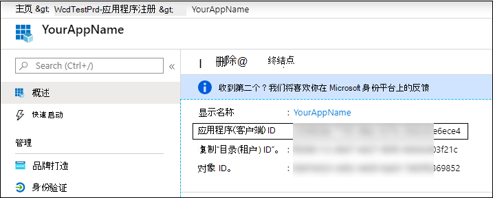
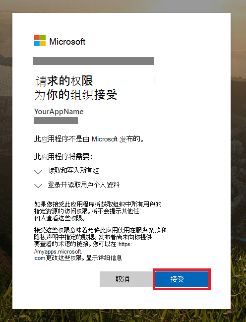

# <a name="partner-access-through-microsoft-365-defender-apis"></a><span data-ttu-id="8d8b8-104">通过 Microsoft 365 Defender Api 的合作伙伴访问</span><span class="sxs-lookup"><span data-stu-id="8d8b8-104">Partner access through Microsoft 365 Defender APIs</span></span>

[!INCLUDE [Microsoft 365 Defender rebranding](../includes/microsoft-defender.md)]


<span data-ttu-id="8d8b8-105">**适用于：**</span><span class="sxs-lookup"><span data-stu-id="8d8b8-105">**Applies to:**</span></span>
- <span data-ttu-id="8d8b8-106">Microsoft 365 Defender</span><span class="sxs-lookup"><span data-stu-id="8d8b8-106">Microsoft 365 Defender</span></span>

>[!IMPORTANT] 
><span data-ttu-id="8d8b8-107">一些信息与 prereleased 产品相关，在正式发布之前可能会对其进行重大修改。</span><span class="sxs-lookup"><span data-stu-id="8d8b8-107">Some information relates to prereleased product which may be substantially modified before it's commercially released.</span></span> <span data-ttu-id="8d8b8-108">Microsoft makes no warranties, express or implied, with respect to the information provided here.</span><span class="sxs-lookup"><span data-stu-id="8d8b8-108">Microsoft makes no warranties, express or implied, with respect to the information provided here.</span></span>


<span data-ttu-id="8d8b8-109">本页介绍如何创建 AAD 应用程序，以获取对客户的编程访问 Microsoft 365 Defender。</span><span class="sxs-lookup"><span data-stu-id="8d8b8-109">This page describes how to create an AAD application to get programmatic access to Microsoft 365 Defender on behalf of your customers.</span></span>

<span data-ttu-id="8d8b8-110">Microsoft 365 Defender 通过一组编程 Api 公开其大部分数据和操作。</span><span class="sxs-lookup"><span data-stu-id="8d8b8-110">Microsoft 365 Defender exposes much of its data and actions through a set of programmatic APIs.</span></span> <span data-ttu-id="8d8b8-111">这些 Api 将帮助您基于 Microsoft 365 Defender 功能自动执行工作流和创新。</span><span class="sxs-lookup"><span data-stu-id="8d8b8-111">Those APIs will help you automate work flows and innovate based on Microsoft 365 Defender capabilities.</span></span> <span data-ttu-id="8d8b8-112">API 访问需要 OAuth 2.0 身份验证。</span><span class="sxs-lookup"><span data-stu-id="8d8b8-112">The API access requires OAuth2.0 authentication.</span></span> <span data-ttu-id="8d8b8-113">有关详细信息，请参阅 [OAuth 2.0 授权代码流](https://docs.microsoft.com/azure/active-directory/develop/active-directory-v2-protocols-oauth-code)。</span><span class="sxs-lookup"><span data-stu-id="8d8b8-113">For more information, see [OAuth 2.0 Authorization Code Flow](https://docs.microsoft.com/azure/active-directory/develop/active-directory-v2-protocols-oauth-code).</span></span>

<span data-ttu-id="8d8b8-114">一般情况下，您需要执行以下步骤来使用 Api：</span><span class="sxs-lookup"><span data-stu-id="8d8b8-114">In general, you’ll need to take the following steps to use the APIs:</span></span>
- <span data-ttu-id="8d8b8-115">创建 **多租户** AAD 应用程序。</span><span class="sxs-lookup"><span data-stu-id="8d8b8-115">Create a **multi-tenant** AAD application.</span></span>
- <span data-ttu-id="8d8b8-116">为你的应用程序获取授权 (同意) 你的应用程序访问所需的 Microsoft 365 Defender 资源。</span><span class="sxs-lookup"><span data-stu-id="8d8b8-116">Get authorized (consent) by your customer administrator for your application to access Microsoft 365 Defender resources it needs.</span></span>
- <span data-ttu-id="8d8b8-117">使用此应用程序获取访问令牌。</span><span class="sxs-lookup"><span data-stu-id="8d8b8-117">Get an access token using this application.</span></span>
- <span data-ttu-id="8d8b8-118">使用令牌访问 Microsoft 365 Defender API。</span><span class="sxs-lookup"><span data-stu-id="8d8b8-118">Use the token to access Microsoft 365 Defender API.</span></span>

<span data-ttu-id="8d8b8-119">以下步骤介绍了如何创建 AAD 应用程序，获取 Microsoft 365 Defender 的访问令牌并验证令牌。</span><span class="sxs-lookup"><span data-stu-id="8d8b8-119">The following steps with guide you how to create an AAD application, get an access token to Microsoft 365 Defender and validate the token.</span></span>

## <a name="create-the-multi-tenant-app"></a><span data-ttu-id="8d8b8-120">创建多租户应用程序</span><span class="sxs-lookup"><span data-stu-id="8d8b8-120">Create the multi-tenant app</span></span>

1. <span data-ttu-id="8d8b8-121">使用具有 **全局管理员** 角色的用户登录到你的 [Azure 租户](https://portal.azure.com)。</span><span class="sxs-lookup"><span data-stu-id="8d8b8-121">Log on to your [Azure tenant](https://portal.azure.com) with user that has **Global Administrator** role.</span></span>

2. <span data-ttu-id="8d8b8-122">导航到 **Azure Active Directory**  >  **应用注册**  >  **新注册** 。</span><span class="sxs-lookup"><span data-stu-id="8d8b8-122">Navigate to **Azure Active Directory** > **App registrations** > **New registration**.</span></span> 

   

3. <span data-ttu-id="8d8b8-124">在 "注册" 表单中：</span><span class="sxs-lookup"><span data-stu-id="8d8b8-124">In the registration form:</span></span>

    - <span data-ttu-id="8d8b8-125">为您的应用程序选择一个名称。</span><span class="sxs-lookup"><span data-stu-id="8d8b8-125">Choose a name for your application.</span></span>

    - <span data-ttu-id="8d8b8-126">受支持的帐户类型-任何组织目录中的帐户。</span><span class="sxs-lookup"><span data-stu-id="8d8b8-126">Supported account types - accounts in any organizational directory.</span></span>

    - <span data-ttu-id="8d8b8-127">重定向 URI-类型： Web，URI： https://portal.azure.com</span><span class="sxs-lookup"><span data-stu-id="8d8b8-127">Redirect URI - type: Web, URI: https://portal.azure.com</span></span>

    


4. <span data-ttu-id="8d8b8-129">允许应用程序访问 Microsoft 365 Defender，并为其分配完成集成所需的最少权限集。</span><span class="sxs-lookup"><span data-stu-id="8d8b8-129">Allow your Application to access Microsoft 365 Defender and assign it with the minimal set of permissions required to complete the integration.</span></span>

   - <span data-ttu-id="8d8b8-130">在应用程序页上，单击 " **API 权限**  >  **Add permission**  >  **" "添加我的组织使用的权限 api"** > 键入 **microsoft 365 defender** ，然后单击 " **microsoft 365 defender** "。</span><span class="sxs-lookup"><span data-stu-id="8d8b8-130">On your application page, click **API Permissions** > **Add permission** > **APIs my organization uses** > type **Microsoft 365 Defender** and click on **Microsoft 365 Defender**.</span></span>

   >[!NOTE]
   ><span data-ttu-id="8d8b8-131">Microsoft 365 Defender 不会显示在原始列表中。</span><span class="sxs-lookup"><span data-stu-id="8d8b8-131">Microsoft 365 Defender does not appear in the original list.</span></span> <span data-ttu-id="8d8b8-132">您需要先在文本框中写入其名称，才能看到它的显示。</span><span class="sxs-lookup"><span data-stu-id="8d8b8-132">You need to start writing its name in the text box to see it appear.</span></span>

   
   
   ### <a name="request-api-permissions"></a><span data-ttu-id="8d8b8-134">请求 API 权限</span><span class="sxs-lookup"><span data-stu-id="8d8b8-134">Request API permissions</span></span>

   <span data-ttu-id="8d8b8-135">若要确定所需的权限，请查看您想要调用的 API 中的 " **权限** " 部分。</span><span class="sxs-lookup"><span data-stu-id="8d8b8-135">To determine which permission you need, please look at the **Permissions** section in the API you are interested to call.</span></span> 

   <span data-ttu-id="8d8b8-136">在下面的示例中，我们将使用 **"读取所有事件"** 权限：</span><span class="sxs-lookup"><span data-stu-id="8d8b8-136">In the following example we will use **'Read all incidents'** permission:</span></span>

   <span data-ttu-id="8d8b8-137">选择 " **应用程序权限**  >  **事件"。读取。所有** > 单击 " **添加权限** "</span><span class="sxs-lookup"><span data-stu-id="8d8b8-137">Choose **Application permissions** > **Incidents.Read.All** > Click on **Add permissions**</span></span>

   


5. <span data-ttu-id="8d8b8-139">单击 " **授予同意** "</span><span class="sxs-lookup"><span data-stu-id="8d8b8-139">Click **Grant consent**</span></span>

    >[!NOTE]
    ><span data-ttu-id="8d8b8-140">每次添加权限时，都必须单击 " **授予许可** " 以使新权限生效。</span><span class="sxs-lookup"><span data-stu-id="8d8b8-140">Every time you add permission you must click on **Grant consent** for the new permission to take effect.</span></span>

    

6. <span data-ttu-id="8d8b8-142">向应用程序添加密码。</span><span class="sxs-lookup"><span data-stu-id="8d8b8-142">Add a secret to the application.</span></span>

    - <span data-ttu-id="8d8b8-143">单击 " **证书 & 密码** "，将 "说明" 添加到密码，然后单击 " **添加** "。</span><span class="sxs-lookup"><span data-stu-id="8d8b8-143">Click **Certificates & secrets** , add description to the secret and click **Add**.</span></span>

    >[!IMPORTANT]
    > <span data-ttu-id="8d8b8-144">选择 " **添加** " 后， **复制生成的机密值** 。</span><span class="sxs-lookup"><span data-stu-id="8d8b8-144">After selecting **Add** , **copy the generated secret value**.</span></span> <span data-ttu-id="8d8b8-145">你不能在离开后检索！</span><span class="sxs-lookup"><span data-stu-id="8d8b8-145">You won't be able to retrieve after you leave!</span></span>

    

7. <span data-ttu-id="8d8b8-147">记下应用程序 ID：</span><span class="sxs-lookup"><span data-stu-id="8d8b8-147">Write down your application ID:</span></span>

   - <span data-ttu-id="8d8b8-148">在应用程序页上，转到 " **概述** " 并复制以下内容：</span><span class="sxs-lookup"><span data-stu-id="8d8b8-148">On your application page, go to **Overview** and copy the following:</span></span>

   

8. <span data-ttu-id="8d8b8-150">将应用程序添加到客户的租户。</span><span class="sxs-lookup"><span data-stu-id="8d8b8-150">Add the application to your customer's tenant.</span></span>

    <span data-ttu-id="8d8b8-151">您需要在要使用的每个客户租户中批准您的应用程序。</span><span class="sxs-lookup"><span data-stu-id="8d8b8-151">You need your application to be approved in each customer tenant where you intend to use it.</span></span> <span data-ttu-id="8d8b8-152">这是因为您的应用程序代表客户与 Microsoft 365 Defender 应用程序进行交互。</span><span class="sxs-lookup"><span data-stu-id="8d8b8-152">This is because your application interacts with Microsoft 365 Defender application on behalf of your customer.</span></span>

    <span data-ttu-id="8d8b8-153">具有客户租户的 **全局管理员** 的用户需要单击许可链接并批准您的应用程序。</span><span class="sxs-lookup"><span data-stu-id="8d8b8-153">A user with **Global Administrator** from your customer's tenant need to click the consent link and approve your application.</span></span>

    <span data-ttu-id="8d8b8-154">许可链接的形式为：</span><span class="sxs-lookup"><span data-stu-id="8d8b8-154">Consent link is of the form:</span></span>

    ```
    https://login.microsoftonline.com/common/oauth2/authorize?prompt=consent&client_id=00000000-0000-0000-0000-000000000000&response_type=code&sso_reload=true
    ```

    <span data-ttu-id="8d8b8-155">其中00000000-0000-0000-0000-000000000000 应替换为您的应用程序 ID</span><span class="sxs-lookup"><span data-stu-id="8d8b8-155">Where 00000000-0000-0000-0000-000000000000 should be replaced with your Application ID</span></span>

    <span data-ttu-id="8d8b8-156">单击 "同意" 链接后，请使用客户租户的全局管理员登录，并同意该应用程序。</span><span class="sxs-lookup"><span data-stu-id="8d8b8-156">After clicking on the consent link, login with the Global Administrator of the customer's tenant and consent the application.</span></span>

    

    <span data-ttu-id="8d8b8-158">此外，还需要向客户咨询其租户 ID，并将其保存以供将来在获取令牌时使用。</span><span class="sxs-lookup"><span data-stu-id="8d8b8-158">In addition, you will need to ask your customer for their tenant ID and save it for future use when acquiring the token.</span></span>

- <span data-ttu-id="8d8b8-159">**为了!**</span><span class="sxs-lookup"><span data-stu-id="8d8b8-159">**Done!**</span></span> <span data-ttu-id="8d8b8-160">已成功注册应用程序！</span><span class="sxs-lookup"><span data-stu-id="8d8b8-160">You have successfully registered an application!</span></span> 
- <span data-ttu-id="8d8b8-161">有关令牌获取和验证，请参阅下面的示例。</span><span class="sxs-lookup"><span data-stu-id="8d8b8-161">See examples below for token acquisition and validation.</span></span>

## <a name="get-an-access-token-examples"></a><span data-ttu-id="8d8b8-162">获取访问令牌示例：</span><span class="sxs-lookup"><span data-stu-id="8d8b8-162">Get an access token examples:</span></span>

>[!NOTE]
> <span data-ttu-id="8d8b8-163">若要代表客户获取访问令牌，请在以下令牌收购中使用客户的租户 ID。</span><span class="sxs-lookup"><span data-stu-id="8d8b8-163">To get access token on behalf of your customer, use the customer's tenant ID on the following token acquisitions.</span></span>

<br><span data-ttu-id="8d8b8-164">有关 AAD 令牌的更多详细信息，请参阅 [AAD 教程](https://docs.microsoft.com/azure/active-directory/develop/active-directory-v2-protocols-oauth-client-creds)</span><span class="sxs-lookup"><span data-stu-id="8d8b8-164">For more details on AAD token, refer to [AAD tutorial](https://docs.microsoft.com/azure/active-directory/develop/active-directory-v2-protocols-oauth-client-creds)</span></span>

### <a name="using-powershell"></a><span data-ttu-id="8d8b8-165">使用 PowerShell</span><span class="sxs-lookup"><span data-stu-id="8d8b8-165">Using PowerShell</span></span>

```
# That code gets the App Context Token and save it to a file named "Latest-token.txt" under the current directory
# Paste below your Tenant ID, App ID and App Secret (App key).

$tenantId = '' ### Paste your tenant ID here
$appId = '' ### Paste your Application ID here
$appSecret = '' ### Paste your Application key here

$resourceAppIdUri = 'https://api.security.microsoft.com'
$oAuthUri = "https://login.windows.net/$TenantId/oauth2/token"
$authBody = [Ordered] @{
    resource = "$resourceAppIdUri"
    client_id = "$appId"
    client_secret = "$appSecret"
    grant_type = 'client_credentials'
}
$authResponse = Invoke-RestMethod -Method Post -Uri $oAuthUri -Body $authBody -ErrorAction Stop
$token = $authResponse.access_token
Out-File -FilePath "./Latest-token.txt" -InputObject $token
return $token
```

### <a name="using-c"></a><span data-ttu-id="8d8b8-166">使用 c #：</span><span class="sxs-lookup"><span data-stu-id="8d8b8-166">Using C#:</span></span>

><span data-ttu-id="8d8b8-167">下面的代码使用 Nuget Microsoft.identitymodel.dll 进行了测试</span><span class="sxs-lookup"><span data-stu-id="8d8b8-167">The below code was tested with Nuget Microsoft.IdentityModel.Clients.ActiveDirectory</span></span>

- <span data-ttu-id="8d8b8-168">创建新的控制台应用程序</span><span class="sxs-lookup"><span data-stu-id="8d8b8-168">Create a new Console Application</span></span>
- <span data-ttu-id="8d8b8-169">安装 Nuget [microsoft.identitymodel.dll](https://www.nuget.org/packages/Microsoft.IdentityModel.Clients.ActiveDirectory/) 。</span><span class="sxs-lookup"><span data-stu-id="8d8b8-169">Install Nuget [Microsoft.IdentityModel.Clients.ActiveDirectory](https://www.nuget.org/packages/Microsoft.IdentityModel.Clients.ActiveDirectory/)</span></span>
- <span data-ttu-id="8d8b8-170">使用添加下面的</span><span class="sxs-lookup"><span data-stu-id="8d8b8-170">Add the below using</span></span>

    ```
    using Microsoft.IdentityModel.Clients.ActiveDirectory;
    ```

- <span data-ttu-id="8d8b8-171">将下面的代码复制/粘贴到您的应用程序中 (不要忘记更新3个变量： ```tenantId, appId, appSecret```) </span><span class="sxs-lookup"><span data-stu-id="8d8b8-171">Copy/Paste the below code in your application (do not forget to update the 3 variables: ```tenantId, appId, appSecret```)</span></span>

    ```
    string tenantId = "00000000-0000-0000-0000-000000000000"; // Paste your own tenant ID here
    string appId = "11111111-1111-1111-1111-111111111111"; // Paste your own app ID here
    string appSecret = "22222222-2222-2222-2222-222222222222"; // Paste your own app secret here for a test, and then store it in a safe place! 

    const string authority = "https://login.windows.net";
    const string mtpResourceId = "https://api.security.microsoft.com";

    AuthenticationContext auth = new AuthenticationContext($"{authority}/{tenantId}/");
    ClientCredential clientCredential = new ClientCredential(appId, appSecret);
    AuthenticationResult authenticationResult = auth.AcquireTokenAsync(mtpResourceId, clientCredential).GetAwaiter().GetResult();
    string token = authenticationResult.AccessToken;
    ```


### <a name="using-curl"></a><span data-ttu-id="8d8b8-172">使用卷</span><span class="sxs-lookup"><span data-stu-id="8d8b8-172">Using Curl</span></span>

> [!NOTE]
> <span data-ttu-id="8d8b8-173">以下过程应卷曲 Windows 已安装在您的计算机上</span><span class="sxs-lookup"><span data-stu-id="8d8b8-173">The below procedure supposed Curl for Windows is already installed on your computer</span></span>

- <span data-ttu-id="8d8b8-174">打开命令窗口</span><span class="sxs-lookup"><span data-stu-id="8d8b8-174">Open a command window</span></span>
- <span data-ttu-id="8d8b8-175">将 CLIENT_ID 设置为你的 Azure 应用程序 ID</span><span class="sxs-lookup"><span data-stu-id="8d8b8-175">Set CLIENT_ID to your Azure application ID</span></span>
- <span data-ttu-id="8d8b8-176">将 CLIENT_SECRET 设置为你的 Azure 应用程序密码</span><span class="sxs-lookup"><span data-stu-id="8d8b8-176">Set CLIENT_SECRET to your Azure application secret</span></span>
- <span data-ttu-id="8d8b8-177">将 TENANT_ID 设置为希望使用应用程序访问 Microsoft 365 Defender 应用程序的客户的 Azure 租户 ID</span><span class="sxs-lookup"><span data-stu-id="8d8b8-177">Set TENANT_ID to the Azure tenant ID of the customer that wants to use your application to access Microsoft 365 Defender application</span></span>
- <span data-ttu-id="8d8b8-178">运行以下命令：</span><span class="sxs-lookup"><span data-stu-id="8d8b8-178">Run the below command:</span></span>

```
curl -i -X POST -H "Content-Type:application/x-www-form-urlencoded" -d "grant_type=client_credentials" -d "client_id=%CLIENT_ID%" -d "scope=https://api.security.microsoft.com.default" -d "client_secret=%CLIENT_SECRET%" "https://login.microsoftonline.com/%TENANT_ID%/oauth2/v2.0/token" -k
```

<span data-ttu-id="8d8b8-179">您将获得表单的答案：</span><span class="sxs-lookup"><span data-stu-id="8d8b8-179">You will get an answer of the form:</span></span>

```
{"token_type":"Bearer","expires_in":3599,"ext_expires_in":0,"access_token":"eyJ0eXAiOiJKV1QiLCJhbGciOiJSUzI1NiIsIn <truncated> aWReH7P0s0tjTBX8wGWqJUdDA"}
```

## <a name="validate-the-token"></a><span data-ttu-id="8d8b8-180">验证令牌</span><span class="sxs-lookup"><span data-stu-id="8d8b8-180">Validate the token</span></span>

<span data-ttu-id="8d8b8-181">健全性检查以确保获得正确的令牌：</span><span class="sxs-lookup"><span data-stu-id="8d8b8-181">Sanity check to make sure you got a correct token:</span></span>

- <span data-ttu-id="8d8b8-182">将上一步中获取的令牌复制/粘贴到 [JWT](https://jwt.ms) ，以便对其进行解码</span><span class="sxs-lookup"><span data-stu-id="8d8b8-182">Copy/paste into [JWT](https://jwt.ms) the token you get in the previous step in order to decode it</span></span>
- <span data-ttu-id="8d8b8-183">验证是否获取了具有所需权限的 "roles" 声明</span><span class="sxs-lookup"><span data-stu-id="8d8b8-183">Validate you get a 'roles' claim with the desired permissions</span></span>
- <span data-ttu-id="8d8b8-184">在下面的屏幕截图中，你可以看到从具有多个权限的应用程序获取的已解码令牌： Microsoft 365 Defender：</span><span class="sxs-lookup"><span data-stu-id="8d8b8-184">In the screenshot below, you can see a decoded token acquired from an Application with multiple permissions to Microsoft 365 Defender:</span></span>
- <span data-ttu-id="8d8b8-185">"Tid" 声明是令牌所属的租户 ID。</span><span class="sxs-lookup"><span data-stu-id="8d8b8-185">The "tid" claim is the tenant ID the token belongs to.</span></span>


## <a name="use-the-token-to-access-microsoft-365-defender-api"></a><span data-ttu-id="8d8b8-187">使用令牌访问 Microsoft 365 Defender API</span><span class="sxs-lookup"><span data-stu-id="8d8b8-187">Use the token to access Microsoft 365 Defender API</span></span>

- <span data-ttu-id="8d8b8-188">选择要使用的 API。有关详细信息，请参阅 [支持的 Microsoft 365 Defender api](api-supported.md)</span><span class="sxs-lookup"><span data-stu-id="8d8b8-188">Choose the API you want to use, for more information, see [Supported Microsoft 365 Defender APIs](api-supported.md)</span></span>
- <span data-ttu-id="8d8b8-189">在发送到 "持有者 {令牌}" 的 Http 请求中设置授权标头 (持有者是授权方案) </span><span class="sxs-lookup"><span data-stu-id="8d8b8-189">Set the Authorization header in the Http request you send to "Bearer {token}" (Bearer is the Authorization scheme)</span></span>
- <span data-ttu-id="8d8b8-190">令牌的过期时间为1小时 (您可以使用同一令牌发送多个请求) </span><span class="sxs-lookup"><span data-stu-id="8d8b8-190">The Expiration time of the token is 1 hour (you can send more then one request with the same token)</span></span>

- <span data-ttu-id="8d8b8-191">**使用 c #** 发送获取事件列表的请求的示例</span><span class="sxs-lookup"><span data-stu-id="8d8b8-191">Example of sending a request to get a list of incidents **using C#**</span></span> 
    ```
    var httpClient = new HttpClient();

    var request = new HttpRequestMessage(HttpMethod.Get, "https://api.security.microsoft.com/api/incidents");

    request.Headers.Authorization = new AuthenticationHeaderValue("Bearer", token);

    var response = httpClient.SendAsync(request).GetAwaiter().GetResult();

    // Do something useful with the response
    ```

## <a name="related-topics"></a><span data-ttu-id="8d8b8-192">相关主题</span><span class="sxs-lookup"><span data-stu-id="8d8b8-192">Related topics</span></span> 

- [<span data-ttu-id="8d8b8-193">访问 Microsoft 365 Defender Api</span><span class="sxs-lookup"><span data-stu-id="8d8b8-193">Access the Microsoft 365 Defender APIs</span></span>](api-access.md)
- [<span data-ttu-id="8d8b8-194">使用应用程序上下文访问 Microsoft 365 Defender</span><span class="sxs-lookup"><span data-stu-id="8d8b8-194">Access  Microsoft 365 Defender with application context</span></span>](api-create-app-web.md)
- [<span data-ttu-id="8d8b8-195">使用用户上下文访问 Microsoft 365 Defender</span><span class="sxs-lookup"><span data-stu-id="8d8b8-195">Access  Microsoft 365 Defender with user context</span></span>](api-create-app-user-context.md)
