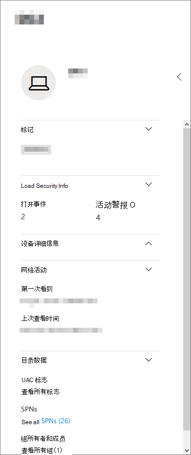
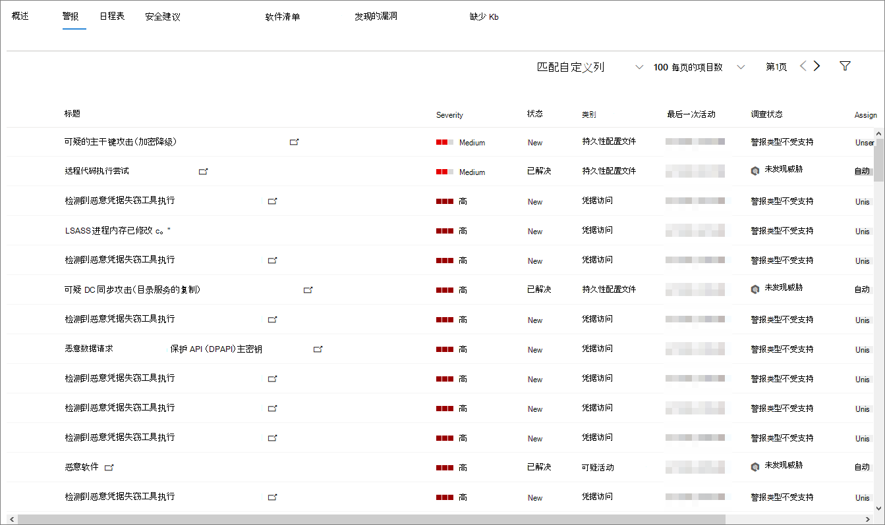
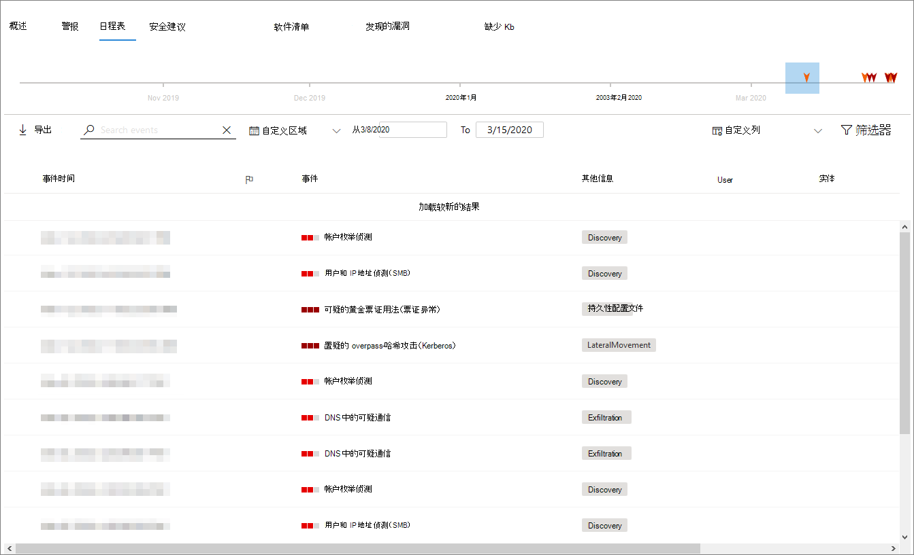
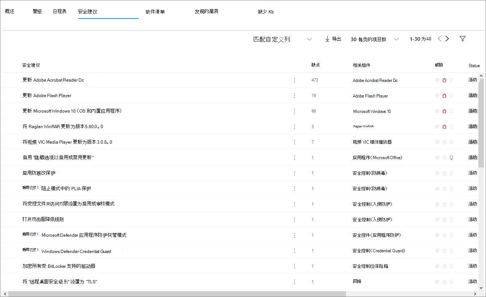
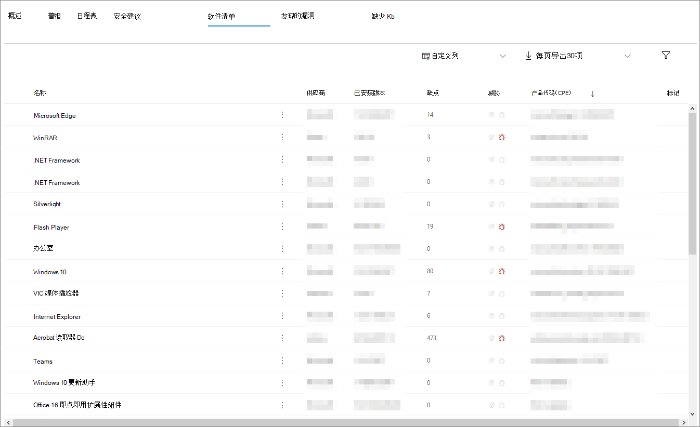
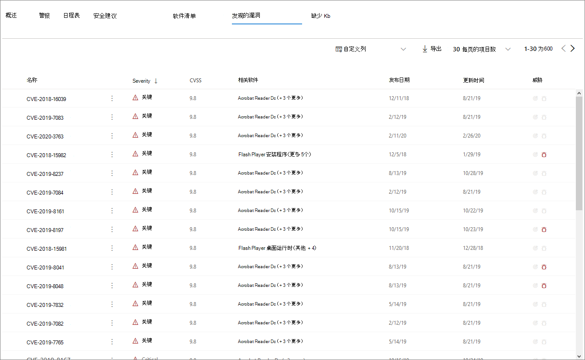

# 设备配置文件页

Microsoft 365 安全门户为您提供了设备配置文件页，因此您可以快速评估网络上设备的运行状况和状态。

> [!IMPORTANT]
> 设备配置文件页看上去可能略有不同，具体取决于设备是在 Microsoft Defender ATP、Azure ATP 中注册还是同时在两者中注册。

如果设备已在 Microsoft Defender ATP 中注册，则还可以使用设备配置文件页面执行一些常见的安全任务。

## 浏览设备配置文件页

配置文件页面分为几个广义部分。

边栏（1）列出有关设备的基本详细信息。

主内容区域（2）包含可以切换到的选项卡，以查看有关设备的不同类型的信息。

如果设备已在 Microsoft Defender ATP 中注册，则还会看到响应操作的列表（3）。 响应操作允许您执行常见的与安全相关的任务。

## 边栏

在设备配置文件页面的主要内容区域旁边是侧边栏。

侧栏列出设备的完整名称和曝光级别。 它还提供了一些小子部分中的一些重要基本信息，这些信息可以切换为打开或关闭，例如：

* **标记**-与设备关联的任何 MICROSOFT Defender ATP、Azure atp 或自定义标记。 来自 Azure ATP 的标记不可编辑。
* **安全信息**-打开事件和活动警报。 在 Microsoft Defender ATP 中注册的设备也将显示暴露级别和风险级别。

> [!TIP]
> 暴露程度取决于设备符合安全建议的程度，而风险级别则根据许多因素计算，包括活动警报的类型和严重性。

* **设备详细信息**-域、OS、设备首次看到时的时间戳、IP 地址、资源。 在 Microsoft Defender ATP 中注册的设备也会显示运行状况状态。 在 Azure ATP 中注册的设备将显示 SAM 名称和在第一次创建设备时的时间戳。
* **网络活动**-首次在网络上显示设备时的时间戳。
* **目录数据**（*仅适用于在 Azure ATP 中注册的设备*）- [UAC](https://docs.microsoft.com/windows/security/identity-protection/user-account-control/user-account-control-overview)标志、 [spn](https://docs.microsoft.com/windows/win32/ad/service-principal-names)和组成员身份。

## 响应操作

响应操作提供了一种快速防御和分析威胁的方法。

> [!IMPORTANT]
> * 仅当设备已在 Microsoft Defender ATP 中注册时，[响应操作](https://docs.microsoft.com/windows/security/threat-protection/microsoft-defender-atp/respond-machine-alerts)才可用。
> * 在 Microsoft Defender ATP 中注册的设备可以显示不同数量的响应操作，具体取决于设备的 OS 和版本号。

在设备配置文件页上可用的操作包括：

* **管理标记**-更新已应用于此设备的自定义标记。
* **隔离设备**-将设备与组织的网络隔离，同时保持它连接到 Microsoft Defender 高级威胁防护。 你可以选择允许 Outlook、团队和 Skype for Business 在设备被隔离时运行，以便进行通信。
* **操作中心**-查看已提交操作的状态。 仅在已选择另一操作时可用。
* **限制应用程序执行**-阻止未由 Microsoft 签名的应用程序运行。
* **运行防病毒扫描**-更新 Windows Defender 防病毒定义，并立即运行防病毒扫描。 在快速扫描或完全扫描之间进行选择。
* 收集有关设备的**调查包**收集信息。 调查完成后，你可以下载它。
* **启动 Live Response Session** -在设备上加载远程命令行管理程序以进行[深入的安全调查](https://docs.microsoft.com/windows/security/threat-protection/microsoft-defender-atp/live-response)。
* **启动自动调查**-自动[调查和 remediates 威胁](https://docs.microsoft.com/microsoft-365/security/office-365-security/office-365-air)。 尽管您可以手动触发自动调查以从此页面运行，但[某些警报策略](https://docs.microsoft.com/microsoft-365/compliance/alert-policies?view=o365-worldwide#default-alert-policies)会触发自己的自动调查。
* **操作中心**-显示有关当前正在运行的所有响应操作的信息。

## “选项卡”部分

通过设备配置文件选项卡，可以切换有关设备的安全详细信息以及包含警报列表的表的概述。

在 Microsoft Defender ATP 中注册的设备也将显示功能为日程表的选项卡、安全建议列表、软件清单、发现的漏洞列表和缺少的 Kb （安全更新）。

### 概述选项卡

默认选项卡为**概述**。 它提供了有关设备最重要的安全事实的快速讨论。

你可以在此处快速查看设备的活动警报以及任何当前登录的用户。

如果设备已在 Microsoft Defender ATP 中注册，你还将看到设备的风险级别和任何在安全评估上可用的数据。 安全评估描述设备的暴露级别、提供安全建议，并列出受影响的软件和发现的漏洞。

### "通知" 选项卡

"**警报**" 选项卡包含来自 Azure Atp 和 MICROSOFT Defender atp 的设备上已产生的警报的列表。

您可以自定义所显示的项目数，以及为每个项目显示的列。 默认行为是列出每个页面的三十个项目。

此选项卡中的列包含有关触发警报的威胁的严重性的信息，以及状态、调查状态和向其分配警报的发件者。

*受影响的实体*列指的是当前正在查看其配置文件的设备（实体）以及网络中受影响的任何其他设备。

从该列表中选择一项将打开一个浮出控件，其中包含有关选定警报的详细信息。

可以按严重性、状态或向其分配警报的人筛选此列表。

### 日程表选项卡

"**时间线**" 选项卡包含设备上引发的所有事件的交互式、按时间排列的图表。 通过将图表的突出显示区域向左或向右移动，可以查看不同时间段的事件。 您还可以从 "交互式图表" 和 "事件" 列表之间的下拉菜单中选择一个自定义日期范围。

图表下面是选定日期范围内的事件的列表。

可以自定义显示的项目数和列表中的列。 默认列列出了事件时间、活动用户、操作类型、实体（进程）以及有关事件的其他信息。

从该列表中选择一项将打开一个浮出控件，其中显示事件实体图，显示事件中涉及的父进程和子进程。

该列表可以按特定类型的事件进行筛选;例如，注册表事件或智能屏幕事件。

此外，还可以将列表导出到 CSV 文件，以供下载。 尽管该文件不受事件数量的限制，但可以选择导出的最长时间范围是七天。

### "安全性建议" 选项卡

"**安全建议**" 选项卡列出了可用于保护设备的操作。 选择此列表中的项将打开一个浮出控件，您可以在其中获取有关如何应用建议的说明。

与以前的选项卡一样，可以自定义每页显示的项数以及哪些列是可见的。

默认视图包含详细介绍了解决安全弱点的列、相关威胁、受威胁影响的相关组件或软件等。 可以按建议的状态筛选项目。

### 软件清单

"**软件清单**" 选项卡列出了设备上安装的软件。

默认视图显示软件供应商、已安装版本号、已知软件弱点数、威胁见解、产品代码和标记。 可以自定义所显示的项目数以及显示的列。

从该列表中选择一项将打开一个浮出控件，其中包含有关所选软件的更多详细信息，以及上次找到该软件时的路径和时间戳。

可以按产品代码筛选此列表。

### 发现的漏洞选项卡

"**发现的漏洞**" 选项卡列出了可能会影响设备的任何常见漏洞和漏洞（cve）。

默认视图列出了 CVE 的严重性、常见漏洞得分（CVS）、发布的 CVE 发布时间、CVE 的最后更新时间以及与 CVE 相关的威胁。

与前面的选项卡一样，可以自定义所显示的项目数和可见的列。

从该列表中选择一项将打开一个描述 CVE 的浮出控件。

### 缺少 Kb

"**缺少 kb** " 选项卡列出了所有尚未应用于设备的 Microsoft 更新。 相关的 "Kb" 是介绍这些更新的[知识库文章](https://support.microsoft.com/help/242450/how-to-query-the-microsoft-knowledge-base-by-using-keywords-and-query)。例如， [KB4551762](https://support.microsoft.com/help/4551762/windows-10-update-kb4551762)。

默认视图列出包含更新、OS 版本、受影响的产品、Cve 地址、KB 编号和标记的公告。

每页显示的项目数和可自定义的列数。

选择某个项目将打开一个链接到更新的浮出控件。

## 相关主题

* [Microsoft 威胁防护概述](microsoft-threat-protection.md)
* [打开 Microsoft 威胁防护](mtp-enable.md)
* [使用实时响应调查设备上的实体](https://docs.microsoft.com/windows/security/threat-protection/microsoft-defender-atp/live-response)
* [Office 365 中的自动化调查和响应（空气）](https://docs.microsoft.com/microsoft-365/security/office-365-security/office-365-air)
