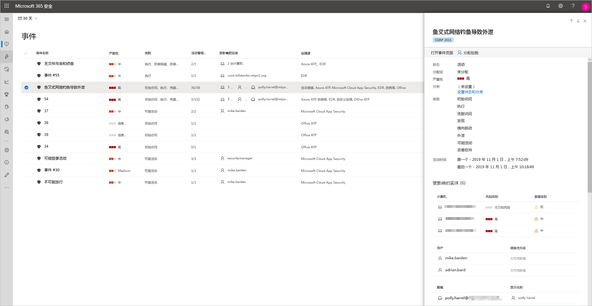
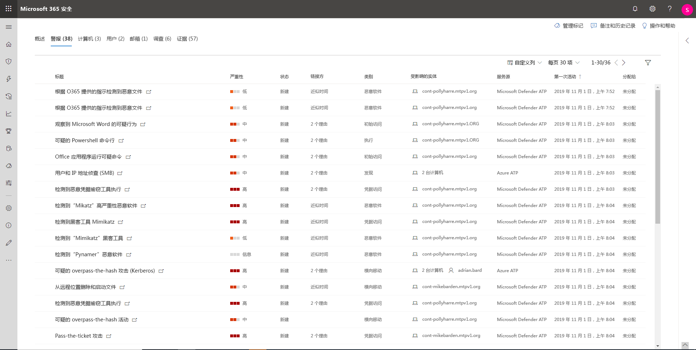
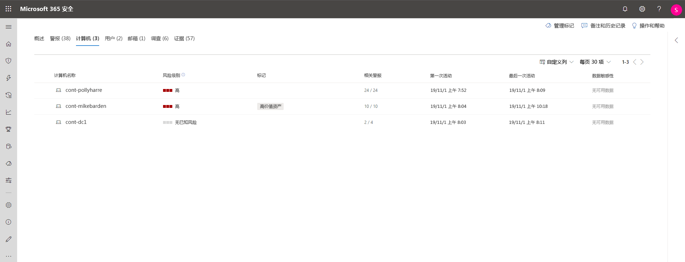
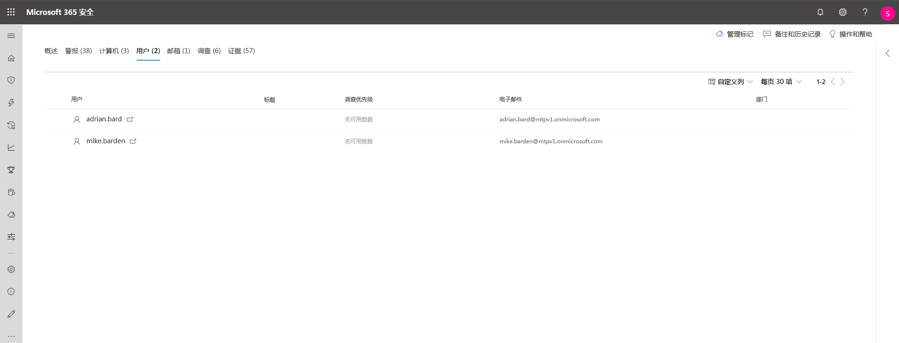
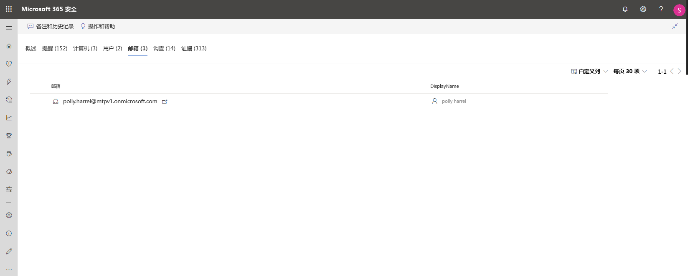
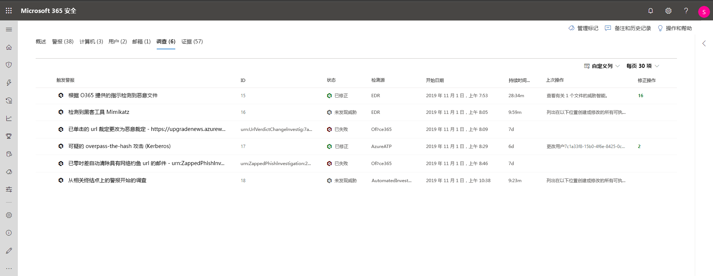
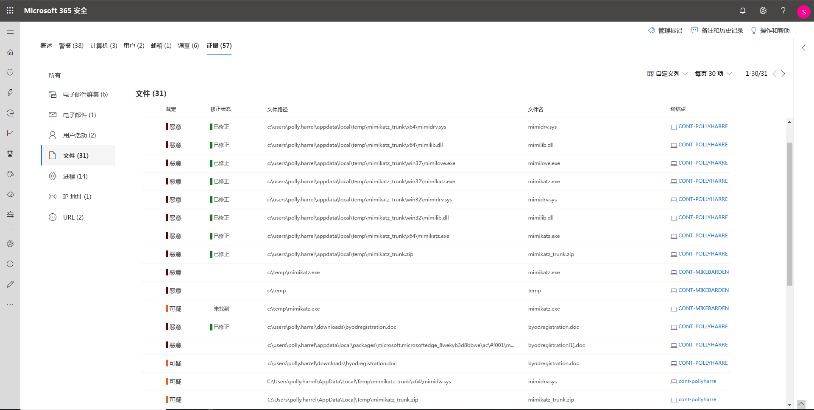

# 调查 Microsoft 威胁防护中的事件

**适用于：**
- Microsoft 威胁防护

[!INCLUDE [Prerelease information](../includes/prerelease.md)]

Microsoft 威胁防护将从所有设备、用户和邮箱聚合所有相关的警报、资产、调查和证据，让你全面了解完整的攻击范围。 

调查影响网络的警报，了解其含义，整理与事件相关的证据，以便可以制定出有效的补救计划。 

## 调查事件

1. 从事件队列中选择一个事件。   此操作将打开侧面板并显示重要信息（如状态、严重性、类别和受影响的实体）的预览。

    

2. 选择“**打开事件页面**”。   此操作将打开 "事件" 页面，可在其中找到更多信息事件详情、批注和操作、选项卡（概述、警报、设备、用户、调查、证据）。

3. 查看警报、设备、用户、其它涉及事件的实体。

## 事件概述 
"概述" 页面提供有关事件的最需要注意事项的概览信息。

攻击类别提供了有关如何在攻击链中获得高级攻击进度的直观和数字视图。 与其他 Microsoft 安全产品一样，Microsoft 威胁防护与 [MITRE ATT & CK&trade;](https://attack.mitre.org/) 框架一致。  

“范围” 部分提供了属于此事件的最受影响的资产列表。 如果存在有关此资产的具体信息（例如风险级别、调查优先级以及资产上的任何标记），也将在本节中显示。

“警报”时间线能够提前了解警报发生的时间顺序以及警报与此事件关联的原因。

最后“证据部分”汇总了事件中包含的项目数量和修正状态，因此能够立即确定是否需要采取措施。 

此概述可通过深入了解事件的首要特征，有助于了解事件的初始会审。 

## 警报 
可查看事件相关的所有警报和其他信息，如严重性、涉及警报的实体、警报来源（Azure ATP、Microsoft Defender ATP、Office  365 ATP）和关联原因。 

警报默认按时间顺序排序，可以首先查看攻击如何随时间推移。 点击各警报，将导航至相关警报页面，可在此对警报进行深入调查。 

## 设备 
"设备" 选项卡列出了出现与事件相关警报的所有设备。 

单击执行攻击的计算机的名称，导航至计算机页面，可在其中查看触发的警报和有助于调查的相关事件。 

选择 "时间线" 选项卡，将能够在计算机时间线之间滚动，并按时间顺序查看计算机上观察到的所有事件和行为，并与引发的警报交错。 

## 用户 
查看标记为属于事件或与事件相关的邮箱。 

单击用户名，将导航至用户的 Cloud App Security 页面，可在此进行进一步调查。

## 邮箱
调查标记为属于事件或与事件相关的邮箱。 若要执行进一步调查工作，选择邮件相关通知将 Office 365 打开高级威胁防护，可在此执行补救操作。

## 调查
选择“**调查**”，查看此事件中警报触发的自动调查。 调查将执行补救操作或等待分析员批准操作，具体取决于如何配置自动化调查，以在 Microsoft Defender ATP 和 Office 365 高级威胁防护中运行。

选择“调查”，以导航到调查详细信息页面，获取有关调查和修复状态的完整信息。 如果在调查过程中有任何待审批的操作，将在 "待定操作" 选项卡中显示。采取作为事件补救措施的操作。

## 证据
Microsoft 威胁防护自动调查警报中所有事件支持的事件和可疑实体，提供有关重要文件、流程、服务、电子邮件等的信息。 这有助于快速检测并阻止事件中的潜在威胁。 

每一被分析的实体都将标记有裁定（恶意、可疑和清除）以及修正状态。 这可有助于解整个事件的修正状态，以及执行进一步补救的后续步骤。

## 相关主题
- [事件概述](incidents-overview.md)
- [确定事件优先级](incident-queue.md)
- [管理事件](manage-incidents.md)