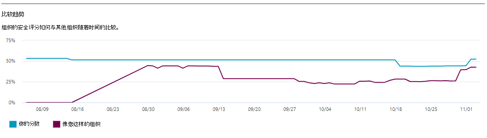

# 跟踪 Microsoft 安全分数历史记录并实现目标Track your Microsoft Secure Score history and meet goals

[!INCLUDE [Microsoft 365 Defender rebranding](../includes/microsoft-defender.md)]

[Microsoft 安全](microsoft-secure-score.md) 分数是组织安全状况的度量，较高的数字表示采取更多改进措施。[Microsoft Secure Score](microsoft-secure-score.md) is a measurement of an organization's security posture, with a higher number indicating more improvement actions taken. 可以在 https://security.microsoft.com/securescore [Microsoft 365 安全中心找到它](overview-security-center.md)。It can be found at https://security.microsoft.com/securescore in the [Microsoft 365 security center](overview-security-center.md).

## 深入了解影响分数的活动Gain insights into activity that has affected your score

在"历史记录"选项卡中查看组织一段时间 **得分的图形。**View a graph of your organization's score over time in the **History** tab.

下图是选定时间范围内执行的所有操作及其属性的列表，如生成的点和类别。Below the graph is a list of all the actions taken in the selected time range and their attributes, such as resulting points and category. 您可以自定义日期范围，并按类别进行筛选。You can customize a date range and filter by category.

如果选择与活动关联的改进操作，将显示完整的改进操作飞出图。If you select the improvement action associated with an activity, the full improvement action flyout will appear.

若要查看该特定改进操作的所有历史记录，请在飞出中选择历史记录链接。To view all history for that specific improvement action, select the history link in the flyout.

## 发现趋势并设定目标Discover trends and set goals

在 **"指标&** 趋势"选项卡中，有几个图表可让你进一步查看趋势和设定目标。In the **Metrics & trends** tab, there are several graphs and charts to give you more visibility into trends and set goals. 你可以为整个可视化页面设置日期范围。You can set the date range for the whole page of visualizations. 可视化包括：The visualizations include:

* **安全分数区域** - 根据组织目标和良好、正常和差分范围的定义进行自定义。**Your Secure Score zone** - Customized based on your organization's goals and definitions of good, okay, and bad score ranges.
* **回归趋势** - 由于配置、用户或设备更改而已回归的点的时间线。**Regression trend** - A timeline of points that have regressed because of configuration, user, or device changes.  
* **比较趋势** - 组织的安全分数如何与其他人的一段时间进行比较。**Comparison trend** - How your organization's Secure Score compares to others' over time. 此视图可以包含表示具有相似席位计数的组织得分平均值的行和您可以设置的自定义比较视图。This view can include lines representing the score average of organizations with similar seat count and a custom comparison view that you can set.
* **风险接受趋势** - 标记为"接受风险"的改进操作时间线。**Risk acceptance trend** - Timeline of improvement actions marked as "risk accepted."
* **分数更改** - 获得分数、已回归分数以及指定日期范围内分数的更改。**Score changes** - The number of points achieved, points regressed, and changes to your score in the specified date range.

### 将你的分数与像你这样的组织进行比较Compare your score to organizations like yours

有两处可了解分数与你类似的组织的比较方式。There are two places to see how your score compares to organizations that are similar to you. 在这两个图表中，都可以选择" **管理比较** "以查看和编辑组织的信息。In both charts, you can select **Manage comparisons** to view and edit your organization's information. 您还可以根据行业、组织规模、许可证和地区创建自定义比较。You can also create a custom comparison based on industry, organization size, licenses, and regions.

#### 比较条形图Comparison bar chart

比较条形图是"概述 **"** 选项卡。将鼠标悬停在图表上可查看得分和得分机会。The comparison bar chart is the **Overview** tab. Hover over the chart to view the score and score opportunity. 对比较数据进行匿名处理，因此，我们完全不知道哪些其他租户位于混合中。The comparison data is anonymized so we don’t know exactly which others tenants are in the mix.

- **类似你的** 组织：如果我们至少有五个或五 (个租户来比较符合以下条件) 租户的平均得分：**Organizations like yours**: an average score of other tenants (provided we have at least five or more tenants to compare) that qualify with the following criteria:
    1. 同一行业Same industry
    2. 组织规模相同Same organization size
    3. 所有区域All regions
    4. 使用的 Microsoft 产品有 80% 相似Microsoft products used are 80% similar
    5. 机会 (租户 20% 范围内的当前许可证) 达到的最大得分Opportunity (max score that can be achieved by current license) within a 20% range from your tenant

- **自定义比较**：需要根据以下条件选择"管理 **比较"进行** 设置：**Custom Comparison**: needs to be set up by selecting **Manage Comparison** based on the following criteria:
    1. 选定的行业 () Selected industry(s)
    2. 所选组织规模 () Selected organization size(s)
    3. 所选 (区域) Selected region(s)
    4. 所选许可证 () Selected license(s)
    5. 使用的 Microsoft 产品有 80% 相似Microsoft products used are 80% similar
    6. 机会 (租户 20% 范围内的当前许可证) 可获取的最大得分Opportunity (max score that can be achieved by current license) within a 20% range from your tenant

如果你已进行自定义选择，但结果少于五个我们可以与之比较的其他租户，你将看到"由于数据有限，不可用"。If you've made a custom selection but the results have less than five other tenants that we can compare against, you'll see “Not available due to limited data”.

#### 比较趋势Comparison trend

在 **"指标&** 趋势"选项卡中，查看组织的安全分数如何与其他人的一段时间进行比较。In the **Metrics & trends** tab, view how your organization's Secure Score compares to others' over time.

## 欢迎提出宝贵意见We want to hear from you

如果有任何问题，请通过发布到安全、隐私和合规社区& [告知](https://techcommunity.microsoft.com/t5/Security-Privacy-Compliance/bd-p/security_privacy) 我们。If you have any issues, let us know by posting in the [Security, Privacy & Compliance](https://techcommunity.microsoft.com/t5/Security-Privacy-Compliance/bd-p/security_privacy) community. We're monitoring the community and will provide help.We're monitoring the community and will provide help.

## 相关资源Related resources

- [Microsoft 安全分数概述Microsoft Secure Score overview](microsoft-secure-score.md)
- [评估你的安全状况Assess your security posture](microsoft-secure-score-improvement-actions.md)
- [即将推出的功能What's coming](microsoft-secure-score-whats-coming.md)
- [新增功能What's new](microsoft-secure-score-whats-new.md)
