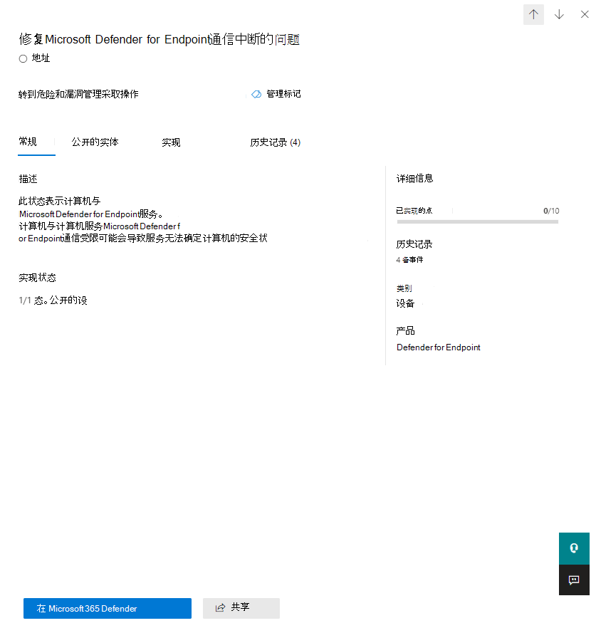

# 使用 Microsoft 安全分数评估安全状况Assess your security posture with Microsoft Secure Score

[!INCLUDE [Microsoft 365 Defender rebranding](../includes/microsoft-defender.md)]

Microsoft 安全分数是组织的安全状态的度量，数字越大，表明执行了更多改进操作。Microsoft Secure Score is a measurement of an organization's security posture, with a higher number indicating more improvement actions taken. 可在 https://security.microsoft.com/securescore [Microsoft 365 安全中心](overview-security-center.md)中找到。It can be found at https://security.microsoft.com/securescore in the [Microsoft 365 security center](overview-security-center.md).

为了帮助您更快地了解所需的信息，Microsoft 改善操作将组织成组：To help you the information you need more quickly, Microsoft improvement actions are organized into groups:

*  (Azure Active Directory 帐户 & 角色的标识) Identity (Azure Active Directory accounts & roles)
* Microsoft 信息保护) 的数据 (Data  (Microsoft Information Protection)
* 设备 (Microsoft Defender ATP，称为 [设备的 Microsoft 安全分数](https://docs.microsoft.com/windows/security/threat-protection/microsoft-defender-atp/tvm-microsoft-secure-score-devices)) Device (Microsoft Defender ATP, known as [Microsoft Secure Score for Devices](https://docs.microsoft.com/windows/security/threat-protection/microsoft-defender-atp/tvm-microsoft-secure-score-devices))
* 应用 (电子邮件和云应用，包括 Office 365 和 Microsoft 云应用安全) App (email and cloud apps, including Office 365 and Microsoft Cloud App Security)
* 基础结构 (现在没有任何改进操作) Infrastructure (no improvement actions for now)

>[!NOTE]
>在最近发布的 Microsoft 安全分数中，已发布了一个已改进的记分模型，使 Microsoft 安全分数暂时与标识安全分数和 Graph API 不兼容。In the recent release of Microsoft Secure Score, an improved scoring model has been released which made Microsoft Secure Score temporarily incompatible with Identity Secure Score and the Graph API. [查看详细信息View details](microsoft-secure-score-whats-new.md)

在 "Microsoft 安全分数概述" 页中，请参阅如何在这些组之间拆分点以及哪些点可用。In the Microsoft Secure Score overview page, see how points are split between these groups and what points are available. 您还可以获取总分和基准对比的安全分数的历史趋势的整体视图，以及可采取的优先改进措施来提高成绩。You can also get an all-up view of the total score, historical trend of your secure score with benchmark comparisons, and prioritized improvement actions that can be taken to improve your score.

## 检查当前分数Check your current score

若要查看你当前的分数，请转到 Microsoft 安全分数概述页面，并查找表明你的 **安全分数**的磁贴。To check on your current score, go to the Microsoft Secure Score overview page and look for the tile that says **Your secure score**. 你的分数将显示为百分比，以及你已实现的总积分数。Your score will be shown as a percentage, along with the number of points you've achieved out of a total possible points.

此外，如果您在得分旁选择 " **包括** " 按钮，则可以选择分数的不同视图。Additionally, if you select the **Include** button next to your score, you can choose different views of your score. 这些不同的分数视图将显示在 "分数" 图块和 "点" 细目图表的图中。These different score views will display in the graph on the score tile and the point breakdown chart.

以下是你可以向你的总体成绩视图中添加的分数，以便更完整地了解总体成绩：The following are scores you can add to your view of your overall score to give you a fuller picture of your overall score:

- **计划分数**：在计划的操作完成时显示计划的分数**Planned score**: Show projected score when planned actions are completed
- **当前许可证分数**：显示可通过当前 Microsoft 许可证实现的分数**Current license score**: Show score that can be achieved with your current Microsoft license
- 可**实现分数**：显示可通过你的 Microsoft 许可证和当前风险接受能力实现的分数**Achievable score**: Show score that can be achieved with your Microsoft licenses and current risk acceptance

如果您已包括所有可能的分数视图，则此视图如下所示：This view is what it will look like if you've included all possible score views:

## 采取行动以提高成绩Take action to improve your score

" **改进操作** " 选项卡列出了解决可能存在的攻击面的安全建议。The **Improvement actions** tab lists the security recommendations that address possible attack surfaces. 它还包括他们的状态 (，可解决、规划、风险接受、通过第三方解决问题、通过备用缓解措施解决，并完成) 。It also includes their status (to address, planned, risk accepted, resolved through third party, resolved through alternate mitigation, and completed). 您可以搜索、筛选和分组所有改进操作。You can search, filter, and group all the improvement actions.  

### 排名Ranking

排名基于要实现的点数、实现难度、用户影响和复杂性。Ranking is based on the number of points left to achieve, implementation difficulty, user impact, and complexity. 最高排名改进操作的剩余分数与较低的难度、用户影响和复杂性相同。The highest ranked improvement actions have a large number of points remaining with low difficulty, user impact, and complexity.

### 查看改进操作详细信息View improvement action details

选择特定的 "改进" 操作时，将显示完整的 "页面" 飞出控件。When you select a specific improvement action, a full page flyout appears.  

 *图2：改进操作浮出控件示例*
*Figure 2: Improvement action flyout example*

若要完成此操作，您有几个选项：To complete the action, you have a few options:

* 选择 " **管理** " 以转到配置屏幕并进行更改。Select **Manage** to go the configuration screen and make the change. 然后，您将获得活动所需的积分，在飞出中可见。点通常需要大约24小时才能更新。You'll then gain the points that the action is worth, visible in the fly out. Points generally take about 24 hours to update.

* 选择 " **共享** " 以将直接链接复制到 "改进" 操作。Select **Share** to copy the direct link to the improvement action. 您还可以选择用于共享链接的平台，如电子邮件、Microsoft 团队、Microsoft Planner 或 ServiceNow。You can also choose the platform to share the link, such as email, Microsoft Teams, Microsoft Planner, or ServiceNow. 选择 ServiceNow 将允许你创建将在 ServiceNow 和 Microsoft 365 安全中心主页中可见的更改票证。Selecting ServiceNow will let you create a change ticket that will be visible in ServiceNow and the Microsoft 365 security center home. 若要了解详细信息，请参阅 [Microsoft 365 安全中心和 ServiceNow 集成](tickets-security-center.md)。To learn more, see [Microsoft 365 security center and ServiceNow integration](tickets-security-center.md).

### 选择改进操作状态Choose an improvement action status

选择特定于 "改进" 操作的任何状态和记录笔记。Choose any statuses and record notes specific to the improvement action.

- **若要解决** 此需要，您可以认识到改进操作是必需的，并计划在将来某一时间解决此操作。**To address** - You recognize that the improvement action is necessary and plan to address it at some point in the future. 此状态也适用于检测为部分但未完全完成的操作。This state also applies to actions that are detected as partially, but not fully completed.
- **计划** -完成改进操作有具体的计划。**Planned** - There are concrete plans in place to complete the improvement action.
- **风险接受** -安全应始终平衡可用性，而不是每个建议都适用于你的环境。**Risk accepted** - Security should always be balanced with usability, and not every recommendation will work for your environment. 在这种情况下，您可以选择接受风险或剩余风险，而不是执行改进操作。When that is the case, you can choose to accept the risk, or the remaining risk, and not enact the improvement action. 不会向你提供任何点，但操作将不再显示在改进操作列表中。You won't be given any points, but the action will no longer be visible in the list of improvement actions. 您可以在历史记录中查看此操作，也可以随时撤消。You can view this action in history or undo it at any time.
- **通过第三方解决** ，并 **通过备用缓解措施解决** -改进操作已由第三方应用程序或软件或内部工具解决。**Resolved through third party** and **Resolved through alternate mitigation** - The improvement action has already been addressed by a third-party application or software, or an internal tool. 你将获得该操作所需的要点，因此你的得分更好地反映了你的总体安全状况。You'll gain the points that the action is worth, so your score better reflects your overall security posture. 如果第三方或内部工具不再涵盖该控件，您可以选择另一个状态。If a third party or internal tool no longer covers the control, you can choose another status. 请注意，如果将改进操作标记为这些状态之一，Microsoft 将无法深入了解实施的完整性。Keep in mind, Microsoft will have no visibility into the completeness of implementation if the improvement action is marked as either of these statuses.

#### 威胁 & 漏洞管理改进操作Threat & Vulnerability Management improvement actions

对于 "设备" 类别中的改进操作，你将无法选择状态。For improvement actions in the "Device" category, you won't be able to choose statuses. 相反，你将转到关联的 [威胁 & 漏洞管理 (TVM](https://docs.microsoft.com/windows/security/threat-protection/microsoft-defender-atp/tvm-security-recommendation) 中的 " [Microsoft Defender 安全中心](https://docs.microsoft.com/windows/security/threat-protection/microsoft-defender-atp/use) " 中的 ") 安全建议" 执行操作。Instead, you'll be directed to the associated [Threat & Vulnerability Management (TVM) security recommendation](https://docs.microsoft.com/windows/security/threat-protection/microsoft-defender-atp/tvm-security-recommendation) in the [Microsoft Defender Security Center](https://docs.microsoft.com/windows/security/threat-protection/microsoft-defender-atp/use) to take action. 您选择的异常和您编写的理由将特定于该门户。The exception you choose and justification you write will be specific to that portal. 它不会出现在 Microsoft 安全分数门户中。It won't be present in the Microsoft Secure Score portal.

#### 已完成的改进操作Completed improvement actions

一旦完成了改进操作的所有可能的点，改进操作将为 "已完成" 状态。Improvement actions have a "completed" status once all possible points for the improvement action have been achieved. 已完成的改进操作通过 Microsoft data 进行确认，并且你将无法更改状态。Completed improvement actions are confirmed though Microsoft data, and you won't be able to change the status.

### 评估信息并查看用户影响Assess information and review user impact

一 **眼** 中的 "" 一节将向您告知类别、它可以保护的攻击和产品。The section called **At a glance** will tell you the category, attacks it can protect against, and the product.

**用户影响**显示了在制定改进操作后用户将会遇到的情况，并且**受影响的用户**将会看到他们会遇到的情况。The **User impact** shows what the users will experience if the improvement action is enacted, and **Users affected** shows who will experience it.

### 实施改进操作Implement the improvement action

" **实现** " 部分显示了所有先决条件、完成改进操作的后续步骤、改进操作的当前实现状态以及任何 "了解更多" 链接。The **Implementation** section shows any prerequisites, step-by-step next steps to complete the improvement action, the current implementation status of the improvement action, and any learn more links.

先决条件包括任何需要获取的许可证或在解决改进操作之前需要完成的操作。Prerequisites include any licenses that need to be obtained or actions that need to be completed before the improvement action is addressed. 请确保你的许可证中有足够的座位来完成改进操作，并且这些许可证适用于所需的用户。Make sure you have enough seats in your license to complete the improvement action and that those licenses are applied to the necessary users.  

## 我们希望收到你的来信We want to hear from you

如果你有任何问题，请通过在 [安全、隐私 & 合规](https://techcommunity.microsoft.com/t5/Security-Privacy-Compliance/bd-p/security_privacy) 社区中发布来告知我们。If you have any issues, let us know by posting in the [Security, Privacy & Compliance](https://techcommunity.microsoft.com/t5/Security-Privacy-Compliance/bd-p/security_privacy) community. 我们正在监视社区，并将提供帮助。We're monitoring the community and will provide help.

## 相关资源Related resources

- [Microsoft 安全评分概述Microsoft Secure Score overview](microsoft-secure-score.md)
- [跟踪你的 Microsoft 安全分数历史记录并实现目标Track your Microsoft Secure Score history and meet goals](microsoft-secure-score-history-metrics-trends.md)
- [即将推出的功能What's coming](microsoft-secure-score-whats-coming.md)
- [新增功能What's new](microsoft-secure-score-whats-new.md)
