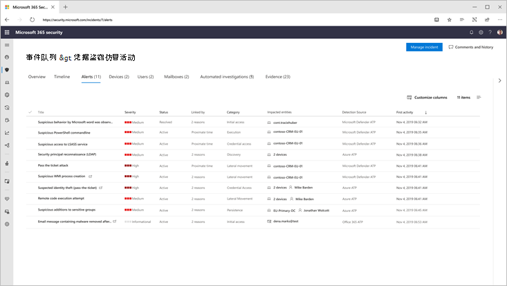
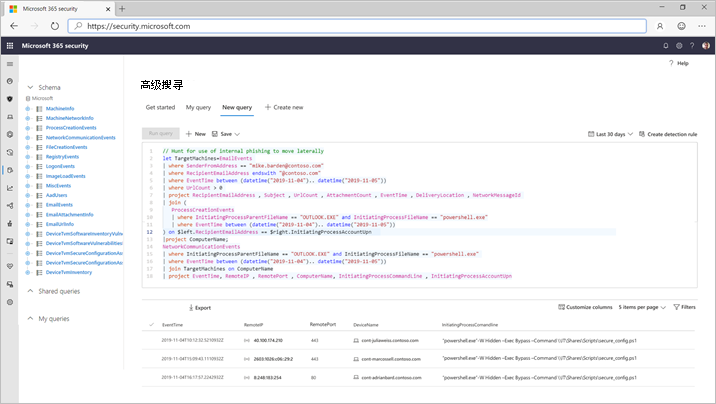

# Microsoft 365 DefenderMicrosoft 365 Defender

[!INCLUDE [Microsoft 365 Defender rebranding](../includes/microsoft-defender.md)]

**适用于：****Applies to:**
- Microsoft 365 DefenderMicrosoft 365 Defender

> 想要体验 Microsoft 365 Defender？Want to experience Microsoft 365 Defender? 您可以 [在实验室环境中对其进行评估](https://aka.ms/mtp-trial-lab) ，也可以 [在生产中运行试点项目](https://aka.ms/m365d-pilotplaybook)。You can [evaluate it in a lab environment](https://aka.ms/mtp-trial-lab) or [run your pilot project in production](https://aka.ms/m365d-pilotplaybook).
>

Microsoft 365 Defender 是一个统一的前期和后入侵后企业防护套件，它固有的跨终结点、标识、电子邮件和应用程序协调检测、预防、调查和响应，以提供针对复杂攻击的集成保护。Microsoft 365 Defender is a unified pre- and post-breach enterprise defense suite that natively coordinates detection, prevention, investigation, and response across endpoints, identities, email, and applications to provide integrated protection against sophisticated attacks.

使用集成的 Microsoft 365 Defender 解决方案，安全专业人员可以将威胁信号与这些产品中的每个产品一起接收并确定威胁的完整作用域和影响，并将它们结合起来。如何进入环境、受影响的内容以及当前对组织的影响。With the integrated Microsoft 365 Defender solution, security professionals can stitch together the threat signals that each of these products receive and determine the full scope and impact of the threat; how it entered the environment, what it's affected, and how it's currently impacting the organization. Microsoft 365 Defender 执行自动操作以阻止或停止攻击和自我修复受影响的邮箱、终结点和用户身份。Microsoft 365 Defender takes automatic action to prevent or stop the attack and self-heal affected mailboxes, endpoints, and user identities.  

<h2>Microsoft 365 Defender 服务
Microsoft 365 Defender services
</h2>
<table><tr><td>
<b><a href="https://docs.microsoft.com/windows/security/threat-protection/microsoft-defender-atp/microsoft-defender-advanced-threat-protection"><b>Microsoft Defender for Endpoint</b>

<b><a href="https://docs.microsoft.com/windows/security/threat-protection/microsoft-defender-atp/microsoft-defender-advanced-threat-protection"><b>Microsoft Defender for Endpoint</b>
</a></td>
<td>
<b><a href="https://docs.microsoft.com/office365/securitycompliance/office-365-atp"><b>Microsoft Defender for Office 365</b>

<b><a href="https://docs.microsoft.com/office365/securitycompliance/office-365-atp"><b>Microsoft Defender for Office 365</b>
</a></td>
<td>
<b><a href="https://docs.microsoft.com/azure-advanced-threat-protection/"><b>Microsoft Defender for Identity</b></a>

<b><a href="https://docs.microsoft.com/azure-advanced-threat-protection/"><b>Microsoft Defender for Identity</b></a>
</td>
<td>
<b><a href="https://docs.microsoft.com/cloud-app-security/"><b>Microsoft 云应用安全</b></a>

<b><a href="https://docs.microsoft.com/cloud-app-security/"><b>Microsoft Cloud App Security</b></a>
</td>
</tr>
</table>
 

>[!TIP]
>请参阅本 [Microsoft 365 Defender 互动指南](https://aka.ms/MTP-Interactive-Guide)。Check out this [Microsoft 365 Defender interactive guide](https://aka.ms/MTP-Interactive-Guide).

Microsoft 365 Defender suite 保护：Microsoft 365 Defender suite protects: 
- **使用 Microsoft defender For endpoint 的终结** 点-microsoft Defender for endpoint 是一个统一的终结点平台，用于预防性保护、入侵后检测、自动调查和响应。**Endpoints with Microsoft Defender for Endpoint** - Microsoft Defender for Endpoint is a unified endpoint platform for preventative protection, post-breach detection, automated investigation, and response. 
- **Microsoft defender For office 365 的电子邮件和协作** -office 365 的 defender 保护您的组织免受电子邮件、链接 (url) 和协作工具带来的恶意威胁的侵扰。**Email and collaboration with Microsoft Defender for Office 365** - Defender for Office 365 safeguards your organization against malicious threats posed by email messages, links (URLs) and collaboration tools. 
- **带有 Microsoft defender For identity And AZURE AD Identity Protection 的标识** 。 Microsoft Defender for Identity 使用 Active Directory 信号识别、检测和调查组织中的高级威胁、已泄露身份和恶意内幕活动。**Identities with Microsoft Defender for Identity and Azure AD Identity Protection** - Microsoft Defender for Identity uses Active Directory signals to identify, detect, and investigate advanced threats, compromised identities, and malicious insider actions directed at your organization. 
- **Microsoft 云应用安全应用程序** 安全-Microsoft 云应用安全是全面的跨 SaaS 解决方案，为你的云应用提供深入的可见性、强大的数据控制和增强的威胁防护。**Applications with Microsoft Cloud App security** - Microsoft Cloud App security is a comprehensive cross-SaaS solution bringing deep visibility, strong data controls, and enhanced threat protection to your cloud apps. 

>[!VIDEO https://www.microsoft.com/en-us/videoplayer/embed/RE4Bzww] 

Microsoft 365 Defender 独特的跨产品层将各个套件组件扩充为：Microsoft 365 Defender's unique cross-product layer augments the individual suite components to:
- 通过信号共享和自动操作来帮助防止攻击和跨套件协调防御性响应Help protect against attacks and coordinate defensive responses across the suite through signal sharing and automated actions
- 通过将警报上的数据、可疑事件和受影响的资产加入 "事件"，对安全团队的产品警报、行为和上下文中的攻击的完整故事进行旁白Narrate the full story of the attack across product alerts, behaviors, and context for security teams by joining data on alerts, suspicious events and impacted assets to 'incidents'
- 通过自动修正触发对受影响资产的自我修复来实现危害的自动化Automate response to compromise by triggering self-healing for impacted assets through automated remediation
- 使安全团队能够跨终结点和 Office 数据执行详细和有效的威胁搜寻Enable security teams to perform detailed and effective threat hunting across endpoint and Office data

  
跨产品事件 (概述) Cross-product incident (Overview)

 
将所有相关的警报全部关联到一起组成一个事件 (警报视图中的套件产品) All related alerts across the suite products correlated together into a single incident (alerts view)

 
电子邮件和终结点原始数据顶部的基于查询的搜寻Query-based hunting on top of email and endpoint raw data

Microsoft 365 Defender 跨产品功能包括：Microsoft 365 Defender cross-product features include: 
- **跨产品单一** 外观视图：用于检测、受影响的资产的所有信息、执行的自动操作以及在 [security.microsoft.com](https://security.microsoft.com)中的单个队列和单个窗格中的相关证据。**Cross-product single pane of glass** - Central view all information for detections, impacted assets, automated actions taken, and related evidence in a single queue and a single pane in [security.microsoft.com](https://security.microsoft.com). 
- **组合的事件队列** -以帮助安全专业人员通过确保完整的攻击作用域、受影响的资产和自动修正操作以及时方式进行分组，以帮助安全专业人员重点了解关键因素。**Combined incidents queue** - To help security professionals focus on what is critical by ensuring the full attack scope, impacted assets and automated remediation actions are grouped together and surfaced in a timely manner. 
- **对威胁的自动响应** -在 Microsoft 365 Defender 产品之间实时共享关键威胁信息，以帮助停止攻击的进展。**Automatic response to threats** - Critical threat information is shared in real time between the Microsoft 365 Defender products to help stop the progression of an attack. 例如，如果在受 Microsoft Defender for Endpoint 保护的终结点上检测到恶意文件，它将指示 Office 365 的 Defender 扫描并删除所有电子邮件中的文件。For example, if a malicious file is detected on an endpoint protected by Microsoft Defender for Endpoint, it will instruct Defender for Office 365 to scan and remove the file from all e-mail messages. 将阻止整个 Microsoft 365 安全套件看到该文件。The file will be blocked on sight by the entire Microsoft 365 security suite.
- **针对受损设备、用户标识和邮箱的自我修复** -Microsoft 365 Defender 使用采用 AI 的自动操作和行动手册将受影响的资产恢复为安全状态。**Self-healing for compromised devices, user identities, and mailboxes** - Microsoft 365 Defender uses AI-powered automatic actions and playbooks to remediate impacted assets back to a secure state. Microsoft 365 Defender 利用套件产品的自动修正功能，以确保与事件相关的所有受影响的资产在可能的情况下会自动修正。Microsoft 365 Defender leverages automatic remediation capabilities of the suite products to ensure all impacted assets related to an incident are automatically remediated where possible.
- **跨产品威胁搜寻** -安全团队可以通过使用各种保护产品收集的原始数据创建自己的自定义查询，从而利用其独特的组织知识来寻找危害的迹象。**Cross-product threat hunting** - Security teams can leverage their unique organizational knowledge to hunt for signs of compromise by creating their own custom queries over the raw data collected by the various protection products. Microsoft 365 Defender 提供了对30天的历史原始信号的基于查询的访问，并在终结点和 Microsoft Defender for Office 365 数据中通知数据。Microsoft 365 Defender provides query-based access to 30 days of historic raw signals and alert data across endpoint and Microsoft Defender for Office 365 data. 

## 入门Get started
必须满足 microsoft 365 Defender 许可要求，然后才能在 [security.microsoft.com](https://security.microsoft.com)中启用 microsoft 365 安全中心中的服务。Microsoft 365 Defender licensing requirements must be met before you can enable the service in the Microsoft 365 security center at [security.microsoft.com](https://security.microsoft.com). 有关详细信息，请参阅：For more information, read:
- [授权要求Licensing requirements](prerequisites.md#licensing-requirements)
- [打开 Microsoft 365 DefenderTurn on Microsoft 365 Defender](mtp-enable.md)
