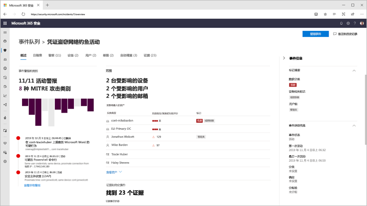
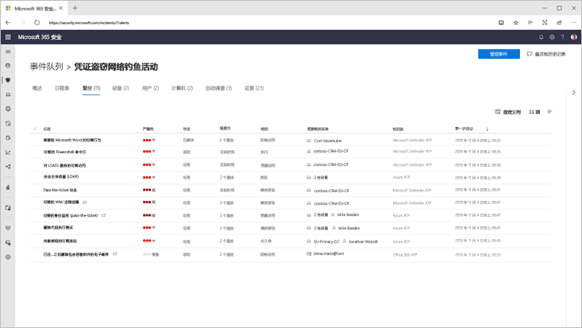
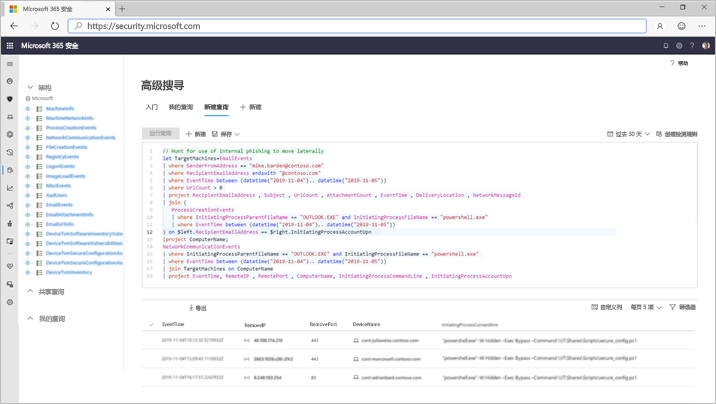

# Microsoft 威胁防护

**应用于：**
- Microsoft 威胁防护

[!include[Prerelease information](prerelease.md)]

Microsoft 威胁防护是一种统一的前期和 post 违规企业防护套件，它固有集成在终结点、标识、电子邮件和应用程序上，以检测、阻止、调查和自动响应复杂的攻击。  

使用集成的 Microsoft 威胁防护解决方案，安全专业人员可以将威胁信号与这些产品中的每个产品一起接收并确定威胁的完整作用域和影响，并将它们结合起来。如何进入环境、受影响的内容以及当前对组织的影响。 Microsoft 威胁防护采用自动操作来阻止或停止攻击和自我修复受影响的邮箱、终结点和用户身份。  

Microsoft 威胁防护套件保护： 
- **使用 Microsoft DEFENDER atp 的终结点**-MICROSOFT defender atp 是用于预防性保护、入侵后检测、自动调查和响应的统一终结点平台。 
- **电子邮件和协作与 office 365 atp** -OFFICE 365 atp 将保护您的组织免受电子邮件、链接（url）和协作工具带来的恶意威胁的侵扰。 
- **使用 AZURE atp 和 AZURE AD 标识保护的标识**-azure Atp 使用 Active Directory 信号识别、检测和调查组织中的高级威胁、已泄露标识和恶意内幕活动。 
- **Microsoft 云应用安全应用程序**安全-Microsoft 云应用安全是全面的跨 SaaS 解决方案，为你的云应用提供深入的可见性、强大的数据控制和增强的威胁防护。 

Microsoft 威胁防护独特的跨产品层将各个套件组件扩充为：
- 通过信号共享和自动操作来帮助防止攻击和跨套件协调防御性响应
- 通过将警报上的数据、可疑事件和受影响的资产加入 "事件"，对安全团队的产品警报、行为和上下文中的攻击的完整故事进行旁白
- 通过自动修正触发对受影响资产的自我修复来实现危害的自动化
- 使安全团队能够跨终结点和 Office 数据执行详细和有效的威胁搜寻

  
交叉产品事件（概述）

 
通过将相关的套件产品结合在一起形成一个单一事件（警报视图）的所有相关警报

 
电子邮件和终结点原始数据顶部的基于查询的搜寻

Microsoft 威胁防护跨产品功能包括： 
- **跨产品单一**外观视图：用于检测、受影响的资产的所有信息、执行的自动操作以及在[security.microsoft.com](https://security.microsoft.com)中的单个队列和单个窗格中的相关证据。 
- **组合的事件队列**-以帮助安全专业人员通过确保完整的攻击作用域、受影响的资产和自动修正操作以及时方式进行分组，以帮助安全专业人员重点了解关键因素。 
- **对威胁的自动响应**-在 Microsoft 威胁防护产品之间实时共享关键威胁信息，以帮助停止攻击的进展。 例如，如果在受 Microsoft Defender ATP 保护的终结点上检测到恶意文件，它将指示 Office 365 ATP 扫描并删除所有电子邮件中的文件。 将阻止整个 Microsoft 365 安全套件看到该文件。
- **对受损设备、用户标识和邮箱的自我修复**-Microsoft 威胁防护使用通过 AI 的自动操作和行动手册将受影响的资产恢复为安全状态。 Microsoft 威胁防护利用套件产品的自动修正功能，以确保与事件相关的所有受影响的资产在可能的情况下会自动修正。
- **跨产品威胁搜寻**-安全团队可以通过使用各种保护产品收集的原始数据创建自己的自定义查询，从而利用其独特的组织知识来寻找危害的迹象。 Microsoft 威胁防护提供了对30天的历史原始信号的基于查询的访问，并在终结点和 Office 365 ATP 数据中通知数据。 

<h2>Microsoft 威胁 Protection 服务
</h2>
<table><tr><td>
<b><a href="https://docs.microsoft.com/windows/security/threat-protection/microsoft-defender-atp/microsoft-defender-advanced-threat-protection"><b>Microsoft Defender 高级威胁防护</b>
</a></td>
<td>
<b><a href="https://docs.microsoft.com/office365/securitycompliance/office-365-atp"><b>Office 365 高级威胁防护</b>
</a></td>
<td>
<b><a href="https://docs.microsoft.com/azure-advanced-threat-protection/"><b>Azure 高级威胁防护</b></a>
</td>
<td>
<b><a href="https://docs.microsoft.com/cloud-app-security/"><b>Microsoft 云应用安全</b></a>
</td>
</tr>
</table>
 

## 入门
使用 Microsoft 365 E5 或等效许可证的客户可以使用 Microsoft 威胁防护。 若要开始，请在 Microsoft 365 安全中心的[security.microsoft.com](https://security.microsoft.com)中启用该服务。 有关详细信息，请参阅：
- [授权要求](prerequisites.md#licensing-requirements)
- [启用 Microsoft 威胁防护](mtp-enable.md)
