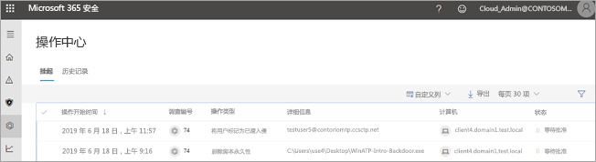
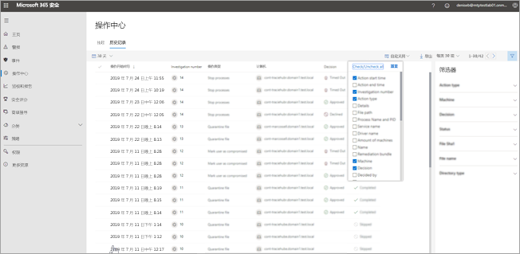
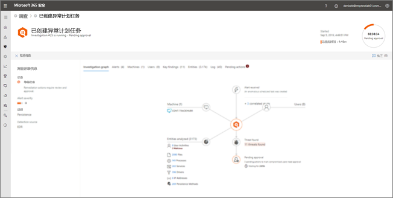

# 转到操作中心以查看修正操作Go to the Action center to view remediation actions

**适用于：****Applies to:**
- Microsoft 威胁防护Microsoft Threat Protection

[!INCLUDE [Prerelease information](../includes/prerelease.md)]

## “单窗格”体验A "single pane of glass" experience

使用操作中心查看组织设备和邮箱中的当前和过去调查的结果。Use the Action center to see the results of current and past investigations across your organization's devices and mailboxes. 根据威胁的类型和[最终结论](mtp-autoir-results.md#remediation-actions-following-automated-investigation)，自动执行修正操作，或者在组织的安全运营团队批准后执行修正操作。Depending on the type of threat and [resulting verdict](mtp-autoir-results.md#remediation-actions-following-automated-investigation), remediation actions occur automatically or upon approval by your organization’s security operations team. 所有修正操作（无论是待批准还是已批准的操作）都合并在操作中心内。All remediation actions, whether they are pending approval or were already approved, are consolidated in the Action center. 

操作中心提供任务的“单窗格”体验，例如：The Action center provides a "single pane of glass" experience for tasks, such as:
- 批准挂起的修正操作；Approving pending remediation actions;
- 查看已批准的修正操作的审核日志；以及Viewing an audit log of already approved remediation actions; and
- 查看已完成的修正操作。Reviewing completed remediation actions.

你的安全运营团队可以更有效地进行运营，因为操作中心提供了工作中的 Microsoft 威胁防护的全面视图。Your security operations team can operate more effectively and efficiently, because the Action center provides a comprehensive view of Microsoft Threat Protection at work.

## 修正操作Remediation actions

下表列出了操作中心当前支持的修正操作：The following table lists remediation actions that are currently supported in the Action center: 

|终结点修正操作Endpoints remediation actions  |电子邮件修正操作Email remediation actions  |
|---------|---------|
|隔离Quarantine file 删除注册表项Remove registry key 终止进程Kill process  停止服务Stop service  删除注册表项Remove registry key  禁用驱动程序Disable driver  删除计划任务Remove scheduled task      |软删除电子邮件或群集Soft delete email messages or clusters 阻止 URL（单击时）Block URL (time-of-click) 关闭外部邮件转发Turn off external mail forwarding          |

## 转到操作中心Go to the Action center

1. 转到 [https://security.microsoft.com](https://security.microsoft.com) 并登录。Go to [https://security.microsoft.com](https://security.microsoft.com) and sign in. 

2. 在导航窗格中，选择“**操作中心**”。In the navigation pane, choose **Action center**. 

3. 在操作中心，你将看到两个选项卡：“**挂起**”和 **“历史记录**”。In the Action center, you’ll see two tabs: **Pending** and **History**.

    - “**挂起**”选项卡列出了需要由安全运营团队中的人员进行审查和批准才能继续的调查。The **Pending** tab lists investigations that require review and approval by someone in your security operations team to continue. 确保对此处看到的挂起项目进行审查并采取操作。Make sure to review and take action on pending items you see here.

    - “**历史记录**”选项卡列出了自动执行的过去调查和修正操作。The **History** tab lists past investigations and remediation actions that were taken automatically. 可查看过去一天、一周、一个月或六个月的数据。You can view data for the past day, week, month, or six months.

4. 若要仅显示想要查看的列，请选择“**自定义列**”。To show only the columns you want to see, select **Customize columns**. 

5. 在列表中选择一个项目以查看有关调查的更多详细信息。Select an item in the list to view more details about an investigation. 此时将打开调查详细信息视图。The investigation details view opens. 

    - 如果调查与电子邮件内容有关（例如，实体是邮箱），则将在 Office 365 安全与合规中心 ([https://protection.office.com/threatinvestigation](https://protection.office.com/threatinvestigation)) 中打开调查详细信息。If the investigation pertains to email content (such as, the entity is a mailbox), investigation details open in the Office 365 Security & Compliance Center ([https://protection.office.com/threatinvestigation](https://protection.office.com/threatinvestigation)). 

    - 如果调查涉及设备，则将在安全中心 ([https://security.microsoft.com](https://security.microsoft.com)) 中打开调查详细信息。If the investigation involves a device, investigation details open in the security center ([https://security.microsoft.com](https://security.microsoft.com)). 

> [!TIP]
> 如果你认为在 Microsoft 威胁防护中，自动调查和响应功能已丢失或错误地检测到了某些内容，请告诉我们！If you think something was missed or wrongly detected by automated investigation and response features in Microsoft Threat Protection, let us know! 请参阅[如何在 Microsoft 威胁防护中报告误报/负面的自动调查和响应（空中）功能](mtp-autoir-report-false-positives-negatives.md)。See [How to report false positives/negatives in automated investigation and response (AIR) capabilities in Microsoft Threat Protection](mtp-autoir-report-false-positives-negatives.md).

## 操作中心任务所需的权限Required permissions for Action center tasks

若要批准或拒绝操作中心中挂起的操作，必须按下表所列的方式分配权限：To approve or reject pending actions in the Action center, you must have permissions assigned as listed in the following table:

|修正操作Remediation action |所需角色和权限Required roles and permissions |
|--|----|
|Microsoft Defender ATP 修正（设备）Microsoft Defender ATP remediation (devices) |在 Azure Active Directory ([https://portal.azure.com](https://portal.azure.com)) 或 Microsoft 365 管理中心 ([https://admin.microsoft.com](https://admin.microsoft.com)) 中分配的**安全管理员**角色**Security Administrator** role assigned in either Azure Active Directory ([https://portal.azure.com](https://portal.azure.com)) or the Microsoft 365 admin center ([https://admin.microsoft.com](https://admin.microsoft.com)) --- 或 ------ or --- 在 Microsoft Defender ATP 中分配的**主动修正操作**角色**Active remediation actions** role assigned in Microsoft Defender ATP     若要了解详细信息，请参阅以下资源：To learn more, see the following resources:  - [Azure Active Directory 中的管理员角色权限](https://docs.microsoft.com/azure/active-directory/users-groups-roles/directory-assign-admin-roles)- [Administrator role permissions in Azure Active Directory](https://docs.microsoft.com/azure/active-directory/users-groups-roles/directory-assign-admin-roles) - [为基于角色的访问控制创建和管理角色 (Microsoft Defender ATP)](https://docs.microsoft.com/windows/security/threat-protection/microsoft-defender-atp/user-roles)- [Create and manage roles for role-based access control (Microsoft Defender ATP)](https://docs.microsoft.com/windows/security/threat-protection/microsoft-defender-atp/user-roles)  |
|Office 365 ATP 修正（Office 内容和电子邮件）Office 365 ATP remediation (Office content and email)  |在 Azure Active Directory ([https://portal.azure.com](https://portal.azure.com)) 或 Microsoft 365 管理中心 ([https://admin.microsoft.com](https://admin.microsoft.com)) 中分配的**安全管理员**角色**Security Administrator** role assigned in either Azure Active Directory ([https://portal.azure.com](https://portal.azure.com)) or the Microsoft 365 admin center ([https://admin.microsoft.com](https://admin.microsoft.com)) --- 和 ------ and ---  在 Office 365 安全与合规中心 ([https://protection.office.com](https://protection.office.com)) 中分配的**搜索和清除**角色**Search and Purge** role assigned the Office 365 Security & Compliance Center ([https://protection.office.com](https://protection.office.com))   **重要提示**：如果仅在 Office 365 安全与合规中心中分配了安全管理员角色，则将无法访问操作中心或 Microsoft 威胁防护功能。**IMPORTANT**: If you have the Security Administrator role assigned only in the Office 365 Security & Compliance Center, you will not be able to access the Action center or Microsoft Threat Protection capabilities. 必须在 Azure Active Directory 或 Microsoft 365 管理中心中分配安全管理员角色。You must have the Security Administrator role assigned in Azure Active Directory or the Microsoft 365 admin center.   若要了解详细信息，请参阅以下资源：To learn more, see the following resources:  - [Azure Active Directory 中的管理员角色权限](https://docs.microsoft.com/azure/active-directory/users-groups-roles/directory-assign-admin-roles)- [Administrator role permissions in Azure Active Directory](https://docs.microsoft.com/azure/active-directory/users-groups-roles/directory-assign-admin-roles) - [Office 365 安全与合规中心的权限](https://docs.microsoft.com/microsoft-365/security/office-365-security/permissions-in-the-security-and-compliance-center)- [Permissions in the Office 365 Security & Compliance Center](https://docs.microsoft.com/microsoft-365/security/office-365-security/permissions-in-the-security-and-compliance-center) |

> [!NOTE]
> 在 Azure Active Directory 中分配了**全局管理员**角色的用户可以批准或拒绝操作中心中挂起的任何操作。Users who have the **Global Administrator** role assigned in Azure Active Directory can approve or reject any pending action in the Action center. 但是，作为最佳做法，你的组织应该限制分配全局管理员角色的人数。However, as a best practice, your organization should limit the number of people who have the Global Administrator role assigned. 对于操作中心权限，我们建议使用上面列出的**安全管理员**、**主动修正操作**以及**搜索和清除**角色。We recommend using the **Security Administrator**, **Active remediation actions**, and **Search and Purge** roles listed above for Action center permissions.

## 后续步骤Next steps 

- [深入了解 Microsoft 威胁防护中的事件Learn more about incidents in Microsoft Threat Protection](incidents-overview.md)
- [查看自动调查的结果View the results of an automated investigation](mtp-autoir-results.md)
- [了解 Microsoft 威胁防护中的搜寻Learn about hunting in Microsoft Threat Protection](advanced-hunting-overview.md)

