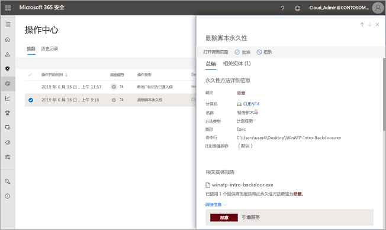

# 批准或拒绝自动调查的挂起操作

**适用于：**
- Microsoft 威胁防护

[!include[Prerelease information](prerelease.md)]

运行自动调查后，可能会生成一个或多个[修正操作](mtp-action-center.md#remediation-actions)，需要批准这些操作才能继续。 例如，可能需要删除电子邮件的群集，或者可能需要删除已隔离的文件。 应尽快批准（或拒绝）挂起的操作，以便自动调查可以继续并及时完成。 

可以使用以下几种方法之一来查看和批准挂起的操作：
- [使用操作中心](#review-a-pending-action-in-the-action-center)
- [使用“调查详细信息”视图](#review-a-pending-action-in-the-investigation-details-view)

> [!NOTE]
> 必须具有[相应的权限](mtp-action-center.md#required-permissions-for-action-center-tasks)才能批准或拒绝修正操作。

## 在操作中心中查看挂起的操作

1. 转到 [https://security.microsoft.com](https://security.microsoft.com) 并登录。 

2. 在“导航”窗格中，选择“操作中心”****。 

3. 在操作中心中的“挂起”选项卡上，选择列表中的某个项****。 

    - 如果选择“调查编号”列中的某个项，将打开“调查详细信息”页面****。 可以在此处查看调查结果，然后批准或拒绝建议的操作。
 
    - 如果选择列表中的某一行，将打开浮出控件，可在其中查看有关该项的信息。   使用链接查看关联的警报或调查，并批准或拒绝该操作。

## 在“调查详细信息”视图中查看挂起的操作

1. 在[调查详细信息](mtp-autoir-results.md)页上，选择“挂起的操作”（或“操作”）选项卡。此处列出了等待批准的项********。

2. 选择列表中的某个项，然后选择“批准”或“拒绝”********。

## 后续步骤

- [详细了解操作中心](mtp-action-center.md)
- [详细了解事件](incidents-overview.md)
- [详细了解搜寻](advanced-hunting-overview.md)
