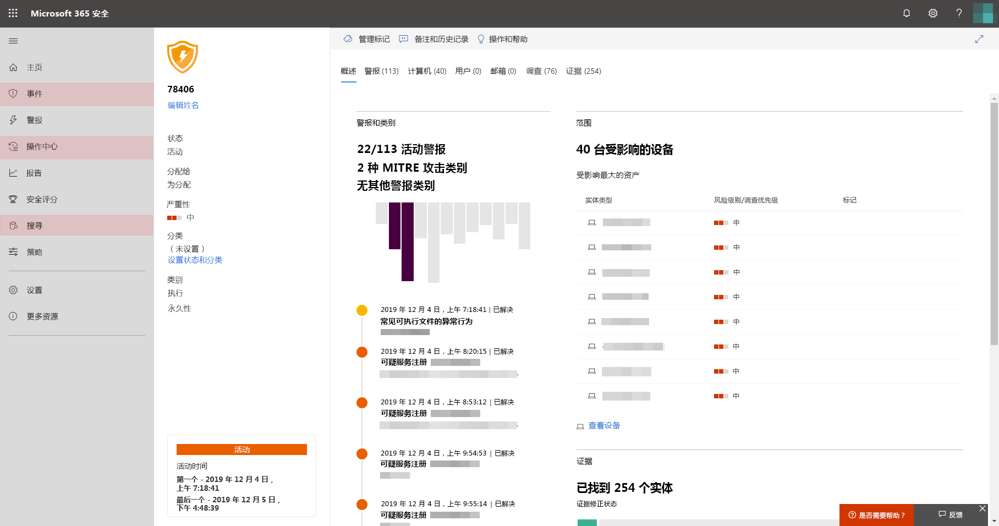

# 打开 Microsoft 威胁防护Turn on Microsoft Threat Protection

**适用于：****Applies to:**
- Microsoft 威胁防护Microsoft Threat Protection

Microsoft 威胁防护通过集成 Microsoft Defender 高级威胁防护 (ATP)、Office 365 ATP、Microsoft Cloud App Security 和 Azure ATP 的关键功能来统一事件响应流程。Microsoft Threat Protection unifies your incident response process by integrating key capabilities across Microsoft Defender Advanced Threat Protection (ATP), Office 365 ATP, Microsoft Cloud App Security, and Azure ATP. 这种统一的体验增加了可在 Microsoft 365 安全中心访问的强大功能。This unified experience adds powerful features you can access in the Microsoft 365 security center.

## 检查许可证资格和必需权限Check license eligibility and required permissions
Microsoft 365 E5、Microsoft 365 E5 安全或等效的许可证组合的客户可以使用 Microsoft 威胁防护。Customers with Microsoft 365 E5, Microsoft 365 E5 Security, or an equivalent combination of licenses can use Microsoft Threat Protection. 有关更多信息，请[阅读许可要求](prerequisites.md#licensing-requirements)。For more information, [read the licensing requirements](prerequisites.md#licensing-requirements).

您必须是**全局管理员**或[Azure Active Directory](https://docs.microsoft.com/azure/active-directory/users-groups-roles/directory-assign-admin-roles#available-roles)中的**安全管理员**才能打开 Microsoft 威胁防护。You must be a **global administrator** or a **security administrator** in [Azure Active Directory](https://docs.microsoft.com/azure/active-directory/users-groups-roles/directory-assign-admin-roles#available-roles) to turn on Microsoft Threat Protection.

## 开始使用服务Start using the service
Microsoft 威胁防护从各种集成服务中聚合数据。Microsoft Threat Protection aggregates data from the various integrated services. 它将集中处理和存储数据，以确定新的见解并使集中响应工作流成为可能。It will process and store data centrally to identify new insights and make centralized response workflows possible.

在你打开服务之前，Microsoft 365 安全中心（[security.microsoft.com](https://security.microsoft.com)）不会在导航窗格中显示**事件**和**操作中心**选项。Before you turn on the service, the Microsoft 365 security center ([security.microsoft.com](https://security.microsoft.com)) doesn't show the **Incidents** and the **Action center** options in the navigation pane.

的 microsoft 365 安全中心导航窗格的图像关闭 microsoft*365 安全中心，并关闭 microsoft 威胁防护*
*Microsoft 365 security center with Microsoft Threat Protection turned off*

若要打开 Microsoft 威胁防护，请在导航窗格中选择 "**设置**"。To turn on Microsoft Threat Protection, select **Settings** in the navigation pane. 在 "**[设置" 页](https://security.microsoft.com/settings)** 中，转到 " **Microsoft 威胁防护** > **" 自愿加入/自愿退出**。In the **[Settings page](https://security.microsoft.com/settings)**, go to **Microsoft Threat Protection** > **Opt-in / Opt-out**.

>[!NOTE]
>如果在导航窗格中看不到**设置**或无法访问页面，请检查您的权限和许可证。If you don't see **Settings** in the navigation pane or couldn't access the page, check your permissions and licenses.

### 选择数据中心位置Select data center location
如果已为组织设置了 Microsoft Defender ATP，则数据将在为 [Microsoft Defender ATP 数据](https://docs.microsoft.com/windows/security/threat-protection/microsoft-defender-atp/data-storage-privacy)选择的同一数据中心位置进行存储和处理。If Microsoft Defender ATP has been provisioned for your organization, data will be stored and processed in the same data center location you have selected for [your Microsoft Defender ATP data](https://docs.microsoft.com/windows/security/threat-protection/microsoft-defender-atp/data-storage-privacy). 如果你没有 Microsoft Defender ATP，系统将要求你选择一个专门用于 Microsoft 威胁防护的新数据中心位置。If you don't have Microsoft Defender ATP, you will be asked to choose a new data center location specifically for Microsoft Threat Protection. 

您需要先提供许可，然后才能在服务和聚合之间共享数据。You need to provide consent before data is shared between services and aggregated.

### 确认服务已开启Confirm that the service is on
设置服务后，它将添加：Once the service is provisioned, it adds:

- [事件管理Incidents management](incidents-overview.md)
- 用于管理[自动调查和响应](mtp-autoir.md)的操作中心An action center for managing [automated investigation and response](mtp-autoir.md)
- [高级搜寻](advanced-hunting-overview.md)功能（添加到现有**搜寻**页面）[Advanced hunting](advanced-hunting-overview.md) capabilities to the existing **Hunting** page

*microsoft 365 security center with 事件管理和其他 Microsoft 威胁防护功能*
*Microsoft 365 security center with incidents management and other Microsoft Threat Protection capabilities*

### 获取 Azure ATP 数据Getting Azure ATP data
要使用 Microsoft 威胁防护共享 Azure ATP 数据，请确保已打开 Microsoft Cloud App Security 和 Azure ATP 集成。To share Azure ATP data with Microsoft Threat Protection, ensure that Microsoft Cloud App Security and Azure ATP integration is turned on. [了解有关此集成的更多信息Learn more about this integration](https://docs.microsoft.com/cloud-app-security/aatp-integration)

## 关闭 Microsoft 威胁防护Turn off Microsoft Threat Protection
要停止使用 Microsoft 威胁防护，请转到 Microsoft 365 安全中心中的“**设置**” > “**Microsoft 威胁防护**” > “**选择加入/选择退出**”。To stop using Microsoft Threat Protection, go to **Settings** > **Microsoft Threat Protection** > **Opt-in / Opt-out** in the Microsoft 365 security center. 取消选择**打开 Microsoft 威胁防护**并保存更改。Unselect **Turn on Microsoft Threat Protection** and save the changes.

将永久删除数据，并将从 Microsoft 365 安全中心删除相应的功能。Data will be permanently deleted and corresponding features will be removed from the Microsoft 365 security center.

## 获取帮助Get assistance

Microsoft 支持人员可帮助设置或取消设置或取消设置租户上的服务和相关资源。Microsoft support staff can help provision or deprovision the service and related resources on your tenant. 若要获取帮助，请在 Microsoft 365 安全中心中选择 **"需要帮助？** "。For assistance, select **Need help?** in the Microsoft 365 security center. 联系支持时，请提及 Microsoft 威胁防护。When contacting support, mention Microsoft Threat Protection.

## 相关主题Related topics

- [Microsoft 威胁防护概述Microsoft Threat Protection overview](microsoft-threat-protection.md)
- [许可要求和其他先决条件Licensing requirements and other prerequisites](prerequisites.md)
- [Microsoft Defender ATP 概述Microsoft Defender ATP overview](https://docs.microsoft.com/windows/security/threat-protection/microsoft-defender-atp/microsoft-defender-advanced-threat-protection)
- [Office 365 ATP 概述Office 365 ATP overview](../office-365-security/office-365-atp.md)
- [Microsoft Cloud App Security 概述Microsoft Cloud App Security overview](https://docs.microsoft.com/cloud-app-security/what-is-cloud-app-security)
- [Azure ATP 概述Azure ATP overview](https://docs.microsoft.com/azure-advanced-threat-protection/what-is-atp)
- [Microsoft Defender ATP 数据存储Microsoft Defender ATP data storage](https://docs.microsoft.com/windows/security/threat-protection/microsoft-defender-atp/data-storage-privacy)
