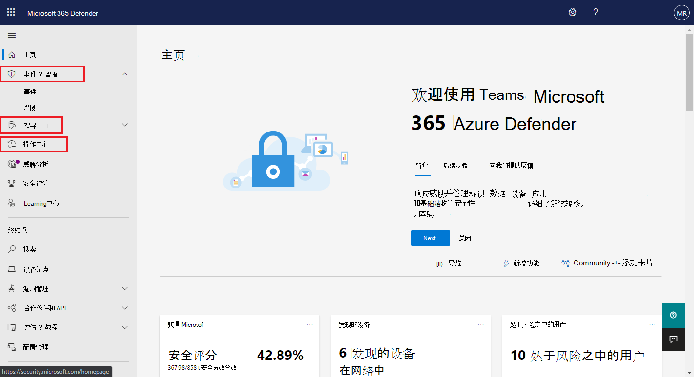

# 启用 Microsoft 365 Defender

[!INCLUDE [Microsoft 365 Defender rebranding](../includes/microsoft-defender.md)]

**适用于：**
- Microsoft 365 Defender

[Microsoft 365 Defender](microsoft-threat-protection.md) 通过在 microsoft Defender for Endpoint、microsoft Defender for Office 365、Microsoft 云应用安全性和 microsoft Defender for Identity 中集成关键功能，统一了你的事件响应过程。 这种统一的体验增加了可在 Microsoft 365 安全中心访问的强大功能。

Microsoft 365 Defender 在具有所需权限的符合条件的客户访问 Microsoft 365 安全中心时自动启用。 阅读本文以了解各种先决条件以及如何设置 Microsoft 365 Defender。

## 检查许可证资格和必需权限
Microsoft 365 安全产品的许可证通常使您能够在 Microsoft 365 安全中心使用 Microsoft 365 Defender，而无需额外的许可费用。 我们建议获取 Microsoft 365 E5、E5、E5 或 A5 安全许可证或有效的许可证组合，以提供对所有支持的服务的访问权限。

有关许可的详细信息，请 [阅读许可要求](prerequisites.md#licensing-requirements)。

### 检查你的角色
您必须是 **全局管理员** 或 Azure Active Directory 中的 **安全管理员** 才能打开 Microsoft 365 Defender。 [在 Azure AD 中查看你的角色](https://docs.microsoft.com//azure/active-directory/users-groups-roles/directory-manage-roles-portal)

## 支持的服务
Microsoft 365 Defender 聚合来自您已部署的各种受支持服务的数据。 它将集中处理和存储数据，以确定新的见解并使集中响应工作流成为可能。 这样做不会影响与集成服务关联的现有部署、设置或数据。

若要获得最佳保护并优化 Microsoft 365 Defender，建议在网络上部署所有适用的受支持的服务。 有关详细信息，请 [参阅部署支持的服务](deploy-supported-services.md)。

## 启动服务之前
在打开服务之前，Microsoft 365 安全中心 ( [security.microsoft.com](https://security.microsoft.com)) 在选择 " **事件** "、" **操作中心** " 或 "导航窗格" 中的 " **搜寻** " 时显示 "microsoft 365 Defender 设置" 页。 如果你不符合使用 Microsoft 365 Defender 的资格，则不会显示这些导航项。

 *在 microsoft 365 安全中心中未启用 Microsoft 365 defender 设置* 时显示的 microsoft 365 defender 设置页面的图像

## 启动服务
若要打开 Microsoft 365 Defender，只需选择 **"打开 microsoft 365 defender** " 并应用更改。 您还可以通过在导航窗格中选择 " **设置** " ( [security.microsoft.com/settings](https://security.microsoft.com/settings)) ，然后选择 " **microsoft 365 Defender** " 来访问此选项。

>[!NOTE]
>如果在导航窗格中看不到 **设置** 或无法访问页面，请检查您的权限和许可证。

### 数据中心位置
Microsoft 365 Defender 将存储和处理 [Microsoft Defender For Endpoint 使用的相同位置](https://docs.microsoft.com/windows/security/threat-protection/microsoft-defender-atp/data-storage-privacy)中的数据。 如果没有 Microsoft Defender for Endpoint，将根据活动的 Microsoft 365 安全服务的位置自动选择新的数据中心位置。 屏幕上显示了所选的数据中心位置。 

在 Microsoft 365 安全中心中选择 **"需要帮助？** "，以联系 microsoft 支持部门，了解如何在其他数据中心位置设置 Microsoft 365 Defender。 

>[!NOTE]
>Microsoft Defender for Endpoint 在欧洲联合 (EU 通过 Azure Defender * 打开时自动设置) 数据中心。 对于以这种方式为终结点预配了 Defender 的客户，Microsoft 365 Defender 将自动在相同的欧盟数据中心中进行预配。 

### 确认服务已开启
设置服务后，它将添加：

- [事件管理](incidents-overview.md)
- 用于管理[自动调查和响应](mtp-autoir.md)的操作中心
- [高级搜寻](advanced-hunting-overview.md) 功能

 *microsoft 365 安全中心与事件管理和其他 Microsoft 365 功能*

### 获取用于标识数据的 Microsoft Defender
若要与 Microsoft 365 Defender 共享 Microsoft Defender 的标识数据，请确保 Microsoft 云应用安全性和 Microsoft Defender for Identity integration 已打开。 [了解有关此集成的更多信息](https://docs.microsoft.com/cloud-app-security/aatp-integration)

## 关闭 Microsoft 365 Defender
若要停止使用 microsoft 365 defender，请 **Settings** 转到 microsoft  >  365 安全中心中的设置 **microsoft 365 Defender**  >  **自愿加入/自愿退出** 。 取消选择 **"打开 Microsoft 365 Defender** 并应用更改"。

将从 Microsoft 365 安全中心删除相应的功能。

## 获取帮助

若要获取有关启用 Microsoft 365 Defender 的最常见问题的解答，请 [阅读 FAQ](mtp-enable-faq.md)。

Microsoft 支持人员可帮助设置或取消设置或取消设置租户上的服务和相关资源。 若要获取帮助，请在 Microsoft 365 安全中心中选择 **"需要帮助？** "。 联系支持时，请注明 Microsoft 365 Defender。

## 相关主题

- [常见问题](mtp-enable-faq.md)
- [许可要求和其他先决条件](prerequisites.md)
- [部署支持的服务](deploy-supported-services.md)
- [Microsoft 365 Defender 概述](microsoft-threat-protection.md)
- [Microsoft Defender for Endpoint 概述](https://docs.microsoft.com/windows/security/threat-protection/microsoft-defender-atp/microsoft-defender-advanced-threat-protection)
- [适用于 Office 的 Defender 365 概述](../office-365-security/office-365-atp.md)
- [Microsoft Cloud App Security 概述](https://docs.microsoft.com/cloud-app-security/what-is-cloud-app-security)
- [Microsoft Defender for Identity 概述](https://docs.microsoft.com/azure-advanced-threat-protection/what-is-atp)
- [Microsoft Defender for Endpoint data storage](https://docs.microsoft.com/windows/security/threat-protection/microsoft-defender-atp/data-storage-privacy)
