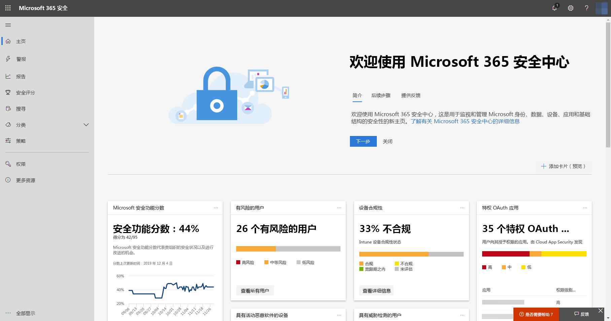
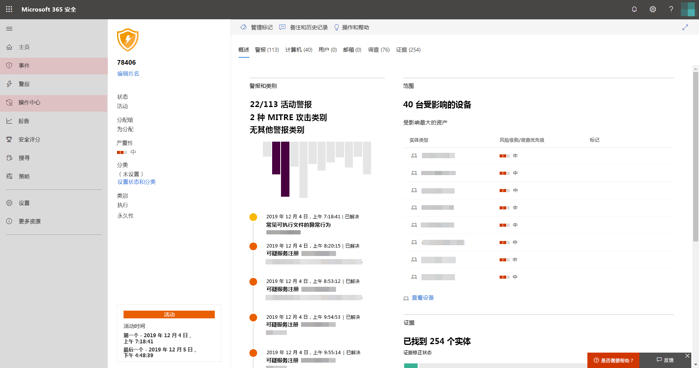

# 打开 Microsoft 威胁防护

**适用于：**
- Microsoft 威胁防护

[!include[Prerelease information](prerelease.md)]

Microsoft 威胁防护通过集成 Microsoft Defender 高级威胁防护 (ATP)、Office 365 ATP、Microsoft Cloud App Security 和 Azure ATP 的关键功能来统一事件响应流程。 这种统一的体验增加了可在 Microsoft 365 安全中心访问的强大功能。

## 检查资格
拥有 Microsoft 365 E5 或等效许可证的客户可以使用 Microsoft 威胁防护。 有关更多信息，请[阅读许可要求](prerequisites.md#licensing-requirements)。

## 开始使用服务
打开 Microsoft 威胁防护服务可聚合来自各种集成服务的数据。 系统将对数据进行集中处理和存储，以确定新的见解，并使集中的响应工作流程成为可能。

在你打开该服务之前，Microsoft 365 安全中心 ([security.microsoft.com](https://security.microsoft.com)) 不会在菜单上显示“**事件**”和“**操作中心**”选项。

*关闭了 Microsoft 威胁防护的 Microsoft 365 安全中心*

要打开 Microsoft 威胁防护服务，请转到 Microsoft 365 安全中心中的“**设置**” > “**Microsoft 威胁防护**” > “**选择加入/选择退出**”。 要执行此任务，你需要是 [Azure Active Directory](https://docs.microsoft.com/azure/active-directory/users-groups-roles/directory-assign-admin-roles#available-roles) 中的全局管理员或安全管理员。

如果已为组织设置了 Microsoft Defender ATP，则数据将在为 [Microsoft Defender ATP 数据](https://docs.microsoft.com/windows/security/threat-protection/microsoft-defender-atp/data-storage-privacy)选择的同一数据中心位置进行存储和处理。 如果你没有 Microsoft Defender ATP，系统将要求你选择一个专门用于 Microsoft 威胁防护的新数据中心位置。 你需要确认同意，才能在服务和聚合之间共享数据。

### 确认服务已开启
设置服务后，它将添加：

- [事件管理](incidents-overview.md)
- 用于管理[自动调查和响应](mtp-autoir.md)的操作中心
- [高级搜寻](advanced-hunting-overview.md)功能（添加到现有**搜寻**页面）

*包含事件管理和其他 Microsoft 威胁防护功能的 Microsoft 365 安全中心*

### 获取 Azure ATP 数据
要使用 Microsoft 威胁防护共享 Azure ATP 数据，请确保已打开 Microsoft Cloud App Security 和 Azure ATP 集成。 [了解有关此集成的更多信息](https://docs.microsoft.com/cloud-app-security/aatp-integration)

## 关闭 Microsoft 威胁防护
要停止使用 Microsoft 威胁防护，请转到 Microsoft 365 安全中心中的“**设置**” > “**Microsoft 威胁防护**” > “**选择加入/选择退出**”。 取消选择**打开 Microsoft 威胁防护**并保存更改。

数据将被永久删除，相应的功能将从 Microsoft 365 安全中心中删除。

## 获取帮助

Microsoft 员工可以帮助在你的租户上设置或取消设置服务和相关资源。 如需帮助，[请联系顶级支持](https://go.microsoft.com/fwlink/?LinkID=733758)。

## 相关主题

- [Microsoft 威胁防护概述](microsoft-threat-protection.md)
- [许可要求和其他先决条件](prerequisites.md)
- [Microsoft Defender ATP 概述](https://docs.microsoft.com/windows/security/threat-protection/microsoft-defender-atp/microsoft-defender-advanced-threat-protection)
- [Office 365 ATP 概述](../office-365-security/office-365-atp.md)
- [Microsoft Cloud App Security 概述](https://docs.microsoft.com/cloud-app-security/what-is-cloud-app-security)
- [Azure ATP 概述](https://docs.microsoft.com/azure-advanced-threat-protection/what-is-atp)
- [Microsoft Defender ATP 数据存储](https://docs.microsoft.com/windows/security/threat-protection/microsoft-defender-atp/data-storage-privacy)
