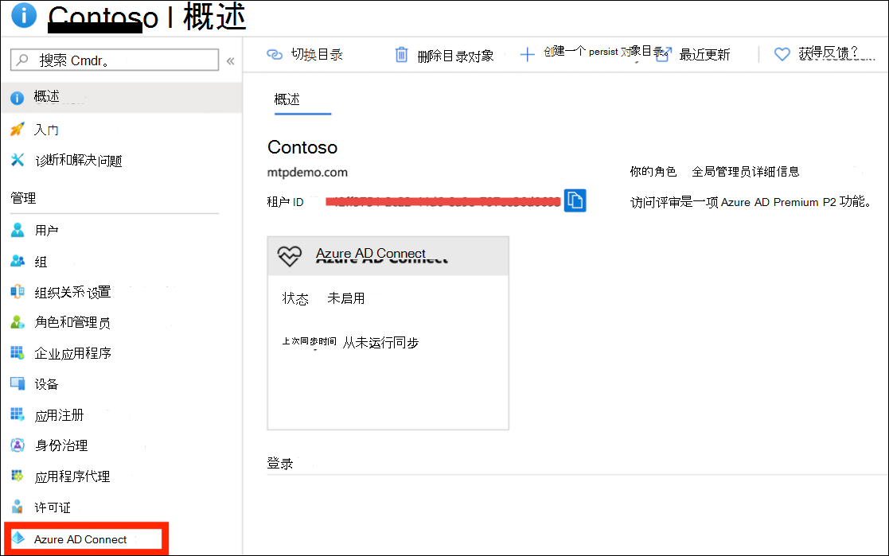
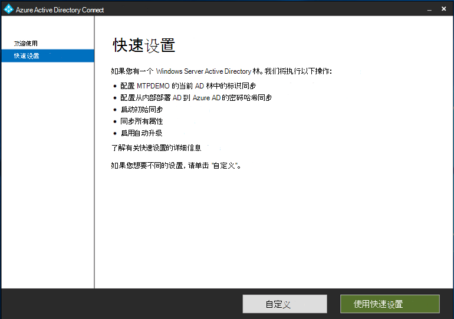
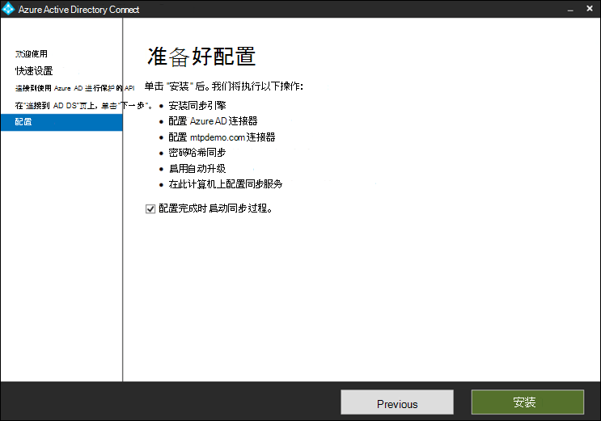
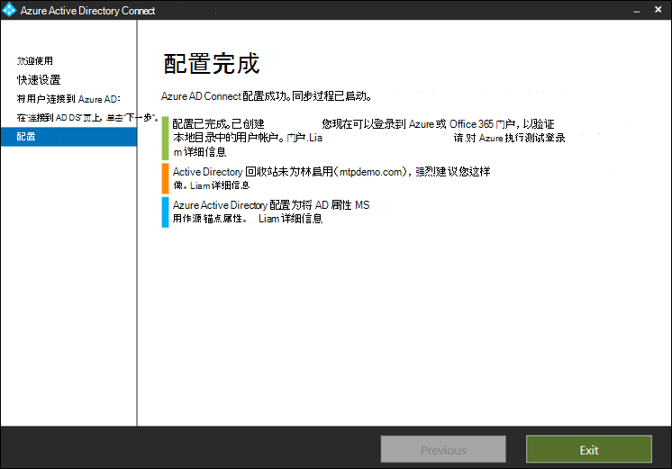

# 准备你的 Microsoft 威胁防护试用实验室或试点环境Prepare your Microsoft Threat Protection trial lab or pilot environment

**适用于：****Applies to:**
- Microsoft 威胁防护Microsoft Threat Protection

创建 Microsoft 威胁防护试用实验室或试点环境并对其进行部署的过程分为三个阶段：Creating a Microsoft Threat Protection trial lab or pilot environment and deploying it is a three-phase process:

 
<table border="0" width="100%" align="center">
  <tr style="text-align:center;">
    <td align="center" style="width:25%; border:0;" bgcolor="#d5f5e3">
      <a href= "https://docs.microsoft.com/microsoft-365/security/mtp/prepare-mtpeval"> 
        
       第1阶段：准备 </a>Phase 1: Prepare </a> 
    </td>
     <td align="center"  >
      <a href="https://docs.microsoft.com/microsoft-365/security/mtp/setup-mtpeval">
        
       阶段2：安装程序 </a>Phase 2: Setup </a> 
        </td>
    <td align="center">
      <a href="https://docs.microsoft.com/microsoft-365/security/mtp/config-mtpeval">
        
       第3阶段： Configure & 板载</a>Phase 3: Configure & Onboard</a> 
</td>
  </tr>
  <tr>
    <td style="width:25%; border:0;">
   
    </td>
    <td valign="top" style="width:25%; border:0;">
    
</td>
    <td valign="top" style="width:25%; border:0;">

</td>    
  </tr>
</table>

你当前正在准备阶段。You're currently in the preparation phase.

准备工作是任何成功部署的关键。Preparation is key to any successful deployment. 本部分将指导您在准备为 Microsoft 威胁防护部署创建试用实验室或试点环境时需要考虑的事项。This section will guide you through what you need to consider as you prepare to create a trial lab or pilot environment for your Microsoft Threat Protection deployment.

## 先决条件Prerequisites
了解有关设置和使用 Microsoft 威胁防护的许可、硬件和软件要求以及其他配置设置。Learn about the licensing, hardware and software requirements, and other configuration settings to provision and use Microsoft Threat Protection. 请参阅 [Microsoft 威胁防护](https://docs.microsoft.com/microsoft-365/security/mtp/prerequisites?view=o365-worldwide)、 [microsoft Defender ATP](https://docs.microsoft.com/windows/security/threat-protection/microsoft-defender-atp/minimum-requirements)、 [OFFICE 365 ATP](https://docs.microsoft.com/office365/servicedescriptions/office-365-advanced-threat-protection-service-description)、 [Azure atp](https://docs.microsoft.com/azure-advanced-threat-protection/atp-prerequisites)、 [microsoft 云应用安全性](https://docs.microsoft.com/azure-advanced-threat-protection/atp-prerequisites)的最低要求。See the minimum requirements for [Microsoft Threat Protection](https://docs.microsoft.com/microsoft-365/security/mtp/prerequisites?view=o365-worldwide), [Microsoft Defender ATP](https://docs.microsoft.com/windows/security/threat-protection/microsoft-defender-atp/minimum-requirements), [Office 365 ATP](https://docs.microsoft.com/office365/servicedescriptions/office-365-advanced-threat-protection-service-description), [Azure ATP](https://docs.microsoft.com/azure-advanced-threat-protection/atp-prerequisites), [Microsoft Cloud App Security](https://docs.microsoft.com/azure-advanced-threat-protection/atp-prerequisites).

## 利益干系人和签署Stakeholders and sign-off
以下部分用于确定项目中涉及的所有利益干系人以及可能需要签署、查看或随时通知的所有利益干系人，无论是评估还是运行试点。The following section serves to identify all the stakeholders that are involved in the project and who may need to sign-off, review, or stay informed, whether for evaluation or running a pilot.

>[!NOTE]
>并非所有组织都可能具有此类角色的安全组织成熟度。Not all organizations might have the security organization maturity to have such roles. 在这种情况下，请与您的领导团队联系，了解审阅和批准责任。In such case, consult with your leadership team on review and approval accountabilities.

根据您的组织的需要，向下表中添加利益干系人。Add stakeholders to the table below as appropriate for your organization.

-   SO = 此项目上的注销SO = Sign-off on this project

-   R = 查看此项目并提供输入R = Review this project and provide input

-   I = 此项目的通知I = Informed of this project

| 名称Name                 | RoleRole                                                                                                                                                                                                          | 操作Action |
|----------------------|---------------------------------------------------------------------------------------------------------------------------------------------------------------------------------------------------------------|--------|
| 输入名称和电子邮件Enter name and email | \*\*首席信息安全专员 (CISO) \*\* *作为新技术部署的组织中充当承办人的执行者。***Chief Information Security Officer (CISO)** *An executive representative who serves as sponsor inside the organization for the new technology deployment.*                                                  | 就SO     |
| 输入名称和电子邮件Enter name and email | "\*\*网络防护运营中心" (CDOC) \*\* *来自 CDOC 团队的代表，负责定义如何将此更改与客户安全操作团队中的过程相一致。***Head of Cyber Defense Operations Center (CDOC)** *A representative from the CDOC team in charge of defining how this change is aligned with the processes in the customers security operations team.*       | 就SO     |
| 输入名称和电子邮件Enter name and email | \**安全\*\*\*团队中的一名代表，负责定义如何将此更改与组织中的核心安全体系结构保持一致。***Security Architect** *A representative from the Security team in charge of defining how this change is aligned with the core Security architecture in the organization.*                         | RR      |
| 输入名称和电子邮件Enter name and email | \**工作场所架构师\*\*\*由 IT 团队负责定义此更改与组织中的核心工作区体系结构的对齐方式。***Workplace Architect** *A representative from the IT team in charge of defining how this change is aligned with the core workplace architecture in the organization.*                             | RR      |
| 输入名称和电子邮件Enter name and email | \**安全分析员\*\*\*来自 CDOC 团队的代表，可以通过安全操作的角度提供对此更改的检测功能、用户体验和总体有用性的输入。***Security Analyst** *A representative from the CDOC team who can provide input on the detection capabilities, user experience, and overall usefulness of this change from a security operations perspective.* | II      |

## 准备 Azure Active DirectoryPrepare your Azure Active Directory
如果已启用本地 Active directory 和 Azure Active Directory 之间的同步，请跳过此步骤。Skip this step if you have already enabled synchronization between Active Directory and Azure Active Directory on premises. 查看 Azure Active Directory 中现有的最佳实践文档。Review existing best practices documentation from Azure Active Directory. 以下步骤经过优化，可评估或运行试点 Microsoft 威胁防护项目。The following steps are optimized to evaluate or run a pilot Microsoft Threat Protection project.

1. 请转到 [Azure Active Directory](https://portal.azure.com/#blade/Microsoft_AAD_IAM/ActiveDirectoryMenuBlade) 门户 > **azure AD Connect**。Go to the [Azure Active Directory](https://portal.azure.com/#blade/Microsoft_AAD_IAM/ActiveDirectoryMenuBlade) portal > **Azure AD Connect**. 
   

2. 单击 **"** 从 **Microsoft Azure Active Directory 连接** "，并将其传输到域控制器。Click **Download** from **Microsoft Azure Active Directory Connect** and transfer it to your Domain Controller.
  

3. 在域控制器上，按照 Azure Active Directory 连接向导。On the domain controller, follow the Azure Active Directory Connect wizard. 阅读许可条款和隐私声明，如果同意，请选中此复选框。Read the license terms and privacy notice and select the checkbox if you agree. 单击"继续"。Click **Continue**.
  

4. 导航到 " **Express 设置**"。Navigate to **Express Settings**.
  

5. 输入全局管理员凭据。Enter your global administrator credentials. 单击“**下一步**”。Click **Next**.
  

6. 输入你的 Active Directory 域服务企业管理员凭据。Enter your Active Directory Domain Services enterprise administrator credentials. 单击“**下一步**”。Click **Next**.
  

7. 单击 " **安装** " 以确认配置。Click **Install** to confirm the configuration.
  

8. 恭喜，你已成功配置 Azure Active Directory Connect。Congratulations, you have successfully configured Azure Active Directory Connect.
  

您现在可以 [向 Active Directory 中添加用户和组](https://docs.microsoft.com/azure-advanced-threat-protection/atp-playbook-setup-lab#bkmk_hydrate) ，并 [配置 SAM-R 策略](https://docs.microsoft.com/azure-advanced-threat-protection/atp-playbook-setup-lab#configure-sam-r-capabilities-from-contosodc)。You can now [add users and groups to Active Directory](https://docs.microsoft.com/azure-advanced-threat-protection/atp-playbook-setup-lab#bkmk_hydrate) and [configure a SAM-R policy](https://docs.microsoft.com/azure-advanced-threat-protection/atp-playbook-setup-lab#configure-sam-r-capabilities-from-contosodc).  

## 配置顺序Configuration order
下表指出 Microsoft 建议为试用版实验室或试点环境部署配置 Microsoft 威胁防护组件的顺序。The table below indicates the order Microsoft recommends for configuring the Microsoft Threat Protection components for your trial lab or pilot environment deployment.

| 组件Component                               | 说明Description                                                                                                                                                                                                                                                                                                                                                                                                                                                                                                                                                                                                                                                                                              | 配置顺序排名Configuration order rank |
|-----------------------------------------|----------------------------------------------------------------------------------------------------------------------------------------------------------------------------------------------------------------------------------------------------------------------------------------------------------------------------------------------------------------------------------------------------------------------------------------------------------------------------------------------------------------------------------------------------------------------------------------------------------------------------------------------------------------------------------------------------------|---------------------|
| Office 365 高级威胁防护Office 365 Advanced Threat Protection| Office 365 ATP 将保护您的组织免受电子邮件、链接 (Url) 和协作工具带来的恶意威胁的侵扰。Office 365 ATP safeguards your organization against malicious threats posed by email messages, links (URLs), and collaboration tools.   [了解更多信息。Learn more.](https://docs.microsoft.com/microsoft-365/security/office-365-security/office-365-atp?view=o365-worldwide)                                                                                                                                                                                                                                             | 1 1                   |
|Azure 高级威胁防护Azure Advanced Threat Protection|Azure ATP 使用 Active Directory 信号识别、检测和调查组织中的高级威胁、已泄露身份和恶意内幕活动。Azure ATP uses Active Directory signals to identify, detect, and investigate advanced threats, compromised identities, and malicious insider actions directed at your organization.   [了解详细信息](https://docs.microsoft.com/azure-advanced-threat-protection/)。[Learn more](https://docs.microsoft.com/azure-advanced-threat-protection/).| 2 2 |
|Microsoft Cloud App SecurityMicrosoft Cloud App Security| Microsoft 云应用安全是一个云访问安全代理 (CASB) ，可在多个云上运行。Microsoft Cloud App Security is a Cloud Access Security Broker (CASB) that operates on multiple clouds. 它提供丰富的可见性、控制数据旅行和完善的分析，以跨所有云服务识别和防御威胁。It provides rich visibility, control over data travel, and sophisticated analytics to identify and combat cyberthreats across all your cloud services.   [了解详细信息](https://docs.microsoft.com/cloud-app-security/)。[Learn more](https://docs.microsoft.com/cloud-app-security/).                                                                                                                                                                                                                                                                                                                                                                       |3 3                   |
|Microsoft Defender 高级威胁防护Microsoft Defender Advanced Threat Protection | Microsoft Defender ATP 终结点检测和响应功能提供了准实时且可操作的高级攻击检测。Microsoft Defender ATP endpoint detection and response capabilities provide advanced attack detections that are near real-time and actionable. 安全分析员可以有效地确定警报的优先级，了解整个泄露范围，并采取响应措施来修正威胁。Security analysts can prioritize alerts effectively, gain visibility into the full scope of a breach, and take response actions to remediate threats.   [了解更多信息。Learn more.](https://docs.microsoft.com/windows/security/threat-protection/microsoft-defender-atp/microsoft-defender-advanced-threat-protection)                                     |4 4                   |                                                                                                                                                                                                                                    

## 后续步骤Next step
  [阶段2：安装程序Phase 2: Setup](setup-mtpeval.md)  设置你的 Microsoft 威胁防护试用实验室或试点环境Set up your Microsoft Threat Protection trial lab or pilot environment

