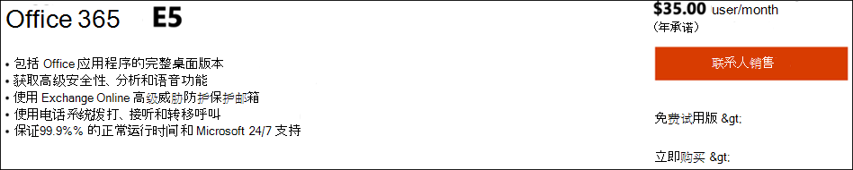
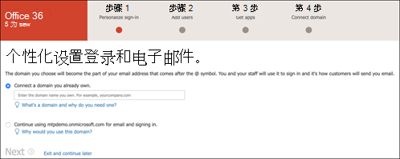
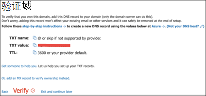
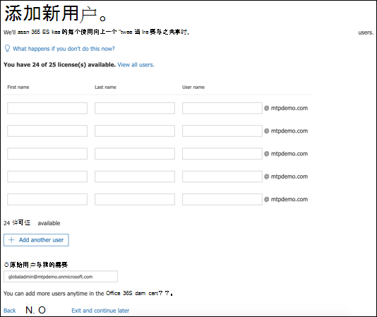
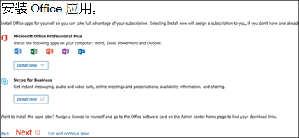
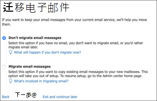
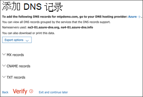
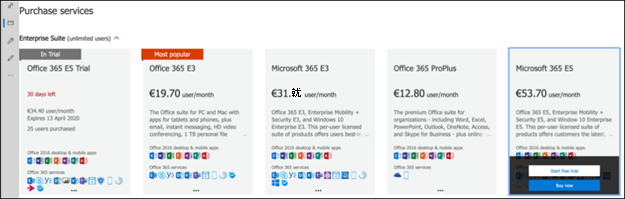
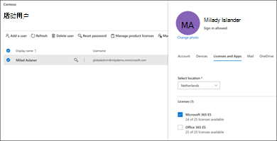
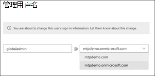

# 设置你的 Microsoft 365 Defender 试用实验室环境Set up your Microsoft 365 Defender trial lab environment 

[!INCLUDE [Microsoft 365 Defender rebranding](../includes/microsoft-defender.md)]

**适用于：****Applies to:**
- Microsoft 365 DefenderMicrosoft 365 Defender 

创建 Microsoft 365 Defender 试用版实验室或试点环境并对其进行部署的过程分为三个阶段：Creating a Microsoft 365 Defender trial lab or pilot environment and deploying it is a three-phase process:

 
<table border="0" width="100%" align="center">
  <tr style="text-align:center;">
    <td align="center" style="width:25%; border:0;" >
      <a href= "https://docs.microsoft.com/microsoft-365/security/mtp/prepare-mtpeval?view=o365-worldwide"> 
        
       第1阶段：准备 </a>Phase 1: Prepare </a> 
    </td>
     <td align="center"bgcolor="#d5f5e3">
      <a href="https://docs.microsoft.com/microsoft-365/security/mtp/setup-mtpeval?view=o365-worldwide">
        
       阶段2：安装程序 </a>Phase 2: Setup </a> 
    </td>
    <td align="center">
      <a href="https://docs.microsoft.com/microsoft-365/security/mtp/config-mtpeval?view=o365-worldwide">
        
       第3阶段： Configure & 板载 </a>Phase 3: Configure & Onboard </a> 
</td>

  </tr>
</table>

你当前正在设置阶段。You're currently in the set up phase. 执行最初的步骤来访问 Microsoft 365 安全中心，然后设置试用版实验室或试点环境。Take the initial steps to access Microsoft 365 Security Center then set up your trial lab or pilot environment.

注册 Office 365 或 Azure Active Directory 订阅，以生成可用于注册 Microsoft 365 E5 许可证的 *onmicrosoft.com* 租户。Sign up for an Office 365 or Azure Active Directory subscription to generate a *.onmicrosoft.com* tenant that you can use to sign up for your Microsoft 365 E5 license. 

>[!NOTE]
>如果已有 Office 365 或 Azure Active Directory 订阅，则可以跳过 Office 365 E5 试用版或试点租户创建步骤。If you already have an existing Office 365 or Azure Active Directory subscription, you can skip the Office 365 E5 trial or pilot tenant creation steps.

在此阶段中，将指导您执行以下操作：In this phase, you'll be guided to:
- 创建 Office 365 E5 试用租户Create an Office 365 E5 trial tenant
- 启用 Microsoft 365 试用订阅Enable Microsoft 365 trial subscription

## 创建 Office 365 E5 试用租户Create an Office 365 E5 trial tenant
>[!NOTE]
>如果已有 Office 365 或 Azure Active Directory 订阅，则可以跳过 Office 365 E5 试用版租户创建步骤。If you already have an existing Office 365 or Azure Active Directory subscription, you can skip the Office 365 E5 trial tenant creation steps.

1. 转到 [Office 365 E5 产品门户](https://www.microsoft.com/microsoft-365/business/office-365-enterprise-e5-business-software?activetab=pivot%3aoverviewtab) ，并选择 " **免费试用版** "。Go to the [Office 365 E5 product portal](https://www.microsoft.com/microsoft-365/business/office-365-enterprise-e5-business-software?activetab=pivot%3aoverviewtab) and select **Free trial**.

   
  
2. 通过输入您的电子邮件地址 (个人或公司) 完成试用注册。Complete the trial registration by entering your email address (personal or corporate). 单击 " **设置帐户** "。Click **Set up account**.

   

3. 填写你的名字、姓氏、商务电话号码、公司名称、公司规模以及国家或地区。Fill in your first name, last name, business phone number, company name, company size, and country or region.  

   
   
   > [!NOTE]
   > 您在此处设置的国家或地区决定了您的 Office 365 将托管的数据中心区域。The country or region you set here determines the data center region your Office 365 will be hosted.
  
4. 选择您的验证首选项：通过短信或 call。Choose your verification preference: through a text message or call. 单击 " **发送验证代码** "。Click **Send Verification Code**. 

   

5. 为租户设置自定义域名称，然后单击 " **下一步** "。Set the custom domain name for your tenant, then click **Next**.

   
 
6. 设置第一个标识，这将成为租户的全局管理员。Set up the first identity, which will be a Global Administrator for the tenant. 填写 " **名称** " 和 " **密码** "。Fill in **Name** and **Password**. 单击 " **注册** "。Click **Sign up**.

   

7. 单击 " **转到设置** " 以完成 Office 365 E5 试用租户设置。Click **Go to Setup** to complete the Office 365 E5 trial tenant provisioning.

   

8. 将企业域连接到 Office 365 租户。Connect your corporate domain to the Office 365 tenant. Optional选择 " **连接您已拥有的域** "，并键入您的域名。[Optional] Choose **Connect a domain you already own** and type in your domain name. 单击“ **下一步** ”。Click **Next**.

   
 
9. 添加 TXT 或 MX 记录以验证域所有权。Add a TXT or MX record to validate the domain ownership. 将 TXT 或 MX 记录添加到域后，选择 " **验证** "。Once you’ve added the TXT or MX record to your domain, select **Verify**.

   
 
10. Optional为你的租户创建更多用户帐户。[Optional] Create more user accounts for your tenant. 您可以通过单击 " **下一步** " 跳过此步骤。You can skip this step by clicking **Next**.

    
 
11. Optional下载 Office 应用。[Optional] Download Office apps. 单击 " **下一步** " 跳过此步骤。Click **Next** to skip this step. 

    

12. Optional迁移电子邮件。[Optional] Migrate email messages. 同样，您可以跳过此步骤。Again, you can skip this step.

    
 
13. 选择 "在线服务"。Choose online services. 选择 " **Exchange** " 并单击 " **下一步** "。Select **Exchange** and click **Next**. 

    

14. 向您的域中添加 MX、CNAME 和 TXT 记录。Add MX, CNAME, and TXT records to your domain. 完成后，选择 " **验证** "。When completed, select **Verify**.

    
 
15. 恭喜，你已完成 Office 365 租户的预配。Congratulations, you have completed the provisioning of your Office 365 tenant.

    

## 启用 Microsoft 365 试用订阅Enable Microsoft 365 trial subscription

>[!NOTE]
>注册试用版将提供25个用户许可证用于一个月。Signing up for a trial gives you 25 user licenses to use for a month. 有关详细信息，请参阅 [试用或购买 M365 订阅](https://docs.microsoft.com/microsoft-365/commerce/try-or-buy-microsoft-365#try-or-buy-a-microsoft-365-subscription-1) 。See [Try or Buy an M365 subscription](https://docs.microsoft.com/microsoft-365/commerce/try-or-buy-microsoft-365#try-or-buy-a-microsoft-365-subscription-1) for details.

1. 从 [Microsoft 365 管理中心](https://admin.microsoft.com/)，单击 " **帐单** "，然后导航到 " **购买服务** "。From [Microsoft 365 Admin Center](https://admin.microsoft.com/), click **Billing** and then navigate to **Purchase services**.

2. 选择 " **Microsoft 365 E5** "，然后单击 " **开始免费试用** "。Select **Microsoft 365 E5** and click **Start free trial**. 

   

3. 选择您的验证首选项：通过短信或 call。Choose your verification preference: through a text message or call. 确定后，请输入电话号码，选择 " **文本** " 或 " **呼叫我** "，具体取决于你的选择。Once you have decided, enter the phone number, select **Text me** or **Call me** depending on your selection.

   
 
4. 输入验证代码，然后单击 " **开始免费试用** "。Enter the verification code and click **Start your free trial**.

   

5. 单击 " **立即试用** " 以确认你的 Microsoft 365 E5 试用版。Click **Try now** to confirm your Microsoft 365 E5 trial.

   
 
6. 转到 **Microsoft 365 管理中心**  >  **用户**  >  **活动用户** 。Go to the **Microsoft 365 Admin Center** > **Users** > **Active users**. 选择您的用户帐户，选择 " **管理产品许可证** "，然后将来自 Office 365 e5 的许可证交换为 **Microsoft 365 e5** 。Select your user account, select **Manage product licenses** , then swap the license from Office 365 E5 to **Microsoft 365 E5**. 单击“ **保存** ”。Click **Save**.

   
 
7. 再次选择全局管理员帐户，然后单击 " **管理用户名** "。Select the global administrator account again then click **Manage username**.

   

8. Optional将域从 *onmicrosoft.com* 更改为您自己的域，具体取决于您在前面步骤中选择的内容。[Optional] Change the domain from *onmicrosoft.com* to your own domain—depending on what you chose on the previous steps. 单击“ **保存更改** ”。Click **Save changes**.

   

## 后续步骤Next step
|  [第3阶段： Configure & 板载Phase 3: Configure & Onboard](config-mtpeval.md) | 为 Microsoft 365 Defender 试用版实验室或试点环境配置每个 Microsoft 365 Defender 支柱，并将终结点集成在一起。Configure each Microsoft 365 Defender pillar for your Microsoft 365 Defender trial lab or pilot environment and onboard your endpoints.
|:-------|:-----|
