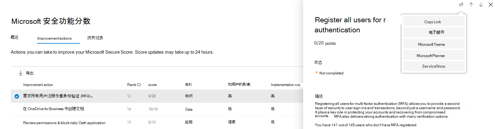
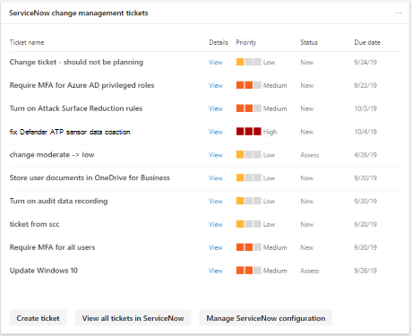

# 在 Microsoft 365 安全中心中创建和跟踪 ServiceNow 票证Create and track ServiceNow tickets in the Microsoft 365 security center

[Microsoft 365 安全中心](overview-security-center.md)已得到增强，能够在 ServiceNow 中以本机方式创建和跟踪票证。The [Microsoft 365 security center](overview-security-center.md) has been enhanced with the ability to natively create and track tickets in ServiceNow. [了解有关 ServiceNow 的详细信息Learn more about ServiceNow](https://www.servicenow.com/)

在安全中心中，安全管理员可以直接向 ServiceNow 发送[Microsoft Secure 得分](microsoft-secure-score.md)改进操作，并创建一个票证。In the security center, security administrators can send a [Microsoft Secure Score](microsoft-secure-score.md) improvement action directly to ServiceNow and create a ticket. 可以创建事件管理和变更管理票证。Both incident management and change management tickets can be created. 然后，可以在安全中心主页和 ServiceNow 中跟踪它们。They can then be tracked in the security center home page, and ServiceNow.

- [**了解先决条件、数据交换和疑难解答****Learn about prerequisites, data exchange, and troubleshooting**](tickets.md)
- **在合规中心中管理 ServiceNow 票证**（即将推出）**Manage ServiceNow tickets in the compliance center** (coming soon)

## 将 Microsoft 365 安全中心连接到 ServiceNowConnect Microsoft 365 security center to ServiceNow

导航到 Microsoft 365 安全中心主页以查看 ServiceNow 连接卡。Navigate to the Microsoft 365 security center home page to see the ServiceNow connection card.

选择 "连接到 ServiceNow" 以转到 "ServiceNow 设置" 页。Select "Connect to ServiceNow" to go to the ServiceNow setup page. 按照说明授权 Microsoft 365 连接器应用。Follow the instructions to authorize the Microsoft 365 Connector app.

> [!NOTE]
> 在授权 Microsoft 365 安全中心和 ServiceNow 之间的连接之前，请确保使用您在安装步骤中创建的集成用户登录名和密码。Before you authorize the connection between Microsoft 365 security center and ServiceNow, make sure you use the integration user login and password you created in the installation steps. 请勿使用你的个人凭据。Do not use your personal credentials.

按照说明进行操作并授权连接后，请查看 Microsoft 365 安全中心连接页和 ServiceNow Microsoft 365 票证发放连接器应用程序体验中的连接状态。After you have followed the directions and authorizing the connection, view the connection status on both the Microsoft 365 security center connection page and in the ServiceNow Microsoft 365 Ticketing Connector App experience. 现在，你已设置为开始创建任务！Now you are all set to start creating tasks!

### 疑难解答Troubleshooting

了解在连接过程中可能遇到的常见错误，以及如何在 "[疑难解答" 部分](tickets.md#troubleshooting)中对其进行缓解。Learn common errors you may encounter in the connection process, and how to mitigate them, in the [troubleshooting section](tickets.md#troubleshooting).

## 创建一个任务并将其共享到 ServiceNowCreate a task and share it to ServiceNow

建立集成后，基于特定 Microsoft 安全得分改进操作创建 ServiceNow 任务。Once the integration is set up, create ServiceNow tasks based on specific Microsoft Secure Score improvement actions. 转到 Microsoft 365 安全中心门户中安全得分的任何改进措施，并选择 "共享" 图标。Go to any improvement action in Secure Score in the Microsoft 365 security center portal, and select the "share" icon. 其中一个下拉选项是 ServiceNow。One of the dropdown options is ServiceNow.

将生成一个任务，您可以在其中设置优先级并编辑名称、说明或截止日期。A task is generated where you can set the priority and edit the name, description, or due date. 填写所有必填字段后，将该任务发送到 ServiceNow。Once all the required fields are filled in, send the task to ServiceNow.

在 ServiceNow 中，此任务显示为 Microsoft 365 安全性和配置更改请求。The task is visible in ServiceNow as a Microsoft 365 Security and Configuration Change Request.

## 跟踪票证Track tickets

一旦创建了 ServiceNow 更改管理和事件管理票证，它们就会显示在 Microsoft 365 安全中心主页上的卡片上。Once ServiceNow change management and incident management tickets have been created, they are displayed on cards in the Microsoft 365 security center home page. 通过这些卡，您可以创建一个票证、查看所有票证或管理 ServiceNow 配置。From these cards, you can create a ticket, view all tickets, or manage the ServiceNow configuration.

  

若要在 Microsoft 365 安全中心中重新设置或管理你的 ServiceNow 集成，请选择任一卡片上的 "**管理 servicenow 配置**"。To re-provision or manage your ServiceNow integration in the Microsoft 365 security center, select **Manage ServiceNow configuration** on either of the cards. 在此处，删除当前的 ServiceNow 连接并自定义票证状态名称。From there, remove the current ServiceNow connection and customize ticket state names.

借助 Microsoft 365 security center 中显示的 ServiceNow 票证，你的任务可以在某个位置进行跟踪，并在你的其他安全仪表板项目旁边进行操作。With ServiceNow tickets visible in the Microsoft 365 security center, your tasks live in a place where they can be tracked and acted upon alongside your other security dashboard items.

## 资源Resources

- [了解先决条件、数据交换和疑难解答Learn about prerequisites, data exchange, and troubleshooting](tickets.md)
- [Microsoft 安全功能分数Microsoft Secure Score](microsoft-secure-score.md)