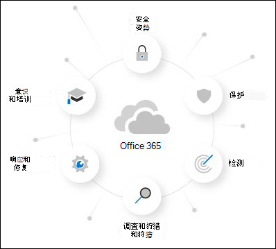

# 关于 Microsoft Defender for Office 365试用版

Microsoft Defender for Office 365保护你的组织免受电子邮件、链接和 URL) 和协作工具 (恶意威胁。 Defender for Office 365 包括：

- **威胁防护策略**：定义威胁防护策略，为组织设置适当级别的保护。
- **报告**：查看实时报告，监视组织中的 Defender for Office 365 性能。
- **威胁调查和响应功能**：使用前沿工具调查、理解、模拟和阻止威胁。
- **自动化调查和响应功能**：节省时间和精力来调查和缓解威胁。

Microsoft Defender for Office 365 试用版是试用 Defender for Office 365 功能的最简单方法，设置它只需单击几下。 完成试用设置后，组织中所有适用于 Office 365 计划 1 和计划 2 的 Defender 功能可在最多 90 天内使用。 以下列表描述了这些高级功能：

 

****

|功能|说明|
|---|---|
|[反网络钓鱼策略中的独占设置](set-up-anti-phishing-policies.md#exclusive-settings-in-anti-phishing-policies-in-microsoft-defender-for-office-365)|获取用户模拟保护、域模拟保护、邮箱智能和高级网络钓鱼阈值。|
|[安全附件](safe-attachments.md)|在受控的爆炸环境中检查电子邮件附件和其他文件，以捕获新的和具有威胁性的恶意软件。|
|[安全链接](safe-links.md)|执行单击时间检查，以确保可能已经通过初始检查的 URL 尚未被武器化。|
|[威胁跟踪器](threat-trackers.md)\*|使用信息小组件和视图来确定可能会影响组织的网络安全问题。|
|[威胁资源管理器](threat-explorer.md)\*|使用有关电子邮件中威胁的近实时信息Office 365。|
|[AIR (自动调查和) ](office-365-air.md)\*|触发警报时自动查找和修正威胁对象。|
|[攻击模拟培训](attack-simulation-training.md)\*|培训用户识别网络钓鱼攻击并做出相应的响应。|
|[市场活动视图](campaigns.md)\*|调查和响应大规模的恶意电子邮件活动。|
|[使用 Defender for Office 365功能的报告](view-reports-for-mdo.md)|查看报告，包括威胁防护状态、URL 威胁防护、邮件延迟等。|

\*适用于 Office 365 2 计划的 Defender 功能，作为试用版的一部分提供。

> [!NOTE]
> 本文中介绍的自动配置目前处于公共预览版中，可能在你的组织中不可用。

## 条款和条件

Defender for Office 365试用版的可用时间为 90 天，可以针对所有用户启动。 有关详细信息，请参阅[Microsoft Defender for Office 365 Trial Terms & Conditions](defender-for-office-365-trial-terms-and-conditions.md)。

## 设置 Defender for Office 365 试用版

试用允许组织轻松设置和配置 Defender Office 365功能。 在设置过程中，使用预设安全策略的标准模板应用专用于 Office 365 (的Defender 的策略，特别是保险箱 附件[、保险箱](safe-links.md)链接和反垃圾邮件策略[) ](set-up-anti-phishing-policies.md#impersonation-settings-in-anti-phishing-policies-in-microsoft-defender-for-office-365)中的模拟[保护。](preset-security-policies.md)

默认情况下，这些策略的范围为组织中所有用户，但管理员可以在设置期间或之后自定义策略，以便它们仅适用于特定用户。

在设置过程中，Office 365 Defender (在 Defender for Office 365 P2 或等效) 中为整个组织设置响应功能。 无需策略范围。

## 授权

作为试用设置的一部分，Office 365 Defender 许可证将自动应用于组织。 许可证在前 90 天内免费。

## 权限

若要开始或结束试用版，你需要是 Azure Active Directory 中的全局管理员或安全管理员角色的成员。 有关详细信息，请参阅[关于管理员角色](../../admin/add-users/about-admin-roles.md)。

## 其他信息

注册试用版后，更改和更新最多可能需要 2 小时才会可用。 管理员必须注销并重新登录才能查看更改。

管理员可通过访问"试用"卡片随时 <> 试用版。

## 可用性

Defender for Office 365 试用版将逐步向满足特定条件的现有客户推出 (包括地理位置) 以及其订阅中或作为加载项) 不包含现有 Defender for Office 365 计划 1 或计划 2 许可证 (的客户。

## 了解有关 Defender for Office 365

Defender for Office 365通过提供一系列全面的功能来帮助组织保护企业。

还可以在此交互式指南中了解有关 defender for Office 365[功能。](https://techcommunity.microsoft.com/t5/video-hub/protect-your-organization-with-microsoft-365-defender/m-p/1671189)

### 保护

可靠的筛选堆栈可防止各种基于卷和目标的攻击，包括业务电子邮件泄露、凭据钓鱼、勒索软件以及高级恶意软件。

- [反网络钓鱼策略：Defender for Office 365](set-up-anti-phishing-policies.md#exclusive-settings-in-anti-phishing-policies-in-microsoft-defender-for-office-365)
- [安全附件](safe-attachments.md)
- [安全链接](safe-links.md)

### 检测

行业领先的 AI 可检测恶意和可疑内容，并关联攻击模式，以识别旨在规避保护的活动。

- [Microsoft Defender for Office 365 中的市场活动视图](campaigns.md)

### 调查和搜寻

强大的体验通过高级搜寻功能帮助识别、确定威胁优先级和调查威胁，以跟踪整个Office 365。

- [威胁资源管理器和实时检测](threat-explorer.md)
- [Defender for Office 365 中的实时报告](view-reports-for-mdo.md)
- [威胁跟踪器 - 新增的和值得注意的威胁](threat-trackers.md)
- 与[Microsoft 365 Defender](../defender/microsoft-365-defender.md)

### 响应和修正

广泛的事件响应和自动化功能会增强安全团队的有效性和效率。

- [Microsoft Defender for (AIR) 自动调查和响应Office 365](office-365-air.md)

### 宣传和培训

丰富的模拟和培训功能以及客户端应用程序中的集成体验可提升用户意识。

- [开始使用攻击模拟培训](attack-simulation-training-get-started.md)

### 安全状况

建议的模板和配置见解帮助客户获得和保持安全。

- [在 EOP 和 Microsoft Defender for Office 365](preset-security-policies.md)
- [EOP 和 Microsoft Defender for Office 365 中的保护策略的配置分析器](configuration-analyzer-for-security-policies.md)。

## 提供反馈

你的反馈可帮助我们更好地保护你的环境免受高级攻击。 分享产品功能和试用结果的体验和印象。
