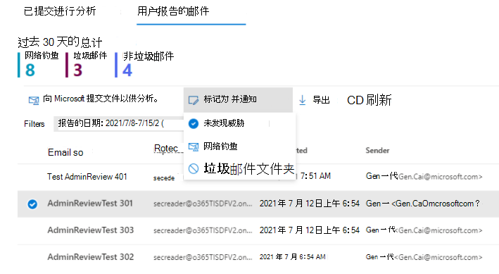
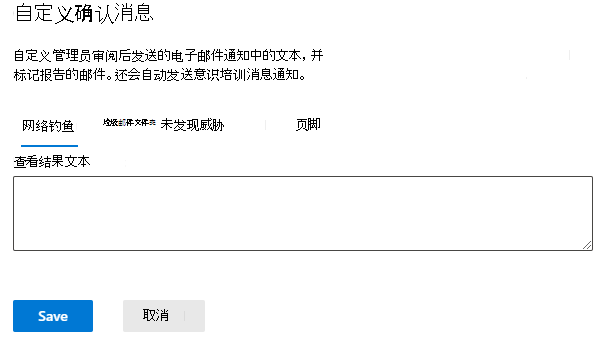

# 管理员审阅报告邮件

[!INCLUDE [Microsoft 365 Defender rebranding](../includes/microsoft-defender-for-office.md)]

**适用对象**
- [Microsoft Defender for Office 365 计划 1 和计划 2](defender-for-office-365.md)
- [Microsoft 365 Defender](../defender/microsoft-365-defender.md)

在Microsoft 365邮箱Exchange Online Microsoft Defender for Office 365 的组织中，管理员现在可以在查看报告的邮件后将模板邮件发送回最终用户。 可以根据管理员裁定为组织自定义模板。

该功能旨在向用户提供反馈，但不更改系统中邮件裁定。 为了帮助 Microsoft 更新和改进其筛选器，你需要使用管理员提交 提交[邮件进行分析。](admin-submission.md)

只有在邮件被报告为误报或漏报时，你才能标记和通知 [用户审阅结果](report-false-positives-and-false-negatives.md)。

## 开始前，有必要了解什么？

- 访问 <https://security.microsoft.com> 打开 Microsoft 365 Defender 门户。 若要直接转到 **提交页面，** 请使用 <https://security.microsoft.com/reportsubmission> 。

- 若要修改用户提交的配置，你需要是以下角色组之一的成员：
  - 组织管理或安全管理员在[Microsoft 365 Defender 门户中](permissions-microsoft-365-security-center.md)。
  - 中的组织[Exchange Online。](/Exchange/permissions-exo/permissions-exo#role-groups)

- 你还需要访问 Exchange Online PowerShell。 如果您尝试使用的帐户无法访问 Exchange Online PowerShell，您将收到错误消息，指出"在域中指定 *电子邮件地址"。* 有关启用或禁用对 PowerShell Exchange Online访问的信息，请参阅下列主题：
  - [启用或禁用对 Exchange Online PowerShell 的访问](/powershell/exchange/disable-access-to-exchange-online-powershell)
  - [客户端访问规则Exchange Online](/exchange/clients-and-mobile-in-exchange-online/client-access-rules/client-access-rules)

## 从门户中通知用户

1. In the Microsoft 365 Defender portal at <https://security.microsoft.com> ， go to the **Submissions** page at **Email & collaboration** \> **Submissions**. 若要直接转到 **提交页面，** 请使用 <https://security.microsoft.com/reportsubmission> 。

2. 单击 **"用户报告的邮件**"，然后选择要标记并通知的邮件。

3. 选择"**标记为并通知**"下拉列表，然后选择"**未找到威胁**"、"网络钓鱼 **"** 或"**垃圾邮件"。**

   > [!div class="mx-imgBorder"]
   > 

报告的邮件将被标记为误报或漏报，并且系统会自动从门户内发送电子邮件，通知报告邮件的用户。

## 自定义用于通知用户的消息

1. In the Microsoft 365 Defender portal at <https://security.microsoft.com> ， go to the User **submissions** page at **Email & Collaboration** Policies & \> **Rules** \> **Threat policies** User reported message \> **settings** in the **Others** section. 若要直接转到用户 **提交页面，** 请使用 <https://security.microsoft.com/userSubmissionsReportMessage> 。

2. 在"用户提交"页面上，如果要指定发件人 显示名称，请选中"管理员审阅结果的电子邮件通知"部分下的"指定要用作发件人的 **Office 365** 电子邮件地址"框，然后输入想要使用的名称。 将在电子邮件中显示的电子邮件地址Outlook所有答复将转到该地址。

3. 如果要自定义任何模板，请单击页面底部的"自定义电子邮件通知"。  在打开的标注中，只能自定义以下内容：

    - 网络钓鱼
    - 垃圾邮件
    - 未发现威胁
    - 页脚

    > [!div class="mx-imgBorder"]
    > 

4. 完成后，单击“**保存**”。 若要清除这些值，请单击" **用户提交** " **页面上的"放弃** "。
