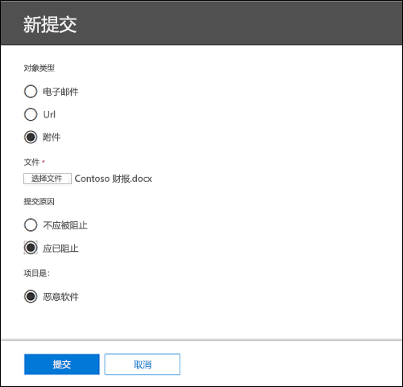
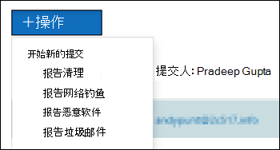

# 使用“管理员提交”将可疑的垃圾邮件、网络钓鱼诈骗、URL和文件提交给 MicrosoftUse Admin Submission to submit suspected spam, phish, URLs, and files to Microsoft

[!INCLUDE [Microsoft 365 Defender rebranding](../includes/microsoft-defender-for-office.md)]

在 Exchange Online 中具有邮箱的 Microsoft 365 组织中，管理员可以使用安全 & 合规中心中的提交门户将电子邮件、URL 和附件提交给 Microsoft 进行扫描。In Microsoft 365 organizations with mailboxes in Exchange Online, admins can use the Submissions portal in the Security & Compliance Center to submit email messages, URLs, and attachments to Microsoft for scanning.

提交电子邮件时，将获取有关可能允许传入电子邮件进入租户的任何策略的信息，以及检查邮件中任何 URL 和附件的信息。When you submit an email, you will get information about any policies that may have allowed the incoming email into your tenant, as well as examination of any URLs and attachments in the mail. 允许邮件的策略包括单个用户的安全发件人列表以及租户级别策略（如 Exchange 邮件流规则 (也称为传输规则) 。Policies that may have allowed a mail include an individual user's safe sender list as well as tenant level policies such as Exchange mail flow rules (also known as transport rules).

有关向 Microsoft 提交电子邮件、URL 和附件的其他方法，请参阅向 Microsoft 报告邮件 [和文件](report-junk-email-messages-to-microsoft.md)。For other ways to submit email messages, URLs, and attachments to Microsoft, see [Report messages and files to Microsoft](report-junk-email-messages-to-microsoft.md).

## 开始前，有必要了解什么？What do you need to know before you begin?

- 安全与合规中心的打开网址为 <https://protection.office.com/>。You open the Security & Compliance Center at <https://protection.office.com/>. 若要直接转到提交 **页面，** 请使用 <https://protection.office.com/reportsubmission> 。To go directly to the **Submission** page, use <https://protection.office.com/reportsubmission>.

- 若要向 Microsoft 提交邮件和文件，你需要是以下角色组之一的成员：To submit messages and files to Microsoft, you need to be a member of one of the following role groups:

  - [安全和合规中心](permissions-in-the-security-and-compliance-center.md)中的“**组织管理**”或“**安全管理员**”。**Organization Management** or **Security Administrator** in the [Security & Compliance Center](permissions-in-the-security-and-compliance-center.md).

  - **Exchange** [Online 中的组织管理](https://docs.microsoft.com/Exchange/permissions-exo/permissions-exo#role-groups)。**Organization Management** in [Exchange Online](https://docs.microsoft.com/Exchange/permissions-exo/permissions-exo#role-groups).

    请注意，查看自定义邮箱的用户提交需要此角色组成员身份，如本文稍后所述。Note that membership in this role group is required to [View user submissions to the custom mailbox](#view-user-submissions-to-the-custom-mailbox) as described later in this article.

- 若要详细了解用户如何向 Microsoft 提交邮件和文件，请参阅向 Microsoft 报告邮件 [和文件](report-junk-email-messages-to-microsoft.md)。For more information about how users can submit messages and files to Microsoft, see [Report messages and files to Microsoft](report-junk-email-messages-to-microsoft.md).

## 向 Microsoft 报告可疑内容Report suspicious content to Microsoft

1. 在安全&合规中心，转到"**威胁** 管理提交"，确认你位于"管理员提交"选项卡上， \> 然后单击"新建 **提交"。**In the Security & Compliance Center, go to **Threat management** \> **Submissions**, verify that you're on the **Admin submissions** tab, and then click **New submission**.

2. 使用 **显示为** 提交邮件、URL 或附件的新提交飞出，如以下部分所述。Use **New submission** flyout that appears to submit the message, URL, or attachment as described in the following sections.

### 向 Microsoft 提交一封有问题的电子邮件Submit a questionable email to Microsoft

1. 在"**对象类型"** 部分，选择"**电子邮件"。**In the **Object type** section, select **Email**. 在 **"提交格式** "部分中，使用以下选项之一：In the **Submission format** section, use one of the following options:

   - **网络邮件 ID：** 这是一个 GUID 值，在邮件的 **X-MS-Exchange-Organization-Network-Message-Id** 标头中或在隔离邮件的 **X-MS-Office365-Filtering-Correlation-Id 标头** 中可用。**Network Message ID**: This is a GUID value that's available in the **X-MS-Exchange-Organization-Network-Message-Id** header in the message, or in the **X-MS-Office365-Filtering-Correlation-Id** header in quarantined messages.

   - **文件**：单击 **"选择文件"。****File**: Click **Choose file**. 在打开的对话框中，查找并选择 .eml 或 .msg 文件，然后单击"**打开"。**In the dialog that opens, find and select the .eml or .msg file, and then click **Open**.

   > [!NOTE]
   > 具有 Defender for Office 365 计划 1 或计划 2 的管理员可以提交 30 天的邮件。Admins with Defender for Office 365 Plan 1 or Plan 2 are able to submit messages as old as 30 days. 其他管理员将只能返回 7 天。Other admins will only be able to go back 7 days.

2. 在 **"收件人"** 部分中，指定要针对这些收件人运行策略检查的一个或多个收件人。In the **Recipients** section, specify one or more recipients that you would like to run a policy check against. 策略检查将确定电子邮件是否由于用户或组织策略而绕过扫描。The policy check will determine if the email bypassed scanning due to user or organization policies.

3. 在 **"提交原因"部分** ，选择下列选项之一：In the **Reason for submission** section, select one of the following options:

   - **不应被阻止****Should not have been blocked**

   - **应该已被阻止**：选择 **垃圾邮件**、 **网络钓鱼** 或 **恶意软件**。**Should have been blocked**: Select **Spam**, **Phishing**, or **Malware**. 如果你不确定，请使用最佳判断。If you're not sure, use your best judgment.

4. 完成后，单击"提交 **"** 按钮。When you're finished, click the **Submit** button.

### 向 Microsoft 发送可疑 URLSend a suspect URL to Microsoft

1. 在"**对象类型"** 部分，选择 **URL。**In the **Object type** section, select **URL**. 在出现的框中，输入完整的 URL (例如 `https://www.fabrikam.com/marketing.html` ，) 。In the box that appears, enter the full URL (for example, `https://www.fabrikam.com/marketing.html`).

2. 在 **"提交原因"部分** ，选择下列选项之一：In the **Reason for submission** section, select one of the following options:

   - **不应被阻止****Should not have been blocked**

   - **应该已被阻止：** 选择 **网络钓鱼或\*\*\*\*恶意软件**。**Should have been blocked**: Select **Phishing** or **Malware**.

3. 完成后，单击"提交 **"** 按钮。When you're finished, click the **Submit** button.

### 将可疑文件提交给 MicrosoftSubmit a suspected file to Microsoft

1. 在"**对象类型"** 部分，选择"**附件"。**In the **Object type** section, select **Attachment**.

2. 单击 **"选择文件"。**Click **Choose File**. 在打开的对话框中，查找并选择文件，然后单击"打开 **"。**In the dialog that opens, find and select the file, and then click **Open**.

3. 在 **"提交原因"部分** ，选择下列选项之一：In the **Reason for submission** section, select one of the following options:

   - **不应被阻止****Should not have been blocked**

   - **应该已被阻止**： **恶意软件** 是唯一的选择，并且会自动选中。**Should have been blocked**: **Malware** is the only choice, and is automatically selected..

4. 完成后，单击"提交 **"** 按钮。When you're finished, click the **Submit** button.

## 查看管理员提交View admin submissions

在安全&合规中心，转到"**威胁** 管理提交"，确认你位于"管理员提交"选项卡上， \> 然后单击"新建 **提交"。**In the Security & Compliance Center, go to **Threat management** \> **Submissions**, verify that you're on the **Admin submissions** tab, and then click **New submission**.

在页面顶部附近，你可以输入开始日期、结束日期和 (默认情况下) 可以通过在框中输入值并单击"刷新"按钮，按提交 **ID** (筛选分配给每个提交) 的 GUID 值  。Near the top of the page, you can enter a start date, an end date, and (by default) you can filter by **Submission ID** (a GUID value that's assigned to every submission) by entering a value in the box and clicking . UpdateYou can enter multiple values separated by commas.

若要更改筛选条件，请单击 **"提交 ID"** 按钮并选择下列值之一：To change the filter criteria, click the **Submission ID** button and choose one of the following values:

- **Sender****Sender**
- **主题/URL/文件名****Subject/URL/File name**
- **提交者****Submitted by**
- **提交类型****Submission type**
- **Status****Status**

若要导出结果，请单击页面顶部附近的"导出"，然后选择 **"图表"数据或\*\*\*\*"表"。**To export the results, click **Export** near the top of the page and select **Chart data** or **Table**. 在出现的对话框中，保存 .csv 文件。In the dialog that appears, save the .csv file.

在图形下方，有三个选项卡：电子邮件 (默认 **) 、URL** 和 **附件**。Below the graph, there are three tabs: **Email** (default), **URL**, and **Attachment**.

### 查看管理员电子邮件提交View admin email submissions

单击 **"电子邮件"** 选项卡。Click the **Email** tab.

可以单击页面 **底部附近的** "列选项"按钮，在视图中添加或删除列：You can click the **Column options** button near the bottom of the page to add or remove columns from the view:

- **Date****Date**
- **提交 ID：** 分配给每个提交的 GUID 值。**Submission ID**: A GUID value that's assigned to every submission.
- **提交者**\***Submitted by**\*
- **主题**\***Subject**\*
- **Sender****Sender**
- **发件人 IP**\***Sender IP**\*
- **提交类型****Submission type**
- **传递原因****Delivery reason**
- **状态**\***Status**\*

  \* 如果单击此值，则详细信息将显示在一个标注中。\* If you click this value, detailed information is displayed in a flyout.

#### 管理员提交重新扫描详细信息Admin submission rescan details

在管理员提交中提交的邮件将重新扫描，详细信息飞出中显示的结果如下：Messages that are submitted in admin submissions are rescanned and results shown in the details flyout:

- 如果在发送时发件人的电子邮件身份验证失败。If there was a failure in the sender's email authentication at the time of delivery.
- 有关可能影响或替代邮件裁定的任何策略命中的信息。Information about any policy hits that could have affected or overridden the verdict of a message.
- 当前触发结果，以查看邮件中包含的 URL 或文件是否恶意。Current detonation results to see if the URLs or files contained in the message were malicious or not.
- 来自成绩人员的反馈。Feedback from graders.

如果发现覆盖，则重新扫描应在几分钟后完成。If an override was found, the rescan should complete in several minutes. 如果电子邮件身份验证没有问题，或者传递不受替代影响，则来自成绩人员的反馈可能需要一天的时间。If there wasn't a problem in email authentication or delivery wasn't affected by an override, then the feedback from graders could take up to a day.

### 查看管理员 URL 提交View admin URL submissions

单击 **"URL"** 选项卡。Click the **URL** tab.

可以单击页面 **底部附近的** "列选项"按钮，在视图中添加或删除列：You can click the **Column options** button near the bottom of the page to add or remove columns from the view:

- **Date****Date**
- **提交 ID****Submission ID**
- **提交者**\***Submitted by**\*
- **URL**\***URL**\*
- **提交类型****Submission type**
- **状态**\***Status**\*

  \* 如果单击此值，则详细信息将显示在一个标注中。\* If you click this value, detailed information is displayed in a flyout.

### 查看管理员附件提交View admin attachment submissions

单击 **"附件"** 选项卡。Click the **Attachments** tab.

可以单击页面 **底部附近的** "列选项"按钮，在视图中添加或删除列：You can click the **Column options** button near the bottom of the page to add or remove columns from the view:

- **Date****Date**
- **提交 ID****Submission ID**
- **提交者**\***Submitted by**\*
- **文件名**\***File name**\*
- **提交类型****Submission type**
- **状态**\***Status**\*

  \* 如果单击此值，则详细信息将显示在一个标注中。\* If you click this value, detailed information is displayed in a flyout.

## 查看用户向 Microsoft 提交内容View user submissions to Microsoft

如果已部署"报告邮件"加载项，或者用户使用[Outlook](report-junk-email-and-phishing-scams-in-outlook-on-the-web-eop.md)网页中的内置报告，可以在"用户提交"选项卡上查看报告的用户。 If you've deployed the [Report Message add-in](enable-the-report-message-add-in.md), or people use the [built-in reporting in Outlook on the web](report-junk-email-and-phishing-scams-in-outlook-on-the-web-eop.md), you can see what users are reporting on the **User submissions** tab.

1. 在安全&中心，转到 **"威胁管理** \> **提交"。**In the Security & Compliance Center, go to **Threat management** \> **Submissions**.

2. 选择 **"用户提交"** 选项卡，然后单击"**新建提交"。**Select the **User submissions** tab, and then click **New submission**.

可以单击页面 **底部附近的** "列选项"按钮，在视图中添加或删除列：You can click the **Column options** button near the bottom of the page to add or remove columns from the view:

- **提交于****Submitted on**
- **提交者**\***Submitted by**\*
- **主题**\***Subject**\*
- **Sender****Sender**
- **发件人 IP**\***Sender IP**\*
- **提交类型****Submission type**

\* 如果单击此值，则详细信息将显示在一个标注中。\* If you click this value, detailed information is displayed in a flyout.

在页面顶部附近，可以输入开始日期、结束日期和 (默认情况下) 可以通过在框中输入值并单击"刷新"按钮按发件人进行  。Near the top of the page, you can enter a start date, an end date, and (by default) you can filter by **Sender** by entering a value in the box and clicking . UpdateYou can enter multiple values separated by commas.

若要更改筛选条件，请单击 **"发件人"** 按钮并选择下列值之一：To change the filter criteria, click the **Sender** button and choose one of the following values:

- **发件人域****Sender domain**
- **主题****Subject**
- **提交者****Submitted by**
- **提交类型****Submission type**
- **发件人 IP****Sender IP**

若要导出结果，请单击页面顶部附近的"导出"，然后选择 **"图表"数据或\*\*\*\*"表"。**To export the results, click **Export** near the top of the page and select **Chart data** or **Table**. 在出现的对话框中，保存 .csv 文件。In the dialog that appears, save the .csv file.

## 查看用户提交到自定义邮箱View user submissions to the custom mailbox

**如果** 已配置自定义 [邮箱](user-submission.md) 以接收用户报告的邮件，则还可以查看并提交已传递到报告邮箱的邮件。**If** you've [configured a custom mailbox](user-submission.md) to receive user reported messages, you can view and also submit messages that were delivered to the reporting mailbox.

1. 在安全&中心，转到 **"威胁管理** \> **提交"。**In the Security & Compliance Center, go to **Threat management** \> **Submissions**.

2. 选择 **"自定义邮箱"** 选项卡。Select the **Custom mailbox** tab.

可以单击页面 **底部附近的** "列选项"按钮，在视图中添加或删除列：You can click the **Column options** button near the bottom of the page to add or remove columns from the view:

- **提交于****Submitted on**
- **提交者**\***Submitted by**\*
- **主题**\***Subject**\*
- **Sender****Sender**
- **发件人 IP**\***Sender IP**\*
- **提交类型****Submission type**

在页面顶部附近，可以输入开始日期、结束日期，并且可以通过在框中输入值并单击"刷新"按钮按"提交  。Near the top of the page, you can enter a start date, an end date, and you can filter by **Submitted by** by entering a value in the box and clicking . UpdateYou can enter multiple values separated by commas.

若要导出结果，请单击页面顶部附近的"导出"，然后选择 **"图表"数据或\*\*\*\*"表"。**To export the results, click **Export** near the top of the page and select **Chart data** or **Table**. 在出现的对话框中，保存 .csv 文件。In the dialog that appears, save the .csv file.

## 撤消用户提交Undo user submissions

用户向自定义邮箱提交可疑电子邮件后，用户和管理员将无法选择撤消提交。Once a user submits a suspicious email to the custom mailbox, the user and admin don't have an option to undo the submission. 如果用户希望恢复电子邮件，它将可用于"已删除邮件"或"垃圾邮件"文件夹中的恢复。If the user would like to recover the email, it will be available for recovery in the Deleted Items or Junk Email folders.

### 从自定义邮箱向 Microsoft 提交邮件Submit messages to Microsoft from the custom mailbox

如果已配置自定义邮箱以截获用户报告的邮件，而不将邮件发送到 Microsoft，您可以查找特定邮件并将其发送给 Microsoft 进行分析。If you've configured the custom mailbox to intercept user-reported messages without sending the messages to Microsoft, you can find and send specific messages to Microsoft for analysis. 这有效地将用户提交移动到管理员提交。This effectively moves a user submission to an admin submission.

在 **"自定义邮箱**"选项卡上，在列表中选择一封邮件，单击"操作"按钮，然后进行以下选择之一：On the **Custom mailbox** tab, select a message in the list, click the **Action** button, and make one of the following selections:

- **报告干净****Report clean**
- **报告网络钓鱼****Report phishing**
- **报告恶意软件****Report malware**
- **报告垃圾邮件****Report spam**

