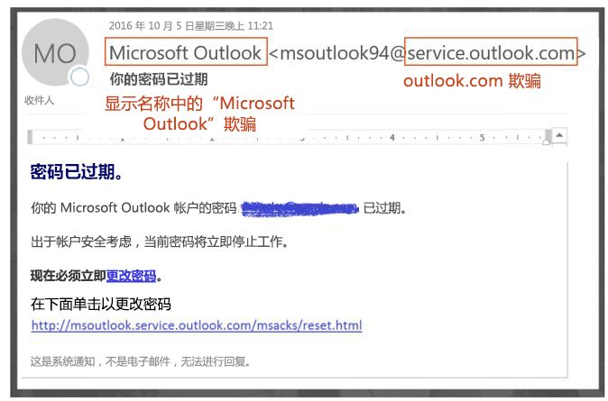
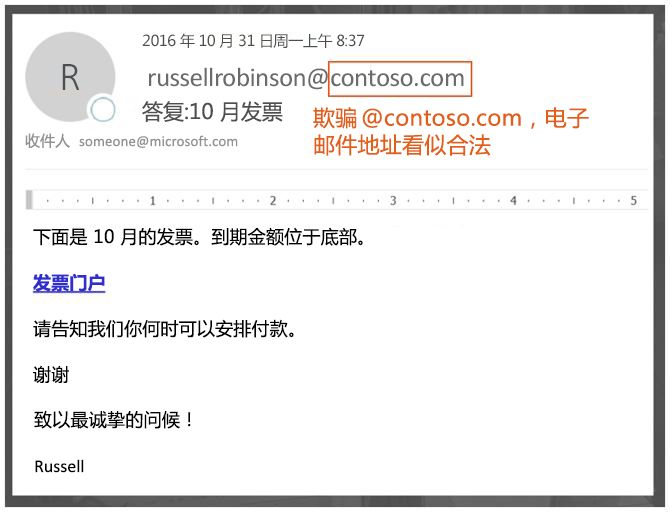
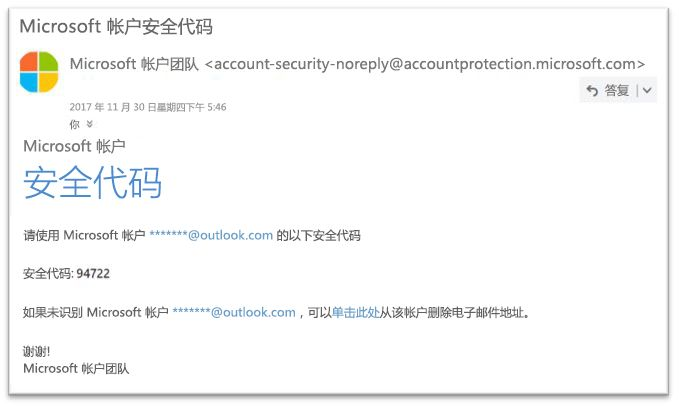

# EOP 中的防欺骗防护

[!INCLUDE [Microsoft 365 Defender rebranding](../includes/microsoft-defender-for-office.md)]

**适用对象**
- [Exchange Online Protection](exchange-online-protection-overview.md)
- [Microsoft Defender for Office 365 计划 1 和计划 2](defender-for-office-365.md)
- [Microsoft 365 Defender](../defender/microsoft-365-defender.md)

无论是针对拥有 Exchange Online 邮箱的 Microsoft 365 组织，还是没有 Exchange Online 邮箱的独立 Exchange Online Protection (EOP) 组织，EOP 都将提供帮助保护你的组织免受虚假（伪造）发件人威胁的功能。

在为用户提供保护方面，Microsoft 非常重视网络钓鱼的威胁。 欺骗是黑客使用的一种常见技术。 **欺骗邮件看似来自某人或某处，其实并非其真实来源**。 此技术通常在专门获取用户凭据的网络钓鱼活动中使用。 EOP 中的反欺骗技术专门检查邮件正文中的“发件人”标头（用于显示电子邮件客户端中的邮件发件人）。 如果 EOP 高度确信“发件人”标头是伪造的，该邮件将被识别为欺骗邮件。

EOP 中提供了以下反欺骗技术：

- **电子邮件身份验证**：DNS 中的 SPF、DKIM 和 DMARC 记录使用的电子邮件身份验证（也称为电子邮件验证）是任何反欺骗工作必不可少的一部分。 可以为你的域配置这些记录，以便目标电子邮件系统能够检查声称来自域中发件人的邮件的有效性。 对于入站邮件，Microsoft 365 需要针对发件人域的电子邮件身份验证。 有关详细信息，请参阅 [Microsoft 365 中的电子邮件身份验证](email-validation-and-authentication.md)。

  EOP 可分析并阻止标准电子邮件身份验证方法和发件人信誉技术组合无法验证的邮件。

  

- **欺骗智能见解**：查看过去 7 天内内部和外部域中来自发件人的欺骗邮件，并允许或阻止这些发件人。有关详细信息，请参阅 [EOP 中的欺骗智能见解](learn-about-spoof-intelligence.md)。

- **在“租户允许/阻止列表”中允许或阻止欺骗发件人**：如果覆盖欺骗智能见解中的裁定，欺骗发件人将成为仅在“租户允许/阻止列表”的“**欺骗**”选项卡上显示的手动允许或阻止条目。 也可以在欺骗智能检测到欺骗发件人之前手动为其创建允许或阻止条目。 有关详细信息，请参阅[管理 EOP 中的租户允许/阻止列表](tenant-allow-block-list.md)。

- **防钓鱼策略**：在 EOP 和 Microsoft Defender for Office 365 中，反钓鱼策略包含以下反欺骗设置：
  - 打开或关闭欺骗智能。
  - 打开或关闭 Outlook 中未经身份验证的发件人标识。
  - 指定对阻止的欺骗发件人的操作。

  有关详细信息，请参阅[反钓鱼策略中的“欺骗”设置](set-up-anti-phishing-policies.md#spoof-settings)。

  **注意**：Microsoft Defender for Office 365 中的反钓鱼策略包含添加保护，包括 **模拟** 保护。 有关详细信息，请参阅 [Microsoft Defender for Office 365 中反钓鱼策略中的“独占”设置](set-up-anti-phishing-policies.md#exclusive-settings-in-anti-phishing-policies-in-microsoft-defender-for-office-365)。

- **欺骗检测报告**：有关详细信息，请参阅 [欺骗检测报告](view-email-security-reports.md#spoof-detections-report)。

  **注意**：Defender for Office 365 组织还可以使用实时检测（计划 1）或威胁资源管理器（计划 2）查看有关网络钓鱼尝试的信息。有关详细信息，请参阅 [Microsoft 365 威胁调查和响应](office-365-ti.md)。

## 如何在网络钓鱼攻击中使用欺骗

欺骗邮件会对用户造成以下负面影响：

- **欺骗邮件设备用户**：欺骗邮件可能会欺骗收件人点击链接并放弃使用其凭据、下载恶意软件或向邮件回复敏感内容（称为商务电子邮件入侵或 BEC）。

  以下是一封具有伪造发件人 msoutlook94@service.outlook.com 的网络钓鱼邮件示例：

  

  此邮件并非来自 service.outlook.com，而是攻击者伪造“**发件人**”标头字段，使它看起来像是这样。 这种做法试图欺骗收件人单击“**更改密码**”链接并放弃使用其凭据。

  以下邮件是使用欺骗电子邮件域 contoso.com 的 BEC 示例：

  

  该邮件看似合法，但发件人其实是伪造的。

- **用户混淆了真实邮件和虚假邮件**：即使是知道网络钓鱼的用户也可能很难看出真实邮件与欺骗邮件之间的差异。

  例如，以下是来自 Microsoft 安全帐户部门的真实密码重置邮件的示例：

  

  邮件确实来自 Microsoft，但用户已经习惯于持怀疑态度。因为难以区分真正的密码重置邮件和伪造的邮件，用户可能会忽略该消息，而将其报告为垃圾邮件，或者不必要地将该消息作为网络钓鱼报告给 Microsoft。

## 不同类型的欺骗

Microsoft 区分两种不同类型的欺骗邮件：

- **组织内欺骗**：也称为 _自我_ 欺骗。例如：

  - 发件人和收件人位于同一域：
    > 发件人：chris@contoso.com   收件人：michelle@contoso.com

  - 发件人和收件人位于同一域的子域：
    > 发件人：laura@marketing.fabrikam.com   收件人：julia@engineering.fabrikam.com

  - 发件人和收件人位于属于同一组织的不同域（即，两个域均配置为同一组织中的[接受域](/exchange/mail-flow-best-practices/manage-accepted-domains/manage-accepted-domains)）：
    > 发件人：sender @ microsoft.com   收件人：recipient @ bing.com

    电子邮件地址中使用空格，以防垃圾邮件机器人收集邮件。

  由于组织内欺骗而导致未通过[复合身份验证](email-validation-and-authentication.md#composite-authentication)的邮件包含以下标头值：

  `Authentication-Results: ... compauth=fail reason=6xx`

  `X-Forefront-Antispam-Report: ...CAT:SPOOF;...SFTY:9.11`

  - `reason=6xx` 表示组织内欺骗。

  - SFTY 是邮件的安全级别。 9 表示网络钓鱼，11 表示组织内欺骗。

- **跨域欺骗**：发件人和收件人域不同，并且相互之间没有任何关系（也称为外部域）。例如：
    > 发件人：chris@contoso.com   收件人：michelle@tailspintoys.com

  由于跨域欺骗而导致未通过[复合身份验证](email-validation-and-authentication.md#composite-authentication)的邮件包含以下标头值：

  `Authentication-Results: ... compauth=fail reason=000/001`

  `X-Forefront-Antispam-Report: ...CAT:SPOOF;...SFTY:9.22`

  - `reason=000` 表示邮件未通过显式电子邮件身份验证。 `reason=001` 表示邮件未通过隐式电子邮件身份验证。

  - `SFTY` SFTY 是邮件的安全级别。 9 表示网络钓鱼，22 表示跨域欺骗。

> [!NOTE]
> 如果收到类似 ***compauth=fail reason=###** _ 的电子邮件，并且需要了解组合身份验证（compauth）和与欺骗有关的值，请参阅 [_Microsoft 365 中的反垃圾邮件标头*](anti-spam-message-headers.md)。或直接转到 [*原因*](anti-spam-message-headers.md) 代码。

有关 DMARC 的详细信息，请参阅[在 Microsoft 365 中使用 DMARC 来验证电子邮件](use-dmarc-to-validate-email.md)。

## 反欺骗防护方面的问题

由于转发和修改邮件的方式，邮件列表（也称为讨论列表）存在反欺骗问题。

例如，Gabriela Laureano (glaureano@contoso.com) 有兴趣赏鸟，他加入了邮件列表 birdwatchers@fabrikam.com，并向列表发送了以下邮件：

> **发件人:** "Gabriela Laureano" \<glaureano@contoso.com\>   **收件人:** 赏鸟者讨论列表\<birdwatchers@fabrikam.com\>   **主题**：本周到雷尼尔山顶观赏美丽的冠蓝鸦 
 有人想本周去雷尼尔山看风景吗？

邮件列表服务器接收邮件，修改其内容并将其重播给列表中的成员。 重播的邮件具有相同的“发件人”地址 (glaureano @ contoso.com)，但向主题行添加了标记并在邮件底部添加了页脚。 这种类型的修改在邮件列表中很常见，并且可能导致欺骗误报。

> **发件人:** "Gabriela Laureano" \<glaureano@contoso.com\>   **收件人:** 赏鸟者讨论列表\<birdwatchers@fabrikam.com\>   **主题：** [赏鸟者] 本周到雷尼尔山顶观赏美丽的冠蓝鸦 
 有人想本周去雷尼尔山看风景吗？
 此邮件已发送到赏鸟者讨论列表。 可随时取消订阅。

要帮助邮件列表邮件通过反欺骗检查，请根据是否控制邮件列表执行以下操作：

- 组织拥有邮件列表：

  - 查看 DMARC.org 上的常见问题解答：[我在操作邮件列表时想与 DMARC 进行交互，应该怎么办？](https://dmarc.org/wiki/FAQ#I_operate_a_mailing_list_and_I_want_to_interoperate_with_DMARC.2C_what_should_I_do.3F)。

  - 阅读此博客文章中的说明：[关于邮件列表操作员与 DMARC 进行交互以避免失败的提示](/archive/blogs/tzink/a-tip-for-mailing-list-operators-to-interoperate-with-dmarc-to-avoid-failures)。

  - 考虑在邮件列表服务器上安装更新以支持 ARC，请参阅 <http://arc-spec.org>

- 组织不拥有邮件列表：

  - 请求邮件列表的维护人员为从中中继邮件列表的域配置电子邮件身份验证。

    如果有足够多的发件人向域所有者反映他们应该设置电子邮件身份验证记录，这会促使他们采取行动。 虽然 Microsoft 也可与域所有者合作发布所需的记录，但当个人用户提出请求时，它可以提供更多帮助。

  - 在电子邮件客户端中创建邮箱规则，以将邮件移动到收件箱。 此外，还可以要求管理员按照 [EOP 中的欺骗智能见解](learn-about-spoof-intelligence.md)和[管理租户允许/阻止列表](tenant-allow-block-list.md)部分的说明配置替代。

  - 使用 Microsoft 365 创建支持票证，以便为邮件列表创建替代，以将其视为合法邮件。 有关详细信息，请参阅[就商业版产品问题联系支持人员 - 管理员帮助](../../admin/get-help-support.md)。

如果其他所有操作均失败，则可以向 Microsoft 报告该邮件为误报。 有关详细信息，请参见[向 Microsoft 报告邮件和文件](report-junk-email-messages-to-microsoft.md)。

你也可以联系管理员，他可以将其作为支持票证向 Microsoft 提出。 Microsoft 工程团队将调查邮件被标记为欺骗邮件的原因。

## 反欺骗防护注意事项

如果你是当前向 Microsoft 365 发送邮件的管理员，则需要确保你的电子邮件经过了正确的身份验证。 否则，它可能被标记为垃圾邮件或网络钓鱼。 有关详细信息，请参阅[适用于发送未经身份验证的电子邮件的合法发件人的解决方案](email-validation-and-authentication.md#solutions-for-legitimate-senders-who-are-sending-unauthenticated-email)。

单个用户（或管理员）的安全发件人列表中的发件人将绕过筛选堆栈的一部分，包括欺骗保护。有关详细信息，请参阅 [Outlook 安全发件人](create-safe-sender-lists-in-office-365.md#use-outlook-safe-senders)。

管理员应避免（如果可能）使用允许的发件人列表或允许的域列表。 这些发件人将绕过所有垃圾邮件、欺骗和网络钓鱼防护以及发件人身份验证（SPF、DKIM、DMARC）。 有关详细信息，请参阅[使用允许的发件人列表或允许的域列表](create-safe-sender-lists-in-office-365.md#use-allowed-sender-lists-or-allowed-domain-lists)。
