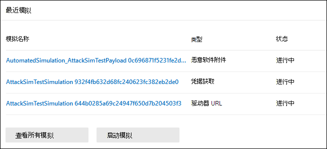
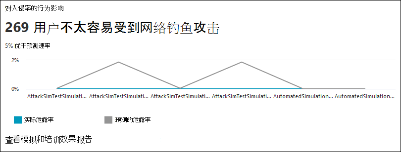
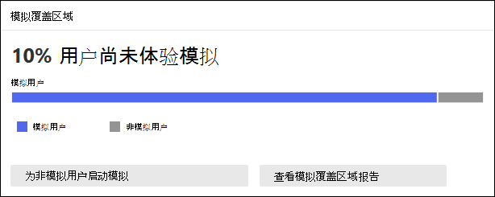
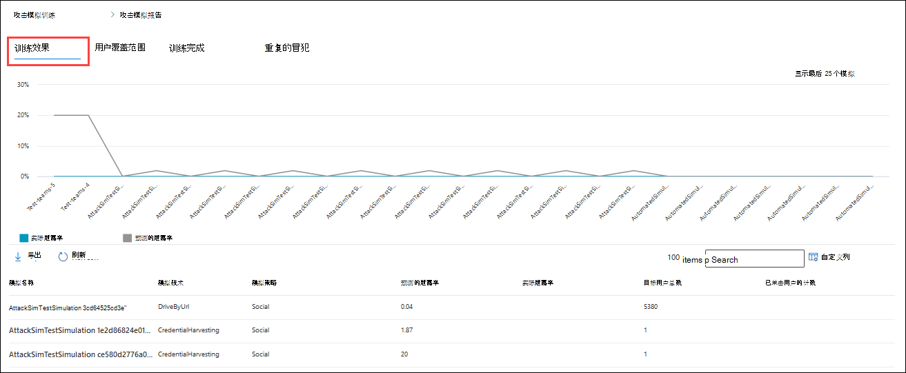
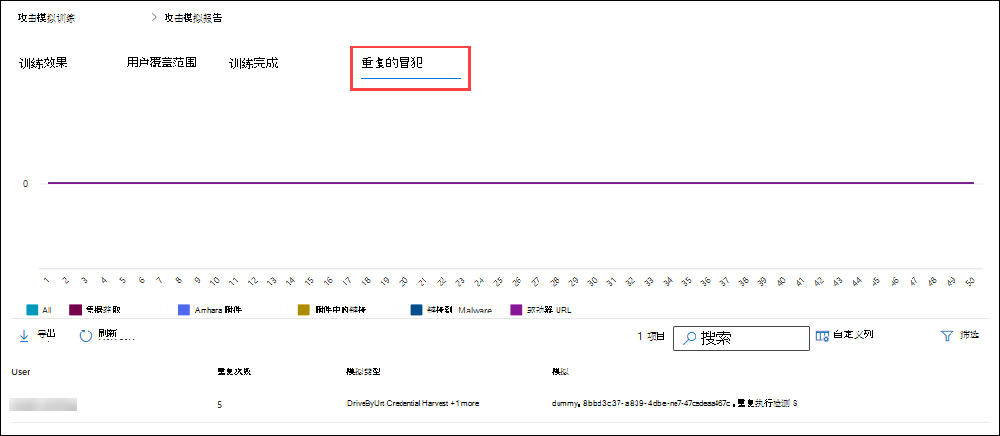

# Insights Defender for Office 365 中攻击模拟培训的报告和报告

**适用于 Microsoft** [Defender for Office 365计划 2](defender-for-office-365.md)

在 Microsoft Defender 中针对 Office 计划 2 或 Microsoft 365 E5 的攻击模拟培训中，Microsoft 提供来自模拟结果和相应培训的见解和报告。 此信息可让你了解用户的威胁就绪进度，以及建议执行哪些步骤，以便用户更好地为将来的攻击做好准备。

Insights门户中攻击模拟培训中的以下位置提供了Microsoft 365 Defender报告：

- " **概述"** 选项卡。
- 模拟选项卡上的 **模拟** 详细信息。

本文的其余部分介绍了可用信息。

有关攻击模拟培训的入门信息，请参阅使用 [攻击模拟培训入门](attack-simulation-training-get-started.md)。

## Insights攻击模拟培训的概述选项卡上的报告和报告

To go to the **Overview** tab， open the Microsoft 365 Defender portal at <a href="https://go.microsoft.com/fwlink/p/?linkid=2077139" target="_blank">https://security.microsoft.com</a> ， go to Email & **collaboration** Attack \> **simulation training**， and verify that the **Overview** tab is selected (it's the default) . 若要直接转到攻击 **模拟培训** 页面上的概述 **选项卡** ，请使用 <https://security.microsoft.com/attacksimulator?viewid=overview> 。

本部分的其余部分介绍了攻击模拟培训的"概述 **"选项卡上** 的信息。

### 最近模拟卡

"**概述"选项卡** 上的"最近模拟"卡片显示你在组织中创建或运行的最近三个模拟。

可以选择模拟以查看详细信息。

选择 **"查看所有模拟"** 将你选中 **"模拟"** 选项卡。

选择 **启动模拟将** 启动模拟创建向导。 有关详细信息，请参阅在 Defender for Office 365 中[模拟网络钓鱼Office 365。](attack-simulation-training.md)

### 对泄露率卡的行为影响

"**概述"选项卡** 上的"行为对泄露率卡的影响"显示用户对模拟的回复与当前测试中的历史数据Microsoft 365。 通过针对同一组用户运行多个模拟，可以使用这些见解跟踪用户威胁准备情况的进度。

图表数据本身显示以下信息：

- **预测入侵率**：攻击模拟培训模拟的平均入侵率，该模拟在所有其他组织之间使用相同 \* Microsoft 365率。
- **实际泄露率** \* ：进行模拟的用户的实际百分比。

如果将鼠标悬停在图表中的数据点上，将显示实际百分比值。

卡片上还会显示以下摘要信息：

- **用户对网络钓鱼** 的干扰程度较低：受模拟攻击危害的实际用户数与预测的入侵率之间的差值。 此用户数以后不太可能受到类似攻击的攻击。
- **x% 好于预测速率**：指示用户与预测的泄露率相比的总体效果。

若要查看更详细的报告，请单击查看 **模拟和培训的报表**。 本文稍后将 [对此报告进行介绍](#training-efficacy-tab-for-the-attack-simulation-report)。

### 模拟覆盖卡

"概述"选项卡上的模拟覆盖卡显示组织中已收到模拟 (模拟用户 **)** 的用户与未收到模拟 (非模拟用户) 的用户的百分比。  您可以将鼠标悬停在图表中的一部分上，以查看每个类别中的实际用户数。

选择 **"启动非模拟** 用户的模拟"将启动模拟创建向导，其中，在"目标用户"页面上自动选择未收到 **模拟** 的用户。 有关详细信息，请参阅在 Defender for Office 365 中[模拟网络钓鱼Office 365。](attack-simulation-training.md)

选择 **查看模拟覆盖报告** 将你访问攻击模拟报告的用户 [范围选项卡](#user-coverage-tab-for-the-attack-simulation-report)。

### 培训完成卡

"**概述**"选项卡上的"培训完成卡"根据模拟结果将接受培训的用户百分比分为以下类别：

- **已完成**
- **正在进行**
- **不完整**

您可以将鼠标悬停在图表中的一部分上，以查看每个类别中的实际用户数。

选择 **查看培训完成报告** 将你访问攻击模拟报告的培训 [完成选项卡](#training-completion-tab-for-the-attack-simulation-report)。

### 重复错误卡片

"**概述"选项卡上的**"重复错误"卡片显示有关重复错误的信息。 重复 _错误_ 是由连续模拟泄露的用户。 连续模拟的默认数量为 2，**但你可以** 更改 攻击模拟设置选项卡上的值 <https://security.microsoft.com/attacksimulator?viewid=setting> 。

该图表按模拟类型组织重复 [重复数据](attack-simulation-training.md#select-a-social-engineering-technique)：

- **全部**
- **恶意软件附件**
- **链接到恶意软件**
- **凭据获取**
- **附件中的链接**
- **按 URL 的驱动器**

选择 **"查看重复攻击报告** "将你选中攻击模拟报告的"重复 [攻击"选项卡](#repeat-offenders-tab-for-the-attack-simulation-report)。

### 推荐卡片

**"推荐"****选项卡上的"** 模拟"卡片建议运行不同类型的模拟。

选择 **"启动** "现在将启动模拟创建向导，同时在"选择技术"页上自动 **选择指定的模拟** 类型。 有关详细信息，请参阅在 Defender for Office 365 中[模拟网络钓鱼Office 365。](attack-simulation-training.md)

### 攻击模拟报告

你可以单击 **"查看**..."，从"概述"选项卡打开攻击 **模拟报告。报告** 按钮，可在本文所述的许多卡片中提供。 若要直接转到报告，请使用 <https://security.microsoft.com/attacksimulationreport>

#### 攻击模拟报告的培训培训选项卡

在攻击 **模拟报告页面上** ， **默认情况下选择培训** 培训选项卡。 此选项卡提供与"行为影响泄露率卡"中提供的相同信息，以及来自模拟本身的附加上下文。

该图显示了预测 **的入侵速率** 和 **实际泄漏率**。 如果将鼠标悬停在图表中的节上，将显示 的实际百分比值。

图表下面的详细信息表显示以下信息：

- **模拟名称**
- **模拟技术**
- **模拟策略**
- **预测的泄露率**
- **实际泄露率**
- **目标用户总数**
- **点击用户数**

若要对结果进行排序，可以单击可用列标题。

单击 **"自定义** 列"以删除显示的列。 完成后，单击“**应用**”。

使用  **搜索** 框按模拟名称或模拟技术 **筛选结果**。 不支持通配符。

如果单击"导出  **导出报告** 按钮，报告生成进度显示为完成百分比。 在打开的对话框中，可以选择打开.csv文件，保存.csv文件，并记住选择。

#### 攻击模拟报告的用户范围选项卡

在"**用户范围**"选项卡上，图表显示 **"** 模拟用户 **"和"非模拟用户"。** 如果将鼠标悬停在图表中的数据点上，将显示实际值。

图表下面的详细信息表显示以下信息：

- **Username**
- **电子邮件地址**
- **包含在模拟中**
- **上次模拟的日期**
- **上次模拟结果**
- **点击次数**
- **遭到入侵的计数**

若要对结果进行排序，可以单击可用列标题。

单击 **"自定义** 列"以删除显示的列。 完成后，单击“**应用**”。

使用  **搜索** 框按用户名或电子邮件地址筛选 **结果**。 不支持通配符。

如果单击"导出  **导出报告** 按钮，报告生成进度显示为完成百分比。 在打开的对话框中，可以选择打开.csv文件，保存.csv文件，并记住选择。

#### 攻击模拟报告的培训完成选项卡

在 **"培训完成** "选项卡上，图表显示" **已完成**"、 **正在进行** 和 **未完成** 模拟的数量。 如果将鼠标悬停在图表中的节上，将显示实际值。

图表下面的详细信息表显示以下信息：

- **Username**
- **电子邮件地址**
- **包含在模拟中**
- **上次模拟的日期**
- **上次模拟结果**
- **最近完成的培训的名称**
- **完成日期**
- **所有培训**

若要对结果进行排序，可以单击可用列标题。

单击 **"自定义** 列"以删除显示的列。 完成后，单击“**应用**”。

单击  **筛选** 以按以下一个或多个值筛选图表和详细信息表：

- **已完成**
- **正在进行**
- **全部**

配置完筛选器后，请单击"应用"、"**取消**"或"清除 **筛选器"。**

使用  **搜索** 框按用户名或电子邮件地址筛选 **结果**。 不支持通配符。

如果单击"导出  **导出报告** 按钮，报告生成进度显示为完成百分比。 在打开的对话框中，可以选择打开.csv文件，保存.csv文件，并记住选择。

#### 攻击模拟报告的"重复攻击"选项卡

重复 _错误_ 是由连续模拟泄露的用户。 连续模拟的默认数量为 2，**但** 你可以更改 攻击模拟设置选项卡上的值 <https://security.microsoft.com/attacksimulator?viewid=setting> 。

在" **重复限制** "选项卡上，图表按模拟类型组织 [重复重复数据](attack-simulation-training.md#select-a-social-engineering-technique)：

- **全部**
- **凭据获取**
- **恶意软件附件**
- **附件中的链接**
- **链接到恶意软件**
- **按 URL 的驱动器**

如果将鼠标悬停在图表中的数据点上，将显示实际值。

图表下面的详细信息表显示以下信息：

- **用户**
- **重复计数**
- **模拟类型**
- **模拟**

若要对结果进行排序，可以单击可用列标题。

单击 **"自定义** 列"以删除显示的列。 完成后，单击“**应用**”。

单击  **筛选** 以按部分或所有模拟类型值筛选图表和详细信息表：

- **凭据获取**
- **恶意软件附件**
- **附件中的链接**
- **链接到恶意软件**
- **按 URL 的驱动器**

配置完筛选器后，请单击"应用"、"**取消**"或"清除 **筛选器"。**

使用  **搜索图标** ""搜索"框按任何列值筛选结果。 不支持通配符。

如果单击"导出  **导出报告** 按钮，报告生成进度显示为完成百分比。 在打开的对话框中，可以选择打开.csv文件，保存.csv文件，并记住选择。

## Insights攻击模拟培训的模拟详细信息中的报告和报告

To go to the **Simulations** tab， open the Microsoft 365 Defender portal at <a href="https://go.microsoft.com/fwlink/p/?linkid=2077139" target="_blank">https://security.microsoft.com</a> ， go to Email & **collaboration** Attack \> **simulation training**， and then click the **Simulations** tab.若要直接转到攻击 **模拟** 培训页面上的模拟选项卡 **，请使用** <https://security.microsoft.com/attacksimulator?viewid=simulations> 。

当你从列表中选择模拟时，将打开一个详细信息页面。 此页面包含模拟的配置设置，你将看到 (状态、发布日期、使用的负载等) 。

本节的其余部分介绍了模拟详细信息页面上提供的见解和报告。

### 模拟影响部分

模拟 **详细信息** 页上的"模拟影响"部分显示模拟完全欺骗了多少用户，以及模拟中的用户总数。 显示的信息因模拟类型而异。 例如：

- 链接：**输入的凭据****和未输入凭据**。

  

- 附件：**打开的附件****和未打开的附件**。

  

如果将鼠标悬停在图表中的节上，将显示每个类别的实际数字。

### "用户活动"部分

模拟 **详细信息页面上** 的"所有用户活动"部分显示模拟的可能结果的数字。 显示的信息因模拟类型而异。 例如：

- **SuccessfullyDeliveredEmail**
- **ReportedEmail：** 有多少用户将模拟邮件报告为可疑邮件。
- 链接：
  - **EmailLinkClicked：** 在模拟消息中单击链接的用户数。
  - **CredSupplied：** 单击链接后，有多少用户提供其凭据。

    

- 附件：
  - **AttachmentOpened：** 模拟邮件中打开附件的用户数。

    

### 培训完成部分

模拟 **详细信息页上** 的"培训完成"部分显示模拟所需的培训，以及完成培训的用户数。

## 建议的操作部分

模拟 **详细信息页面上** 的推荐操作部分显示 [来自 Microsoft 安全](../defender/microsoft-secure-score.md) 分数的建议操作，以及该操作对安全分数的影响。 这些建议基于模拟中使用的有效负载，有助于保护用户和环境。 从 **列表中选择"** 改进"操作将您定位到实施建议操作的位置。

## 相关链接

[开始使用攻击模拟培训](attack-simulation-training-get-started.md)

[创建网络钓鱼攻击模拟](attack-simulation-training.md)

[创建用于培训人员的有效负载](attack-simulation-training-payloads.md)
