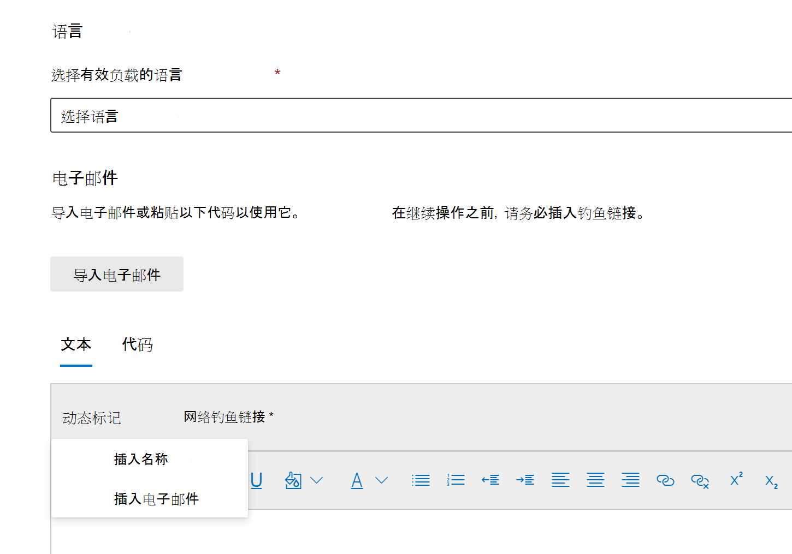

# 创建用于攻击模拟培训的自定义负载

Microsoft 为各种社交工程技术提供了可靠的有效负载目录，以与攻击模拟培训配对。 但是，你可能希望创建自定义有效负载，以更好地为组织工作。 本文介绍如何在 Microsoft Defender for Office 365 攻击模拟培训中创建有效负载。

可以通过单击专用"有效负载"选项卡或模拟创建向导中的"创建有效负载["来创建有效负载](attack-simulation-training.md#selecting-a-payload)。 

向导的第一步是选择有效负载类型。 **目前，只有电子邮件可用**。

接下来，选择关联的技术。 有关选择社交工程 [技术的方法的详细信息，请参阅](attack-simulation-training.md#selecting-a-social-engineering-technique)。

在下一步中，命名有效负载。 （可选）你可以为它提供说明。

## 配置有效负载

现在，可以生成有效负载了。 在"发件人详细信息"部分输入发件人的姓名、电子邮件地址和 **电子邮件** 主题。 从提供的列表中选择网络钓鱼 URL。 此 URL 稍后将嵌入到邮件正文中。

> [!TIP]
> 你可以选择有效负载的发件人的内部电子邮件，这会使有效负载显示为来自公司的另一名员工。 这将提高有效负载的易感知性，并帮助员工了解内部威胁的风险。

格式文本编辑器可用于创建有效负载。 还可以导入预先创建的电子邮件。 创建电子邮件正文时，利用动态标记个性化发送到目标的电子邮件。  单击 **"网络钓鱼"** 链接，将以前选择的网络钓鱼 URL 添加到邮件正文中。

> [!TIP]
> 若要节省时间，请切换该选项以将电子邮件中所有 **链接替换为网络钓鱼链接**。

完成有效负载生成后，单击"下一步 **"。**

## 添加指示器

指示器可帮助员工完成攻击模拟，了解他们可以在将来的攻击中查找的线索。 若要开始，请单击 **"添加指示器"。**

从下拉列表中选择一个希望使用的指示器。 此列表被组织为包含网络钓鱼电子邮件中最常见的线索。 选择后，请确保将指示器放置设置为"**从** 电子邮件正文"并单击"**选择文本"。** 突出显示显示此指示器的有效负载部分，然后单击"**选择"。**

添加用于描述指示器的自定义说明，然后单击指示器预览帧以查看指示器预览。 完成后，单击"**添加"。** 重复这些步骤，直到负载中涵盖所有指示器。

## 查看有效负载

你已完成有效负载的生成。 现在应该查看详细信息并查看有效负载的预览。 预览将包括你创建的所有指示器。 你可以从此步骤编辑负载的每个部分。 一旦满足，你可以 **提交** 有效负载。

> [!IMPORTANT]
> 你创建的负载将租户 **作为** 源。 选择有效负载时，请确保不筛选出 **租户**。

## 相关链接

[开始使用攻击模拟培训](attack-simulation-training-get-started.md)

[创建网络钓鱼攻击模拟](attack-simulation-training.md)

[通过攻击模拟培训获得见解](attack-simulation-training-insights.md)
