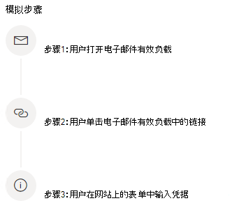

# 模拟网络钓鱼攻击

Microsoft Defender for Office 365 中的攻击模拟培训允许你在组织中运行恶意网络攻击模拟，以测试安全策略和做法，并培训员工提高认知度并减少他们对攻击的敏感性。 本文将引导你完成使用攻击模拟培训创建模拟网络钓鱼攻击。

有关攻击模拟培训的入门信息，请参阅 [使用攻击模拟培训入门](attack-simulation-training-get-started.md)。

若要启动模拟网络钓鱼攻击，请打开 Microsoft [365](https://security.microsoft.com/)安全中心，转到"电子邮件&协作攻击 \> **模拟培训**"，然后切换到"[**模拟**](https://security.microsoft.com/attacksimulator?viewid=simulations)"选项卡。

在 **"模拟"** 下，选择 **" + 启动模拟"。**

> [!NOTE]
> 在模拟创建期间的任何时间点，你都可以保存并关闭，以稍后继续配置模拟。

## 选择社交工程技术

从 CK 的 4 种不同的技术中选择，这些技术 [由 MITRE ATT&设计®设计](https://attack.mitre.org/techniques/enterprise/)。 不同的有效负载可用于不同的技术：

- **凭据收集** 尝试通过让用户到具有输入框的已知网站来提交用户名和密码来收集凭据。
- **恶意软件附件** 向邮件添加恶意附件。 当用户打开附件时，将运行任意代码，帮助攻击者破坏目标设备。
- **附件中的链接** 是凭据获取混合的一种类型。 攻击者将 URL 插入到电子邮件附件中。 附件中的 URL 遵循与凭据获取相同的技术。
- **指向恶意软件** 的链接将运行一些来自已知文件共享服务上托管的文件的任意代码。 发送给用户的邮件将包含指向此恶意文件的链接。 打开文件并帮助攻击者破坏目标设备。

> [!TIP]
> 单击 **每种技术** 的说明中的"查看详细信息"将显示有关该技术的详细信息和模拟步骤。
>
> 

选择该技术并单击"下一步"后，为模拟指定名称和说明（可选）。

## 选择有效负载

接下来，你需要从预先存在的有效负载目录中选择有效负载。

有效负载具有多个数据点，可帮助你选择：

- **单击率** 计算单击此负载的人数。
- **根据 Microsoft** Defender for Office 365 客户有效负载的历史数据，预测受此负载危害的百分比。
- **启动的** 模拟计算此有效负载在其他模拟中使用的次数。
- **复杂性**（通过筛选器 **提供**）基于有效负载中的指示器数量计算，这些指示器可提示目标受到攻击。 指标越多，复杂性越低。
- **源**（通过 **筛选器提供**）指示有效负载是在租户上创建的，还是 Microsoft 预先存在的有效负载目录的一 (全局) 。

从列表中选择一个有效负载，以查看有效负载的预览以及有关它的其他信息。

如果你想要创建自己的有效负载，请阅读为攻击 [模拟培训创建有效负载](attack-simulation-training-payloads.md)。

## 访问群体设定

现在该选择此模拟的受众了。 可以选择包括 **组织中所有用户或** 仅包括 **特定用户和组**。

选择仅 **包含特定用户和组时，** 可以执行下列任一操作：

- **添加** 用户，这允许你利用租户的搜索以及高级搜索和筛选功能，例如面向过去 3 个月内未通过模拟定位的用户。
  
- **通过 CSV** 导入，可以导入此模拟的预定义用户集。

## 分配培训

我们建议你为每个模拟分配培训，因为经过培训的员工不太容易遭受类似攻击。

可以选择为自己分配培训，也可以自己选择培训课程和模块。

选择 **培训截止日期，** 确保员工及时完成培训。

> [!NOTE]
> 如果你选择自己选择课程和模块，你仍然可以看到推荐的内容以及所有可用的课程和模块。
>
> 

在以下步骤中，如果选择自己选择培训，则需要添加培训，并自定义培训登陆页面。 你将能够预览培训登陆页面，并更改其标头和正文。

## 启动详细信息和查看

现在，所有内容已配置完成，你可以立即启动此模拟或安排在以后日期进行。 你还需要选择何时结束此模拟。 在选定时间后，我们将停止捕获此模拟的交互。

**启用区域感知时区传递** ，以根据员工的区域在工作时间向员工传递模拟攻击消息。

完成后，单击 **"下一** 步"并查看模拟的详细信息。 单击 **任意部件的** "编辑"可返回并更改任何需要更改的详细信息。 完成后，单击"**提交"。**
