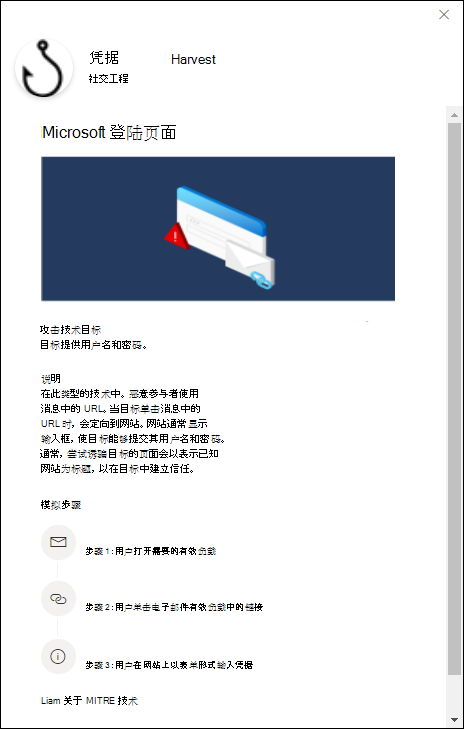
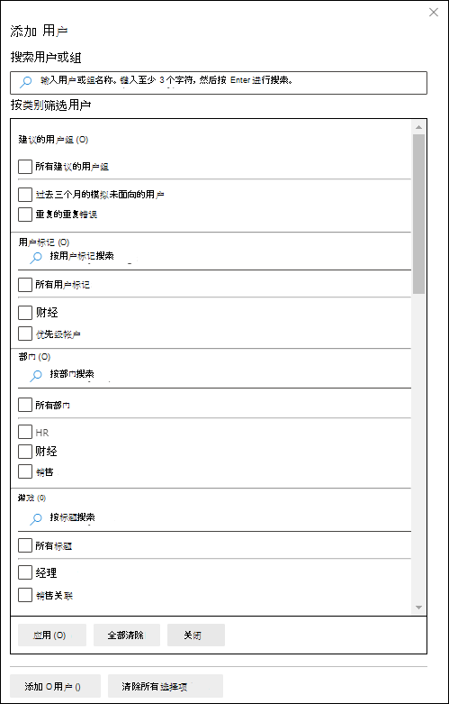

# 在 Defender for Office 365

**适用于 Microsoft** [Defender for Office 365计划 2](defender-for-office-365.md)

通过 Microsoft Defender for Office 365 计划 2 或 Microsoft 365 E5攻击模拟培训，你可以在你的组织中运行恶意网络攻击模拟。 这些模拟将测试你的安全策略和做法，并培训你的员工提高认知度并减少他们对攻击的敏感性。 本文将指导你完成使用攻击模拟培训创建模拟网络钓鱼攻击。

有关攻击模拟培训的入门信息，请参阅使用 [攻击模拟培训入门](attack-simulation-training-get-started.md)。

若要启动模拟网络钓鱼攻击，请执行以下步骤：

1. 在 Microsoft 365 Defender 门户中 <a href="https://go.microsoft.com/fwlink/p/?linkid=2077139" target="_blank">https://security.microsoft.com</a> ，转到"电子邮件& \> **协作攻击模拟** \> **培训模拟"** 选项卡。

   若要直接转到模拟 **选项卡** ，请使用 <https://security.microsoft.com/attacksimulator?viewid=simulations> 。

2. 在" **模拟"选项卡** 上，选择  **启动模拟**。

   

3. 模拟创建向导将打开。 本文的其余部分介绍了页面及其包含的设置。

> [!NOTE]
> 在模拟创建向导期间的任何时间点，都可以单击 **"保存并** 关闭"以保存进度，并稍后继续配置模拟。 不完整的模拟 **在模拟选项卡** 上 **具有****状态值** 草稿。通过选择模拟并单击"编辑模拟图标"，你可以从你离开  **编辑** 模拟。

## 选择社交工程技术

在"**选择技术**"页上，选择一种可用的社交工程技术，该技术由 [MITRE ATT&CK®设计。](https://attack.mitre.org/techniques/enterprise/) 不同的有效负载可用于不同的技术。 可以使用以下社交工程技术：

- **凭据获取**：尝试通过让用户访问具有输入框的已知网站来提交用户名和密码来收集凭据。
- **恶意软件附件**：向邮件添加恶意附件。 当用户打开附件时，将运行任意代码，以帮助攻击者破坏目标设备。
- **附件中的链接**：凭据获取混合的一种类型。 攻击者将 URL 插入到电子邮件附件中。 附件中的 URL 遵循与凭据获取相同的技术。
- **链接到恶意软件**：从已知文件共享服务上托管的文件运行一些任意代码。 发送给用户的邮件将包含指向此恶意文件的链接。 打开文件并帮助攻击者破坏目标设备。
- **按 URL：** 邮件中的恶意 URL 将用户带至用户熟悉的网站，该网站以静默方式运行和/或在用户设备上安装代码代码。

如果单击描述 **中的"查看** 详细信息"链接，将打开一个详细信息飞出图，描述该技术以及由该技术所导致模拟的步骤。

完成后，单击“**下一步**”。

## 命名并描述模拟

在" **名称模拟"** 页上，配置以下设置：

- **名称**：输入模拟的唯一描述性名称。
- **说明**：输入模拟的可选详细说明。

完成后，单击“**下一步**”。

## 选择有效负载

在 **"选择有效** 负载"页上，您需要从列表中选择现有有效负载，或创建新的有效负载。

以下详细信息显示在有效负载列表中，可帮助你选择：

- **名称**
- **语言**：有效负载内容的语言。 Microsoft 的有效负载目录 (全局) 提供 10 多种语言（也可以筛选）的有效负载。
- **单击率**：单击此有效负载的人。
- **预测入侵率**：预测此负载Microsoft 365威胁的负载的历史数据。
- **模拟启动** 计算此有效负载在其他模拟中使用的次数。

在"  **搜索** 框，可以键入部分有效负载名称，然后按 Enter 筛选结果。

如果单击 **"筛选器"，** 则以下筛选器可用：

- **复杂性**：根据有效负载中指示可能的攻击 (拼写错误、紧急性等的指示器) 。 更多指示器更易于识别为攻击，并指示复杂度更低。 可用值有：
  - **低**
  - **中**
  - **高**
- **源**：指示有效负载是在组织中创建的，还是 Microsoft 预先存在的有效负载目录的一部分。 有效值包含:
  - **全局** (内置) 
  - **租户** (自定义) 
  - **全部**
- 语言 ：可用值为：中文 (简体 **) 、** 中文 (**繁体) 、****英语**、**法语**、**德语**、**意大利语**、**日语**、**朝鲜** 语、**葡萄牙语、****俄语**、**西班牙语** 和 **荷兰语**。
- **添加 (标记)**
- **按主题** 筛选：可用值为：**帐户** 激活、**帐户** 验证、**计费**、**清理邮件**、已接收 **文档**、**费用**、**传真**、财务报告、**传入** 邮件、**发票**、已接收项目、**登录通知**、**已接收邮件**、**密码**、**付款**、**工资** 单、个性化 **优惠****、隔离远程工作**，**审阅邮件**，**安全更新**，**服务** 挂起 **，** 需要签名 ，**升级邮箱存储 验证邮箱**、**语音邮件** 和其他 **。**
- 按品牌筛选：可用值为 **：American Express、Capital** One、DHL、DocuSign、Dropbox、Facebook、First      American、Microsoft、Netflix、Scotiabank、SendGrid、Stewart      **Title、Tesco、Wells** Fargo、Syrinx **Cloud** **和其他**。
- **按行业** 筛选：可用值为：**银行**、商业服务、**消费者** 服务、**教育**、**能源**、**建筑**、**咨询**、**金融服务**、**政府**、**城市**、保险、**法律****、Courier 服务****、IT、****医疗保健**、**制造**、**零售**、**电信**、**房地产**、 和其他。
- **当前事件**：可用值为"**是**"或"**否"。**
- **中国**：可用值为"**是**"或"**否"。**

配置完筛选器后，请单击"应用"、"**取消**"或"清除 **筛选器"。**

如果从列表中选择有效负载，则有关有效负载的详细信息将显示在一个飞出内容中：

- " **概述** "选项卡包含有关有效负载的示例和其他详细信息。
- 模拟 **启动选项卡** 包含 **模拟名称**、单击 **率****、泄露率****和操作**。

如果通过单击名称从列表中选择有效负载，则会显示  **"发送测试** "按钮显示在主页上，你可以向自己发送有效负载电子邮件的副本 (当前登录的用户) 进行检查。

若要创建自己的有效负载，请单击  **创建有效负载**。 有关详细信息，请参阅为攻击 [模拟培训创建自定义负载](attack-simulation-training-payloads.md)。

完成后，单击“**下一步**”。

## 目标用户

在 **"目标用户"** 页上，选择将接收模拟的用户。 配置以下设置之一：

- **包括组织中所有用户**：受影响的用户显示在 10 个列表中。 可以使用用户 **列表正下方的"下** 一步"和"上一步"按钮滚动浏览列表。  您还可以使用搜索  **页面上** 的搜索图标以查找受影响的用户。
- **仅包括特定用户和组**：选择以下选项之一：
  -  **添加用户**：在出现的" **添加用户** "飞出中，可以基于以下条件查找用户和组：
    - **用户或组**：在"  **搜索用户和组** 框，可以键入用户或组的名称或电子邮件地址的一部分，然后按 Enter。 可以选择部分或所有结果。 完成后，单击"添加 **x 用户"。**

      > [!NOTE]
      > 单击"**添加筛选器**"按钮返回到"按类别筛选用户"选项将清除在搜索结果中选择的任何用户或组。

    - **按类别筛选用户**：从无、部分或以下所有选项中进行选择：
      - **建议的用户组**：从以下值中选择：
        - **所有建议的用户组**
        - **最近三个月内未通过模拟确定目标的用户**
        - **重复错误**
      - **部门**：使用以下选项：
        - **搜索**：在  **按部门搜索** 框，可以键入部分部门值，然后按 Enter。 可以选择部分或所有结果。
        - 选择 **"所有部门"**
        - 选择现有的部门值。
      - **标题**：使用以下选项：
        - **搜索**：在"  **在"按标题** 搜索"框中，可以键入 Title 值的一部分，然后按 Enter。 可以选择部分或所有结果。
        - 选择 **所有标题**
        - 选择现有的"标题"值。

      

      确定条件后，受影响的用户将显示在出现的"用户列表"部分，您可以在其中选择部分或所有发现的收件人。

      完成后，单击"应用 x **(x) "，** 然后单击"**添加 x 用户"。**

  返回到主 **"目标用户"** 页面，您可以使用"搜索  **搜索** 框以查找受影响的用户。 还可以单击"删除  **删除** 以删除特定用户。

-  **导入**：在打开的对话框中，指定每行包含一个电子邮件地址的 CSV 文件。

  找到选择 CSV 文件后，用户列表将导入并显示在" **目标用户"** 页面上。 可以使用"搜索  **搜索** 框以查找受影响的用户。 还可以单击"  **删除** 以删除特定用户。

完成后，单击“**下一步**”。

## 分配培训

在 **分配培训页面上** ，你可以分配模拟培训。 我们建议你为每个模拟分配培训，因为通过培训的员工不太容易遭受类似的攻击。 可使用以下设置：

- **选择培训内容首选项**：选择以下选项之一：
  - **Microsoft 培训** 体验：此为默认值，具有要配置的以下关联选项：
    - 选择下列选项之一：
      - **为我分配培训**：这是默认值和推荐值。 我们根据用户以前的模拟和培训结果分配培训，你可以查看向导下一步中的选择。
      - **亲自选择** 培训课程和模块：如果你选择此值，你仍然可以看到向导下一步中推荐的内容以及所有可用的课程和模块。
    - **截止日期：** 选择下列值之一：
      - **模拟结束后 30 天**：这是默认值。
      - **模拟结束后 15 天**
      - **模拟结束后 7 天**
  - **重定向到自定义 URL：** 此值具有以下要配置的相关选项：
    - **自定义培训 URL** (必需) 
    - **自定义培训名称 (** 必填) 
    - **自定义培训说明**
    - **自定义培训 (分钟) ：** 默认值为 0，表示没有指定的培训持续时间。
    - **截止日期：** 选择下列值之一：
      - **模拟结束后 30 天**：这是默认值。
      - **模拟结束后 15 天**
      - **模拟结束后 7 天**
  - **无培训**：如果你选择此值，页面上的唯一选项是"下一步"按钮，将你导航到 [**登陆页面**](#landing-page)页面。

### 培训作业

> [!NOTE]
> "**培训作业**"页仅在你选择了 **Microsoft 培训** 体验时可用。在上一页上选择培训课程 \> 和模块自己。

在 **"培训作业** "页上，单击"添加培训"图标，选择要添加到  **添加培训**。

在 **出现的"添加** 培训"飞出选项卡上，可以选择在可用的以下选项卡上使用的培训：

- **推荐** 选项卡：显示基于模拟配置的建议内置培训。 这些培训与在上一页上选择"为我分配培训"时分配的培训相同。
- **"所有培训** "选项卡：显示所有可用的内置培训。

  将显示每个培训的以下信息：

  - **培训名称**
  - **源**：值为 **Global**。
  - **持续时间 (分钟)**
  - **预览**：单击 **"预览** "按钮以查看培训。

  在"  **搜索** 框，可以键入部分培训名称，然后按 Enter 筛选当前选项卡上的结果。

  Select all trainings that you want to include from the current tab， and then click **Add**.

返回到主 **"培训作业"** 页面，将显示所选的培训。 将显示每个培训的以下信息：

- **培训名称**
- **Source**
- **持续时间 (分钟)**

对于列表中的每个培训，你需要通过在"分配到"列中选择值来 **选择获得培训** 的人：

- **所有用户**

  或以下一个或两个值：

- **单击的有效负载**
- **已泄露**

如果不想使用所显示的培训，请单击"删除  **删除**。

完成后，单击“**下一步**”。

### 登陆页面

在 **登录页面** 页面上，配置用户在模拟中打开有效负载时将访问的网页。

Microsoft 提供的登陆页面有 12 种语言版本：中文 (简体) 、中文 (繁体) 、英语、法语、德语、意大利语、日语、朝鲜语、葡萄牙语、俄语、西班牙语和荷兰语。

- **选择登陆页面首选项**：可用值为：
  - **使用 Microsoft 默认登陆** 页面：这是要配置的以下关联选项的默认值：
    - **选择登陆页面布局**：选择一个可用的模板。
    - **添加徽标**：单击 **"浏览** "查找并选择.png、.jpeg 或 .gif 文件。 若要删除徽标，请单击"删除 **"。**
    - **向电子邮件添加** 有效负载指示器：如果你之前在"选择技术"页上选择了"恶意软件附件"或"链接到恶意软件"，[则此设置](#select-a-social-engineering-technique)不可用。

      选择 **"将有效负载指示器添加到电子邮件** "可帮助用户了解如何识别网络钓鱼邮件。

    可以通过单击页面底部的"打开预览面板"按钮来预览结果。

  - **使用自定义 URL：** 如果你之前在"选择技术"页上选择了"恶意软件附件"或"链接到恶意软件"，[则此设置](#select-a-social-engineering-technique)不可用。

    如果选择" **使用自定义 URL"，** 则需要在出现的"输入自定义登陆 **页面 URL"** 框中添加 URL。 页面上没有其他可用选项。

  - **创建你自己的登陆页面**：此值具有以下要配置的关联选项：
    - **向电子邮件添加** 有效负载指示器：如果你之前在"选择技术"页上选择了"恶意软件附件"或"链接到恶意软件"，[则此设置](#select-a-social-engineering-technique)不可用。

      选择 **"将有效负载指示器添加到电子邮件** "可帮助用户了解如何识别网络钓鱼邮件。

    - 页面内容：有两个选项卡可用：
      - **文本**：可以使用格式文本编辑器创建登陆页面。 除了典型的字体和格式设置之外，以下设置也可用：
        - **动态标记**：从以下标记中选择：
          - **Username**
          - **电子邮件发件人名称**
          - **发件人电子邮件地址**
          - **电子邮件主题**
          - **电子邮件内容**
        - **使用自默认值**：选择一个可用模板开始。 可以在编辑区域中修改文本和布局。 若要将登陆页面重置回模板的默认文本和布局，请单击 **"重置为默认"。**
    - **代码**：可以直接查看和修改 HTML 代码。

    可以通过单击页面中间的"打开预览面板"按钮来预览结果。

完成后，单击“**下一步**”。

> [!NOTE]
> 某些商标、徽标、符号、签名和其他源标识符受到当地、州、联邦法规和法律的保护。 未经授权使用此类指示器可能会使用户遭受处罚，包括罚款。 虽然这不是一个广泛列表，但其中包括"百科百科"、"Vice Vice"和"一流"（该名称为"一家"）、"社会保险局"、"一家"和"Medicaid"、美国国内收入服务和"美国商务部"。 除了这些类别的商标之外，使用和修改任何第三方商标会带来固有风险。 在有效负载中使用自己的商标和徽标的风险较低，尤其是在组织允许使用的情况下。 如果对创建或配置负载时适合使用或不适合使用的任何进一步问题，请咨询法律顾问。

## 启动详细信息

在 **启动详细信息** 页面上，你可以选择何时启动模拟以及何时结束模拟。 指定结束日期后，我们将停止捕获此模拟的交互。

可使用以下设置：

- 选择下列值之一：
  - **完成后尽快启动此模拟**
  - **计划稍后启动此模拟**：此值具有以下要配置的相关选项：
    - **选择启动日期**
    - **选择启动时间**
- **配置在之后结束模拟的天数**：默认值为 2。
- **启用区域感知时区传递**：根据员工的区域，在工作时间向员工传递模拟攻击邮件。

完成后，单击“**下一步**”。

## 查看模拟

在 **"查看模拟** "页上，你可以查看模拟的详细信息。

单击"  **发送测试** 按钮，向自己发送有效负载电子邮件 (当前登录的用户) 进行检查。

可以在每个部分中选择“**编辑**”来修改该部分中的设置。 或者，可以单击“**返回**”或选择向导中的特定页面。

完成后，请单击“**提交**”。

