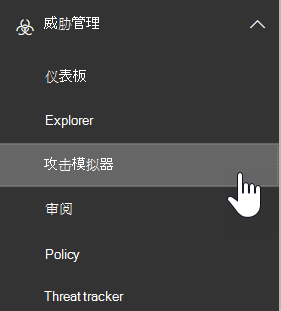

# ATP 中的攻击模拟器

**摘要**如果您是全局管理员或安全管理员，并且您的组织具有 Office 365 高级威胁防护计划2（其中包括[威胁调查和响应功能](office-365-ti.md)），则可以使用攻击模拟器在组织中运行实际的攻击方案。 这可以帮助你在实际攻击影响你的底线之前识别并找出易受攻击的用户。 阅读本文以了解详细信息。

## 开始前，有必要了解什么？

- 若要打开安全与合规中心，请转到 <https://protection.office.com/>。 攻击模拟器在**威胁管理** \> **攻击模拟器**中可用。

  

- 有关跨不同 Microsoft 365 订阅的攻击模拟器的可用性的详细信息，请参阅[Office 365 高级威胁防护服务说明](https://docs.microsoft.com/office365/servicedescriptions/office-365-advanced-threat-protection-service-description)。

- 您必须是 "**组织管理**" 或 "**安全管理员**" 角色组的成员。 若要详细了解安全与合规中心内的角色组，请参阅[安全与合规中心内的权限](permissions-in-the-security-and-compliance-center.md)。

- 您的帐户需要配置用于多重身份验证（MFA），以在攻击模拟器中创建和管理市场活动。 有关说明，请参阅[设置多因素身份验证](https://docs.microsoft.com/microsoft-365/admin/security-and-compliance/set-up-multi-factor-authentication)。

为成功启动攻击，请确保用于运行模拟攻击的帐户使用多重身份验证。 此外，您必须是全局管理员或安全管理员。 （若要了解有关角色和权限的详细信息，请参阅[安全性 & 合规性中心中的权限](permissions-in-the-security-and-compliance-center.md)。）

- 网络钓鱼活动将收集和处理30天的事件。 在你启动市场活动后，历史宣传活动数据将在最长90天内可用。

- 没有对应的 PowerShell cmdlet 用于攻击模拟器。

## Spear 仿冒活动

*仿冒*是电子邮件攻击的一般性术语，试图窃取看似合法或受信任发件人的邮件中的敏感信息。 *Spear 仿冒*是一种目标网络钓鱼攻击，它使用专门为目标收件人（通常是攻击者在收件人上的侦测之后）量身定制的重点和自定义内容。

- 您是全局管理员或安全管理员

在攻击模拟器中，可以使用两种不同类型的 spear 网络钓鱼活动：

- [多因素身份验证/条件访问](https://docs.microsoft.com/microsoft-365/admin/security-and-compliance/set-up-multi-factor-authentication)已打开，至少为全局管理员帐户和将使用攻击模拟器的安全管理员。 （理想情况下，为组织中的所有用户启用多重身份验证/条件访问。）

  - 一个说明这只是一个测试的默认页面，并提供了有关识别网络钓鱼邮件的提示。

    

  - 您指定的自定义页面（URL）。

- **Spear 网络钓鱼（附件）**：攻击试图说服收件人在邮件中打开 .docx 或 .pdf 附件。 附件包含来自默认仿冒链接的相同内容，但第一句以 "" \<Display Name\> ，您将看到此邮件是您打开的最近的电子邮件 ... "。

> [!NOTE]
> 目前，攻击模拟器中的 spear 网络钓鱼活动不会过期。

### 创建 spear 网络钓鱼活动

任何 spear 仿冒活动的一个重要部分是发送给目标收件人的电子邮件的外观和感觉。 若要创建和配置电子邮件，您可以选择以下选项：

- **使用内置电子邮件模板**：提供了两个内置模板：**奖品 Giveaway**和**工资更新**。 创建和启动市场活动时，可以进一步自定义模板中的部分、全部或无电子邮件属性。

- **创建可重用的电子邮件模板**：创建并保存电子邮件模板之后，可以在将来的 spear 仿冒活动中再次使用它。 创建和启动市场活动时，可以进一步自定义模板中的部分、全部或无电子邮件属性。

- **在向导中创建电子**邮件：创建和启动 spear 仿冒活动时，可以在向导中直接创建电子邮件。

#### 步骤1（可选）：创建自定义电子邮件模板

如果要使用内置模板之一或直接在向导中创建电子邮件，则可以跳过此步骤。

1. 在安全 & 合规性中心中，转到 "**威胁管理** \> **攻击模拟器**"。

2. 在 "**模拟攻击**" 页上的 " **Spear 仿冒（凭据收集）** " 或 " **Spear 仿冒（附件）** " 部分，单击 "**攻击详细信息**"。

   在何处创建模板无关紧要。 对于这两种类型的网络钓鱼攻击，模板中的可用选项都是相同的。

3. 在打开的 "**攻击详细信息**" 页上的 "**仿冒模板**" 部分的 "**创建模板**" 区域中，单击 "**新建模板**"。

4. "**配置仿冒模板**向导" 将在新的浮出控件中启动。 在 "**开始**" 步骤中，为模板输入一个唯一的显示名称，然后单击 "**下一步**"。

5. 在 "**配置电子邮件详细信息**" 步骤中，配置以下设置：

   - **From （Name）**：用于邮件发件人的显示名称。

   - 发件人 **（电子邮件）**：发件人的电子邮件地址。

   - **网络钓鱼登录服务器 URL**：单击下拉列表，并从列表中选择一个可用的 url。 这是用户将被引诱单击的 URL。 ）这三个选项包括：

     - <http://portal.docdeliveryapp.com>
     - <http://portal.docdeliveryapp.net>
     - <http://portal.docstoreinternal.com>
     - <http://portal.docstoreinternal.net>
     - <http://portal.hardwarecheck.net>
     - <http://portal.hrsupportint.com>
     - <http://portal.payrolltooling.com>
     - <http://portal.payrolltooling.net>
     - <http://portal.prizegiveaway.net>
     - <http://portal.prizesforall.com>
     - <http://portal.salarytoolint.com>
     - <http://portal.salarytoolint.net>

     > [!NOTE]
     > <ul><li>所有 Url 都是有意的 http，而不是 https。</li><li>URL 信誉服务可能会将这些 Url 中的一个或多个标识为不安全。 在网络仿冒活动中使用 URL 之前，请先检查受支持的 web 浏览器中的 URL 是否可用。</li></ul>

   - **自定义登陆页面 URL**：输入用户在单击 "仿冒" 链接并输入其凭据时使用的可选登录页。 此链接将替换默认登录页。 例如，如果您有内部意识培训，则可以在此指定 URL。

   - **类别**：当前未使用此设置（输入的任何内容都将被忽略）。

   - **主题**：电子邮件的 "**主题**" 字段。

   完成后，单击“下一步”****。

6. 在 "**撰写电子邮件**" 步骤中，创建电子邮件的邮件正文。 您可以使用 "**电子邮件**" 选项卡（丰富的 html 编辑器）或 "**源**" 选项卡（原始 HTML 代码）。

   HTML 格式可以简单，也可以复杂，因为您需要它。 您可以插入图像和文本，以增强收件人的电子邮件客户端中邮件的 believability。

   - `${username}`插入收件人的姓名。

   - `${loginserverurl}`插入上一步中的**网络钓鱼登录服务器 URL**值。

   完成后，单击“下一步”****。

7. 在 "**确认**" 步骤中，单击 "**完成**"。

#### 步骤2：创建和启动 spear 仿冒活动

1. 在安全 & 合规性中心中，转到 "**威胁管理** \> **攻击模拟器**"。

2. 在 "**模拟攻击**" 页面上，根据您要创建的市场活动类型，进行下列选择之一：

   - 在 " **Spear 仿冒（凭据收集）** " 部分，单击 "**启动攻击**" 或单击 "**攻击详细信息** \> **启动攻击**"。

   - 在 " **Spear 仿冒（附件）** " 部分，单击 "**启动攻击**" 或单击 "**攻击详细信息** \> **启动攻击**"。

3. "**配置网络钓鱼攻击**向导" 将在新的浮出控件中启动。 在 "**开始**" 步骤中，执行下列步骤之一：

   - 在 "**名称**" 框中，为市场活动输入唯一的显示名称。 不要单击 "**使用模板**"，因为稍后将在向导中创建电子邮件。

   - 单击 "**使用模板**"，然后选择一个内置或自定义电子邮件模板。 选择模板后，将根据模板自动填充 "**名称**" 框，但您可以更改名称。

   

   完成后，单击“下一步”****。

4. 在 "**目标收件人**" 步骤中，执行下列步骤之一：

   - 单击 "**通讯簿**" 选择市场活动的收件人（用户或组）。 每个目标收件人都必须有一个 Exchange Online 邮箱。 如果在未输入搜索条件的情况下单击 "**筛选**和**应用**"，则将返回所有收件人并将其添加到市场活动中。

   - 单击 "**导**入"，然后单击 "**文件导**入" 以导入逗号分隔值（CSV）或电子邮件地址的行分隔文件。 每行必须包含收件人的电子邮件地址。

   完成后，单击“下一步”****。

5. 在 "**配置电子邮件详细信息**" 步骤中，配置以下设置：

   如果您在 "**开始**" 步骤中选择了一个模板，则这些值中的大多数已配置，但您可以对其进行更改。

   - **From （Name）**：用于邮件发件人的显示名称。

   - 发件人 **（电子邮件）**：发件人的电子邮件地址。 您可以输入组织的电子邮件域中的真实或虚假电子邮件地址，也可以输入真实或虚假的外部电子邮件地址。 组织中的有效发件人电子邮件地址将在收件人的电子邮件客户端中实际解析。

   - **网络钓鱼登录服务器 URL**：单击下拉列表，并从列表中选择一个可用的 url。 这是用户将被引诱单击的 URL。 ）这三个选项包括：

     - <http://portal.docdeliveryapp.com>
     - <http://portal.docdeliveryapp.net>
     - <http://portal.docstoreinternal.com>
     - <http://portal.docstoreinternal.net>
     - <http://portal.hardwarecheck.net>
     - <http://portal.hrsupportint.com>
     - <http://portal.payrolltooling.com>
     - <http://portal.payrolltooling.net>
     - <http://portal.prizegiveaway.net>
     - <http://portal.prizesforall.com>
     - <http://portal.salarytoolint.com>
     - <http://portal.salarytoolint.net>

     > [!NOTE]
     > <ul><li>所有 Url 都是有意的 http，而不是 https。</li><li>URL 信誉服务可能会将这些 Url 中的一个或多个标识为不安全。 在网络仿冒活动中使用 URL 之前，请先检查受支持的 web 浏览器中的 URL 是否可用。</li><li>您需要选择一个 URL。 对于<b>Spear 仿冒（附件）</b>市场活动，您可以在下一步中删除邮件正文中的链接（否则，邮件将同时包含链接<b>和</b>附件）。</li></ul>

   - **附件类型**：此设置仅在**Spear 仿冒（附件）** 市场活动中可用。 单击下拉箭头，然后选择 "" **。.DOCX**或 **。PDF**中的列表。

   - **附件名称**：此设置仅在**Spear 仿冒（附件）** 市场活动中可用。 输入 .docx 或 .pdf 附件的文件名。

   - **自定义登陆页面 URL**：输入用户在单击 "仿冒" 链接并输入其凭据时使用的可选登录页。 此链接将替换默认登录页。 例如，如果您有内部意识培训，则可以在此指定 URL。

   - **主题**：电子邮件的 "**主题**" 字段。

   完成后，单击“下一步”****。

6. 在 "**撰写电子邮件**" 步骤中，创建电子邮件的邮件正文。 如果在 "**开始**" 步骤中选择了一个模板，则表示已配置邮件正文，但您可以对其进行自定义。 您可以使用 "**电子邮件**" 选项卡（丰富的 html 编辑器）或 "**源**" 选项卡（原始 HTML 代码）。

   HTML 格式可以简单，也可以复杂，因为您需要它。 您可以插入图像和文本，以增强收件人的电子邮件客户端中邮件的 believability。

   - `${username}`插入收件人的姓名。

   - `${loginserverurl}`插入**网络钓鱼登录服务器 URL**值。

   对于**Spear 仿冒（附件）** 市场活动，应删除邮件正文中的链接（否则，邮件将同时包含链接**和**附件，附件市场活动中不会跟踪链接单击）。

   

   完成后，单击“下一步”****。

7. 在 "**确认**" 步骤中，单击 "**完成**" 以启动市场活动。 将仿冒邮件传递给目标收件人。

## 密码攻击市场活动

*密码攻击*尝试猜测组织中的用户帐户的密码，通常是在攻击者标识了一个或多个有效的用户帐户之后。

在攻击模拟器中，可以使用两种不同类型的密码攻击活动来测试用户密码的复杂性：

- **强力密码（字典攻击）**：*强力*攻击或*字典*攻击在用户帐户上使用密码的大型字典文件，希望其中一个密码可以使用（针对一个帐户的多个密码）。 不正确的密码锁定帮助阻止强力密码攻击。

  对于字典攻击，可以指定要尝试的一个或多个密码（手动输入或在上载的文件中），并且可以指定一个或多个用户。

- **密码喷涂攻击**：*密码喷涂*攻击对用户帐户列表使用相同的仔细考虑密码（针对多个帐户使用一个密码）。 密码喷涂攻击比强力密码攻击更难检测（当攻击者在几十个或数百个帐户之间尝试一个密码，而不会导致用户不正确的密码锁定的风险时，成功的概率也会增加。

  对于密码喷涂攻击，只能指定一个密码进行尝试，并且您可以指定一个或多个用户。

> [!NOTE]
> 攻击模拟器中的密码攻击会将用户名和密码的基本身份验证请求传递给终结点，以便它们也适用于其他身份验证方法（AD FS、密码哈希同步、传递、PingFederate 等）。 对于启用了 MFA 的用户（即使密码攻击尝试其实际密码），尝试将始终注册为失败（换句话说，MFA 用户永远不会出现在市场活动的**成功尝试**计数中）。 这是预期的结果。 MFA 是一种帮助防止密码攻击的主要方法。

### 创建和启动密码攻击市场活动

1. 在安全 & 合规性中心中，转到 "**威胁管理** \> **攻击模拟器**"。

2. 在 "**模拟攻击**" 页面上，根据您要创建的市场活动类型，进行下列选择之一：

   - 在**强力密码（字典攻击）** 部分，单击 "**启动攻击**" 或单击 "**攻击详细信息** \> **启动攻击**"。

   - 在 "**密码喷涂攻击**" 部分，单击 "**启动攻击**" 或单击 "**攻击详细信息** \> **启动攻击**"。

3. "**配置密码攻击**向导" 将在新的浮出控件中启动。 在 "**开始**" 步骤中，为市场活动输入一个唯一的显示名称，然后单击 "**下一步**"。

4. 在 "**目标用户**" 步骤中，执行下列步骤之一：

   - 单击 "**通讯簿**" 选择市场活动的收件人（用户或组）。 每个目标收件人都必须有一个 Exchange Online 邮箱。 如果在未输入搜索条件的情况下单击 "**筛选**和**应用**"，则将返回所有收件人并将其添加到市场活动中。

   - 单击 "**导**入"，然后单击 "**文件导**入" 以导入逗号分隔值（CSV）或电子邮件地址的行分隔文件。 每行必须包含收件人的电子邮件地址。

   完成后，单击“下一步”****。

5. 在 "**选择攻击设置**" 步骤中，选择要基于市场活动类型执行的操作：

   - **强力密码（字典攻击）**：执行以下任一步骤：

     - **手动输入密码**：在**按 enter 以添加密码**框中，键入一个密码，然后按 enter 键。 根据需要重复执行此步骤（次数不限）。

     - **上载字典文件中的密码**：单击 "**上传**" 以导入每行包含一个密码的现有文本文件和一个空白的最后一行。 文本文件的大小必须为 10 MB 或更小，并且不能包含超过30000个密码。

   - **密码喷涂攻击**：在 "**攻击中使用的密码**" 框中，输入一个密码。

   完成后，单击“下一步”****。

6. 在 "**确认**" 步骤中，单击 "**完成**" 以启动市场活动。 您指定的密码将尝试您指定的用户。

## 查看市场活动结果

启动市场活动后，可以在 "主**模拟攻击**" 页上查看进度和结果。

活动的市场活动将显示状态栏、已完成的百分比值和 "（全部用户的用户）" 的计数。 单击 "**刷新**" 按钮将更新任何活动活动的进度。 您还可以单击 "**终止**" 以停止活动的市场活动。

在市场活动完成后，状态将更改为 "**已完成攻击**"。 您可以通过执行以下任一操作来查看市场活动的结果：

- 在 "主**模拟攻击**" 页面上，单击市场活动名称下的 "**查看报告**"。

- 在 "主**模拟攻击**" 页面上，单击攻击类型部分中的 "**攻击详细信息**"。 在打开的 "**攻击详细信息**" 页上，选择 "**攻击历史记录**" 部分中的 "活动"。

上述任一操作都将转到名为 "**攻击详细信息**" 的页面。 以下各节介绍了在此页面上为每种类型的市场活动提供的信息。

### Spear 网络钓鱼（凭据收集）市场活动结果

以下信息在每个市场活动的 "**攻击详细信息**" 页上提供：

- 市场活动的持续时间（开始日期/时间和结束日期/时间）。

- **目标的用户总数**

- **成功的尝试**：单击链接的用户数 **，并**输入其凭据（*任何*用户名和密码值）。

- **总体成功率**：由**成功尝试**的  /  **用户的目标总数**计算所得的百分比。

- **最快的点击**次数：启动市场活动后，第一个用户单击链接所需的时间。

- **平均单击**次数：每个人单击链接所花的时间除以单击链接的用户数。

- **单击 "成功率**：计算人" （单击链接的用户数）/**目标的用户总数**的百分比。

- **最快的凭据**：在启动市场活动后，第一个用户输入其凭据所需的时间。

- **平均凭据**：每个人输入其凭据所花的时间除以输入其凭据的用户数量的总和。

- **凭据成功率**：计算的百分比（输入其凭据的用户数）/**目标的用户总数**。

- 显示**链接已单击**的条形图，以及**凭据**每日提供的数字。

- 显示**链接已单击**、**提供凭据**和**无**市场活动百分比的圆形图。

- "已**损坏的用户**" 部分列出了单击该链接的用户的详细信息：

  - 用户的电子邮件地址

  - 单击链接时的日期/时间。

  - 客户端 IP 地址。

  - 有关用户的 Windows 和 web 浏览器的版本的详细信息。

  您可以单击 "**导出**" 将结果导出到 CSV 文件中。

### Spear 仿冒（附件）市场活动结果

以下信息在每个市场活动的 "**攻击详细信息**" 页上提供：

- 市场活动的持续时间（开始日期/时间和结束日期/时间）。

- **目标的用户总数**

- **成功的尝试**：打开或下载并打开附件的用户数（预览不计数）。

- **总体成功率**：由**成功尝试**的  /  **用户的目标总数**计算所得的百分比。

- **最快的附件打开时间**：启动市场活动后，首个用户打开附件所需的时间。

- **平均附件打开时间**：每个人打开附件所花的时间除以打开附件的用户数。

- **附件打开成功比率**：计算的百分比（打开附件的用户数）/**目标的用户总数**。

### 强力密码（字典攻击）市场活动结果

以下信息在每个市场活动的 "**攻击详细信息**" 页上提供：

- 市场活动的持续时间（开始日期/时间和结束日期/时间）。

- **目标的用户总数**

- **成功的尝试**：找到的使用指定密码之一的用户数。

- **总体成功率**：由**成功尝试**的  /  **用户的目标总数**计算所得的百分比。

- "已**损坏的用户**" 部分列出了受影响的用户的电子邮件地址。 您可以单击 "**导出**" 将结果导出到 CSV 文件中。

### 密码喷涂攻击活动结果

以下信息在每个市场活动的 "**攻击详细信息**" 页上提供：

- 市场活动的持续时间（开始日期/时间和结束日期/时间）。

- **目标的用户总数**

- **成功的尝试**：找到的使用指定密码的用户数量。

- **总体成功率**：由**成功尝试**的  /  **用户的目标总数**计算所得的百分比。
