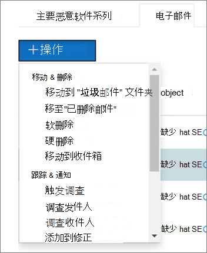

# Microsoft Defender for Office 365

[!INCLUDE [Microsoft 365 Defender rebranding](../includes/microsoft-defender-for-office.md)]

**适用对象**
- [适用于 Office 365 计划 2 的 Microsoft Defender](defender-for-office-365.md)
- [Microsoft 365 Defender](../defender/microsoft-365-defender.md)

触发安全警报时，由安全运营团队来调查这些警报，并采取措施来保护你的组织。 有时，安全运营团队可能会因触发的警报数量而感到不知所措。 Microsoft Defender for (AIR) 功能的自动调查和响应Office 365可以提供帮助。

AIR 使安全运营团队可以更高效地操作。 AIR 功能包括自动调查流程，以响应当今存在的已知威胁。 适当的修正操作等待审批，使安全运营团队能够响应检测到的威胁。

本文介绍 AIR 如何通过几个示例工作。 当你准备好开始使用 AIR 时，请参阅自动 [调查和响应威胁](office-365-air.md)。

- [示例 1：用户报告的网络钓鱼邮件启动调查手册](#example-a-user-reported-phish-message-launches-an-investigation-playbook)
- [示例 2：安全管理员从威胁资源管理器触发调查](#example-a-security-administrator-triggers-an-investigation-from-threat-explorer)
- [示例 3：安全运营团队使用管理活动 API 将 AIR 与 SIEM Office 365集成](#example-a-security-operations-team-integrates-air-with-their-siem-using-the-office-365-management-activity-api)

## 示例：用户报告的钓鱼邮件启动调查手册

假设你组织的用户收到一封电子邮件，他们会认为这是网络钓鱼尝试。 经过培训可报告此类邮件的用户使用报告邮件外接程序或报告网络钓鱼外接程序将其发送到 Microsoft进行分析。 提交也会发送到你的系统，并且显示在"提交"视图中的资源管理器中 (以前称为用户 **报告的视图**) 。 此外，用户报告的消息现在触发基于系统的信息警报，该警报将自动启动调查手册。

在根调查阶段，将评估电子邮件的各个方面。 这些方面包括：

- 确定它可能是哪种类型的威胁;
- Who发送它;
- 电子邮件从发送基础结构 (的) ;
- 电子邮件的其他实例是已送达还是被阻止;
- 来自分析员的评估;
- 电子邮件是否与任何已知市场活动相关联;
- 等。

根调查完成后，该操作手册会提供对原始电子邮件及其关联实体执行的建议操作列表。

接下来，执行多个威胁调查和搜寻步骤：

- 类似的电子邮件通过电子邮件群集搜索进行标识。
- 信号与其他平台（如 Microsoft Defender [for Endpoint）共享](/windows/security/threat-protection/microsoft-defender-atp/microsoft-defender-advanced-threat-protection)。
- 确定任何用户是否点击了可疑电子邮件中任何恶意链接。
- 在[Exchange Online Protection (EOP](exchange-online-protection-overview.md)) 和[microsoft Defender for Office 365) ](defender-for-office-365.md)中 (检查是否有用户报告的其他类似消息。
- 检查用户是否遭到入侵。 此检查利用跨 Office 365、Microsoft Cloud App Security 和Azure Active Directory 的信号，关联任何相关的用户活动异常。

在搜寻阶段，将风险和威胁分配给各种搜寻步骤。

修正是 Playbook 的最后阶段。 在此阶段中，将基于调查和搜寻阶段执行修正步骤。

## 示例：安全管理员从威胁资源管理器触发调查

除了由警报触发的自动调查之外，组织的安全运营团队还可以从威胁资源管理器 中的视图触发 [自动调查](threat-explorer.md)。  此调查还会创建警报，以便Microsoft 365 Defender事件和外部 SIEM 工具查看此调查已触发。

例如，假设您使用的是资源管理器 **中的"恶意软件** "视图。 使用图表下方的选项卡，选择" **电子邮件"** 选项卡。如果在列表中选择一个或多个项目，则 **+ 操作** 按钮将激活。

使用"**操作"** 菜单，可以选择"触发 **调查"。**

与警报触发的手册类似，从资源管理器中的视图触发的自动调查包括根调查、识别和关联威胁的步骤，以及缓解这些威胁的建议操作。

## 示例：安全运营团队使用 Office 365 活动 API 将 AIR 与 SIEM 集成

Microsoft Defender for Office 365 AIR 功能包括&[安全](air-view-investigation-results.md)运营团队可用于监视和解决威胁的报告和详细信息。 但您也可以将 AIR 功能与其他解决方案集成。 示例包括 SIEM (安全) 、案例管理系统或自定义报告解决方案。 这些类型的集成可以通过使用管理活动 API [Office 365实现](/office/office-365-management-api/office-365-management-activity-api-reference)。

例如，最近，组织为安全运营团队设置了一种方法，用于查看 AIR 已处理的用户报告的网络钓鱼警报。 他们的解决方案将相关警报与组织的 SIEM 服务器及其案例管理系统集成在一起。 该解决方案大大减少了误报数量，以便其安全运营团队可以将时间和精力集中在实际威胁上。 若要了解有关此自定义解决方案Community，请参阅[Tech Community 博客：使用 Microsoft Defender for Office 365 和 O365 管理 API](https://techcommunity.microsoft.com/t5/microsoft-security-and/improve-the-effectiveness-of-your-soc-with-office-365-atp-and/ba-p/1525185)提高 SOC 的有效性。

## 后续步骤

- [使用 AIR 入门](office-365-air.md)
- [查看挂起或已完成的修正操作](air-review-approve-pending-completed-actions.md)
