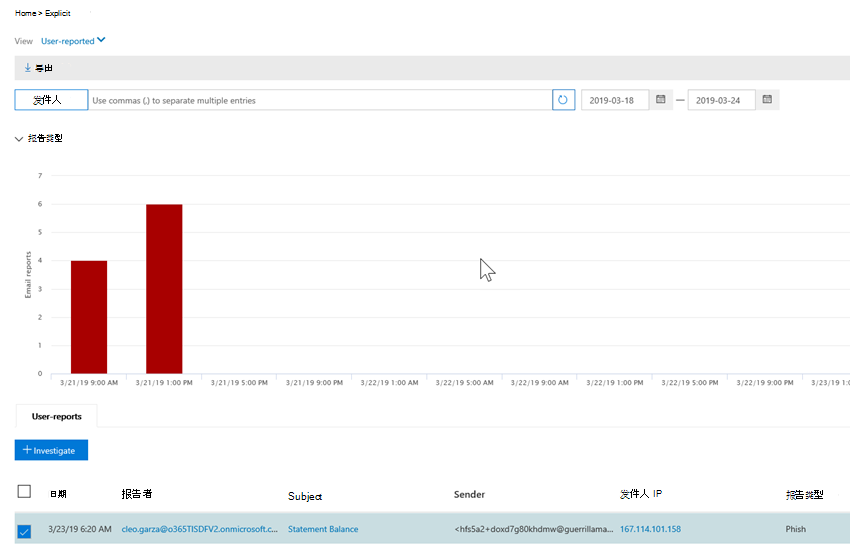

# Office 365 中的自动化调查和响应（空气）Automated investigation and response (AIR) in Office 365

随着安全警报的触发，安全操作团队可查看这些警报并采取措施来保护您的组织。As security alerts are triggered, it's up to your security operations team to look into those alerts and take steps to protect your organization. 有时，安全操作团队可能会受到触发的警报量的感觉的不知所措。Sometimes, security operations teams can feel overwhelmed by the volume of alerts that are triggered. Office 365 中的自动化调查和响应（空中）功能可以帮助。Automated investigation and response (AIR) capabilities in Office 365 can help. 通过 AIR，您的安全操作团队可以更高效地运行。AIR enables your security operations team to operate more efficiently and effectively. 空中功能包括自动调查过程，以响应目前存在的已知威胁。AIR capabilities include automated investigation processes in response to well known threats that exist today. 适当的补救措施等待批准，使安全操作团队能够响应检测到的威胁。Appropriate remediation actions await approval, enabling your security operations team to respond to detected threats. 

本文提供了空气及其组件的概述。This article provides an overview of AIR and its components. 当您准备好开始使用 AIR 时，请参阅在[Office 365 中自动调查和响应威胁](office-365-air.md)。When you're ready to get started using AIR, see [Automatically investigate and respond to threats in Office 365](office-365-air.md).

> [!TIP]
> 你的 Microsoft 365 E5 或 Microsoft 365 E3 是否具有身份和威胁防护？Do you have Microsoft 365 E5 or Microsoft 365 E3 together with Identity & Threat Protection? 考虑尝试使用 [Microsoft 威胁防护](../mtp/microsoft-threat-protection.md)。Consider trying [Microsoft Threat Protection](../mtp/microsoft-threat-protection.md).

## 高级别At a high level

随着警报的触发，安全行动手册将生效。As alerts are triggered, security playbooks go into effect. 根据具体情况，可以开始执行[自动调查过程](https://docs.microsoft.com/microsoft-365/security/office-365-security/office-365-air)。Depending on the situation, an [automated investigation process](https://docs.microsoft.com/microsoft-365/security/office-365-security/office-365-air) can begin. 在进行自动调查的过程中和之后，建议采取[补救措施](air-remediation-actions.md)。During and after an automated investigation, [remediation actions](air-remediation-actions.md) are recommended. 在 Office 365 高级威胁防护中不会自动执行任何操作。No actions are taken automatically in Office 365 Advanced Threat Protection. 您的安全操作团队将进行审核，然后[批准或拒绝每个更正操作](air-remediation-actions.md#approve-or-reject-pending-actions)，完成后，每个调查完成。Your security operations team reviews, and then [approves or rejects each remediation action](air-remediation-actions.md#approve-or-reject-pending-actions), and when this is done, each investigation completes. 所有这些活动都会在 Office 365 安全 & 合规性中心中进行跟踪和查看（请参阅[查看调查的详细信息](air-view-investigation-results.md#view-details-of-an-investigation)）。All of these activities are tracked and viewable in the Office 365 Security & Compliance Center (see [View details of an investigation](air-view-investigation-results.md#view-details-of-an-investigation)).

以下各节提供了有关警报、安全行动手册和操作中的示例的更多详细信息。The following sections provide more details about alerts, security playbooks, and examples of AIR in action.

## 警报Alerts

[警报](../../compliance/alert-policies.md#viewing-alerts)表示用于事件响应的安全操作团队工作流的触发器。[Alerts](../../compliance/alert-policies.md#viewing-alerts) represent triggers for security operations team workflows for incident response. 确定要调查的正确通知集的优先级，同时确保没有威胁是 unaddressed 的挑战。Prioritizing the right set of alerts for investigation, while making sure no threats are unaddressed is challenging. 在手动对通知进行调查时，安全操作团队必须在威胁的风险下对实体（如内容、设备和用户）进行寻找和关联。When investigations into alerts are performed manually, Security Operations teams must hunt and correlate entities (such as content, devices and users) at risk from threats. 此类任务和工作流可能非常耗时，并涉及多个工具和系统。Such tasks and workflows can be very time consuming and involve multiple tools and systems. 通过让关键安全和威胁管理警报自动触发安全响应行动手册，Office 365 安全事件的空中、调查和响应是自动化的。With AIR, investigation and response for Office 365 security events are automated by having key security and threat management alerts trigger security response playbooks automatically. 

目前，对于气流，从下列类型的警报策略生成的警报将自动调查：Currently for AIR, alerts generated from the following kinds of alert policies are auto-investigated:  

- 检测到潜在的恶意 URL 单击A potentially malicious URL click was detected
- 用户报告为网络钓鱼的电子邮件 \*Email reported by user as phish\*
- 包含在传递后删除的恶意软件的电子邮件 \*Email messages containing malware removed after delivery\*
- 包含在传递后删除的网络钓鱼 Url 的电子邮件 \*Email messages containing phish URLs removed after delivery\*
- 检测到可疑的电子邮件发送模式#Suspicious email sending patterns detected#
- 限制用户发送电子邮件#User restricted from sending email#

> [!NOTE]
> 以星号（*）标记的警报在安全 & 合规性中心（电子邮件通知已关闭）的相应警报策略中被分配了一个*信息性\*严重性。The alerts marked with an asterisk (\*) are assigned an *Informational* severity in the respective alert policies within the Security & Compliance Center, with email notifications turned off. 可以通过[报警策略配置](../../compliance/alert-policies.md#alert-policy-settings)启用电子邮件通知。Email notifications can be turned on through [Alert policy configuration](../../compliance/alert-policies.md#alert-policy-settings). 使用哈希（#）标记的警报通常是与公共预览版行动手册相关联的警报。Alerts marked with a hash (#) are generally available alerts associated with public preview playbooks.

若要查看警报，请在安全 & 合规性中心中，选择 "**通知** > " "**查看警报**"。To view alerts, in the Security & Compliance Center, choose **Alerts** > **View alerts**. 选择一个警报以查看其详细信息，然后在那里使用 "**查看调查**" 链接转到相应的[调查](air-view-investigation-results.md#investigation-graph)。Select an alert to view its details, and from there, use the **View investigation** link to go to the corresponding [investigation](air-view-investigation-results.md#investigation-graph).  

> [!NOTE]
> 默认情况下，通知视图中隐藏信息警报。Informational alerts are hidden in the alert view by default. 若要查看它们，请更改警报筛选以包含信息警报。To see them, change the alert filtering to include informational alerts.

如果您的组织通过警报管理系统、服务管理系统或安全信息和事件管理（SIEM）系统管理安全警报，则可以通过电子邮件通知或通过[Office 365 管理活动 API](https://docs.microsoft.com/office/office-365-management-api/office-365-management-activity-api-reference)将 Office 365 警报发送到该系统。If your organization manages your security alerts through an alert management system, service management system, or Security Information and Event Management (SIEM) system, you can send Office 365 alerts to that system via either email notification or via the [Office 365 Management Activity API](https://docs.microsoft.com/office/office-365-management-api/office-365-management-activity-api-reference). 通过电子邮件或 API 的调查通知通知包括访问安全 & 合规性中心中的警报的链接，使分配的安全管理员能够快速导航到调查。The investigation alert notifications via email or API include links to access the alerts in the Security & Compliance Center, enabling the assigned security administrator to navigate quickly to the investigation.

 

## 安全行动手册Security playbooks

安全行动手册是在 Office 高级威胁防护和 Microsoft 威胁防护中实现自动化的后端策略。Security playbooks are back-end policies that are at the heart of automation in Office Advanced Threat Protection and Microsoft Threat Protection. 空中提供的安全行动手册基于常见的实际安全方案，并根据安全操作团队的反馈进行开发。The security playbooks provided in AIR are based on common real-world security scenarios and developed based on feedback from Security Operations teams. 当您的组织中触发特定警报时，将自动启动安全行动手册。A security playbook is launched automatically when specific alerts are triggered within your organization. 通知触发后，相关的行动手册将由自动调查和响应（航空）系统运行。Once the alert triggers, the associated playbook is run by the Automated Investigation and Response (AIR) system. 调查根据特定警报的操作手册分析预警的步骤，查看所有关联的元数据（包括电子邮件、用户、主题、发件人等）。The investigation steps through analysis of the alert based on that particular alert's playbook, looking at all the associated metadata (including email messages, users, subjects, senders, etc.). 根据调查行动手册的发现，AIR 推荐了组织的安全团队可采取的一组操作来控制和缓解威胁。Based on the investigation playbook's findings, AIR recommends a set of actions that your organization's security team can take to control and mitigate the threat. 

你将使用空中获取的安全行动手册旨在解决组织在当今的电子邮件中遇到的最常见威胁。The security playbooks you'll get with AIR are designed to tackle the most frequent threats that organizations encounter today with email. 它们基于安全操作和事件响应团队的输入，包括帮助保护 Microsoft 和客户资产的人员。They're based on input from Security Operations and Incident Response teams, including those who help defend Microsoft and our customers' assets.

### 安全行动手册在几个阶段推出Security playbooks are rolling out in phases

作为空气的一部分，安全行动手册将分阶段推出。As part of AIR, security playbooks are rolling out in phases. 第1阶段现已推出，其中包含多个行动手册，这些操作提供了安全管理员可以查看和批准的操作建议：Phase 1 is now generally available and includes several playbooks that provide recommendations for actions that security administrators can review and approve:
- 用户报告的网络钓鱼邮件User-reported phish message
- URL 单击 "判定更改"URL click verdict change
- 恶意软件检测到送达后（恶意软件 ZAP）Malware detected post-delivery (Malware ZAP)
- 网络钓鱼检测到传递后的 ZAP （网络钓鱼 ZAP）Phish detected post-delivery ZAP (Phish ZAP)

第1阶段还包括对管理员触发的电子邮件调查（使用[威胁资源管理器](threat-explorer.md)）的支持。Phase 1 also includes support for administrator triggered e-mail investigations (using [Threat Explorer](threat-explorer.md)).

第2阶段现在与**公共预览版**中的以下行动手册结合在一起，为操作和 aiding 安全管理员提供调查问题的建议：Phase 2 is now progress with the following playbooks in **public preview**, providing recommendations for actions and aiding security administrators in investigating issues:
- 用户报告为 "已损坏" （公用预览）User reported as compromised (public preview)

在完成后，将立即发布后续行动手册。Further playbooks will be released as they are completed. 访问[Microsoft 365 路线图](https://www.microsoft.com/microsoft-365/roadmap)以查看计划和即将推出的其他内容。Visit the [Microsoft 365 Roadmap](https://www.microsoft.com/microsoft-365/roadmap) to see what else is planned and coming soon.

### 行动手册包括调查和建议Playbooks include investigation and recommendations

在空中，每个安全行动手册包括：In AIR, each security playbook includes: 
- 对电子邮件实体（文件、Url、收件人、IP 地址等）的根调查a root investigation of an email's entities (files, URLs, recipients, IP addresses, etc.),
- 对组织收到的类似电子邮件的进一步搜寻further hunting for similar emails received by the organization 
- 确定并关联其他潜在威胁所需的步骤，以及steps taken to identify and correlate other potential threats, and 
- 建议的威胁补救措施。recommended threat remediation actions.

每个高级步骤都包含多个执行的子步骤，以提供对威胁的深入、详细和详尽的响应。Each high-level step includes a number of substeps that are executed to provide a deep, detailed, and exhaustive response to threats.

## 示例：用户报告的网络钓鱼邮件启动调查行动手册Example: A user-reported phish message launches an investigation playbook

当您的组织中的用户提交电子邮件并使用[outlook 或 Outlook Web App 的报告邮件加载项](enable-the-report-message-add-in.md)将其报告给 Microsoft 时，该报告也会发送到您的系统，并在用户报告的视图中显示在资源管理器中。When a user in your organization submits an email message and reports it to Microsoft by using the [Report Message add-in for Outlook or Outlook Web App](enable-the-report-message-add-in.md), the report is also sent to your system and is visible in Explorer in the User-reported view. 此用户报告的消息现在会触发基于系统的信息警报，这将自动启动调查行动手册。This user-reported message now triggers a system-based informational alert, which automatically launches the investigation playbook.

在根调查阶段，会评估电子邮件的各个方面。During the root investigation phase, various aspects of the email are assessed. 具体包括：These include:
- 确定它可能属于哪种类型的威胁;A determination about what type of threat it might be;
- 发件人数;Who sent it;
- 发送电子邮件的位置（发送基础结构）;Where the email was sent from (sending infrastructure);
- 是否已传递或阻止电子邮件的其他实例;Whether other instances of the email were delivered or blocked;
- 我们分析家中的一种评估;An assessment from our analysts;
- 电子邮件是否与任何已知的市场活动相关联;Whether the email is associated with any known campaigns;
- 等等。and more.

根调查完成后，行动手册提供了要对其关联的原始电子邮件和实体执行的建议操作的列表。After the root investigation is complete, the playbook provides a list of recommended actions to take on the original email and entities associated with it.
  
接下来，执行以下几个威胁调查和搜寻步骤：Next, several threat investigation and hunting steps are executed:

- 类似的电子邮件通过电子邮件群集搜索进行标识。Similar email messages are identified via email cluster searches.
- 该信号与其他平台（如[Microsoft DEFENDER ATP](https://docs.microsoft.com/windows/security/threat-protection/microsoft-defender-atp/microsoft-defender-advanced-threat-protection)）共享。The signal is shared with other platforms, such as [Microsoft Defender ATP](https://docs.microsoft.com/windows/security/threat-protection/microsoft-defender-atp/microsoft-defender-advanced-threat-protection).
- 确定是否有用户通过可疑电子邮件中的任何恶意链接单击过。A determination is made on whether any users have clicked through any malicious links in suspicious email messages.
- 跨 Office 365 Exchange Online Protection （[EOP](exchange-online-protection-eop.md)）和 Office 365 高级威胁防护（[ATP](office-365-atp.md)）执行检查以查看用户是否报告了任何其他类似的消息。A check is done across Office 365 Exchange Online Protection ([EOP](exchange-online-protection-eop.md)) and Office 365 Advanced Threat Protection ([ATP](office-365-atp.md)) to see if there are any other similar messages reported by users.
- 将执行检查以查看是否已泄露用户。A check is done to see if a user has been compromised. 此检查跨 Office 365、 [Microsoft 云应用安全性](https://docs.microsoft.com/cloud-app-security)和[Azure Active Directory](https://docs.microsoft.com/azure/active-directory)之间的信号，关联任何相关的用户活动异常。This check leverages signals across Office 365, [Microsoft Cloud App Security](https://docs.microsoft.com/cloud-app-security), and [Azure Active Directory](https://docs.microsoft.com/azure/active-directory), correlating any related user activity anomalies. 

在搜寻阶段，会为各种搜寻步骤分配风险和威胁。During the hunting phase, risks and threats are assigned to various hunting steps. 

修正是行动手册的最后阶段。Remediation is the final phase of the playbook. 在此阶段中，将根据调查和搜寻阶段采取补救措施。During this phase, remediation steps are taken, based on the investigation and hunting phases. 

## 示例：安全管理员触发来自威胁资源管理器的调查Example: A security administrator triggers an investigation from Threat Explorer

除了由警报触发的自动调查之外，组织的安全操作团队可以通过[威胁资源管理器](threat-explorer.md)中的视图触发自动调查。In addition to automatic investigations that are triggered by an alert, your organization's security operations team can trigger an automatic investigation from a view in [Threat Explorer](threat-explorer.md).

例如，假设您正在查看资源管理器中有关用户报告的消息的数据。For example, suppose that you are viewing data in Explorer about user-reported messages. 您可以在结果列表中选择一个项目，然后从 "操作" 菜单中单击 "**调查**" （假设您有相应的修正权限）。You can select an item in the list of results, and then click **Investigate** from the action menu (assuming you have appropriate remediation permissions).

作为另一个示例，假设您要查看检测为包含恶意软件的电子邮件的数据，并且有几封电子邮件被检测为包含恶意软件。As another example, suppose you are viewing data about email messages detected as containing malware, and there are several email messages detected as containing malware. 您可以选择 "**电子邮件**" 选项卡，选择一个或多个电子邮件，然后在 "**操作**" 菜单上选择 "**调查**"。You can select the **Email** tab, select one or more email messages, and then, on the **Actions** menu, select **Investigate**. 

与由警报触发的行动手册类似，通过资源管理器中的视图触发的自动调查包括根调查、标识和关联威胁的步骤以及缓解这些威胁的建议操作。Similar to playbooks triggered by an alert, automatic investigations that are triggered from a view in Explorer include a root investigation, steps to identify and correlate threats, and recommended actions to mitigate those threats.

## 后续步骤Next steps

- [开始使用 Office 365 中的 AIRGet started using AIR in Office 365](office-365-air.md)

- [访问 Microsoft 365 路线图以了解即将推出和推出的内容Visit the Microsoft 365 Roadmap to see what's coming soon and rolling out](https://www.microsoft.com/microsoft-365/roadmap?filters=)

