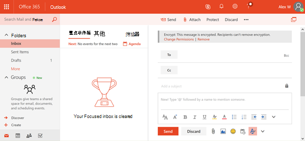

# <a name="protection-features-in-azure-information-protection-rolling-out-to-existing-tenants"></a><span data-ttu-id="0b32d-103">Azure 信息保护中的保护功能向现有租户推出</span><span class="sxs-lookup"><span data-stu-id="0b32d-103">Protection features in Azure Information Protection rolling out to existing tenants</span></span>

<span data-ttu-id="0b32d-104">为了帮助保护你的信息的初始步骤，从2018年7月起，所有 Azure 信息保护符合条件的租户在默认情况下将启用 Azure 信息保护中的保护功能。</span><span class="sxs-lookup"><span data-stu-id="0b32d-104">To help with the initial step in protecting your information, starting July 2018 all Azure Information Protection eligible tenants will have the protection features in Azure Information Protection turned on by default.</span></span> <span data-ttu-id="0b32d-105">Azure 信息保护中的保护功能以前在 Office 365 中称为 "权限管理" 或 "Azure RMS"。</span><span class="sxs-lookup"><span data-stu-id="0b32d-105">The protection features in Azure Information Protection were formerly known in Office 365 as Rights Management or Azure RMS.</span></span> <span data-ttu-id="0b32d-106">如果你的组织具有 Office E3 服务计划或更高的服务计划，你现在将通过 Azure 信息保护在我们推出这些功能时获取一个头开始保护信息。</span><span class="sxs-lookup"><span data-stu-id="0b32d-106">If your organization has an Office E3 service plan or a higher service plan you will now get a head start protecting information through Azure Information Protection when we roll out these features.</span></span>

## <a name="changes-beginning-july-1-2018"></a><span data-ttu-id="0b32d-107">2018年7月1日开始的更改</span><span class="sxs-lookup"><span data-stu-id="0b32d-107">Changes beginning July 1, 2018</span></span>

<span data-ttu-id="0b32d-108">从2018年6月1日起，Microsoft 将为具有以下订阅计划之一的所有组织启用 Azure 信息保护中的保护功能：</span><span class="sxs-lookup"><span data-stu-id="0b32d-108">Starting July 1, 2018, Microsoft will enable the protection capability in Azure Information Protection for all organizations with one of the following subscription plans:</span></span>

- <span data-ttu-id="0b32d-109">Office 365 邮件加密作为 Office 365 E3 和 E5、Microsoft E3 和 E5、Office 365 A1、A3 和 A5 以及 Office 365 G3 和 G5 的一部分提供。</span><span class="sxs-lookup"><span data-stu-id="0b32d-109">Office 365 Message Encryption is offered as part of Office 365 E3 and E5, Microsoft E3 and E5, Office 365 A1, A3, and A5, and Office 365 G3 and G5.</span></span> <span data-ttu-id="0b32d-110">您无需额外的许可证即可接收 Azure 信息保护支持的新保护功能。</span><span class="sxs-lookup"><span data-stu-id="0b32d-110">You do not need additional licenses to receive the new protection capabilities powered by Azure Information Protection.</span></span>

- <span data-ttu-id="0b32d-111">您还可以将 Azure 信息保护计划1添加到以下计划，以接收新的 Office 365 邮件加密功能： Exchange Online 计划1、Exchange Online 计划2、Office 365 F1、Microsoft 365 Business Basic、Microsoft 365 商业标准或 Office 365 Enterprise E1。</span><span class="sxs-lookup"><span data-stu-id="0b32d-111">You can also add Azure Information Protection Plan 1 to the following plans to receive the new Office 365 Message Encryption capabilities: Exchange Online Plan 1, Exchange Online Plan 2, Office 365 F1, Microsoft 365 Business Basic, Microsoft 365 Business Standard, or Office 365 Enterprise E1.</span></span>

- <span data-ttu-id="0b32d-112">每个用户从 Office 365 邮件加密中受益的人都需要获得功能的许可。</span><span class="sxs-lookup"><span data-stu-id="0b32d-112">Each user benefiting from Office 365 Message Encryption needs to be licensed to be covered by the feature.</span></span>

- <span data-ttu-id="0b32d-113">有关完整列表，请参阅[Exchange Online 服务说明](https://docs.microsoft.com/office365/servicedescriptions/exchange-online-service-description/exchange-online-service-description)For the Office 365 邮件加密。</span><span class="sxs-lookup"><span data-stu-id="0b32d-113">For the full list, see the [Exchange Online service descriptions](https://docs.microsoft.com/office365/servicedescriptions/exchange-online-service-description/exchange-online-service-description) for Office 365 Message Encryption.</span></span>

<span data-ttu-id="0b32d-114">租户管理员可以在 Office 365 管理员门户中检查保护状态。</span><span class="sxs-lookup"><span data-stu-id="0b32d-114">Tenant administrators can check the protection status in the Office 365 administrator portal.</span></span>


## <a name="why-are-we-making-this-change"></a><span data-ttu-id="0b32d-116">为什么要进行此更改？</span><span class="sxs-lookup"><span data-stu-id="0b32d-116">Why are we making this change?</span></span>

<span data-ttu-id="0b32d-117">Office 365 邮件加密利用了 Azure 信息保护中的保护功能。</span><span class="sxs-lookup"><span data-stu-id="0b32d-117">Office 365 Message Encryption leverages the protection capabilities in Azure Information Protection.</span></span> <span data-ttu-id="0b32d-118">在对 Office 365 邮件加密的最新改进以及我们对 Microsoft 365 中的信息保护的广泛投资的核心，我们将使组织能够更轻松地打开和使用我们的保护功能（就像以往一样，加密技术很难设置）。</span><span class="sxs-lookup"><span data-stu-id="0b32d-118">At the heart of the recent improvements to Office 365 Message Encryption and our broader investments to information protection in Microsoft 365, we are making it easier for organizations to turn on and use our protection capabilities, as historically, encryption technologies have been difficult to set up.</span></span> <span data-ttu-id="0b32d-119">通过在默认情况下启用 "Azure 信息保护" 中的保护功能，可以快速开始保护敏感数据。</span><span class="sxs-lookup"><span data-stu-id="0b32d-119">By turning on the protection features in Azure Information Protection by default, you can quickly get started to protect your sensitive data.</span></span>

## <a name="does-this-impact-me"></a><span data-ttu-id="0b32d-120">这会对我造成影响吗？</span><span class="sxs-lookup"><span data-stu-id="0b32d-120">Does this impact me?</span></span>

<span data-ttu-id="0b32d-121">如果你的组织已购买符合条件的 Office 365 许可证，则你的租户将受此更改影响。</span><span class="sxs-lookup"><span data-stu-id="0b32d-121">If your organization has purchased an eligible Office 365 license, then your tenant will be impacted by this change.</span></span>

 <span data-ttu-id="0b32d-122">**重要!**</span><span class="sxs-lookup"><span data-stu-id="0b32d-122">**IMPORTANT!**</span></span> <span data-ttu-id="0b32d-123">如果您使用的是本地环境中的 Active Directory 权限管理服务（AD RMS），则必须立即退出此更改或迁移到 Azure 信息保护，然后才能在接下来的30天内推出此更改。</span><span class="sxs-lookup"><span data-stu-id="0b32d-123">If you're using Active Directory Rights Management Services (AD RMS) in your on-premises environment, you must either opt-out of this change immediately or migrate to Azure Information Protection before we roll out this change within the next 30 days.</span></span> <span data-ttu-id="0b32d-124">有关如何选择退出的信息，请参阅 "我使用 AD RMS，如何选择退出？"</span><span class="sxs-lookup"><span data-stu-id="0b32d-124">For information on how to opt-out, see "I use AD RMS, how do I opt out?"</span></span> <span data-ttu-id="0b32d-125">”中所述的过程安装本地化文件。</span><span class="sxs-lookup"><span data-stu-id="0b32d-125">later in this article.</span></span> <span data-ttu-id="0b32d-126">如果你更喜欢迁移，请参阅[从 AD RMS 迁移到 Azure 信息保护。](https://docs.microsoft.com/azure/information-protection/plan-design/migrate-from-ad-rms-to-azure-rms)</span><span class="sxs-lookup"><span data-stu-id="0b32d-126">If you prefer to migrate, see [Migrating from AD RMS to Azure Information Protection.](https://docs.microsoft.com/azure/information-protection/plan-design/migrate-from-ad-rms-to-azure-rms)</span></span>

## <a name="can-i-use-azure-information-protection-with-active-directory-rights-management-services-ad-rms"></a><span data-ttu-id="0b32d-127">是否可以将 Azure 信息保护用于 Active Directory 权限管理服务（AD RMS）？</span><span class="sxs-lookup"><span data-stu-id="0b32d-127">Can I use Azure Information Protection with Active Directory Rights Management Services (AD RMS)?</span></span>

<span data-ttu-id="0b32d-128">否。</span><span class="sxs-lookup"><span data-stu-id="0b32d-128">No.</span></span> <span data-ttu-id="0b32d-129">这不是一种受支持的部署方案。</span><span class="sxs-lookup"><span data-stu-id="0b32d-129">This is not a supported deployment scenario.</span></span> <span data-ttu-id="0b32d-130">在不考虑其他自愿退出步骤的情况下，某些计算机可能会自动开始使用 Azure 权限管理服务，同时还会连接到 AD RMS 群集。</span><span class="sxs-lookup"><span data-stu-id="0b32d-130">Without taking the additional opt-out steps, some computers might automatically start using the Azure Rights Management service and also connect to your AD RMS cluster.</span></span> <span data-ttu-id="0b32d-131">此方案不受支持且具有不可靠的结果，因此，在接下来的30天内，在我们推出这些新功能之前，请务必选择退出此更改。</span><span class="sxs-lookup"><span data-stu-id="0b32d-131">This scenario isn't supported and has unreliable results, so it's important that you opt out of this change within the next 30 days before we roll out these new features.</span></span> <span data-ttu-id="0b32d-132">有关如何选择退出的信息，请参阅 "我使用 AD RMS，如何选择退出？"</span><span class="sxs-lookup"><span data-stu-id="0b32d-132">For information on how to opt-out, see "I use AD RMS, how do I opt out?"</span></span> <span data-ttu-id="0b32d-133">”中所述的过程安装本地化文件。</span><span class="sxs-lookup"><span data-stu-id="0b32d-133">later in this article.</span></span> <span data-ttu-id="0b32d-134">如果你更喜欢迁移，请参阅[从 AD RMS 迁移到 Azure 信息保护。](https://docs.microsoft.com/azure/information-protection/plan-design/migrate-from-ad-rms-to-azure-rms)</span><span class="sxs-lookup"><span data-stu-id="0b32d-134">If you prefer to migrate, see [Migrating from AD RMS to Azure Information Protection.](https://docs.microsoft.com/azure/information-protection/plan-design/migrate-from-ad-rms-to-azure-rms)</span></span>

## <a name="how-do-i-know-if-im-using-ad-rms"></a><span data-ttu-id="0b32d-135">如何知道我是否在使用 AD RMS？</span><span class="sxs-lookup"><span data-stu-id="0b32d-135">How do I know if I'm using AD RMS?</span></span>

<span data-ttu-id="0b32d-136">如果[你还具有 Active Directory 权限管理服务（AD rms）](https://docs.microsoft.com/azure/information-protection/deploy-use/prepare-environment-adrms)以检查是否已部署 AD rms，请按照以下说明，为 Azure 权限管理准备环境：</span><span class="sxs-lookup"><span data-stu-id="0b32d-136">Use these instructions from [Preparing the environment for Azure Rights Management when you also have Active Directory Rights Management Services (AD RMS)](https://docs.microsoft.com/azure/information-protection/deploy-use/prepare-environment-adrms) to check if you have deployed AD RMS:</span></span>

1. <span data-ttu-id="0b32d-137">虽然可选，但大多数 AD RMS 部署都会将服务连接点（SCP）发布到 Active Directory，以便域计算机能够发现 AD RMS 群集。</span><span class="sxs-lookup"><span data-stu-id="0b32d-137">Although optional, most AD RMS deployments publish the service connection point (SCP) to Active Directory so that domain computers can discover the AD RMS cluster.</span></span>

<span data-ttu-id="0b32d-138">使用 ADSI Edit 查看是否已在 Active Directory 中发布 SCP： CN = Configuration [server name]、CN = Services、CN = RightsManagementServices、CN = SCP</span><span class="sxs-lookup"><span data-stu-id="0b32d-138">Use ADSI Edit to see whether you have an SCP published in Active Directory: CN=Configuration [server name], CN=Services, CN=RightsManagementServices, CN=SCP</span></span>

2. <span data-ttu-id="0b32d-139">如果未使用 SCP，则必须使用 Windows 注册表为客户端服务发现或授权重定向配置连接到 AD RMS 群集的 Windows 计算机： HKEY_LOCAL_MACHINE \SOFTWARE\Microsoft\MSIPC\ServiceLocation 或 HKEY_LOCAL_MACHINE \SOFTWARE\Wow6432Node\Microsoft\MSIPC\ServiceLocation</span><span class="sxs-lookup"><span data-stu-id="0b32d-139">If you are not using an SCP, Windows computers that connect to an AD RMS cluster must be configured for client-side service discovery or licensing redirection by using the Windows registry: HKEY_LOCAL_MACHINE\SOFTWARE\Microsoft\MSIPC\ServiceLocation or HKEY_LOCAL_MACHINE\SOFTWARE\Wow6432Node\Microsoft\MSIPC\ServiceLocation</span></span>

<span data-ttu-id="0b32d-140">有关这些注册表配置的详细信息，请参阅使用 Windows 注册表和[重定向授权服务器流量](https://docs.microsoft.com/azure/information-protection/rms-client/client-deployment-notes#redirecting-licensing-server-traffic)[启用客户端服务发现](https://docs.microsoft.com/azure/information-protection/rms-client/client-deployment-notes#enabling-client-side-service-discovery-by-using-the-windows-registry)。</span><span class="sxs-lookup"><span data-stu-id="0b32d-140">For more information about these registry configurations, see [Enabling client-side service discovery by using the Windows registry](https://docs.microsoft.com/azure/information-protection/rms-client/client-deployment-notes#enabling-client-side-service-discovery-by-using-the-windows-registry) and [Redirecting licensing server traffic](https://docs.microsoft.com/azure/information-protection/rms-client/client-deployment-notes#redirecting-licensing-server-traffic).</span></span>

## <a name="i-use-ad-rms-how-do-i-opt-out"></a><span data-ttu-id="0b32d-141">我使用 AD RMS，如何选择退出？</span><span class="sxs-lookup"><span data-stu-id="0b32d-141">I use AD RMS, how do I opt out?</span></span>

<span data-ttu-id="0b32d-142">若要退出即将进行的更改，请完成以下步骤：</span><span class="sxs-lookup"><span data-stu-id="0b32d-142">To opt out of the upcoming change, complete these steps:</span></span>

1. <span data-ttu-id="0b32d-143">使用组织中具有全局管理员权限的工作或学校帐户，启动 Windows PowerShell 会话并连接到 Exchange Online。</span><span class="sxs-lookup"><span data-stu-id="0b32d-143">Using a work or school account that has global administrator permissions in your organization, start a Windows PowerShell session and connect to Exchange Online.</span></span> <span data-ttu-id="0b32d-144">有关说明，请参阅[连接 PowerShell Exchange Online](https://docs.microsoft.com/powershell/exchange/exchange-online/connect-to-exchange-online-powershell/connect-to-exchange-online-powershell)。</span><span class="sxs-lookup"><span data-stu-id="0b32d-144">For instructions, see [Connect to Exchange Online PowerShell](https://docs.microsoft.com/powershell/exchange/exchange-online/connect-to-exchange-online-powershell/connect-to-exchange-online-powershell).</span></span>

2. <span data-ttu-id="0b32d-145">使用以下语法运行 Get-irmconfiguration cmdlet：</span><span class="sxs-lookup"><span data-stu-id="0b32d-145">Run the Set-IRMConfiguration cmdlet using the following syntax:</span></span>

  ```powershell
  Set-IRMConfiguration -AutomaticServiceUpdateEnabled $false
  ```

## <a name="what-can-i-expect-after-this-change-has-been-made"></a><span data-ttu-id="0b32d-146">进行此更改后，我可以预期什么？</span><span class="sxs-lookup"><span data-stu-id="0b32d-146">What can I expect after this change has been made?</span></span>

<span data-ttu-id="0b32d-147">启用此功能后，如果你未选择，则可以开始使用[Microsoft Ignite 2017](https://techcommunity.microsoft.com/t5/Security-Privacy-and-Compliance/Email-Encryption-and-Rights-Protection/ba-p/110801)中宣布推出的新版本的 Office 365 邮件加密，并利用 Azure 信息保护的加密和保护功能。</span><span class="sxs-lookup"><span data-stu-id="0b32d-147">Once this is enabled, provided you haven't opted out, you can start using the new version of Office 365 Message Encryption which was announced at [Microsoft Ignite 2017](https://techcommunity.microsoft.com/t5/Security-Privacy-and-Compliance/Email-Encryption-and-Rights-Protection/ba-p/110801) and leverages the encryption and protection capabilities of Azure Information Protection.</span></span>



<span data-ttu-id="0b32d-149">有关新的增强功能的详细信息，请参阅[Office 365 邮件加密](../../compliance/ome.md)。</span><span class="sxs-lookup"><span data-stu-id="0b32d-149">For more information about the new enhancements, see [Office 365 Message Encryption](../../compliance/ome.md).</span></span>
