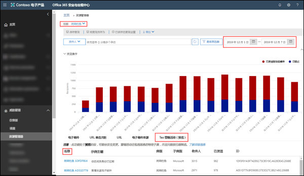
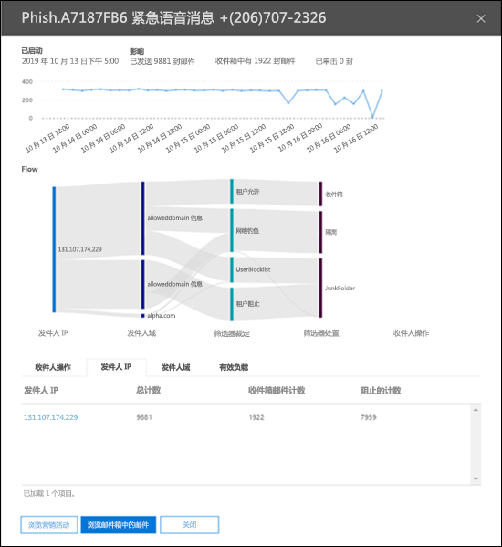
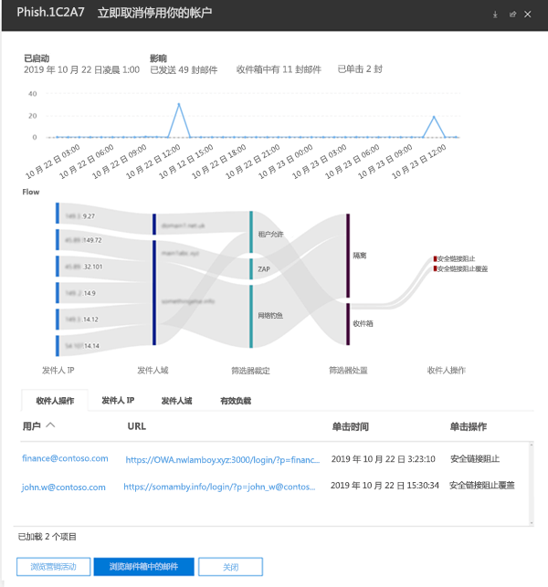

# Office 365 ATP 中的 Campaign ViewsCampaign Views in Office 365 ATP

> [!NOTE]
> 本主题中所述的功能目前处于预览阶段，可能会发生更改。The features described in this topic are currently in preview, and are subject to change.

Campaign Views 是 Office 365 安全与合规中心的高级威胁防护 (ATP) 中的一项功能，可以对服务中的钓鱼攻击进行识别和分类。Campaign Views is a feature in Advanced Threat Protection (ATP) in the Office 365 Security & Compliance Center that identifies and categorizes phishing attacks in the service. Campaign Views 可以帮助你：Campaign Views can help you to:

- 高效调查和应对钓鱼攻击。Efficiently investigate and respond to phishing attacks.

- 更好地了解攻击范围。Better understand the scope of the attack.

- 向决策者展示价值。Show value to decision makers.

借助 Campaign Views，可以让你比任何人都更快获得有关攻击的更全面概览。Campaign Views lets you see the big picture of an attack faster and more complete than any human.

## 什么是活动 (campaign)？What is a campaign?

活动是针对一个或多个组织的协同式电子邮件攻击。A campaign is a coordinated email attack against one or many organizations. 当今，窃取凭据和公司数据的电子邮件攻击是有利可图的大生意。Today, email attacks that steal credentials and company data are a big and lucrative business. 随着旨在阻止攻击的技术不断发展，攻击者为了确保获得持续的成功，已具备改进方法的丰富经验。As technologies increase in an effort to stop attacks, attackers are sophisticated enough to modify their methods in an effort to ensure continued success.

Microsoft 利用在整个 Office 365 服务领域中积累的广泛的反钓鱼、反垃圾邮件和反恶意软件数据和经验，以识别活动。Microsoft leverages the vast amounts of anti-phishing, anti-spam, and anti-malware data and experience across the entire Office 365 service world-wide to identify campaigns. 根据若干因素对攻击信息进行分析和分类。The attack information is analyzed and classified according to several factors. 例如：For example:

- **攻击来源**：源 IP 地址和发件人电子邮件域名。**Attack source**: Source IP addresses and sender email domains.

- **攻击邮件属性**：攻击邮件的内容、样式和语气。**Attack message properties**: The content, style, and tone of the attack messages.

- **攻击收件人**：收件人域名、收件人工作职能（管理员、高管等）、公司类型（大型、小型、公共、私有等）和行业。**Attack recipients**: Recipient domains, recipient job functions (admins, executives, etc.), company types (large, small, public, private, etc.), and industries.

- **攻击有效负载**：恶意链接、附件或其他有效负载。**Attack payload**: Malicious links, attachments, or other payloads.

## Campaign Views Office 365 安全与合规中心Campaign Views the Office 365 Security & Compliance Center

在[安全与合规中心](https://docs.microsoft.com/microsoft-365/compliance/go-to-the-securitycompliance-center)中的以下位置可获取 Campaign Views：Campaign Views is available in the [Security & Compliance Center](https://docs.microsoft.com/microsoft-365/compliance/go-to-the-securitycompliance-center) at the following locations:

- **威胁管理** \> **资源管理器** \> **查看** \> **钓鱼** \> **排名首位的活动（预览）****Threat management** \> **Explorer** \> **View** \> **Phish** \> **Top campaign (Preview)**

- **威胁管理** \> **资源管理器** \> **查看** \> **所有电子邮件** \> **排名首位的活动（预览）****Threat management** \> **Explorer** \> **View** \> **All email** \> **Top campaign (Preview)**

> [!TIP]
> 目前，唯一可用的筛选是日期范围。Currently, the only filtering that's available is the date range. 如果看不到任何活动数据，请尝试更改日期范围。If you don't see any campaign data, try changing the date range.

“概述”页面显示有关该活动的以下信息：The overview page shows the following information about the campaign:

- **名称****Name**

- **示例主题**：活动中某封邮件的主题行。**Sample subject**: The subject line of one of the messages in the campaign. 请注意，并非活动中的_所有_邮件都具有此相同的主题行。Note that _all_ the messages in the campaign will not necessarily have this same subject line.

- **类型**：当前，该值将始终是**钓鱼**。**Type**: Currently, this value will always be **Phish**.

- **子类型**：此活动中作为钓鱼对象的品牌。**Subtype**: Where available, the brand that is being phished by this campaign. 如果检测由 ATP 技术驱动，则会将前缀 **ATP** 添加到子类型值。When the detection is driven by ATP technology, the prefix **ATP-** is added to the subtype value.

- **收件人**：此活动所面向的用户数。**Recipients**: The number of users that were targeted by this campaign.

- **递送数量**：在收件箱中收到此活动发送的邮件的用户数量。**Delivered**: The number of users that received messages from this campaign into their Inbox.

- **ID**：活动的唯一标识符。**ID**: A unique identifier for the campaign.

单击活动的名称时，活动详细信息将显示在浮出控件中。When you click on the name of a campaign, the campaign details appears in a flyout.

## 活动详细信息Campaign details

“活动详细信息”视图中提供了有关活动的大量信息：In the campaign details view, a lot of information is available about the campaign:

- 活动信息：Campaign information:

  - **ID**：“概述”屏幕中活动的相同唯一标识符。**ID**: The same unique identifier of the campaign from the overview screen.

  - **开始时间**和**结束时间**：你选择的日期范围筛选器。**Started** and **Ended**: the date range filter you selected.

  - **影响**：你所选择的日期范围发送的邮件数量、收件箱中的邮件数量（即递送到收件箱的数量），以及单击钓鱼邮件中 URL 有效负载的用户数量。**Impact**: the number of messages sent in the date range you selected, how many were "inboxed" (that is, delivered to the Inbox), and how many users clicked on the URL payload in the phishing message.

  - 活动的时间线：活动的开始时间和结束时间以及随时间推移的邮件数量。A timeline of campaign activity: When the campaign started and ended, and the volume of messages over time.

### 活动流Campaign flow

关于活动的重要详细信息显示在**流程**部分中的水平流程图表（称为 _Sankey_ 图表）中。Important details about the campaign are presented in a horizontal flow diagram (known as a _Sankey_ diagram) in the **Flow** section. 这些详细信息将帮助你了解活动的元素和组织中的潜在影响。These details will help you to understand the elements of the campaign and the potential impact in your organization.

如果将鼠标悬停在图表中的水平带区上，则将看到相关邮件的数目（例如来自特定来源 IP 的邮件，使用指定发件人域名的来自来源 IP 的邮件等）。If you hover over a horizontal band in the diagram, you'll see the number of related messages (for example, messages from a particular source IP, messages from the source IP using the specified sender domain, etc.).

此图表包含以下信息：The diagram contains the following information:

- **发件人 IP****Sender IPs**

- **发件人域名****Sender domains**

- **筛选器裁定**：此处的值与[反垃圾邮件标头](anti-spam-message-headers.md)中所述的可用反钓鱼和反垃圾邮件筛选器裁定相关。**Filter verdicts**: The values here are related to the available anti-phishing and anti-spam filter verdicts as described in [Anti-spam message headers](anti-spam-message-headers.md). 有意思的是值 **Tenant Allow**，该值表示组织中已配置的设置允许该服务中阻止的邮件（例如，Allowed Senders 列表中的域名）。Of great interest here are the values **Tenant Allow**, which means a configured setting in the organization allowed a message through that would have been otherwise blocked by the service (for example, a domain in the Allowed Senders list).

  - **Tenant Block**：该值指示组织中的设置（例如 [Blocked Senders 列表](create-block-sender-lists-in-office-365.md)中的域名条目）已检测到邮件并确定其来源。**Tenant Block**: This value indicates that a setting in your organization (for example, a domain entry in the [Blocked Senders list](create-block-sender-lists-in-office-365.md)) both detected the message and determined where it was delivered. 对于未隔离的邮件，请查看阻止的发件人设置，以确定邮件送达的原因。For messages that weren't quarantined, review your blocked senders settings to determine why the message was delivered.

  - **已检测****Detected**

  - **Tenant Allow****Tenant Allow**

- **送达位置**：你希望调查发送到收件人的邮件（发送到收件箱或垃圾邮件文件夹），即使用户未单击邮件中的有效负载 URL。**Delivery locations**: You'll likely want to investigate messages that were actually delivered to recipients (either to the Inbox or the Junk Email folder), even if users didn't click on the payload URL in the message. 此外，还可以将已隔离的邮件从[ Office 365 中的隔离电子邮件](quarantine-email-messages.md)中删除。You can also remove the quarantined messages from [Quarantine email messages in Office 365](quarantine-email-messages.md).

  - **垃圾邮件文件夹****Junk folder**

  - **隔离****Quarantine**

  - **收件箱****Inbox**

#### URL 单击次数URL clicks

发送到收件人收件箱或垃圾邮件文件夹的邮件总有可能被用户执行操作（即用户将单击邮件中的恶意 URL）。There's always the chance that messages delivered to the recipient's Inbox or Junk Email folder can be acted upon by the user (that is, user will click on the malicious URL in the message). 如果用户没有单击，则表明成功率低，虽然你当然需要首先确定这些恶意邮件为什么会发送到他们的邮箱。If they haven't, that's a small measure of success, although you certainly need to determine why the harmful message was delivered to their mailbox in the first place.

如果用户单击了恶意 URL，则操作将显示在图表的 **URL 单击次数**区域。If a user has clicked on the malicious URL, the actions are displayed in the **URL clicks** area of the diagram.

- **Safe Links Block**：此值指示收件人单击了邮件上的有效负载 URL，但被组织中的 [ATP 安全链接](atp-safe-links.md)策略阻止。**Safe Links Block**: This value indicates the recipient clicked on the payload URL in the message, but it was blocked by the [ATP Safe Links](atp-safe-links.md) policies in your organization.

- **Safe Links Block Override**：此值还指示收件人单击了邮件中的有效负载 URL，ATP 安全链接尝试阻止，但这些 URL 被允许替代阻止。**Safe Links Block Override**: This value also indicates the recipient clicked on the payload URL in the message, ATP Safe Links tried to stop them, but they were allowed to override the block. 你需要调查[安全链接策略](set-up-atp-safe-links-policies.md)，了解为什么用户被允许替代安全链接裁定并单击恶意 URL。You need to investigate your [Safe Links policies](set-up-atp-safe-links-policies.md) to see why users are allowed to override the Safe Links verdict and click on malicious URLs.

### 选项卡Tabs

“活动详细信息”视图中有多个选项卡，可用于进一步调查活动。There are several tabs in the campaign details view that allow you to further investigate the campaign.

- **URL 单击次数**：如果钓鱼邮件中的有效负载 URL 未被单击，则该部分为空。**URL Clicks**: If the payload URL in the phishing message wasn't clicked, this section will be blank. 如果用户能够单击 URL，则If a user was able to click on the URL, you

  - **用户**\***User**\*

  - **URL**\***URL**\*

  - **单击时间****Click Time**

  - **单击操作****Click Action**

- **发件人 IP****Sender IPs**

  - **发件人 IP**\***Sender IP**\*

  - **总计数****Total Count**

  - **收件箱邮件计数****Inboxed Count**

  - **阻止的计数****Blocked Count**

  - **已通过 SPF****SPF Passed**

- **发件人****Senders**

  - **发件人****Sender**

  - **总计数****Total Count**

  - **收件箱邮件计数****Inboxed Count**

  - **阻止的计数****Blocked Count**

  - **已通过 DKIM****DKIM Passed**

  - **已通过 DMARC****DMARC Passed**

- **有效负载****Payloads**

  - **URL**\***URL**\*

  - **总计数****Total Count**

\* 单击此值将打开一个新浮出控件，其中包含有关“活动详细信息”视图顶部的指定项（用户、URL 等）的详细信息。\* Clicking on this value opens a new flyout that contains more details about the specified item (user, URL, etc.) on top of the campaign details view. 若要返回到“活动详细信息”视图，请单击新浮出控件中的“**完成**”。To return to the campaign details view, click **Done** in the new flyout.

### 按钮Buttons

通过“活动详细信息”视图中的按钮，可使用威胁资源管理器的强大功能进一步调查活动。The buttons in the campaign details view allow you to use the power of Threat Explorer to further investigate the campaign.

- **探索活动**：打开新的威胁资源管理器搜索选项卡，将**活动 ID** 值用作搜索筛选器。**Explore campaign**: Opens a new Threat Explorer search tab using the **Campaign ID** value as the search filter.

- **浏览收件箱邮件**：打开新的威胁资源管理器搜索选项卡，将**活动 ID **和**送达位置：收件箱**用作搜索筛选器。**Explore Inbox messages**: Opens a new Threat Explorer search tab using the **Campaign ID** and **Delivery location: Inbox** as the search filter.
