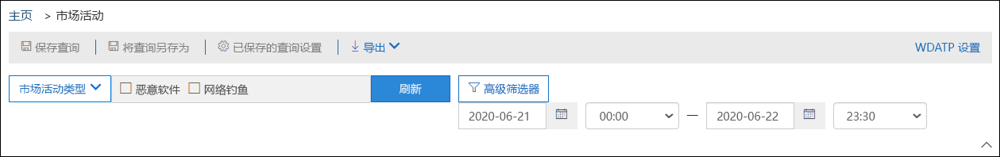
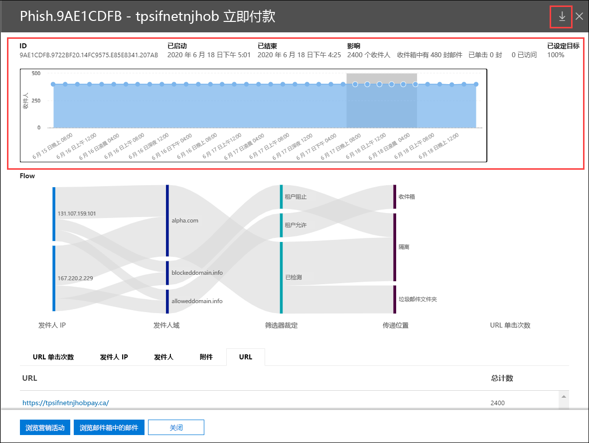
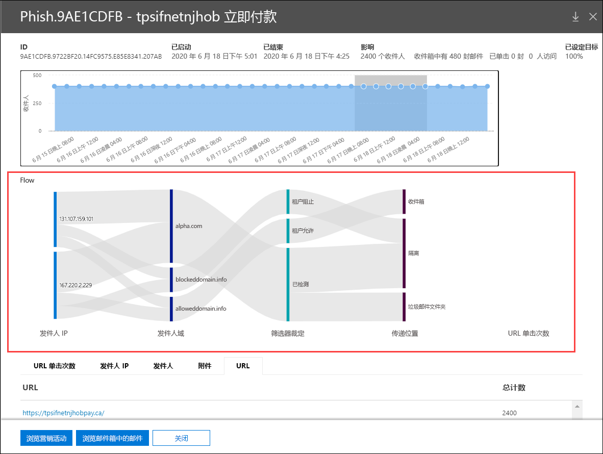

# Microsoft Defender for Office 365 中的市场活动视图

[!INCLUDE [Microsoft 365 Defender rebranding](../includes/microsoft-defender-for-office.md)]

市场活动视图是 Microsoft Defender for Office 365 计划 2 (例如 Microsoft 365 E5 或具有 Defender for Office 365 计划 2 加载项的组织中的一项) 。 安全与合规&中的活动视图可标识和分类服务中的网络钓鱼攻击。 Campaign Views 可以帮助你：

- 高效调查和应对钓鱼攻击。
- 更好地了解攻击范围。
- 向决策者展示价值。

借助 Campaign Views，可以让你比任何人都更快获得有关攻击的更全面概览。

## 什么是活动 (campaign)？

活动是针对一个或多个组织的协同式电子邮件攻击。 窃取凭据和公司数据的电子邮件攻击是一个规模较大且规模很大的行业。 随着技术不断加强，攻击者会修改其方法以确保持续成功。

Microsoft 利用整个服务中大量的反网络钓鱼、反垃圾邮件和反恶意软件数据来帮助识别活动。 我们根据若干因素分析和分类攻击信息。 例如：

- **攻击源**：源 IP 地址和发件人电子邮件域。
- **邮件属性**：邮件的内容、样式和语气。
- **邮件收件人**：收件人如何相关。 例如，收件人域、收件人工作职能 (管理员、主管人员等 ) 、公司类型 (大型、小型、公共、私有等 ) 和行业。
- **攻击负载**：邮件中的恶意链接、附件或其他有效负载。

市场活动可能是短期的，或者可能跨越几天、几周或几个月（包括活动期和非活动期）。 可能会针对你的特定组织启动市场活动，或者你的组织可能是跨多个公司的更大活动的一部分。

## 安全与合规中心&视图

活动视图在安全与合规 中心&**威胁管理** \> **活动，** 或直接位于 <https://protection.office.com/campaigns> 。

您还可以从：

- **威胁管理** \>**资源管理器** \>**视图** \>**市场活动**
- **威胁管理** \>**资源管理器** \>**视图** \>**所有电子邮件** \>**"市场活动"** 选项卡
- **威胁管理** \>**资源管理器** \>**视图** \>**网络钓鱼** \>**"市场活动"** 选项卡
- **威胁管理** \>**资源管理器** \>**视图** \>**恶意软件** \>**"市场活动"** 选项卡

若要访问活动视图，你需要是安全与合规中心内组织管理、安全管理员或安全读者&组的成员。  有关详细信息，请参阅[安全与合规中心中的权限](permissions-in-the-security-and-compliance-center.md)。

## 市场活动概述

概述页面显示有关所有市场活动的信息。

在默认 **"市场活动"** 选项卡上，" **市场活动** 类型"区域显示一个条形图，显示每天的收件人数。 默认情况下，此图同时显示 **网络钓鱼和****恶意软件** 数据。

> [!TIP]
> 如果看不到任何市场活动数据，请尝试更改日期范围或 [筛选器](#filters-and-settings)。

概述页面的其余部分在"市场活动"选项卡 **上显示以下信息** ：

- **名称**

- **示例主题**：活动中某封邮件的主题行。 请注意，活动的所有邮件不一定具有相同的主题。

- 目标 **：计算** 得出的百分比： (组织中) / (服务组织中所有组织的市场活动收件人总数) 。 此值指示市场活动仅定向到你的组织的程度 (该值) 该值与针对服务中其他组织的 (值) 。

- **类型**： **此值为钓鱼** 邮件或 **恶意软件**。

- **子类型**：此值包含有关市场活动的更多详细信息。 例如：
  - **网络钓鱼**：如果可用，则此市场活动所钓鱼的品牌。 例如 `Microsoft` ，、 `365` `Unknown` `Outlook` 或 `DocuSign` 。
  - **恶意软件**：例如， `HTML/PHISH` 或 `HTML/<MalwareFamilyName>` 。

  如果可用，则此市场活动所钓鱼的品牌。 当检测由 Defender for Office 365 技术驱动时，前缀 **ATP 将** 添加到子类型值。

- **收件人**：此活动所面向的用户数。

- **收件箱**：收件箱中收到来自此活动的邮件的用户数 ("垃圾邮件"文件夹) 。

- **单击**：单击 URL 或在网络钓鱼邮件中打开附件的用户数。

- **单击率**：由"单击的收件箱 **"计算**  /  **得出的** 百分比。 此值是活动有效性的指示器。 换句话说，如果收件人能够将邮件标识为网络钓鱼邮件，并且他们未单击有效负载 URL。

  请注意， **恶意软件** 市场活动中不会使用点击率。

- **已访问**：实际通过有效负载网站的用户数。 如果存在 **Clicked 值** ，但安全链接阻止访问网站，则此值将为零。

" **宣传活动源** "选项卡显示世界地图中的邮件源。

### 筛选器和设置

在"市场活动视图"页面顶部，有几个筛选器和查询设置可帮助你查找和隔离特定市场活动。

可以执行的最基本筛选是开始日期/时间和结束日期/时间。

若要进一步筛选视图，可以通过单击"市场活动类型"按钮，进行选择，然后单击"刷新"，对多个值进行单个属性 **筛选**。

以下列表介绍了"市场活动类型"按钮中可用的可筛选市场活动属性：

- **基本**：
  - **市场活动类型**：选择 **恶意软件** 或 **网络钓鱼**。 清除选定内容与同时选择两者的结果相同。
  - **市场活动名称**
  - **市场活动子类型**
  - **发件人**
  - **Recipients**
  - **发件人域**
  - **主题**
  - **附件的文件名**
  - **恶意软件系列**
  - **标记**：已应用指定用户标记的用户或 (包括优先级帐户) 。 有关用户标记详细信息，请参阅 [用户标记](user-tags.md)。
  - **系统替代**
  - **传递操作**
  - **其他操作**
  - **方向性**
  - **检测技术**
  - **原始传递位置**
  - **最新送达位置**
  - **系统替代**

- **高级**：
  - **Internet 邮件 ID：** 在邮件头的 **Message-ID** 头字段中可用。 示例值是 `<08f1e0f6806a47b4ac103961109ae6ef@server.domain>` (括号) 。
  - **网络邮件 ID：** 在邮件头的 **X-MS-Exchange-Organization-Network-Message-Id** 头字段中可用的 GUID 值。
  - **发件人 IP**
  - **附件 SHA256：** 若要在 Windows 中查找文件的 SHA256 哈希值，在命令提示符中运行以下 `certutil.exe -hashfile "<Path>\<Filename>" SHA256` 命令：
  - **群集 ID**
  - **警报策略 ID**
  - **ZAP URL 信号**

- **URL：**
  - **URL 域**
  - **URL 域和路径**
  - **URL**
  - **URL 路径**
  - **单击裁定**

对于更高级筛选（包括按多个属性进行筛选），可以单击 **"高级** 筛选"按钮生成查询。 可以使用相同的市场活动属性，但具有以下增强功能：

- 可以单击 **"添加条件"** 选择多个条件。
- 您可以在条件之间 **选择"And"** 或 **"Or"** 运算符。
- 您可以选择条件 **列表底部的条件** 组项以形成复杂的复合条件。

完成后，单击"查询 **"** 按钮。

创建基本或高级筛选器后，可以使用"保存查询"或"另存为 **"查询来保存它**。 稍后，返回到"市场活动视图"时，可以通过单击"保存的查询设置"加载 **保存的筛选器**。

若要导出图表或市场活动列表，请单击"导出"，然后选择"**导出图表数据**"或"**导出市场活动列表"。** 

如果你有 Microsoft Defender for Endpoint 订阅，可以单击 **"MDE** 设置"来连接或断开与 Microsoft Defender for Endpoint 的市场活动信息。 有关详细信息，请参阅将 [Microsoft Defender for Office 365 与 Microsoft Defender for Endpoint 集成](integrate-office-365-ti-with-wdatp.md)。

## 活动详细信息

单击某个市场活动的名称时，活动详细信息会显示在一个标注中。

### 市场活动信息

在市场活动详细信息视图的顶部，提供以下市场活动信息：

- **ID**：唯一市场活动标识符。

- **开始****和结束**：市场活动的开始日期和结束日期。 请注意，这些日期可能超出在概述页上选择的筛选日期。

- **影响**：此部分包含所选日期范围筛选器的以下 (或在日程表中选择的日期范围) ：
  - 收件人总数。
  - "收件箱"邮件数 (即传递到收件箱，而不是"垃圾邮件"文件夹) 。
  - 在网络钓鱼邮件中单击 URL 有效负载的用户数。
  - 有多少用户访问了 URL。

- 目标 **：计算** 得出的百分比： (组织中) / (服务组织中所有组织的市场活动收件人总数) 。 请注意，此值在活动的整个生命周期内计算，不会基于日期筛选器更改。

- 活动活动的交互式时间线：时间线显示活动在整个生命周期内的活动。 默认情况下，阴影区域包括你在概述中选择的日期范围筛选器。 可以单击并拖动以选择特定的起始点和终点，这将更改"影响"区域以及页面其余部分中显示的数据，如以下各节<u>中所述</u>。

在标题栏中，可以单击"下载市场活动写入"按钮"下载市场活动写入"图标，将市场活动详细信息下载到默认名为 (的  文档CampaignReport.docx) 。 请注意，下载包含整个活动生命周期的详细信息 (您所选的筛选日期) 。

### 活动流

在活动详细信息视图的中间，有关市场活动的重要详细信息在水平流程图的"流"部分 (称为 _Sankey_ 图表) 。 这些详细信息将帮助你了解活动的元素和组织中的潜在影响。

> [!TIP]
> 流图中显示的信息由日程表中的着色日期范围控制，如上一节中所述。

如果将鼠标悬停在图表中的水平带区上，则将看到相关邮件的数目（例如来自特定来源 IP 的邮件，使用指定发件人域名的来自来源 IP 的邮件等）。

此图表包含以下信息：

- **发件人 IP**
- **发件人域名**
- **筛选器裁定**： 裁定值与可用的网络钓鱼和垃圾邮件筛选裁定相关，如反垃圾邮件 [邮件头中所述](anti-spam-message-headers.md)。 下表介绍了可用值：

  ****

  |值|垃圾邮件筛选器裁定|说明|
  |---|---|---|
  |**允许**|`SFV:SKN` 
 `SFV:SKI`|在垃圾邮件筛选评估之前，邮件被标记为非垃圾邮件和/或跳过筛选。 例如，邮件流规则将邮件标记为非垃圾邮件 (也称为传输规则) 。 
 邮件由于其他原因跳过了垃圾邮件筛选。 例如，发件人和收件人似乎在同一个组织中。|
  |**已阻止**|`SFV:SKS`|在垃圾邮件筛选评估之前，邮件被标记为垃圾邮件。 例如，通过邮件流规则。|
  |**已检测**|`SFV:SPM`|邮件被垃圾邮件筛选标记为垃圾邮件。|
  |**未检测到**|`SFV:NSPM`|垃圾邮件筛选将邮件标记为非垃圾邮件。|
  |**已发布**|`SFV:SKQ`|邮件由于从隔离区中释放而跳过了垃圾邮件筛选。|
  |**租户允许**\*|`SFV:SKA`|邮件由于反垃圾邮件策略中的设置而跳过了垃圾邮件筛选。 例如，发件人在允许的发件人列表或允许的域列表中。|
  |**租户块**\*\*|`SFV:SKA`|邮件被垃圾邮件筛选阻止，因为反垃圾邮件策略中的设置。 例如，发件人在允许的发件人列表或允许的域列表中。|
  |**用户允许**\*|`SFV:SFE`|邮件跳过了垃圾邮件筛选，因为发件人位于用户的安全发件人列表中。|
  |**用户阻止**\*\*|`SFV:BLK`|邮件被垃圾邮件筛选阻止，因为发件人位于用户的"阻止的发件人"列表中。|
  |**ZAP**|不适用|[零时差自动清除 (ZAP) ](zero-hour-auto-purge.md) 将传递的邮件移动到"垃圾邮件"文件夹或隔离邮箱。 在反垃圾邮件策略中配置操作。|
  |

  \* 查看反垃圾邮件策略，因为允许的邮件可能已被服务阻止。

  \*\* 查看反垃圾邮件策略，因为这些邮件应隔离，而不是传递。

- 传递位置：你可能需要调查传递到收件人的邮件 (收件箱或垃圾邮件文件夹) ，即使用户未单击邮件中的有效负载 URL。 您还可以从隔离区中删除隔离邮件。 有关详细信息，请参阅 [EOP 中的隔离电子邮件](quarantine-email-messages.md)。
  - **已删除文件夹**
  - **已丢弃**
  - **外部**：收件人位于混合环境中本地电子邮件组织中。
  - **失败**
  - **转发**
  - **收件箱**
  - **垃圾邮件文件夹**
  - **隔离**
  - **Unknown**

- **URL 单击**：这些值在下一节中介绍。

> [!NOTE]
> 在包含 10 多个项目的所有层中，显示前 10 项，其余项目在"其他"中捆绑 **在一起**。

#### URL 单击次数

当网络钓鱼邮件传递到收件人的"收件箱"或"垃圾邮件"文件夹时，用户始终会单击有效负载 URL。 不单击 URL 是成功指标，但您需要确定网络钓鱼邮件甚至传递到邮箱的原因。

如果用户单击网络钓鱼邮件中的有效负载 URL，操作将显示在活动详细信息视图中图表的 **URL** 单击区域中。

- **允许**
- **BlockPage：** 收件人单击了有效负载 URL，但他们对恶意网站的访问被贵组织中安全 [链接](atp-safe-links.md) 策略阻止。
- **BlockPageOverride：** 收件人单击了邮件中的有效负载 URL，安全链接尝试阻止它们，但允许他们覆盖此块。 检查 [安全链接策略](set-up-atp-safe-links-policies.md) ，了解为什么允许用户替代安全链接裁定并继续访问恶意网站。
- **PendingDetonationPage：Microsoft** Defender for Office 365 中的安全附件正在打开和调查虚拟计算机环境中的有效负载 URL。
- **PendingDetonationPageOverride：** 允许收件人替代有效负载触发过程并打开 URL，而无需等待结果。

### 选项卡

市场活动详细信息视图中的选项卡允许你进一步调查市场活动。

> [!TIP]
> 选项卡上显示的信息由日程表中的阴影日期范围控制，如"市场活动信息" [部分](#campaign-information) 中所述。

- **URL 单击**：如果用户未在邮件中单击有效负载 URL，则此部分将为空。 如果用户能够单击 URL，将填充以下值：
  - **用户**\*
  - **URL**\*
  - **单击时间**
  - **单击裁定**

- **发件人 IP**
  - **发件人 IP**\*
  - **总计数**
  - **收件箱**
  - **未收件箱**
  - **SPF 通过**： 发件人策略框架和 [SPF (验证) 。](how-office-365-uses-spf-to-prevent-spoofing.md) 未通过 SPF 验证的发件人指示未经身份验证的发件人，或者邮件正在欺骗合法发件人。

- **发件人**
  - **发件人**：这是 SMTP MAIL FROM 命令中的实际发件人地址，不一定是用户在电子邮件客户端中看到的发件人：电子邮件地址。
  - **总计数**
  - **收件箱**
  - **未收件箱**
  - **DKIM 通过**： 发件人已通过 DKIM 身份验证的域密钥标识 [ (DKIM) 。](support-for-validation-of-dkim-signed-messages.md) 未通过 DKIM 验证的发件人指示未经身份验证的发件人，或者邮件正在欺骗合法发件人。
  - **DMARC 通过**： 发件人已通过基于域的邮件身份验证、 报告和一致性 ([DMARC) 。](use-dmarc-to-validate-email.md) 未通过 DMARC 验证的发件人指示未经身份验证的发件人，或者邮件正在欺骗合法发件人。

- **附件**
  - **Filename**
  - **SHA256**
  - **恶意软件系列**
  - **总计数**

- **URL**
  - **URL**\*
  - **总计数**

\* 单击此值将打开一个新浮出控件，其中包含有关“活动详细信息”视图顶部的指定项（用户、URL 等）的详细信息。 若要返回到“活动详细信息”视图，请单击新浮出控件中的“**完成**”。

### 按钮

通过“活动详细信息”视图中的按钮，可使用威胁资源管理器的强大功能进一步调查活动。

- **探索活动**：打开新的威胁资源管理器搜索选项卡，将 **活动 ID** 值用作搜索筛选器。
- **浏览收件箱邮件**：打开一个新的威胁资源管理器搜索选项卡，使用 **活动 ID** 和传递 **位置：收件箱** 作为搜索筛选器。
