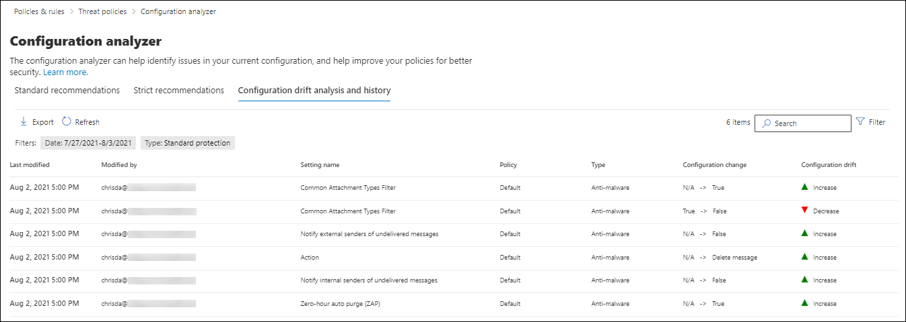

# EOP 和 Microsoft Defender for Office 365 中保护策略的配置分析器

[!INCLUDE [Microsoft 365 Defender rebranding](../includes/microsoft-defender-for-office.md)]

> [!NOTE]
> 本文中所述的功能为预览版，并非在所有组织中都可用，并且可能会更改。 有关发布计划的信息，请查看 [Microsoft 365 路线图](https://www.microsoft.com/microsoft-365/roadmap?filters=&searchterms=config%2Canalyzer)。

安全与合规中心&配置分析器提供了一个中心位置，用于查找和修复安全策略，其中设置低于预设安全策略中的标准保护和严格保护 [配置文件设置](preset-security-policies.md)。

配置分析器将分析以下类型的策略：

- **Exchange Online Protection (EOP)** 策略：这包括具有 Exchange Online 邮箱的 Microsoft 365 组织和没有 Exchange Online 邮箱的独立 EOP 组织：

  - [反垃圾邮件策略](configure-your-spam-filter-policies.md)。
  - [反恶意软件策略](configure-anti-malware-policies.md)。
  - [EOP 防钓鱼策略](set-up-anti-phishing-policies.md#spoof-settings)。

- **Microsoft Defender for Office 365 策略**：这包括具有 Microsoft 365 E5 或适用于 Office 365 的 Defender 附加订阅的组织：

  - Microsoft Defender for Office 365 中的防钓鱼策略，其中包括：

    - EOP [防钓鱼](set-up-anti-phishing-policies.md#spoof-settings) 策略中可用的相同欺骗设置。
    - [模拟设置](set-up-anti-phishing-policies.md#impersonation-settings-in-anti-phishing-policies-in-microsoft-defender-for-office-365)
    - [高级网络钓鱼阈值](set-up-anti-phishing-policies.md#advanced-phishing-thresholds-in-anti-phishing-policies-in-microsoft-defender-for-office-365)

  - [安全链接策略](set-up-atp-safe-links-policies.md)。

  - [安全附件策略](set-up-atp-safe-attachments-policies.md)。

用作 **基线** 的标准 **和严格** 策略设置值在 EOP 和 [Microsoft Defender for Office 365 安全的建议设置中进行了介绍](recommended-settings-for-eop-and-office365-atp.md)。

## 开始前，有必要了解什么？

- 安全与合规中心的打开网址为 <https://protection.office.com/>。 若要直接转到" **配置分析器"** 页，请使用 <https://protection.office.com/configurationAnalyzer> 。

- 若要连接到 Exchange Online PowerShell，请参阅[连接到 Exchange Online PowerShell](https://docs.microsoft.com/powershell/exchange/connect-to-exchange-online-powershell)。

- 必须分配有 Office 365 安全与合规中心内的权限，才能执行本文中的步骤：
  - 若要使用配置分析 **器** 并更新安全策略，你需要是组织管理或 **安全** 管理员角色组的成员。 
  - 若要对配置分析器进行只读访问，你需要是全局读者或安全读者 **角色组的成员**。 

  有关详细信息，请参阅 [安全与合规中心的权限](permissions-in-the-security-and-compliance-center.md)。

  **注意**：

  - 向 Microsoft 365 管理中心相应的 Azure 活动目录添加用户会向其提供安全与合规中心的必备权限 _以及_ Microsoft 365其它功能的权限。 有关详细信息，请参阅 [关于管理员角色](https://docs.microsoft.com/microsoft-365/admin/add-users/about-admin-roles)。
  - [Exchange Online](https://docs.microsoft.com/Exchange/permissions-exo/permissions-exo#role-groups) 中的 **仅查看组织管理人员** 角色组也提供到该功能的只读访问。

## 使用安全与合规中心&分析器

在安全&，转到 **"威胁管理** \> **策略** \> **配置"分析器**。

配置分析器有两个主要选项卡：

- **设置和建议**：选择"标准"或"严格"，并将这些设置与现有的安全策略进行比较。 在结果中，您可以调整设置的值，使它们达到与 Standard 或 Strict 相同的级别。

- **配置偏移分析和历史记录**：此视图允许你跟踪一段时间的策略更改。

### 配置分析器中的"设置和建议"选项卡

默认情况下，选项卡将在与标准保护配置文件进行比较时打开。 可以通过单击"查看严格"建议切换到严格保护 **配置文件的比较**。 若要切换回，请选择 **"查看标准"建议**。

默认情况下，策略 **组/设置名称** 列包含不同类型的安全策略的折叠视图以及需要改进的设置 (（如果有) ）。 策略类型为：

- **反垃圾邮件**
- **防钓鱼**
- **反恶意软件**
- **如果订阅包含** Microsoft Defender for Office 365 (，ATP 安全附件) 
- **如果订阅包含** Microsoft Defender for Office 365 (，ATP 安全链接) 

在默认视图中，所有内容都折叠。 每个策略旁边都有策略 (的比较结果摘要，您可以修改) 以及标准或严格保护配置文件的相应策略中的设置 (这些策略不能修改) 。 你将看到要比较的保护配置文件的以下信息：

- **绿色**：所有现有策略中所有设置都至少与保护配置文件一样安全。
- **Amber：** 现有策略中的少量设置没有保护配置文件安全。
- **红色**：现有策略中的大量设置没有保护配置文件安全。 这可能是许多策略中的一些设置或一个策略中的多个设置。

For favorable comparisons， you'll see the text： **All settings follow** \<**Standard** or **Strict**\> **recommendations.** 否则，你将看到要更改的建议设置的数量。

如果展开 **策略组/设置名称**，则显示每个特定策略中需要关注的所有策略和关联设置。 或者，您可以扩展特定类型的策略 (例如，反垃圾邮件) 查看那些需要您注意的策略类型的设置。

如果比较没有针对绿色策略 (建议) ，则扩展策略不会显示任何结果。 如果存在任何数量的改进建议， (或红色) ，则说明需要注意的设置，并且以下列中显示了相应的信息：

- 需要你注意的设置的名称。 例如，在上一张屏幕截图中，它是反垃圾邮件 **策略中的批量** 电子邮件阈值。

- **策略**：包含设置的受影响策略的名称。

- **应用于**：应用受影响的策略的用户数。

- **当前配置**：设置的当前值。

- **上次修改时间**：上次修改策略的日期。

- **建议**：Standard 或 Strict 保护配置文件中设置的值。 若要更改策略中设置的值以匹配保护配置文件中的推荐值，请单击"**采用"。** 如果更改成功，你将看到消息： **建议已成功采用**。 单击 **"** 刷新"查看建议数量减少，以及从结果中删除特定设置/策略行。

### 配置分析器中的配置偏移分析和历史记录选项卡

此选项卡允许你跟踪对自定义安全策略所做的更改。 默认情况下，将显示以下信息：

- **上次修改时间**
- **修改者**
- **设置名称**
- **策略**
- **类型**

若要筛选结果，请单击“筛选器”。 在 **出现的** "筛选器"飞出中，可以从以下筛选器中选择：

- **开始时间和****结束时间 (** 日期) 
- **标准保护** 或 **严格保护**

若要将结果导出到 .csv 文件，请单击"导出 **"。**

