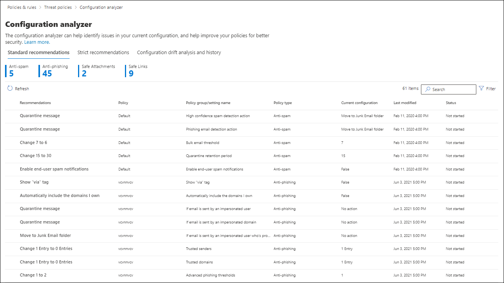

# EOP 和 Office 365 ATP 中的保护策略的配置分析器

[!INCLUDE [Microsoft 365 Defender rebranding](../includes/microsoft-defender-for-office.md)]

> [!NOTE]
> 本主题中所述的功能在预览中，在所有组织中均不可用，可能会发生更改。 有关发布计划的信息，请参阅 [Microsoft 365 路线图](https://www.microsoft.com/microsoft-365/roadmap?filters=&searchterms=config%2Canalyzer)。

Security & 合规中心中的配置分析器提供了一个中心位置，用于查找和修复安全策略，其中的设置位于 [预设安全策略](preset-security-policies.md)中的标准保护和严格保护配置文件设置之下。

配置分析器将对以下策略类型进行分析：

- **Exchange Online Protection (EOP) 策略**：这包括具有 exchange online 邮箱和独立 EOP 组织的 Microsoft 365 组织，而无需使用 exchange online 邮箱：
  
  - [反垃圾邮件策略](configure-your-spam-filter-policies.md)。
  - [反恶意软件策略](configure-anti-malware-policies.md)。
  - [EOP 反网络钓鱼策略](set-up-anti-phishing-policies.md#spoof-settings)。

- **Office 365 高级威胁防护 (ATP) 策略**：这包括具有 Microsoft 365 E5 或 OFFICE 365 ATP 附加产品订阅的组织：

  - ATP 反网络钓鱼策略，其中包括：

    - EOP 反网络钓鱼策略中提供的相同 [欺骗设置](set-up-anti-phishing-policies.md#spoof-settings) 。
    - [模拟设置](set-up-anti-phishing-policies.md#impersonation-settings-in-atp-anti-phishing-policies)
    - [高级网络钓鱼阈值](set-up-anti-phishing-policies.md#advanced-phishing-thresholds-in-atp-anti-phishing-policies)

  - [安全链接策略](set-up-atp-safe-links-policies.md)。

  - [安全附件策略](set-up-atp-safe-attachments-policies.md)。

[EOP 和 Office 365 ATP security 的建议设置](recommended-settings-for-eop-and-office365-atp.md)中介绍了用作基准的**标准**策略设置值和**严格**策略设置值。

## 开始前，有必要了解什么？

- 安全与合规中心的打开网址为 <https://protection.office.com/>。 若要直接转到 " **配置分析器** " 页，请使用 <https://protection.office.com/configurationAnalyzer> 。

- 若要连接到 Exchange Online PowerShell，请参阅[连接到 Exchange Online PowerShell](https://docs.microsoft.com/powershell/exchange/connect-to-exchange-online-powershell)。

- 您需要先分配权限，然后才能执行本文中的过程：

  - 若要使用配置分析器 **并** 对安全策略进行更新，您需要是以下角色组之一的成员：

    - [安全和合规中心](permissions-in-the-security-and-compliance-center.md)中的“**组织管理**”或“**安全管理员**”。
    - [Exchange Online](https://docs.microsoft.com/Exchange/permissions-exo/permissions-exo#role-groups) 中的“**组织管理**”或“**清洁管理**”。

  - 若要对配置分析器进行只读访问，您必须是下列角色组之一的成员：

    - [安全与合规中心](permissions-in-the-security-and-compliance-center.md)内的“**安全读取者**”。
    - [Exchange Online](https://docs.microsoft.com/Exchange/permissions-exo/permissions-exo#role-groups) 中的“**仅查看组织管理**”。

## 在安全 & 合规中心中使用配置分析器

在安全 & 合规性中心中，转到 " **威胁管理** \> **策略** \> **配置分析器**"。

配置分析器有两个主要选项卡：

- **设置和建议**：选择 "标准" 或 "严格"，并将这些设置与现有的安全策略进行比较。 在结果中，您可以调整设置的值，使其与标准或严格的级别相同。

- **配置偏移分析和历史记录**：此视图允许您跟踪一段时间内的策略更改。

### 配置分析器中的 "设置和建议" 选项卡

默认情况下，该选项卡将在与标准保护配置文件的比较中打开。 您可以通过单击 " **查看严格建议**" 切换到严格保护配置文件的比较。 若要切换回，请选择 " **查看标准建议**"。

默认情况下，" **策略组/设置名称** " 列包含不同类型的安全策略和需要改进 (如果有任何) 的设置数量的折叠视图。 策略类型为：

- **反垃圾邮件**
- **反网络钓鱼**
- **反恶意软件**
- 如果您的订阅包括 ATP) ， **Atp 安全附件** (
- 如果您的订阅包括 ATP) ， **Atp 安全链接** (

在默认视图中，所有内容都处于折叠状态。 在每个策略旁边有一个有关策略的比较结果的摘要 (可以在这些策略中修改) 以及在不能修改) 的标准或严格保护配置文件 (相应策略中的设置。 你将看到您要与之进行比较的保护配置文件的以下信息：

- **绿色**：所有现有策略中的所有设置都至少与保护配置文件一样安全。
- **琥珀色**：现有策略中的小一些设置与保护配置文件的安全性不一样。
- **红色**：现有策略中的大量设置与保护配置文件的安全性不一样。 这可能是一种策略中的许多策略或许多设置中的几个设置。

对于有利的比较，你将看到以下文本： **所有设置都遵循** \<**Standard** or **Strict**\> **建议**。 否则，你将看到建议的设置要更改的数量。

如果展开 " **策略" 组/设置名称**，则会显示每个需要注意的特定策略中的所有策略和关联设置。 或者，您可以展开特定类型的策略 (例如， **反垃圾邮件**) 仅查看那些需要注意的策略类型中的设置。

如果比较没有改进建议 (绿色) ，则展开该策略将不会显示任何内容。 如果有任意数量的改进建议 (琥珀色或红色) ，则会显示需要注意的设置，并在以下各列中显示相应的信息：

- 需要您注意的设置的名称。 例如，在前面的屏幕截图中，它是反垃圾邮件策略中的 **批量电子邮件阈值** 。

- **Policy**：包含该设置的受影响策略的名称。

- **应用**于：受影响的策略应用于的用户数量。

- **当前配置**：设置的当前值。

- **上次修改**时间：策略的上次修改日期。

- **建议**：标准或严格保护配置文件中的设置的值。 若要将策略中设置的值更改为与保护配置文件中的推荐值相匹配，请单击 " **采用**"。 如果更改成功，您将看到以下消息： " **已成功采用" 建议**。 单击 " **刷新** " 以查看减少的建议数，以及从结果中删除特定设置/策略行。

### 配置分析器中的 "配置偏移分析和历史记录" 选项卡

此选项卡允许你跟踪你对自定义安全策略所做的更改。 默认情况下，将显示以下信息：

- **上次修改时间**
- **修改者**
- **设置名称**
- **策略**
- **Type**

若要筛选结果，请单击“筛选器”****。 在显示的 " **筛选器** " 浮出控件中，可以从以下筛选器中进行选择：

- **开始时间** 和 **结束时间** (日期) 
- **标准保护** 或 **严格保护**

若要将结果导出到 .csv 文件，请单击 " **导出**"。

