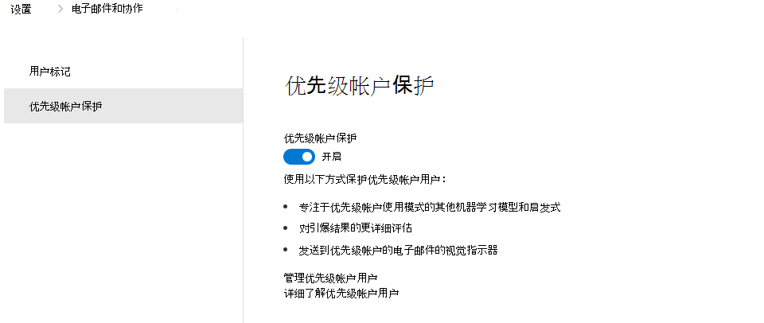

# 在Microsoft Defender for Office 365中配置和查看优先级帐户

[!INCLUDE [Microsoft 365 Defender rebranding](../includes/microsoft-defender-for-office.md)]

**适用对象**
- [Microsoft Defender for Office 365 计划 1 和计划 2](defender-for-office-365.md)
- [Microsoft 365 Defender](../defender/microsoft-365-defender.md)

在每个组织中，都有一些关键人员，例如，有权访问敏感、专有或高优先级信息的高管、领导者、经理或其他用户。 可以在Microsoft Defender for Office 365中将这些用户标记为优先级帐户，使安全团队能够将重点放在这些关键个人上。 通过对优先级帐户的差异化保护，标记为优先级帐户的用户将获得更高级别的威胁保护。

优先级帐户更频繁地成为攻击者的目标，并且通常使用更复杂的技术进行攻击。 优先级帐户的差异化保护侧重于此特定用户集，并使用增强型机器学习模型提供更高级别的保护。 学习和消息处理中的这种差异为这些帐户提供了最高级别的保护，并有助于保持低误报率，因为假正率高也会对这些用户产生负面影响。

## 配置优先级帐户保护

对于预先标识的关键用户，优先级帐户保护默认处于启用状态。 但是，组织的安全管理员也可以按照以下步骤启用优先级帐户保护：

1. 在Microsoft 365 Defender门户中<https://security.microsoft.com>，转到 **设置** \> **电子邮件&协作** \> **优先级帐户保护**。 

2. 启用 **优先级帐户保护**。 

    > [!div class="mx-imgBorder"]
    > 

> [!NOTE]
> 不建议禁用或关闭优先级帐户保护。  

### 启用优先级帐户标记

Microsoft Defender for Office 365支持优先级帐户作为标记，这些标记可用作警报、报表和调查中的筛选器。

有关详细信息，请参阅[Microsoft Defender for Office 365中的用户标记](user-tags.md)。

## 查看威胁防护状态报告、威胁资源管理器和电子邮件实体页中的差异化保护

### 威胁防护状态报告

威胁防护状态报告是一个单个视图，它汇集了有关恶意内容的信息以及Microsoft Defender for Office 365检测和阻止的恶意电子邮件的信息。 

若要在Microsoft 365 Defender门户中查看报表，请转到 **"报** \> **表电子邮件"&协作** \> **电子邮件&协作报表**。 在 **"电子邮件&协作报告** "页上，查找 **威胁防护状态**，然后单击 **"查看详细信息**"。

### 威胁资源管理器 

威胁资源管理器中的上下文筛选器可帮助搜索在检测消息时涉及优先级帐户保护的电子邮件。 这样，安全运营团队就可以查看此保护提供的值。 你仍然可以按优先级帐户标记筛选消息，以查找特定用户集的所有消息。 

若要查看额外保护，请在Microsoft 365 Defender门户中转到 **"电子邮件&协作** \> **资源管理器**"，从下拉列表中选择 **"上下文**"，然后选中 **"优先级帐户保护**"旁边的复选框。 

> [!div class="mx-imgBorder"]
> 

### 电子邮件实体页面

电子邮件&**协作** \> **资源管理器** 的Microsoft 365 Defender门户<https://security.microsoft.com>中提供了电子邮件实体页面。 在 **资源管理器** 中，选择要调查的电子邮件的主题。 该邮件的电子邮件浮出控件顶部将显示一个金条。 选择此选项可查看新页面。

实体页顶部的选项卡使你可以有效地调查电子邮件。 单击" **分析"** 选项卡。优先级帐户保护现已在 **威胁检测详细信息** 下列出。 

## 更多信息

- [Microsoft Defender for Office 365中的用户标记](user-tags.md)
- [管理和监视优先级帐户](../../admin/setup/priority-accounts.md)