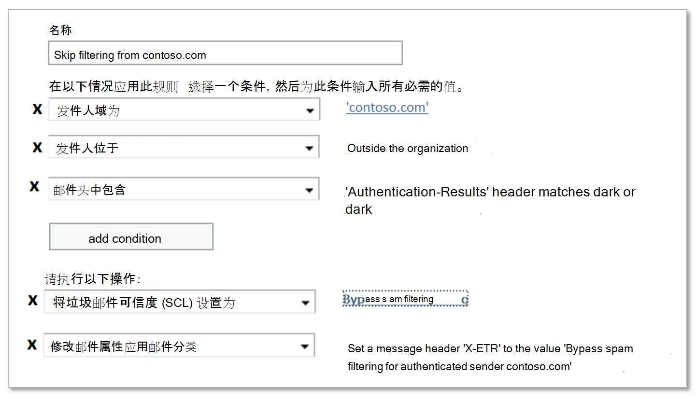

# 在 Office 365 中创建安全发件人列表

如果您是在 Exchange Online 中使用邮箱的 Office 365 客户或没有 Exchange Online 邮箱的独立 Exchange Online Protection （EOP）客户，EOP 将提供多种方法来确保用户收到来自受信任的发件人的电子邮件。 这些选项包括 Exchange 邮件流规则（也称为传输规则）、Outlook 安全发件人、IP 允许列表（连接筛选）和反垃圾邮件策略中允许的发件人列表或允许的域列表。 可以将这些选项统称为_安全发件人列表_。

以下列表中介绍了可用的安全发件人列表，从最建议的到最小建议的顺序如下：

1. 邮件流规则

2. Outlook 安全发件人

3. IP 允许列表（连接筛选）

4. 允许的发件人列表或允许的域列表（反垃圾邮件策略）

邮件流规则允许最大限度地确保只允许使用正确的邮件。 反垃圾邮件策略中允许的发件人和允许的域列表与 IP 允许列表相比不安全，因为发件人的电子邮件域很容易被欺骗。 但是，IP 允许列表也会带来风险，因为从该 IP 地址发送的_任何_域发送的电子邮件将绕过垃圾邮件筛选。

> [!IMPORTANT]
> <ul><li>请注意，并监视使用安全发件人列表的垃圾邮件筛选的*任何*例外。</li><li>虽然您可以使用安全发件人列表帮助误报（电子邮件被标记为垃圾邮件），但您应考虑使用安全发件人列表作为临时解决方案（如果可能，应尽可能避免）。 我们不建议使用安全发件人列表管理误报，因为垃圾邮件筛选例外可以将组织打开为哄骗和其他攻击。 如果您坚持使用安全发件人列表来管理误报，您需要时刻小心，并在准备好时让主题[报告邮件和文件到 Microsoft](report-junk-email-messages-to-microsoft.md) 。</li><li>若要允许域发送未经身份验证的电子邮件（绕过反欺骗保护），但不绕过反垃圾邮件和反恶意软件检查，可以将其添加到[AllowedToSpoof 安全发件人列表](walkthrough-spoof-intelligence-insight.md)</li><li>EOP 和 Outlook 检查不同的邮件属性以确定邮件的发件人。 有关详细信息，请参阅本主题后面的 "[批量电子邮件的注意事项](#considerations-for-bulk-email)" 一节。</li></ul>

相比之下，您还可以使用_阻止发件人列表_的多个选项阻止来自特定来源的电子邮件。 有关详细信息，请参阅[在 Office 365 中创建阻止发件人列表](create-block-sender-lists-in-office-365.md)。

## 适合使用邮件流规则

Exchange Online 和独立 EOP 中的邮件流规则：使用条件和例外来标识邮件，以及指定对这些邮件执行的操作的操作。 有关详细信息，请参阅[Exchange Online 中的邮件流规则（传输规则）](https://docs.microsoft.com/Exchange/security-and-compliance/mail-flow-rules/mail-flow-rules)。

下面的示例假定您需要来自 contoso.com 的电子邮件以跳过垃圾邮件筛选。 为此，请配置以下设置：

1. **条件**：**发件人** \> **域为** \> contoso.com。

2. 配置以下任一设置：

   - **邮件流规则条件**：**邮件头** \> **包含以下任何词语** \> **头名称**： `Authentication-Results` \> **头值**： `dmarc=pass`或`dmarc=bestguesspass`。

     此条件检查发送电子邮件域的发件人身份验证状态，以确保发送域不是欺骗的。 有关电子邮件身份验证的详细信息，请参阅[SPF](set-up-spf-in-office-365-to-help-prevent-spoofing.md)、 [DKIM](use-dkim-to-validate-outbound-email.md)和[DMARC](use-dmarc-to-validate-email.md)。

   - **IP 允许列表**：在连接筛选器策略中指定源 IP 地址或地址范围。
  
     如果发送域没有身份验证，则使用此设置。 当到达 IP 允许列表中的源 IP 地址时，应尽可能地限制其限制性。 建议 IP 地址范围为/24 或更小（更小越好）。 请勿使用属于消费者服务（例如，outlook.com）或共享基础结构的 IP 地址范围。

   > [!IMPORTANT]
   > <ul><li>永远不要将*仅*发送发件人域的邮件流规则配置为跳过垃圾邮件筛选的条件。 这样做会*显著*增加攻击者欺骗发送域（或模拟完整电子邮件地址）的可能性，跳过所有垃圾邮件筛选，并跳过发件人身份验证检查，以便邮件将到达收件人的收件箱中。</li><li>请勿在邮件流规则中使用拥有的域（也称为接受域）或受欢迎的域（例如，microsoft.com）作为条件。 这样做被认为是高风险，因为它会给攻击者发送电子邮件，以其他方式筛选的机会。</li><li>如果您允许位于网络地址转换（NAT）网关后面的 IP 地址，则需要知道 NAT 池中涉及的服务器，才能知道您的 IP 允许列表的范围。 IP 地址和 NAT 参与者可以更改。 你需要定期检查你的 IP 允许列表条目，作为你的标准维护过程的一部分。</li></ul>

3. **可选条件**：

   - **发件人** \>是**组织外部**的**内部/外部** \> ：此条件是隐式的，但可以使用它来考虑可能未正确配置的本地电子邮件服务器。

   - **主题** \>或正文**主题或正文包含以下任何词语** \> \<关键字\>：如果可以通过主题行或邮件正文中的关键字或短语进一步限制邮件，则可以使用这些词作为条件。

4. **操作**：在规则中配置这两个操作：

   a. **修改邮件属性** \> **设置垃圾邮件信任级别（SCL）** \> **绕过垃圾邮件筛选**。

   b. **邮件头** \> **包含以下任何词语** \> "**标题名称**： \<CustomHeaderName\> **头值**： \<CustomHeaderValue\>"。

      例如，`X-ETR: Bypass spam filtering for authenticated sender 'contoso.com'`。 如果规则中有多个域，则可以根据需要自定义标题文本。

      当邮件由于邮件流规则而跳过垃圾邮件筛选时，该值`SFV:SKN`值将在**X Forefront-反垃圾邮件报告**标头中标记。 如果邮件来自 IP 允许列表中的源，则也会添加该值`IPV:CAL` 。 这些值可帮助您进行故障排除。

## 使用 Outlook 安全发件人

用户或管理员可以将发件人电子邮件地址添加到邮箱中的安全发件人列表中，而不是组织设置。 有关说明，请参阅在[Office 365 中的 Exchange Online 邮箱上配置垃圾邮件设置](configure-junk-email-settings-on-exo-mailboxes.md)。

当邮件由于用户的安全发件人列表而跳过垃圾邮件筛选时， **X-Forefront-反垃圾邮件报告**标头`SFV:SFE`字段将包含值，这表明已绕过垃圾邮件、欺骗和网络钓鱼筛选。

## 使用 IP 允许列表

如果您在前面所述的情况下无法使用邮件流规则，则下一个最佳选择是将源电子邮件服务器或服务器添加到连接筛选器策略中的 IP 允许列表中。 有关详细信息，请参阅[在 Office 365 中配置连接筛选](configure-the-connection-filter-policy.md)。

**注意**：

- 一定要将允许的 IP 地址数保持为最小值，以便尽可能避免使用整个 IP 地址范围。

- 请勿使用属于消费者服务（例如，outlook.com）或共享基础结构的 IP 地址范围。

- 定期查看 IP 允许列表中的条目，并删除不再需要的条目。

> [!CAUTION]
> 如果没有其他验证（如邮件流规则），来自 IP 允许列表中的来源的电子邮件将跳过垃圾邮件筛选和发件人身份验证（SPF、DKIM、DMARC）检查。 这会造成攻击者成功将电子邮件传递到收件箱的高风险，否则将被筛选。

## 使用允许的发件人列表或允许的域列表

最不理想的选择是在反垃圾邮件策略中使用允许的发件人列表或允许的域列表。 *如果可能*，应尽可能避免使用此选项，因为发件人绕过所有垃圾邮件、欺骗和网络钓鱼防护以及发件人身份验证（SPF、DKIM、DMARC）。 此方法最适合仅用于临时测试。 可在[Office 365 主题中的配置反垃圾邮件策略](configure-your-spam-filter-policies.md)中找到详细步骤。

这些列表的最大限制约为1000个条目;尽管只能将30个条目输入到门户中。 必须使用 PowerShell 添加30个以上的条目。

> [!CAUTION]
> <ul><li>此方法会带来以下风险：成功将电子邮件传递到收件箱的高风险，否则将被筛选。</li><li>不要在允许的域列表中使用您拥有的域（也称为接受域）或受欢迎的域（例如，microsoft.com）。</li></ul>

## 批量电子邮件的注意事项

标准 SMTP 电子邮件由*邮件信封*和邮件内容组成。 邮件信封包含在 SMTP 服务器之间传输和传递邮件所需的信息。 邮件内容包含邮件头字段（统称为*邮件头*）和邮件正文。 RFC 5321 中介绍了邮件信封，并且 RFC 5322 中介绍了邮件头。 收件人从不会看到实际邮件信封，因为它是由邮件传输进程生成的，并且实际上并不是邮件的一部分。

- `5321.MailFrom`地址（也称为 "**发**件人地址"、"P1 发件人" 或 "信封发件人"）是在邮件的 SMTP 传输中使用的电子邮件地址。 此电子邮件地址通常记录在邮件标头中的 "**返回路径**标头" 字段中（尽管发件人可以指定不同的**返回路径**电子邮件地址）。 此电子邮件地址用于发件人身份验证检查（SPF、DKIM、DMARC），如果邮件无法传递，则它是未送达报告（也称为 "NDR" 或 "退回邮件"）的收件人。 

- （也称为 "**来自**地址" 或 "P2 发件人"）是 "发件人" 头字段中的电子邮件地址，是电子邮件客户端中显示的发件人的电子邮件地址。 **From** `5322.From`

通常， `5321.MailFrom`和`5322.From`地址相同（人到个人的通信）。 但是，当代表其他人发送电子邮件时，地址往往是不同。 通常这对于批量电子邮件是经常发生的。

例如，假设蓝色 Yonder 航空公司已雇用玛吉的旅行，发出电子邮件广告。 您在收件箱中收到的邮件具有以下属性：

- `5321.MailFrom`地址为 blueyonder.airlines@margiestravel.com。

- `5322.From`地址为 blueyonder@news.blueyonderairlines.com，这就是您在 Outlook 中看到的内容。

EOP 中的反垃圾邮件策略中的安全发件人列表和安全域`5321.MailFrom`列表`5322.From`检查和地址。 Outlook 安全发件人仅`5322.From`使用该地址。

若要阻止筛选此邮件，您可以执行以下步骤：

- 将 blueyonder@news.blueyonderairlines.com （ `5322.From`地址）添加为 Outlook 安全发件人。

- [将邮件流规则](#recommended-use-mail-flow-rules)与查找来自 blueyonder@news.blueyonderairlines.com 的邮件的条件（ `5322.From` address、blueyonder.airlines@margiestravel.com （ `5321.MailFrom`）或两者）结合使用。

有关详细信息，请参阅[在 Office 365 中创建安全发件人列表](create-safe-sender-lists-in-office-365.md)。
