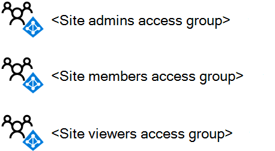
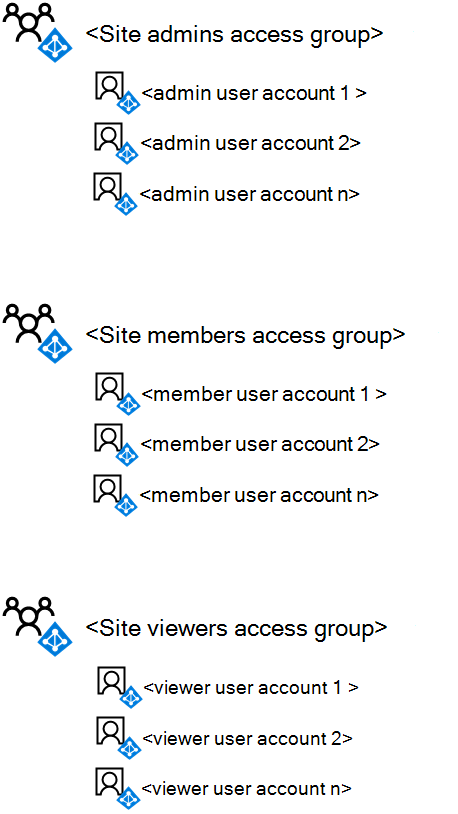
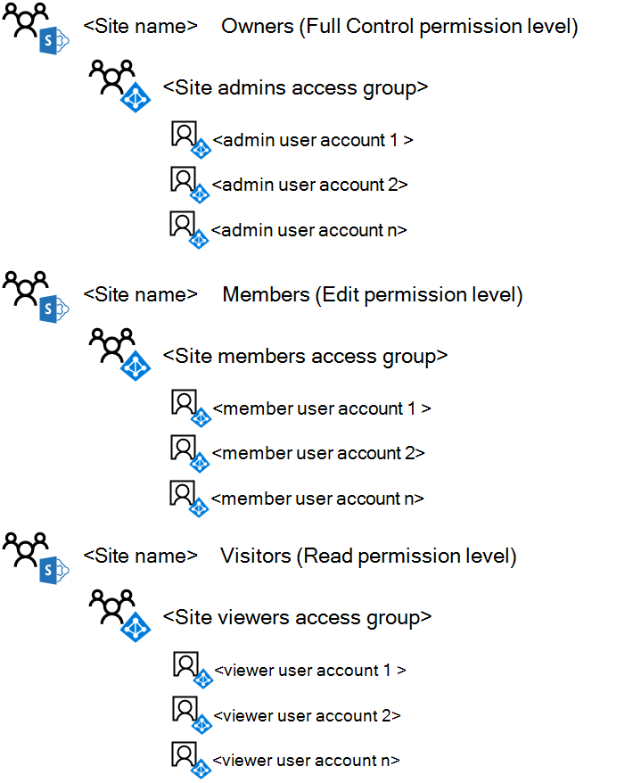

# <a name="deploy-an-isolated-sharepoint-online-team-site"></a>部署独立的 SharePoint Online 团队网站

[!INCLUDE [Microsoft 365 Defender rebranding](../includes/microsoft-defender-for-office.md)]

**适用于**
- [Microsoft Defender for Office 365 计划 1 和计划 2](https://go.microsoft.com/fwlink/?linkid=2148715)
- [Microsoft 365 Defender](https://go.microsoft.com/fwlink/?linkid=2118804)

 **摘要：** 使用这些分步说明部署新的独立 SharePoint Online 团队网站。

本文是一个分步部署指南，用于创建和配置 Microsoft Office 365 中的独立 SharePoint Online 团队网站。 这些步骤假定使用三个默认的 SharePoint 组和相应的权限级别，每个访问级别具有一个 Azure Active Directory (AD) 基于 AD 的访问组。

## <a name="phase-1-create-and-populate-the-team-site-access-groups"></a>阶段 1：创建和填充团队网站访问组

在此阶段，为三个默认 SharePoint 组创建三个基于 Azure AD 的访问组，并使用相应的用户帐户填充它们。

> [!NOTE]
> 以下步骤假定所有必需的用户帐户已经存在，并分配有相应的许可证。 如果没有，请在继续步骤 1 之前添加它们并分配许可证。

### <a name="step-1-list-the-sharepoint-online-admins-for-the-site"></a>步骤 1：列出网站的 SharePoint Online 管理员

确定对应于独立团队网站的 SharePoint Online 管理员的用户帐户集。

如果通过 Microsoft 365 管理用户帐户和组，并且希望使用 Windows PowerShell，请列出其用户主体名称 (UPN)  (UPN：belindan@contoso.com) 。

### <a name="step-2-list-the-members-for-the-site"></a>步骤 2：列出网站的成员

确定对应于独立团队网站的成员（将协作处理网站中存储的资源的成员）的用户帐户集。

如果通过 Microsoft 365 管理用户帐户和组，并且想要使用 PowerShell，请列出其 UPN。 如果有很多网站成员，可以将 UPN 列表存储在文本文件中，然后使用单个 PowerShell 命令添加所有 UPN。

### <a name="step-3-list-the-viewers-for-the-site"></a>步骤 3：列出网站的查看者

确定对应于独立团队网站的查看者（可以查看网站中存储的资源但不修改它们或直接协作处理其内容）的用户帐户集。

如果通过 Microsoft 365 管理用户帐户和组，并且想要使用 PowerShell，请列出其 UPN。 如果有很多网站成员，可以将 UPN 列表存储在文本文件中，然后使用单个 PowerShell 命令添加所有 UPN。

网站的查看者可能包括管理层、法律顾问或部门间利益干系人。

### <a name="step-4-create-the-three-access-groups-for-the-site-in-azure-ad"></a>步骤 4：在 Azure AD 中为网站创建三个访问组

你需要在 Azure AD 中创建以下访问组：

- 网站管理员 (将包含步骤 1 中的列表) 
- 网站 (将包含步骤 2 中的列表) 
- 网站查看 (，其中包含步骤 3 中的) 

1. 在浏览器中，转到 Azure 门户，然后使用已分配有用户管理管理员或公司管理员角色的帐户凭据 <https://portal.azure.com> 登录。

2. 在 Azure 门户中，单击“**Azure Active Directory”>“组**”。

3. 在“**组 - 所有组**”边栏选项卡上，单击“**+ 新建组**”。

4. 在" **新建组"** 边栏选项卡上：

   - 在“组类型”中选择“安全性”。

   - 在名称中键入组 **名称**。

   - 在组说明中键入组 **的说明**。

   - 在“**成员身份**”类型中，选择“**已分配**”。

5. 单击“**创建**”，然后关闭“**组**”边栏选项卡。

6. 对其他组重复步骤 3-5。

> [!NOTE]
> 你需要使用 Azure 门户创建组，以便启用 Office 功能。 如果 SharePoint Online 独立网站稍后被配置为具有 Azure 信息保护标签的高度机密网站，以加密文件并将权限分配给特定组，则必须在启用 Office 功能的情况下创建允许的组。 创建 Azure AD 组的 Office 功能设置后，无法更改。

下面是使用三个网站访问组生成的配置。



### <a name="step-5-add-the-user-accounts-to-the-access-groups"></a>步骤 5. 将用户帐户添加到访问组

在此步骤中，执行下列操作：

1. 将步骤 1 中的用户列表添加到网站管理员访问组。
2. 将步骤 2 中的用户列表添加到网站成员访问组。
3. 将步骤 3 中的用户列表添加到网站查看者访问组。

如果通过 Active Directory 域服务 (AD DS) 管理用户帐户和组，则使用正常的 AD DS 用户和组管理过程将用户添加到相应的访问组，并等待与 Microsoft 365 订阅同步。

如果通过 Office 365 管理用户帐户和组，可以使用 Microsoft 365 管理中心或 PowerShell。 如果任何访问组具有重复的组名称，则应该使用 Microsoft 365 管理中心。

对于 Microsoft 365 管理中心，使用已分配有用户帐户管理员或公司管理员角色的用户帐户登录，并使用组将相应的用户帐户和组添加到相应的访问组。

对于 PowerShell，首先 [使用适用于 Graph 模块的 Azure Active Directory PowerShell 进行连接](https://docs.microsoft.com/microsoft-365/enterprise/connect-to-microsoft-365-powershell#connect-with-the-azure-active-directory-powershell-for-graph-module)。

接下来，使用以下命令块将单个用户帐户添加到访问组：

```powershell
$userUPN="<UPN of the user account>"
$grpName="<display name of the access group>"
Add-AzureADGroupMember -RefObjectId (Get-AzureADUser | Where { $_.UserPrincipalName -eq $userUPN }).ObjectID -ObjectId (Get-AzureADGroup | Where { $_.DisplayName -eq $grpName }).ObjectID
```

如果将任何访问组的用户帐户 UPN 存储在文本文件中，可以使用以下 PowerShell 命令块一次添加所有 UPN：

```powershell
$grpName="<display name of the access group>"
$fileName="<path and name of the file containing the list of account UPNs>"
$grpID=(Get-AzureADGroup | Where { $_.DisplayName -eq $grpName }).ObjectID
Get-Content $fileName | ForEach { $userUPN=$_; Add-AzureADGroupMember -RefObjectId (Get-AzureADUser | Where { $_.UserPrincipalName -eq $userUPN }).ObjectID -ObjectID $grpID }
```

对于 PowerShell，使用以下命令块将单个组添加到访问组：

```powershell
$nestedGrpName="<display name of the group to add to the access group>"
$grpName="<display name of the access group>"
Add-AzureADGroupMember -RefObjectId (Get-AzureADGroup | Where { $_.DisplayName -eq $nestedGrpName }).ObjectID -ObjectID (Get-AzureADGroup | Where { $_.DisplayName -eq $grpName }).ObjectID
```

结果应为：

- 网站管理员 Azure AD 组包含网站管理员用户帐户或组
- 网站成员 Azure AD 组包含站点成员用户帐户或组
- 网站查看者 Azure AD 组包含只能查看网站内容的用户帐户或组

使用 Microsoft 365 管理中心或以下 PowerShell 命令块验证每个访问组的组成员列表：

```powershell
$grpName="<display name of the access group>"
Get-AzureADGroupMember -ObjectId (Get-AzureADGroup | Where { $_.DisplayName -eq $grpName }).ObjectID | Sort UserPrincipalName | Select UserPrincipalName,DisplayName,UserType
```

下面是使用用户帐户或组填充的三个网站访问组生成的配置。



## <a name="phase-2-create-and-configure-the-isolated-team-site"></a>第 2 阶段：创建和配置独立的团队网站

在此阶段，创建独立的 SharePoint Online 网站，并配置默认 SharePoint Online 权限级别的权限，以使用新的基于 Azure AD 的访问组。 默认情况下，新的团队网站包括 Microsoft 365 组和其他相关资源，但在这种情况下，我们将创建没有 Microsoft 365 组的团队网站。 这允许完全通过 SharePoint 维护权限。

首先，使用以下步骤创建 SharePoint Online 团队网站。

1. 使用还将用于管理 SharePoint Online (SharePoint Online 团队网站的帐户登录到 Microsoft 365 管理) 。 如需帮助，请参阅[如何登录到 Office 365](https://support.microsoft.com/office/e9eb7d51-5430-4929-91ab-6157c5a050b4)。

2. 在 Microsoft 365 管理中心的"管理 **中心**"下，单击 **"SharePoint"。**

3. 在 SharePoint 管理中心中，展开 **"网站**"，然后单击 **"活动网站"。**

4. 单击 **"** 创建"，然后选择 **"其他选项"。**

5. 在"**选择模板"列表中**，选择 **"团队网站"。**

6. 在 **"网站** 名称"中，键入团队网站的名称。

7. 在 **主管理员** 中，键入您登录时使用的帐户。

8. 单击“完成”。

接下来，从新的 SharePoint Online 团队网站配置权限。

1. 在工具栏中，依次单击设置图标和“**网站权限**”。

2. 在 **"网站共享**"下，**单击"更改成员共享"。**

3. 选择" **仅网站所有者"可以共享文件、文件夹和网站**。

4. 将 **"允许访问请求"设置为****"关闭"。**

5. 单击“**保存**”。

6. 在 **"权限"** 窗格中，单击 **"高级权限设置"。**

7. 在 **浏览器的**"权限"选项卡上，单击 **\<site name> 列表中的**"成员"。

8. 在“人员和组”中，单击“新建”。

9. 在 **"共享**"对话框中，键入网站成员访问组的名称，选择它，然后单击"**共享"。**

10. 单击浏览器上的后退按钮。

11. 单击 **\<site name> 列表中的**"所有者"。

12. 在“人员和组”中，单击“新建”。

13. 在 **"共享**"对话框中，键入网站管理员访问组的名称，选择它，然后单击"**共享"。**

14. 单击浏览器上的后退按钮。

15. 单击 **\<site name> 列表中的**"访问者"。

16. 在“人员和组”中，单击“新建”。

17. 在 **"共享**"对话框中，键入网站查看器访问组的名称，选择它，然后单击"**共享"。**

18. 关闭浏览器的“权限”标签页。

以下是这些权限设置的结果：

- Owners **\<site name>** SharePoint 组包含网站管理员访问组，其中所有成员均具有完全 **控制** 权限级别。
- 成员 **\<site name>** SharePoint 组包含网站成员访问组，其中所有成员都有"编辑 **"** 权限级别。
- Visitors **\<site name>** SharePoint 组包含网站查看者访问组，其中所有成员都有 **读取** 权限级别。
- 禁用成员邀请其他成员或非成员请求访问的能力。

下面是生成的配置，其中为网站配置了三个 SharePoint 组，以使用三个访问组，这些访问组填充了用户帐户或 Azure AD 组。



通过其中一个访问组的组成员身份，您和网站的成员现在可以使用网站资源进行协作。

## <a name="next-step"></a>后续步骤

当需要更改网站访问组成员身份或创建具有自定义权限的文档文件夹时，请参阅["管理独立的 SharePoint Online 团队网站"。](manage-an-isolated-sharepoint-online-team-site.md)

## <a name="see-also"></a>另请参阅

[独立 SharePoint Online 团队网站](isolated-sharepoint-online-team-sites.md)

[设计单独的 SharePoint Online 团队网站](design-an-isolated-sharepoint-online-team-site.md)

[管理独立 SharePoint Online 团队网站](manage-an-isolated-sharepoint-online-team-site.md)
