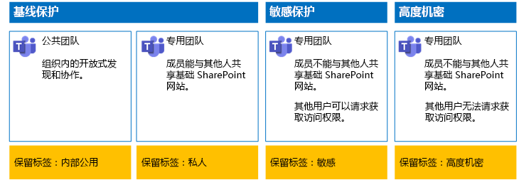
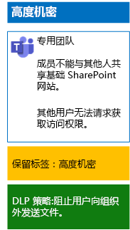

# 使用保留标签和 DLP 保护团队中的文件Protect files in teams with retention labels and DLP

 
使用本文中的步骤针对基线、敏感和高度保密的团队及其基础 SharePoint 网站设计并部署保留标签和数据丢失防护 (DLP) 策略。Use the steps in this article to design and deploy retention labels and data loss prevention (DLP) policies for baseline, sensitive, and highly confidential teams and their underlying SharePoint sites. 有关这三层保护的详细信息，请参阅[保护 Microsoft Teams 中的文件](secure-files-in-teams.md)。For more information about these three tiers of protection, see [Secure files in Microsoft Teams](secure-files-in-teams.md).
  
## 工作原理How this works

1. 创建所需的保留标签并发布这些标签。Create the desired retention labels and publish these. 最多可能需要 12 个小时来发布这些标签。It can take up to 12 hours for these to be published.
2. 对于所需的基础 SharePoint 网站，将文档库设置编辑为向库中项目应用所需的保留标签。For the desired underlying SharePoint sites, edit the document library settings to apply the desired retention labels to items in the library.
3. 创建 DLP 策略以根据保留标签执行相关操作。Create DLP policies to take action based on the retention labels.

当用户将文档添加到团队的基础 SharePoint 网站库时，默认情况下该文档将接收分配的保留标签。When users add a document to the underlying SharePoint site library for the team, the document will receive the assigned retention label by default. 用户可以根据需要更改标签。Users can change the label, if needed. 当用户在组织外共享文档时，DLP 将检查是否已分配标签，并在 DLP 策略与标签匹配时执行相关操作。When a user shares a document outside the organization, DLP will check to see if a label is assigned and take action if a DLP policy matches the label. DLP 还将查找其他策略匹配，例如，如果配置了此类策略，则使用信用卡号保护文件。DLP will look for other policy matches as well, such as protecting files with credit card numbers if this type of policy is configured. 

## 基础 SharePoint 网站的保留标签Retention labels for your underlying SharePoint sites

为基础 SharePoint 网站创建并分配保留标签分为三个阶段。There are three phases to creating and then assigning retention labels to underlying SharePoint sites.
  
### 阶段 1：确定保留标签名称Step 1: Determine the retention label names

在此阶段，对于应用到基础 SharePoint 网站的四个级别的信息保护，确定保留标签的名称。In this phase, you determine the names of your retention labels for the four levels of information protection applied to underlying SharePoint sites. 下表列出了针对每个级别建议的名称。The following table lists the recommended names for each level.
  
|**基础 SharePoint 网站保护级别****underlying SharePoint sites protection level**|**标签名称****Label name**|
|:-----|:-----|
|基线 - 公用Baseline-Public    |内部公用Internal public    |
|基线 - 专用Baseline-Private    |PrivatePrivate    |
|敏感Sensitive    |敏感Sensitive    |
|高度机密Highly Confidential    |高度机密Highly Confidential    |
   
### 阶段 2：创建保留标签Step 2: Create the retention labels

在此阶段中，针对不同的信息保护级别创建并发布确定的标签。In this phase, you create and then publish your determined labels for the different levels of information protection.
  
1. 使用具有安全管理员或公司管理员角色的帐户登录 [Microsoft 365 合规门户](https://compliance.microsoft.com)。Sign in to the [Microsoft 365 compliance portal](https://compliance.microsoft.com) with an account that has the Security Administrator or Company Administrator role.
    
2. 在浏览器的“**主页 - Microsoft 365 合规性**”选项卡中，单击“**分类 > 标签**”。From the **Home - Microsoft 365 compliance** tab of your browser, click **Classifications > Labels**.
    
3. 单击“**保留标签 > 创建标签**”。Click **Retention labels > Create a label**.
    
4. 在“**命名标签**”窗格中，键入标签的名称和管理员及用户描述，然后单击“**下一步**”。On the **Name your label** pane, type the name of the label and a description for admins and users, and then click **Next**.

5. 在“**文件计划描述符**”窗格中，根据需要进行填写，然后单击“**下一步**”。On the **File plan descriptors** pane, fill in as needed, and then click **Next**.
    
6. 在“**标签设置**”窗格中，根据需要将“**保留**”设置为“**开**”并配置保留设置。On the **Label settings** pane, if needed, set **Retention** to **On** and configure retention settings. 单击“**下一步**”。Click **Next**.
    
7. 在“**查看设置**”窗格中，单击“**创建标签**”。On the **Review your settings** pane, click **Create the label**.
    
8. 对于其他标签，请单击“创建标签”\*\*\*\*，然后根据需要重复此过程的步骤 3-7。For your additional labels, click **Create a label**, and then repeat steps 3-7 in this procedure as needed.
    

### 发布新标签Publish your new labels

接下来，使用这些步骤发布新的保留标签。Next, use these steps to publish the new retention labels.
  
1. 在“**标签**”窗格中，单击“**保留标签**”选项卡，然后单击“**发布标签**”。From the **Labels** pane, click the **Retention labels** tab, and then click **Publish labels**.
    
2. 在“**选择要发布的标签**”窗格中，单击“**选择要发布的标签**”。On the **Choose labels to publish** pane, click **Choose labels to publish**.
    
3. 在“**选择标签**”窗格中，单击“**添加**”并选择全部四个标签，然后单击“**添加**”。On the **Choose labels** pane, click **Add**, select all four labels, click **Add**.
    
4. 单击“完成”\*\*\*\*。Click **Done**.
    
5. 在“选择要发布的标签”窗格中，单击“下一步”\*\*\*\*\*\*\*\*。On the **Choose labels to publish** pane, click **Next**.
    
6. 在“选择位置”窗格中，单击“下一步”\*\*\*\*\*\*\*\*。On the **Choose locations** pane, click **Next**.
    
7. 在“命名策略”\*\*\*\* 窗格中，在“名称”\*\*\*\* 中键入标签组的名称，然后单击“下一步”\*\*\*\*。On the **Name your policy** pane, type a name for your set of labels in **Name**, and then click **Next**.
    
8. 在“查看设置”\*\*\*\* 窗格中，单击“发布标签”\*\*\*\*，然后单击“关闭”\*\*\*\*。On the **Review your settings** pane, click **Publish labels**, and then click **Close**.

    
### 步骤 3：将保留标签应用于基础 SharePoint 网站Step 3: Apply the retention labels to your underlying SharePoint sites

使用这些步骤将保留标签应用于基础 SharePoint 网站的文档文件夹。Use these steps to apply the retention labels to the documents folders of your underlying SharePoint sites.
  
1.  在团队中，单击“文件”，然后单击“在 SharePoint 中打开”\*\*\*\*\*\*\*\*。From the team, click **Files**, and then click **Open in SharePoint**.

2. 在浏览器的新“SharePoint 网站”标签页中，单击“文档”\*\*\*\*。In the new SharePoint site tab of your browser, click **Documents**.
    
3. 单击设置图标，然后单击“库设置”\*\*\*\*。Click the settings icon, and then click **Library settings**.
    
4. 在“权限和管理”下，单击“向此库中的项应用标签”\*\*\*\*\*\*\*\*。Under **Permissions and Management**, click **Apply label to items in this library**.
    
5. 在“**设置-应用标签**”中，选择相应的保留标签，然后单击“**保存**”。In **Settings-Apply Label**, select the appropriate retention label, and then click **Save**.
    
6. 关闭 SharePoint 网站的选项卡。Close the tab for the SharePoint site.
    
7. 重复步骤 1-6，将保留标签分配给其他基础 SharePoint 网站。Repeat steps 1-6 to assign retention labels to your additional underlying SharePoint sites.
    
下面是生成的配置。Here is your resulting configuration.
  

  
## 基础 SharePoint 网站的 DLP 策略DLP policies for your underlying SharePoint sites

使用以下步骤配置 DLP 策略，该策略可在用户在组织外共享关于基础 SharePoint 网站的文档时进行通知。Use these steps to configure a DLP policy that notifies users when they share a document on an underlying SharePoint site outside the organization.

1. 使用具有安全管理员或公司管理员角色的帐户登录 [Microsoft 365 合规性门户](https://compliance.microsoft.com/)。Sign in to the [Microsoft 365 compliance portal](https://compliance.microsoft.com/) with an account that has the Security Administrator or Company Administrator role.
    
2. 在浏览器的新“**Microsoft 365 合规**”标签页中，单击“**策略 > 数据丢失防护**”。On the new **Microsoft 365 compliance** tab in your browser, click **Policies > Data loss prevention**.
    
3. 在“**主页 > 数据丢失防护**”窗格中，单击“**创建策略**”。In the **Home > Data loss prevention** pane, click **Create a policy**.
    
4. 在“**从模板开始或创建自定义策略**”窗格中，单击“**自定义**”，然后单击“**下一步**”。In the **Start with a template or create a custom policy** pane, click **Custom**, and then click **Next**.
    
5. 在“命名策略”\*\*\*\* 窗格中，在“名称”\*\*\*\* 中键入敏感级别 DLP 策略的名称，然后单击“下一步”\*\*\*\*。In the **Name your policy** pane, type the name for the sensitive level DLP policy in **Name**, and then click **Next**.
    
6. 在“**选择位置**”窗格中，单击“**允许选择特定位置**”，然后单击“**下一步**”。In the **Choose locations** pane, click **Let me choose specific locations**, and then click **Next**.
    
7. 在位置列表中，禁用“**Exchange 电子邮件**”、“**OneDrive 帐户**”和“**Teams 聊天和频道消息**”，然后单击“**下一步**”。In the list of locations, disable the **Exchange email**, **OneDrive accounts**, and **Teams chat and channel messages** locations, and then click **Next**.
    
8. 在“**自定义要保护的内容类型**”窗格中，单击“**编辑**”。In the **Customize the type of content you want to protect** pane, click **Edit**.
    
9. 在“**选择要保护的内容类型**”窗格中，单击下拉框中的“**添加**”，然后单击“**保留标签**”。In the **Choose the types of content to protect** pane, click **Add** in the drop-down box, and then click **Retention labels**.
    
10. 在“**保留标签**”窗格中，单击“**添加**”，选择“**敏感**”标签，然后依次单击“**添加**”和“**完成**”。In the **Retention labels** pane, click **Add**, select the **Sensitive** label, click **Add**, and then click **Done**.
    
11. 在“选择要保护的内容类型”窗格中，单击“保存”\*\*\*\*\*\*\*\*。In the **Choose the types of content to protect** pane, click **Save**.
    
12. 在“**自定义要保护的敏感信息类型**”窗格中，单击“**下一步**”。In the **Customize the type of content you want to protect** pane, click **Next**.

13. 在“如果检测到敏感信息，希望采取什么操作?”窗格中，单击“自定义提示和电子邮件”\*\*\*\*\*\*\*\*。In the **What do you want to do if we detect sensitive info?** pane, click **Customize the tip and email**.
    
14. 在“自定义策略提示和电子邮件通知”窗格中，单击“自定义策略提示文本”\*\*\*\*\*\*\*\*。In the **Customize policy tips and email notifications** pane, click **Customize the policy tip text**.
    
15. 在文本框中，键入或粘贴以下提示之一：In the text box, type or paste in one of the following tips:
    
  - 要与组织外部的用户共享，请下载并打开文件。 依次单击“文件”、“保护文档”、“使用密码加密”，然后指定强密码。 通过单独的电子邮件或其他通信方式发送密码。To share with a user outside the organization, download the file and then open it. Click File, then Protect Document, and then Encrypt with Password, and then specify a strong password. Send the password in a separate email or other means of communication.
  - 高度机密文件已获加密保护。只有 IT 部门向其授予对这些文件的相应权限的外部用户，才能读取这些文件。Highly confidential files are protected with encryption. Only external users who are granted permissions to these files by your IT department can read them.
    
    或键入或粘贴自己的策略提示，指示用户如何在组织外共享文件。Alternately, type or paste in your own policy tip that instructs users on how to share a file outside your organization.
    
16. 单击“确定”\*\*\*\*。Click **OK**.
    
17. 在“如果检测到敏感信息，希望采取什么操作?”\*\*\*\* 窗格中，单击“下一步”\*\*\*\*。In the **What do you want to do if we detect sensitive info?** pane, click **Next**.
    
18. 在“是否希望立即启用策略或先进行测试?”\*\*\*\* 窗格中，单击“是，立即启用”\*\*\*\*，然后单击“下一步”\*\*\*\*。In the **Do you want to turn on the policy or test things out first?** pane, click **Yes, turn it on right away**, and then click **Next**.
    
19. 在“查看设置”\*\*\*\* 窗格中，单击“创建”\*\*\*\*，然后单击“关闭”\*\*\*\*。In the **Review your settings** pane, click **Create**, and then click **Close**.
    
以下为敏感团队的配置结果。Here is your resulting configuration for sensitive teams.
  

  
接下来，使用以下步骤配置 DLP 策略，该策略可在用户在组织外共享关于基础 SharePoint 网站的文档时阻止用户。Next, use these steps to configure a DLP policy that blocks users when they share a document on an underlying SharePoint site outside the organization.
  
1. 在浏览器的新“**Microsoft 365 合规**”标签页中，单击“**策略 > 数据丢失防护**”。On the new **Microsoft 365 compliance** tab in your browser, click **Policies > Data loss prevention**.
    
2. 在“**数据丢失防护**”窗格中，单击“**创建策略**”。In the **Data loss prevention** pane, click **Create a policy**.
    
3. 在“从模板开始或创建自定义策略”\*\*\*\* 窗格中，单击“自定义”\*\*\*\*，然后单击“下一步”\*\*\*\*。In the **Start with a template or create a custom policy** pane, click **Custom**, and then click **Next**.
    
4. 在“命名策略”\*\*\*\* 窗格中，在“名称”\*\*\*\* 中键入高度敏感级别 DLP 策略的名称，然后单击“下一步”\*\*\*\*。In the **Name your policy** pane, type the name for the highly sensitive level DLP policy in **Name**, and then click **Next**.
    
5. 在“选择位置”窗格中，单击“允许选择特定位置”，然后单击“下一步”\*\*\*\*\*\*\*\*\*\*\*\*。In the **Choose locations** pane, click **Let me choose specific locations**, and then click **Next**.
    
6. 在位置列表中，禁用“**Exchange 电子邮件**”、“**OneDrive 帐户**”和“**Teams 聊天和频道消息**”，然后单击“**下一步**”。In the list of locations, disable the **Exchange email**, **OneDrive accounts**, and **Teams chat and channel messages** locations, and then click **Next**.
    
7. 在“**自定义要保护的敏感信息类型**”窗格中，单击“**编辑**”。In the **Customize the types of sensitive info you want to protect** pane, click **Edit**.
    
8. 在“**选择要保护的内容类型**”窗格中，单击下拉框中的“**添加**”，然后单击“**保留标签**”。In the **Choose the types of content to protect** pane, click **Add** in the drop-down box, and then click **Retention labels**.
    
9. 在“**保留标签**”窗格中，单击“**添加**”，选择“**高度机密**”标签，然后依次单击“**添加**”和“**完成**”。In the **Retention labels** pane, click **Add**, select the **Highly Confidential** label, click **Add**, and then click **Done**.
    
10. 在“选择要保护的内容类型”窗格中，单击“保存”\*\*\*\*\*\*\*\*。In the **Choose the types of content to protect** pane, click **Save**.
    
12. 在“自定义要保护的敏感信息类型”窗格中，单击“下一步”\*\*\*\*\*\*\*\*。In the **Customize the types of sensitive info you want to protect** pane, click **Next**.
    
13. 在“如果检测到敏感信息，希望采取什么操作?”窗格中，单击“自定义提示和电子邮件”\*\*\*\*\*\*\*\*。In the **What do you want to do if we detect sensitive info?** pane, click **Customize the tip and email**.
    
14. 在“自定义策略提示和电子邮件通知”窗格中，单击“自定义策略提示文本”\*\*\*\*\*\*\*\*。In the **Customize policy tips and email notifications** pane, click **Customize the policy tip text**.
    
15. 在文本框中，键入或粘贴以下内容：In the text box, type or paste in the following:
    
  - 要与组织外部的用户共享，请下载并打开文件。 依次单击“文件”、“保护文档”、“使用密码加密”，然后指定强密码。 通过单独的电子邮件或其他通信方式发送密码。To share with a user outside the organization, download the file and then open it. Click File, then Protect Document, and then Encrypt with Password, and then specify a strong password. Send the password in a separate email or other means of communication.
    
    或者，键入或粘贴自己的策略提示，指示用户如何在组织外共享文件。Alternately, type or paste in your own policy tip that instructs users on how to share a file outside your organization.
    
16. 单击“确定”。Click **OK**.
    
17. 在“**如果检测到敏感信息，希望采取什么操作?**”窗格中，在“**共享特定数量的敏感信息时进行检测**”下方单击“**限制访问或加密内容**”，然后单击“**下一步**”。In the **What do you want to do if we detect sensitive info?** pane, under **Detect when a specific amount of sensitive info is being shared at one time**, click **Restrict access or encrypt the content**, and then click **Next**.
    
18. 在“是否希望立即启用策略或先进行测试?”\*\*\*\* 窗格中，单击“是，立即启用”\*\*\*\*，然后单击“下一步”\*\*\*\*。In the **Do you want to turn on the policy or test things out first?** pane, click **Yes, turn it on right away**, and then click **Next**.
    
19. 在“查看设置”\*\*\*\* 窗格中，单击“创建”\*\*\*\*，然后单击“关闭”\*\*\*\*。In the **Review your settings** pane, click **Create**, and then click **Close**.
    
以下为高度机密团队的配置结果。Here is your resulting configuration for high confidentiality team.
  

  
## 后续步骤Next step

[使用灵敏度标签保护团队中的文件Protect files in teams with sensitivity labels](deploy-teams-sensitivity-labels.md)
    
## 另请参阅See Also

[保护 Microsoft Teams 中的文件Secure files in Microsoft Teams](secure-files-in-teams.md)
  
[云应用和混合解决方案Cloud adoption and hybrid solutions](https://docs.microsoft.com/office365/enterprise/cloud-adoption-and-hybrid-solutions)

