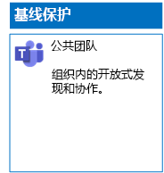
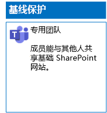
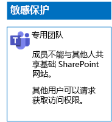
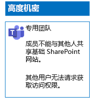

# 部署适用于三层文件保护的团队

使用本文中的步骤设计和部署基线、敏感和高度机密团队。 有关这三层保护的详细信息，请参阅[保护 Microsoft Teams 中的文件](secure-files-in-teams.md)。

## 基准团队

基线保护同时包括公共和专用团队。 组织中的任何人均可发现和访问公共团队。 只有与团队关联的 Office 365 组的成员才可以发现并访问专用网站。 两种类型的团队均允许成员与他人共享网站。

### 公开

按照[本文](https://support.office.com/article/174adf5f-846b-4780-b765-de1a0a737e2b)中的说明操作，创建具有公共访问权限和权限的基准团队。

下面是生成的配置。

### Private

按照[本文](https://support.office.com/article/174adf5f-846b-4780-b765-de1a0a737e2b)中的说明操作，创建具有私人访问权限和权限的基准团队。

下面是生成的配置。

## 敏感团队

对于敏感团队，首先应[创建私人团队](https://support.office.com/article/174adf5f-846b-4780-b765-de1a0a737e2b)。

接下来，配置底层 SharePoint 网站以防止团队成员共享。

1. 在团队的工具栏中，单击“文件”****。

2. 单击省略号，然后单击“在 SharePoint 中打开”****。

3. 在基础 SharePoint 网站的工具栏中，依次单击设置图标和“网站权限”****。

4. 在“**网站权限**”窗格的“**共享设置**”下方，单击“**更改共享设置**”。

5. 在“共享权限”下方，选择“仅网站所有者可以共享文件、文件夹和网站”，然后单击“保存”************。

下面是生成的配置。

## 高度机密团队

对于高度机密团队，首先应[创建私人团队](https://support.office.com/article/174adf5f-846b-4780-b765-de1a0a737e2b)。

接下来，配置底层 SharePoint 网站以防止团队成员共享，并防止团队的非成员请求访问权限。

1. 在团队的工具栏中，单击“文件”****。

2. 单击省略号，然后单击“在 SharePoint 中打开”****。

3. 在基础 SharePoint 网站的工具栏中，依次单击设置图标和“网站权限”****。

4. 在“**网站权限**”窗格的“**共享设置**”下方，单击“**更改共享设置**”。

5. 在“**共享权限**”下方，选择“**仅网站所有者可以共享文件、文件夹和网站**”。

6. 关闭“**允许访问请求**”，然后单击“**保存**”。

下面是生成的配置。

## 后续步骤

[使用保留标签和 DLP 保护团队中的文件](deploy-teams-retention-DLP.md)

## 另请参阅

[保护 Microsoft Teams 中的文件](secure-files-in-teams.md)

[云应用和混合解决方案](https://docs.microsoft.com/office365/enterprise/cloud-adoption-and-hybrid-solutions)
