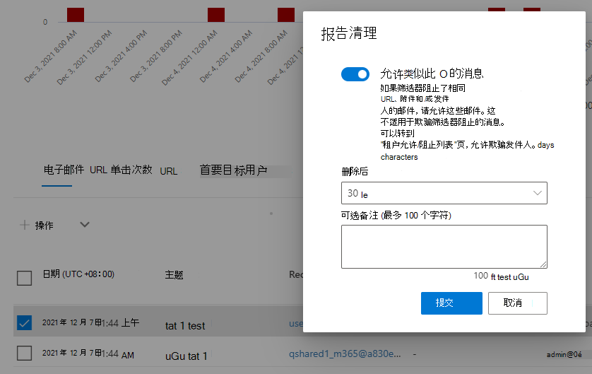

# 使用 Microsoft Defender for Office 365 中的威胁资源管理器进行电子邮件Office 365

本文内容：

- [查看电子邮件中检测到的恶意软件](#view-malware-detected-in-email)
- [查看网络钓鱼 URL 并单击裁定数据](#view-phishing-url-and-click-verdict-data)
- [启动自动调查和响应](#start-automated-investigation-and-response)

> [!NOTE]
> 这是威胁资源管理器 (**资源管理器) 、** 电子邮件安全、资源管理器和实时检测基础知识的 **3** 篇文章系列中的一部分 **(如** 工具之间的差异，以及运行) 所需的权限。 本系列中的其他两篇文章是威胁资源管理器和威胁资源管理器中的威胁搜寻和[实时检测基础知识](real-time-detections.md)。

本文介绍如何查看和调查电子邮件中检测到的恶意软件和网络钓鱼Microsoft 365安全功能。

**适用于：**

- [Microsoft Defender for Office 365 计划 1 和计划 2](defender-for-office-365.md)
- [Microsoft 365 Defender](../defender/microsoft-365-defender.md)

## 查看电子邮件中检测到的恶意软件

若要查看在电子邮件中检测到的恶意软件Microsoft 365技术排序，请使用 Explorer ([**电子邮件 \>**](threat-explorer-views.md#email--malware)恶意软件视图或实时) 。 恶意软件是默认视图，因此一旦打开资源管理器，可能会选中它。

1. In the <a href="https://go.microsoft.com/fwlink/p/?linkid=2077139" target="_blank">Microsoft 365 Defender portal，</a>choose **Email & collaboration** \> **Explorer** (or **Real-time detections**;此示例使用 Explorer) 。

   从此处，从"视图"开始，选择一个特定的时间范围来调查 (如果需要) ，并按资源管理器演练来关注 [筛选器](threat-hunting-in-threat-explorer.md#threat-explorer-walk-through)。

2. 在 **"查看** "下拉列表中，验证 **是否选择了** \> **"电子邮件恶意软件** "。

3. 单击 **"发件人**"，然后在 **下拉列表** 中选择 \> "基本检测技术"。

   :::image type="content" source="../../media/exploreremailmalwaredetectiontech-newimg.png" alt-text="恶意软件检测技术。":::

   你的检测技术现在用作报告的筛选器。

4. 选择一个选项，然后单击 **"刷新"** 以应用 (不刷新浏览器窗口) 。

   :::image type="content" source="../../media/exploreremailmalwaredetectiontech2-new.png" alt-text="选定的检测技术。":::

   报告将刷新，以使用所选的技术选项显示电子邮件中检测到的恶意软件的结果。 在这里，你可以进行进一步分析。

### 在资源管理器中将邮件报告为干净

可以使用资源管理器中的 **"报告** 清除"选项将邮件报告为误报。 

1. 在Microsoft 365 Defender门户中，转到"电子邮件&协作资源管理器"，然后在"视图"下拉列表中， \> 验证 **是否选择了"** 网络钓鱼"。 

2. 确认你位于"电子邮件"选项卡上，然后从报告的邮件列表中选择你要报告为干净的邮件。 

3. 单击 **"** 操作"展开选项列表。

4. 向下滚动选项列表以转到"开始 **新提交"部分**，然后选择"**报告干净"。** 将出现一个飞出图。

   > [!div class="mx-imgBorder"]
   >  

5. 将滑块切换为 **"打开"。** 从下拉列表中，指定希望删除邮件的天数，根据需要添加注释，然后选择"提交 **"。** 

## 查看网络钓鱼 URL 并单击裁定数据

您可以通过电子邮件中的 URL 查看网络钓鱼尝试，包括允许、阻止和覆盖的 URL 列表。 若要标识单击的[URL，保险箱链接](safe-links.md)。 确保为单击保险箱和单击裁定记录设置"链接"策略保险箱链接" 。

1. In the <a href="https://go.microsoft.com/fwlink/p/?linkid=2077139" target="_blank">Microsoft 365 Defender portal，</a>choose **Email & collaboration** \> **Explorer** (or **Real-time detections**;此示例使用 Explorer) 。
，选择 **"电子邮件&协作** \> **资源管理器** (或 **实时检测;"** 此示例使用 Explorer) 。

2. 在"**查看"** 下拉列表中，选择"**电子邮件钓鱼** \> **邮件"。**

   > [!div class="mx-imgBorder"]
   > 

3. 单击 **"发件人**"，然后在下拉列表中选择 **"URL""** \> 单击裁定"。

4. 在出现的选项中，选择一个或多个选项，如"阻止"和"阻止覆盖"，然后单击"刷新 (不刷新浏览器窗口") 。 

    :::image type="content" source="../../media/threatexploreremailphishclickverdict-new.png" alt-text="URL 和单击裁定。":::

   报告将刷新以显示报告下的"URL" **选项卡上的** 两个不同的 URL 表：

   - **顶部 URL** 是筛选到的邮件中的 URL，每个 URL 的电子邮件传递操作计数。 在网络钓鱼电子邮件视图中，此列表通常包含合法 URL。 攻击者在邮件中混合了好 URL 和坏 URL，以尝试传递这些 URL，但它们会使恶意链接看起来更有趣。 URL 表按总电子邮件计数排序，但隐藏此列以简化视图。

   - **点击量** 是单击保险箱链接包装的 URL，按总点击数排序。 此列也不显示，以简化视图。 按列的总计数指示每个保险箱 URL 的链接单击裁定计数。 在网络钓鱼电子邮件视图中，这些 URL 通常是可疑或恶意 URL。 但是，该视图可能包含不是威胁但包含钓鱼邮件中的 URL。 此处不会显示未包链接上的 URL 单击。

   这两个 URL 表按传递操作和位置显示网络钓鱼电子邮件中的顶部 URL。 这些表显示了在出现警告时被阻止或访问的 URL 单击，因此你可以看到向用户显示哪些潜在的错误链接以及用户点击了哪些链接。 在这里，你可以进行进一步分析。 例如，在图表下方，可以看到在组织环境中被阻止的电子邮件中的顶部 URL。

   > [!div class="mx-imgBorder"]
   > 

   选择 URL 以查看更多详细信息。

   > [!NOTE]
   > 在"URL"弹出对话框中，将删除对电子邮件的筛选，以显示环境中 URL 曝光的完整视图。 这允许你在资源管理器中筛选你关注的电子邮件，查找潜在威胁的特定 URL，然后通过"URL 详细信息"对话框) 进一步了解环境中 (中的 URL 曝光，而无需将 URL 筛选器添加到资源管理器视图本身。

### 单击裁定的解释

在"电子邮件或 URL"飞出、点击次数和筛选体验中，你将看到不同的单击裁定值：

- **无：** 无法捕获 URL 裁定。 用户可能通过 URL 单击过。
- **允许：** 允许用户导航到 URL。
- **已阻止：** 阻止用户导航到 URL。
- **待定裁定：** 向用户显示等待触发的页面。
- **被阻止覆盖：** 阻止用户直接导航到 URL。 但用户过度控制块以导航到 URL。
- **已绕过待定裁定：** 向用户显示触发页面。 但是，用户为了访问 URL 而过度使用邮件。
- **错误：** 向用户显示错误页面，或捕获裁定时出错。
- **失败：** 捕获裁定时发生未知异常。 用户可能通过 URL 单击过。

## 启动自动调查和响应

> [!NOTE]
> Microsoft Defender for *Office 365 Plan 2* 和 Office 365 E5 *中提供了自动调查和响应Office 365 E5。*

[自动调查和响应](automated-investigation-response-office.md) 可以节省安全运营团队在调查和缓解网络攻击上花费的时间和精力。 除了配置可触发安全手册的警报之外，还可以从资源管理器中的视图启动自动调查和响应过程。 有关详细信息，请参阅 [示例：安全管理员从资源管理器触发调查](automated-investigation-response-office.md#example-a-security-administrator-triggers-an-investigation-from-threat-explorer)。

## 其他文章

[使用"电子邮件实体"页调查电子邮件](mdo-email-entity-page.md)
