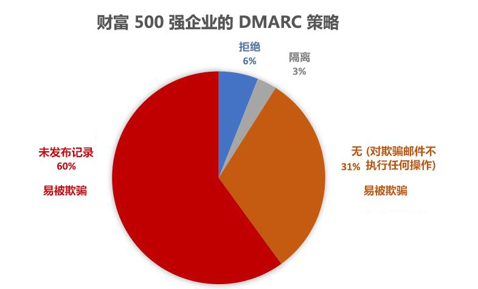

# <a name="email-authentication-in-eop"></a>EOP 中的电子邮件身份验证

[!INCLUDE [Microsoft 365 Defender rebranding](../includes/microsoft-defender-for-office.md)]

**适用对象**
- [Exchange Online Protection](exchange-online-protection-overview.md)
- [Microsoft Defender for Office 365 计划 1 和计划 2](defender-for-office-365.md)
- [Microsoft 365 Defender](../defender/microsoft-365-defender.md)


电子邮件身份验证（也称为电子邮件验证）是一组尝试阻止欺骗（来自伪造发件人的电子邮件）的标准。 在所有 Microsoft 365 组织中，EOP 使用以下标准验证入站电子邮件：

- [SPF](set-up-spf-in-office-365-to-help-prevent-spoofing.md)
- [DKIM](use-dkim-to-validate-outbound-email.md)
- [DMARC](use-dmarc-to-validate-email.md)

电子邮件身份验证会验证发件人的电子邮件（例如，laura@contoso.com）是否合法，是否来自该电子邮件域的预期来源（例如，contoso.com。）

本文的其余部分将说明这些技术的工作原理，以及 EOP 如何使用它们来检查入站电子邮件。

## <a name="use-email-authentication-to-help-prevent-spoofing"></a>使用电子邮件身份验证帮助防止欺骗

DMARC 通过检查邮件中的 **发件人** 地址来防止欺骗。 **发件人** 地址是用户在其电子邮件客户端中看到的发件人的电子邮件地址。 目标电子邮件组织还可以验证电子邮件域是否已通过 SPF 或 DKIM。 换言之，已对域进行身份验证，因此发件人的电子邮件地址不是欺骗电子邮件地址。

但是，SPF、DKIM 和 DMARC 的 DNS 记录（统称为电子邮件身份验证策略）是可选的。 具有强电子邮件身份验证策略的域（例如 microsoft.com 和 skype.com）可防止欺骗。 但是，如果域中的电子邮件身份验证策略较弱，或者根本没有策略，则会成为欺骗的主要目标。

截至 2018 年 3 月，在财富 500 强企业中，只有 9% 的域发布了强电子邮件身份验证策略。 其余 91% 的公司可能被攻击者欺骗。 除非已落实其他某种电子邮件筛选机制，否则这些域中的欺骗发件人发送的电子邮件可能会送达用户。



已发布强电子邮件身份验证策略的中小型公司所占比例较小，而对于北美和西欧以外的电子邮件域，发布强策略的比例更小。

缺乏强大的电子邮件身份验证策略非同小可。 虽然组织可能不知道电子邮件身份验证的工作方式，但是攻击者完全了解，并且会利用电子邮件身份验证的优势。 由于网络钓鱼问题，而且强电子邮件身份验证策略的采用范围有限，因此 Microsoft 将使用 *隐式电子邮件身份验证* 来检查入站电子邮件。

隐式电子邮件身份验证是对常规电子邮件身份验证策略的扩展。 这些扩展包括发件人信誉、发件人历史记录、收件人历史记录、行为分析和其他高级技巧。 如果没有这些扩展的其他信号，从不使用电子邮件身份验证策略的域发送的邮件将被标记为欺骗。

若要查看 Microsoft 的一般声明，请参阅[网络钓鱼第 2 部分 - Microsoft 365 中的增强反欺骗功能](https://techcommunity.microsoft.com/t5/Security-Privacy-and-Compliance/Schooling-A-Sea-of-Phish-Part-2-Enhanced-Anti-spoofing/ba-p/176209)。

## <a name="composite-authentication"></a>复合身份验证

如果域没有传统的 SPF、DKIM 和 DMARC 记录，则这些记录检查将无法传达足够的身份验证状态信息。 为此，Microsoft 开发了一种用于隐式电子邮件身份验证的算法。 该算法可将多个信号组合成一个称为 _复合身份验证_（或简称为 `compauth`）的单一值。 可以在邮件头的“`compauth`Authentication-Results **”标头中标记** 值。

```text
Authentication-Results:
   compauth=<fail | pass | softpass | none> reason=<yyy>
```

[Authentication-results 邮件头](anti-spam-message-headers.md#authentication-results-message-header)对这些值进行了说明。

通过检查邮件头，管理员（或甚至是最终用户）可以确定 Microsoft 365 如何确定发件人是否是冒充的。

## <a name="why-email-authentication-is-not-always-enough-to-stop-spoofing"></a>电子邮件身份验证为何并非总能阻止欺骗

仅依靠电子邮件身份验证记录来确定传入邮件是否是欺骗邮件具有以下限制：

- 发送域可能缺少所需的 DNS 记录，或者记录配置错误。

- 源域已正确配置 DNS 记录，但该域与“发件人”地址中的域不匹配。 SPF 和 DKIM 不需要在“发件人”地址中使用该域。 攻击者或合法服务部门可以注册一个域、为该域配置 SPF 和 DKIM，以及在“发件人”地址中使用一个完全不同的域。 来自此域中的发件人的邮件将通过 SPF 和 DKIM 验证。

复合身份验证可以让这些原本无法通过身份验证检查的邮件通过检查，从而解决这些限制。

为简单起见，以下示例专注于电子邮件身份验证结果。 其他后端智能因素可能会将通过电子邮件身份验证的邮件识别为欺骗邮件，或者将未通过电子邮件身份验证的邮件识别为合法邮件。

例如，fabrikam.com 域没有 SPF、DKIM 或 DMARC 记录。 来自 fabrikam.com 域中的发件人的邮件可能无法通过复合身份验证（请注意 `compauth` 的值和理由）：

```text
Authentication-Results: spf=none (sender IP is 10.2.3.4)
  smtp.mailfrom=fabrikam.com; contoso.com; dkim=none
  (message not signed) header.d=none; contoso.com; dmarc=none
  action=none header.from=fabrikam.com; compauth=fail reason=001
From: chris@fabrikam.com
To: michelle@contoso.com
```

如果 fabrikam.com 配置了 SPF，但没有 DKIM 记录，邮件可通过复合身份验证。通过 SPF 验证的域与“发件人”地址中的域一致：

```text
Authentication-Results: spf=pass (sender IP is 10.2.3.4)
  smtp.mailfrom=fabrikam.com; contoso.com; dkim=none
  (message not signed) header.d=none; contoso.com; dmarc=bestguesspass
  action=none header.from=fabrikam.com; compauth=pass reason=109
From: chris@fabrikam.com
To: michelle@contoso.com
```

如果 fabrikam.com 配置了 DKIM，但没有 SPF 记录，邮件可通过复合身份验证。DKIM 签名中的域与“发件人”地址中的域一致：

```text
Authentication-Results: spf=none (sender IP is 10.2.3.4)
  smtp.mailfrom=fabrikam.com; contoso.com; dkim=pass
  (signature was verified) header.d=outbound.fabrikam.com;
  contoso.com; dmarc=bestguesspass action=none
  header.from=fabrikam.com; compauth=pass reason=109
From: chris@fabrikam.com
To: michelle@contoso.com
```

如果 SPF 或 DKIM 签名中的域与“发件人”地址中的域不一致，则该邮件可能无法通过复合身份验证：

```text
Authentication-Results: spf=none (sender IP is 192.168.1.8)
  smtp.mailfrom=maliciousdomain.com; contoso.com; dkim=pass
  (signature was verified) header.d=maliciousdomain.com;
  contoso.com; dmarc=none action=none header.from=contoso.com;
  compauth=fail reason=001
From: chris@contoso.com
To: michelle@fabrikam.com
```

## <a name="solutions-for-legitimate-senders-who-are-sending-unauthenticated-email"></a>适用于发送未经身份验证的电子邮件的合法发件人的解决方案

Microsoft 365 跟踪谁在向你的组织发送未经身份验证的电子邮件。 如果服务部门认为该发件人不合法，则会将来自该发件人的邮件标记为复合身份验证失败。 若要避免这种裁定，可使用本小节中的建议。

### <a name="configure-email-authentication-for-domains-you-own"></a>为你自己的域配置电子邮件身份验证

如果你拥有多个租户或与多个租户进行交互，则可使用此方法解决组织内欺骗和跨域欺骗。 它还有助于解决跨域欺骗，即你发送给 Microsoft 365 中的其他客户或由其他提供程序托管的第三方。

- [配置域的 SPF 记录](set-up-spf-in-office-365-to-help-prevent-spoofing.md)。
- [为主域配置 DKIM 记录](use-dkim-to-validate-outbound-email.md)。
- [考虑为你的域设置 DMARC 记录](use-dmarc-to-validate-email.md)，以确定合法发件人。

Microsoft 不提供针对 SPF、DKIM 和 DMARC 记录的详细实施指南。 但是，线上提供了许多信息。 此外，还有一些第三方公司致力于帮助你的组织设置电子邮件身份验证记录。

#### <a name="you-dont-know-all-sources-for-your-email"></a>你不知道电子邮件的所有来源

许多域不会发布 SPF 记录，因为它们不知道域中邮件的所有电子邮件来源。 首先发布一个 SPF 记录，其中包含你所知道的所有电子邮件来源（尤其是公司流量所在的位置），然后发布中性 SPF 策略 `?all`。 例如：

```text
fabrikam.com IN TXT "v=spf1 include:spf.fabrikam.com ?all"
```

此示例意味着，来自公司基础结构的电子邮件将通过电子邮件身份验证，但来自未知来源的电子邮件将回退为中性。

Microsoft 365 会将来自公司基础结构的入站电子邮件视为已经过身份验证。 如果来自未识别来源的电子邮件未通过隐式身份验证，则可能仍被标记为欺骗。 不过，这对于所有电子邮件都被 Microsoft 365 标记为欺骗邮件来说，仍是一项改进。

开始使用 `?all` 的 SPF 回退策略后，你可以逐步你的邮件发现和包含更多电子邮件来源，然后使用更严格的策略更新 SPF 记录。

### <a name="configure-permitted-senders-of-unauthenticated-email"></a>配置允许发送未经身份验证的电子邮件的人员

你也可以使用[反欺骗智能保护](learn-about-spoof-intelligence.md)和[租户允许/拦截列表](tenant-allow-block-list.md)来允许发件人将未经身份验证的邮件传送到你的组织。

对于外部域，欺骗用户是“发件人”地址中的域，而发送基础结构是源 IP 地址（分为 /24 个 CIDR 区域），或者是反向 DNS (PTR) 记录的组织域。

### <a name="create-an-allow-entry-for-the-senderrecipient-pair"></a>为发件人/收件人对创建允许条目

若要绕过垃圾邮件筛选、网络钓鱼筛选的某些部分，但不绕过针对特定发件人的恶意软件筛选，请参阅 [在 Microsoft 365 中创建安全发件人列表](create-safe-sender-lists-in-office-365.md)。

### <a name="ask-the-sender-to-configure-email-authentication-for-domains-you-dont-own"></a>要求发件人为不归你所有的域配置电子邮件身份验证

由于存在垃圾邮件和网络钓鱼问题，Microsoft 建议对所有电子邮件组织进行电子邮件身份验证。 无需在组织中配置手动替代，可让发送域中的管理员配置其电子邮件身份验证记录。

- 即使用户过去不需要发布电子邮件身份验证记录，也应在将电子邮件发送到 Microsoft 时执行此操作。

- 设置 SPF 以发布域的发送 IP 地址，并设置 DKIM（如果可用）以对邮件进行数字签名。另外，还应考虑设置 DMARC 记录。

- 如果他们使用批量发件人代表他们发送电子邮件，请验证“发件人”地址（如果该地址属于他们）中的域是否与通过 SPF 或 DMARC 检查的域一致。

- 验证 SPF 记录中是否包括以下位置（如果他们使用了这些地址）：

  - 本地电子邮件服务器。
  - 通过软件即服务 (SaaS) 提供程序发送的电子邮件。
  - 通过云托管服务（Microsoft Azure、GoDaddy、Rackspace、Amazon Web Services 等）发送的电子邮件。

- 对于由 ISP 托管的小型域，请根据 ISP 提供的说明配置 SPF 记录。

虽然刚开始可能很难让发送域进行身份验证，但随着时间的推移，随着越来越多的电子邮件筛选器开始放弃甚至拒绝他们的电子邮件，这将使他们设置正确的记录以确保更好地交付。 此外，他们的参与有助于防止网络钓鱼，并且可以减少将电子邮件发送到的目标组织中出现欺骗的可能性。

#### <a name="information-for-infrastructure-providers-isps-esps-or-cloud-hosting-services"></a>有关基础结构提供商（ISP、ESP 或云托管服务）的信息

如果你负责托管域的电子邮件或提供可以发送电子邮件的托管基础结构，则应执行以下操作：

- 确保你的客户拥有说明应如何配置其 SPF 记录的文档

- 考虑在出站电子邮件上进行 DKIM 签名，即使客户未明确设置它（使用默认域签名）。 你甚至可以使用 DKIM 签名对电子邮件进行双重签名（第一次使用客户的域进行签名（如果已设置该域），第二次使用你公司的 DKIM 签名）

即使你对来自平台的电子邮件进行身份验证，也无法保证向 Microsoft 的邮件传递，但至少可确保 Microsoft 不会因为未经过身份验证而将你的电子邮件标记为垃圾邮件。

## <a name="related-links"></a>相关链接

有关服务提供商最佳实践的更多信息，请参阅[服务提供商的 M3AAWG 移动消息传递最佳实践](https://www.m3aawg.org/sites/default/files/m3aawg-mobile-messaging-best-practices-service-providers-2015-08_0.pdf)。

了解 Office 365 如何使用 SPF 和支持 DKIM 验证：

- [有关 SPF 的更多详细信息](how-office-365-uses-spf-to-prevent-spoofing.md)

- [有关 DKIM 的更多详细信息](support-for-validation-of-dkim-signed-messages.md)
